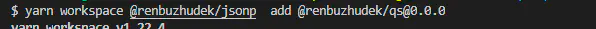
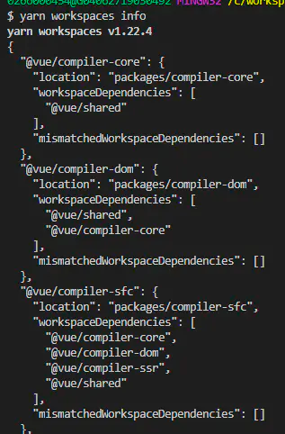
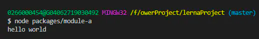
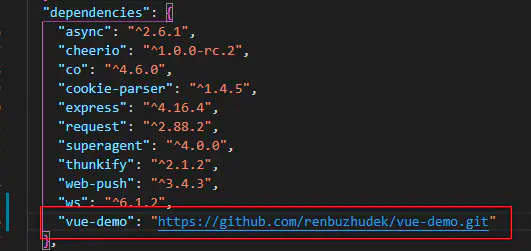

<a name="HnhiM"></a>

## Monorepo

Monorepo 是管理项目代码的一个方式，指在一个项目仓库 (repo) 中管理多个模块/包 (package)，不同于常见的每个模块建一个 repo。

monorepo 好处是统一的工作流和 Code Sharing。搭建一套脚手架，就能管理（构建、测试、发布）多个 package,统一测试、统一发版。

坏处也很明显，就是 repo 的体积会比较大，由于每个 package 都有自己的 package.json，会安装自己的 node\_modules,但是大概率会有很多包是重复的，这就使本来就很大的 node\_modues 变得更大。

目前常见的 monorepo 解决方案是 [Lerna](https://github.com/lerna/lerna) 和 yarn 的 workspaces 特性

对于 node\_modules 包重复安装的问题，lerna 提供了--hoist 选项，相同的依赖，会「提升」到 repo 根目录下安装，但……太鸡肋了，lerna 直接以字符串对比 dependency 的版本号，完全相同才提升，semver 约定在这并不起作用。

yarn 作为包管理器很好的解决了这个问题，只需要在根 package.json 中以 workspaces 字段声明 packages 目录和 `"private": true`，yarn 就会以 monorepo 的方式管理 packages。yarn 会以 semver 约定来分析 dependencies 的版本，安装依赖时更快、占用体积更小；

启用了 yarn workspace 的项目，使用 yarn 安装依赖时，yarn 会为工作区的所有包创建符号链接，在根目录的 node\_modules 可以看到
我们可以结合 lerna yarn 来用 <a name="KA0aa"></a>

### yarn workspace 相关命令

- `yarn workspace <workspace_name>` 在指定工作区执行命令

注意: workspace\_name 取包名(package.json 的 name 属性值)，add 或 remove 内部包时带上版本号；
下面命令会将 react 、react-dmo 添加到 packages/awesome-package/package.json 的 devDependencies

```shell
yarn workspace awesome-package add react react-dom --dev
```



- `yarn workspaces run` 为所有工作区运行命令(lerna run 命令有同样功能),如：
  将会在每个工作区运行 test 脚本

```shell
yarn workspaces run test
```

- `yarn workspaces info [--json]` 显示当前项目的工作区依赖关系

```shell
yarn workspaces info
```

vue-next 项目下打印结果： 显示了工作区的相互依赖关系


<a name="HfS6H"></a>

### lerna 常用 commands

- lerna init 初始化 lerna 管理项目，生成如下目录：
  :::info
  packages/
  package.json
  lerna.json
  :::

- lerna bootstrap --hoist 为所有项目安装依赖，并链接所有依赖包，类似于 npm i
  使用--hoist 选项后，所有公共的依赖都只会安装在根目录的 node\_modules 目录中去,而不会在每个包目录下的 node\_modules 中都保留各自的依赖包。

- lerna clean 删除所有项目的 node\_modules 目录

- lerna run \[script] 默认为所有的项目运行 npm run \[script]脚本，可以指定项目；

- lerna changed 列出下次发版 lerna publish 要更新的包。

- lerna publish 版本发布，按提示选择版本号(递增，或自定义)，将会执行以下步骤：
  - 运行 lerna updated 来决定哪一个包需要被 publish
  - 如果有必要，将会更新 lerna.json 中的 version
  - 将所有更新过的的包中的 package.json 的 version 字段更新
  - 将所有更新过的包中的依赖更新
  - 为新版本创建一个 git commit 或 tag
  - 将包 publish 到 npm 上；注意要先用 npm adduser 登录 npm 源，否则会失败；

- lerna add \[@version] \[--dev] \[--exact] \[--peer] ：可以指定为某一个或所有的包安装依赖，依赖可以是外部(npm i 安装的)也可以是内部依赖(packages/下的包，会创建符号链接)，example：
  - lerna add babel , 该命令会在 package-1 和 package-2 下安装 babel
  - lerna add react --scope=package-1 ,该命令会在 package-1 下安装 react
  - lerna add package-2 --scope=package-1，该命令会在 package-1 下安装 package-2

- lerna create \[loc] 创建一个 lerna 管理的包

- lerna ls 控制台打印 packages 下的包名

- lerna link 类似 npm link,创建软连接 ,但是实测怎么不起作用？(lerna version:v3.22.0) <a name="a8Wgt"></a>

### lerna 工作的两种模式

- Fixed/Locked mode (default)

vue,babel 都是用这种，在 publish 的时候,会在 lerna.json 文件里面"version": "0.1.5",,依据这个号，进行增加，只选择一次，其他有改动的包自动更新版本号。

- Independent mode

lerna init --independent 初始化项目,lerna.json 文件里面"version": "independent",
每次 publish 时，都将得到一个提示符，提示每个已更改的包，以指定是补丁、次要更改、主要更改还是自定义更改。

<a name="veIMH"></a>

### 启用 yarn 的 workspaces 模式

:::info
默认是 npm, 而且每个子 package 都有自己的 node\_modules，通过这样设置后，只有顶层有一个 node\_modules
:::

- 修改顶层 package.json and lerna.json

```json
package.json 文件加入

"private": true,
"workspaces": [
"packages/*"
],

lerna.json 文件加入

"useWorkspaces": true,
"npmClient": "yarn"
```

<a name="Eozdy"></a>

### 说了那么多，接下来实战演示一把

<a name="akEJz"></a>

#### 初始化项目

```shell
npm intall lerna -g
mkdir lernaProject && cd $_
git init
lerna init
git add .
git commit -m "Initial Commit"
git remote add origin http://github.com/renbuzhudek/lernaProject .git
git push -u origin master
```

上述命令执行完成后，生成如下目录：
:::info
packages/
package.json
lerna.json
::: <a name="TnaW9"></a>

#### 新建两个模块

为了演示方便，我们新建两个模块， moduleA 和 moduleB， 并让 moduleA 依赖 moduleB：

```shell
lerna create module-a
lerna create module-b
# 将本地包链接起来，可以直接引用
lerna add module-b --scope=module-a
```

修改 module-b 的入口文件：

```javascript
module.exports = moduleB;
function moduleB() {
    return "hello world";
}
```

修改 module-a 的入口文件:

```javascript
const moduleB = require('module-b');
const moduleA = function() {
    console.log(moduleB());
}
module.exports = moduleA;
moduleA()
```

node 调用模块 a：


<a name="gU3L3"></a>

#### 发布新模块

完成修改后，git 提交完代码，我们就可以直接发布新的模块,记得要先登录 npm 源
然后运行下面命令，根据提示输入版本号等，lerna 会自动帮我们给包加上 tag,并上传到对应的仓库中去。

```shell
lerna publish
```

<a name="sSAun"></a>

### 依赖包的值可以提供一个 url

:::info
会下载到 node\_modules 里面
作用：内网部署 npm 镜像时，可用于下载内部包
:::

