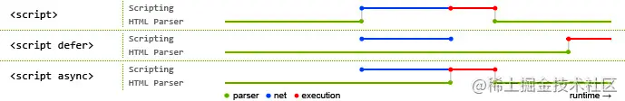

## 内联和外部引用的区别

### 内联代码

- 加载在同一页面中，因此不需要触发另一个请求
- 立即被执行
- async 和 defer 属性无效
- 使用服务端动态渲染时会很有帮助 

### 外部脚本文件

- 更好滴分离关注点和可维护性
- async 和 defer 属性有效，因此如果存在此属性，脚本将更改默认行为
- 下载外部脚本后，浏览器会将其存储在缓存中，因此如果另外一个页面引用它，将无需进行额外下载
- 可用于按需加载客户端代码并减少整体下载时间和大小

***

## defer 和 async 的区别

如果没有 defer 或 async 属性，浏览器会立即加载并执行相应的脚本。它不会等待后续加载的文档元素，读取到就会开始加载和执行，这样就阻塞了后续文档的加载。

下图可以直观的看出三者之间的区别:

:::info
其中蓝色代表 js 脚本网络加载时间，红色代表 js 脚本执行时间，绿色代表 html 解析。
:::

`<script>` 标签添加 defer 或 async 属性，脚本就会异步加载。渲染引擎遇到这一行命令，就会开始下载外部脚本，但不会等它下载和执行，而是直接执行后面的命令。

- defer：要等到整个页面在内存中正常渲染结束，才会执行；多个脚本时，按顺序执行
- async：一旦下载完，渲染引擎就会中断渲染，执行这个脚本再继续渲染。多个脚本时，不能保证按执行顺序
  :::info
  总结:

1. defer 是“**渲染完再执行**”，async 是“**下载完就执行**”。
   1. defer = true，则脚本会在页面解析完毕后执行
   2. async = true，则脚本在下载完成后异步执行
   3. async = false, defer = false，则脚本会在页面解析过程中停止页面解析，立即下载并执行
2. 使用这两个属性的脚本内部不能调用 document.write 方法
3. html4.0 中定义了 defer，html5.0 中定义了 async
   :::
