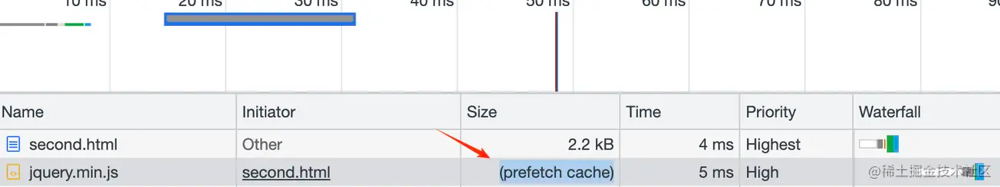
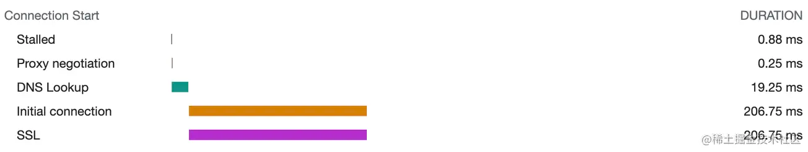

`<link>` 是一种 html 标签，用于加载外部资源。最常见的用法，就是加载 css 样式文件，写法如下：

```html
<link rel='stylesheet' href='./index.css'>
```

- rel 属性是 "关系" 的意思，它的值 stylesheet 表示使用的是样式表
- href 表示资源的地址，当前 html 文件通过这个地址来加载内容

但 link 的功能不仅限于此，它也可以控制资源的下载优先级、提前和指定域名进行连接。
:::info
总结：

1. preload：提高资源加载优先级，适用于提前加载字体、语言包等场景。
2. prefetch：降低资源加载优先级，在下载空闲时再下载缓存起来，适用于提前资源提前加载以提高加载速度的场景
3. preconnect：预先和目标域名进行连接，包括 dns 查询、tcp、http(s) 连接
4. dns-prefetch：预先查询好目标域名的 ip
   ::: <a name="voh6Z"></a>

## preload

```html
<link rel='preload' href='./main.css' as='style'>
```

preload，作用是将对应资源的下载优先级提升为最高。preload 负责提高下载优先级，并将其下载好，但不负责将资源嵌入到页面，需要自行找到合适的地方将其进行显示嵌入。同时 preload 也不会影响资源的执行顺序，如果有多个资源都使用了 preload，那么谁先设置 preload 谁就先下载，as 属性是必填的，不同类型文件对应的值也不同。
:::info
**使用场景：**

- 有字体的 css 先加载，防止字体突变
- 按需加载语言包的语言包 js 文件最先加载
  ::: <a name="dl4IE"></a>

## prefetch

```html
<link rel='prefetch' href='lib/jquery.min.js' as='script'>
```

对于设置了 prefetch 的资源，浏览器会认为这个资源目前不会用到，但可能下个页面会用到，于是会将对应资源的下载优先级降为最低 Lowest。
在其他资源加载好了之后，下载队列就会进入空闲状态，此时该资源才被下载缓存起来。
如果进入的下一个页面使用了这个资源，将会在 network 面板上看到 prefetch cache。

:::info
使用场景：

- 工具类官网首页介绍工具用法时，将会提前加载好真正的工具页面所需要的一些资源，等用户点击进行跳转。从而提高工具页面的加载速度，改善用户体验。
  ::: <a name="x1EhE"></a>

## preconnect

```html
<link rel='preconnect' href='https://cdn-s1.somecdnsite.com'>
```

preconnect 的作用是提前和目标服务器进行链接。这个连接过程包括：dns 查询得到 ip、tcp 的三次握手、http/https 连接。因为过程比较繁琐，因此我们可以提前做这个连接操作，节省100～200ms，在网络不好或者网络波动时，效果会更好。

:::info
使用场景：

- 常用的 cdn 资源所在的域名提前进行连接
- 视频不播放时，在用户点击播放前，提前连接对应域名
  ::: <a name="aUMHo"></a>

## dns-prefetch

```html
<link rel='dns-prefetch' href='https://cdn-s1.somecdnsite.com'>
```

dns-prefetch 是预先通过 dns 查询得到指定域名对应的 ip，在真正请求该域名下资源时，可以省略掉 dns 查询这一步骤。dns-prefetch 是 preconnect 更细粒度的版本。
:::danger
注意：preconnect 不能使用过多，使用过多会阻塞正常的请求，因此可以配合适量的 dns-prefetch，减少时间损耗
:::
:::info
使用场景：

- 常用的 cdn 资源所在的域名提前进行连接
- 视频不播放时，在用户点击播放前，提前连接对应域名
  :::
