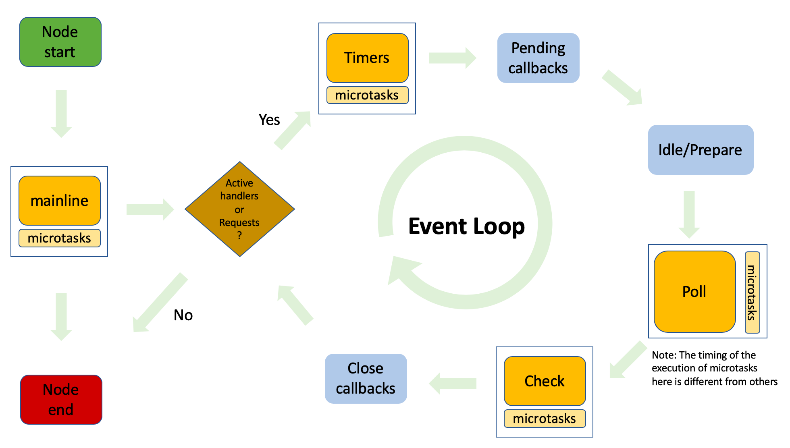

<a name="GzXwt"></a>

## 执行栈

执行栈是类似函数调用栈的运行容器，执行栈为空时，javaScript 引擎会检查事件队列是否为空，如果不为空，那么将第一个任务压入执行栈中执行 <a name="cRycY"></a>

## 事件队列

事件队列就是一个存储着待执行任务的队列，其中的任务严格按照时间顺序来执行，队首的任务率先执行，队尾的任务最后执行。同时每次仅执行一个任务。 <a name="JbDwc"></a>

## javaScript 在浏览器中的事件循环机制

- javaScript 是单线程执行的(两个线程同时操作 DOM，会发生冲突)，在代码执行的过程中，通过将不同函数的**执行上下文**压入**执行栈**中来保证代码的有序执行

- 最开始将整个 script 脚本作为一个宏任务执行，执行过程中同步代码直接执行

- 执行同步代码时，如果遇到了异步事件，javaScript 引擎将不会一直等待其返回结果，而是将这个事件暂时挂起，继续执行**执行栈**中的其它任务

- 当异步事件执行完毕后，再将异步事件对应的回调函数加入到**与当前执行栈不同的任务队列**中等待执行，宏任务进入宏任务队列，微任务进入微任务队列

- 在主执行栈中的事件执行完毕后，javaScript 引擎会**首先判断微任务队列**中是否有任务可以执行，如果有就将微任务队列的**队首**的事件压入执行栈中执行。直到**微任务队列的所有任务全部执行完毕**

- 执行浏览器的 UI 线程渲染工作，渲染阶段会收到以下因素的影响
  - 屏幕分辨率改变，如果页面性能太差，为了不丢帧，浏览器会选择降低帧率
  - 浏览器判断本次渲染是否会造成视觉上的改变，比如背景色改变
  - map of animation frame callbacks 为空

- 检查是否有 web worker 任务，有则执行
  - 对需要渲染的文档，如果窗口发生了变化，就会调用 resize 事件(resize 自带节流)
  - 对需要渲染的文档，如果页面发生了滚动，就会调用 scroll 事件(scroll 自带节流)
  - 对需要渲染的文档，执行 requestAnimationFrame 回调
  - 调用 IntersectionObserver 回调，重新渲染页面
  - 最后会检查宏任务队列和微任务队列是否为空，如果为空会调用 idle 空闲周期算法，检测 requestIdleCallback 是否为空，如果不为空就会执行里面的回调

- 执行完本轮宏任务后，执行下一轮宏任务
  :::success
  **任务队列：**

- **宏任务(macroTasks)队列：**
  - script 脚本的执行
  - setTimeout/setInterval/setImmediate
  - I/O 操作
  - UI 渲染

- **微任务(microTasks)队列：**
  - promise 回调(必须有 resolve/reject 结果，同一块作用域内多个 resolve 中，其中一个执行完毕后其余的皆不再执行)
  - node.js 中的 process.nextTick
  - 对 DOM 变化进行监听的 MutationObserver
    :::

:::success
**requestAnimationFrame 和 requestIdleCallback**
前者是在渲染前执行的，因为动画会更改 dom 结构，后者是用来处理计算量大但不紧急的事件，当队列中没有任务执行时，会清空它内部的回调，也可以传入 timeout 参数，强制 timeout 秒后执行，但是会阻塞其他代码的执行
::: <a name="ipMVF"></a>

## 为什么 javaScript 引擎将异步任务区分为宏任务和微任务

- 这种设计是为了给紧急任务一个插队的机会，否则新入队的任务永远被放在队尾。
- 区分了微任务和宏任务后，本轮循环中的微任务实际上就是在插队，这样微任务中所做的状态修改，在下一轮事件循环中也能得到同步。 <a name="qxOhd"></a>

## javaScript 在 node.js 环境下的事件循环机制

当 node.js 启动后，它会初始化事件循环，处理已提供的输入脚本，它可能会调用一些异步的 API、调度定时器，或者调用 process.nextTick，然后开始处理事件循环 <a name="AavFm"></a>

### node.js 中的微任务

- process.nextTick 注册的回调 (nextTick task queue)
- promise.then 注册的回调 (promise task queue)

node 在执行微任务时，会优先执行 nextTick task queue 中的任务，执行完后会接着执行 promise task queue 中的任务。因此如果二者同时处于主线程或者事件循环中的相同阶段，process.nextTick 回调优先级 > promise.then 回调优先级 <a name="TZ54M"></a>

### 事件循环

下面为 node 执行的整个过程，如果执行了任何非阻塞的异步代码，则会进入事件循环：


其中事件循环分为六个阶段：

- 定时器 ***timers***：本阶段执行已经被 setTimeout 和 setInterval 的调度回调函数
- 待定回调 ***pending callbacks***：执行延迟到下一个循环迭代的 I/O 回调
- ***idle，prepare***：仅系统内部使用
- 轮询 ***poll***：检索新的 I/O 事件；执行与 I/O 相关的回调(几乎所有情况下，除了 close callbacks，那些由定时器和 setImmediate 调度的之外)，其余情况 node 将在适当的时候在此阻塞
- 检测 ***check***：setImmediate 回调函数在这里执行
- 关闭的回调函数 ***close callbacks***：一些关闭的回调函数。如：`socket.on('close', ...)`

:::warning
注意：

1. 每一个阶段都会有一个 FIFO 回调队列，都会尽可能地执行完当前阶段中所有的回调或者到达了系统相关的限制之后，才会进入下一阶段
2. poll 阶段执行微任务的时机与 timers & check 阶段的时机不同，前者是在每一个回调执行的时候就会执行相应的微任务；后者会在所有回调执行完毕之后，才统一 执行相应的微任务
   :::

<a name="wgSt6"></a>

### setImmediate、setTimeout/setInterval 和 process.nextTick 执行时机

- **setImmediate**

触发一个异步回调，在事件循环的 check 阶段立即执行。

- **setTimeout**

触发一个异步回调，当计时器过期后，在事件循环的 timers 阶段执行，只执行一次（可用 clearTimeout 取消）。

- **setInterval**

触发一个异步回调，每次计时器过期后，都会在事件循环的 timers 阶段执行一次回调（可用 clearInterval 取消）。

- **process.nextTick**

触发一个微任务（异步）回调，既可以在主线程（mainline）中执行，可以存在事件循环的某一个阶段中执行。 <a name="Y21SO"></a>

### 总结

- 初始化事件循环，处理输入脚本，处理事件循环
- 执行事件循环的每个阶段
- 在相应阶段的回调执行时或者执行完，去执行微任务，其中 nextTick task queue >  promise task queue
  :::success
  在 node v10 及以前：

1. 执行完 1-6 阶段的任务
2. 执行 nextTick 中的任务
3. 执行完微任务队列中的任务

在 node v11 之后，node 在 setTimeout 执行后会手动清空微任务队列，用来保证结果贴近浏览器
:::

<a name="TJa6Z"></a>

### 案例

```javascript
async function async1() {
    console.log('async1 start')
    await async2()
    console.log('async1 end')
}
 
async function async2() {
    console.log('async2')
}
 
console.log('script start')
 
setTimeout(function () {
    console.log('setTimeout0')
}, 0)
 
setTimeout(function () {
    console.log('setTimeout2')
}, 300)
 
setImmediate(() => console.log('setImmediate'));
 
process.nextTick(() => console.log('nextTick1'));
 
async1();
 
process.nextTick(() => console.log('nextTick2'));
 
new Promise(function (resolve) {
    console.log('promise1')
    resolve();
    console.log('promise2')
}).then(function () {
    console.log('promise3')
})
 
console.log('script end')
```

- 先找到同步任务，输出 script start
- 遇到第一个 setTimeout，将里面的回调函数放到 timer 队列中
- 遇到第二个 setTimeout，300ms 后将里面的回调函数放到 timer 队列中
- 遇到第一个 setImmediate，将里面的回调函数放到 check 队列中
- 遇到第一个 nextTick，将其里面的回调函数放到本轮同步任务执行完毕后执行
- 执行 async1 函数，输出 async1 start
- 执行 async2 函数，输出 async2，async2 后面的输出 async1 end 进入微任务，等待下一轮的事件循环
- 遇到第二个 nextTick，将其里面的回调函数放到本轮同步任务执行完毕后执行
- 遇到 new Promise，执行里面的立即执行函数，输出 promise1、promise2
- then 里面的回调函数进入微任务队列
- 遇到同步任务，输出 script end
- 执行下一轮回调函数，先依次输出 nextTick 的函数，分别是 nextTick1、nextTick2
- 然后执行微任务队列，依次输出 async1 end、promise3
- 执行 timer 队列，依次输出 setTimeout0
- 接着执行 check 队列，依次输出 setImmediate
- 300ms 后，timer 队列存在任务，执行输出 setTimeout2

执行结果如下：

```shell
script start
async1 start
async2
promise1
promise2
script end
nextTick1
nextTick2
async1 end
promise3
setTimeout0
setImmediate
setTimeout2
```
