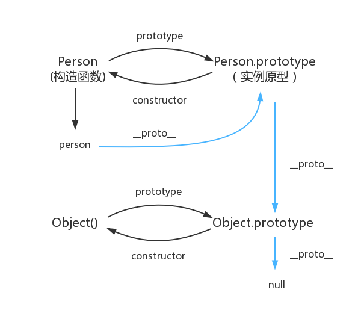

## 原型

在 javaScript 中，我们使用构造函数新建一个对象，每个构造函数内部都有一个 prototype 属性值，该属性值是一个对象，该对象包含了可以被该构造函数的所有实例所共享的属性和方法

当使用构造函数新建立一个对象后，在这个对象的内部将包含一个指针，这个指针会指向构造函数的 prototype 属性值，也就是这个对象的原型

:::tips
javaScript 原型的特点：javaScript 对象是通过 “引用” 的方式来传递的，我们创建的每个新对象实体中并没有一份属于自己的原型副本，当我们修改原型的时候，与之相关的对象也将继承这一改变
::: 

## 原型链

当访问一个对象的属性时，如果对象内部不存在这一属性，便会去它的原型对象寻找这个属性，由于这个原型对象也会有自己的原型，因此这样一直寻找下去，就形成了原型链
:::tips
**个人理解**：原型链 = 链表，this 就是链表当前指向的那个原型，call/apply/bind 用来改变链表的 next 指向
::: 

## 关系图

:::info
图中由相互关联的原型组成的链状结构就是原型链，也就是蓝色的线
:::
