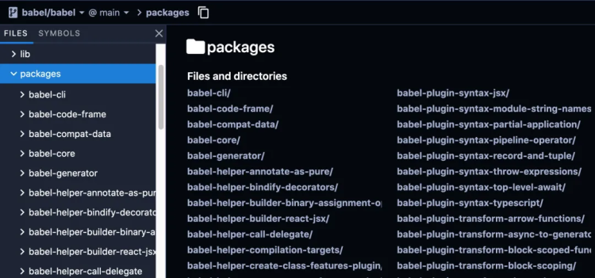

<a name="JA07R"></a>

## 大型项目管理  Monorepo

<a name="x1ZjE"></a>

### 背景

一个体系庞大的代码库拆分成多个单独的具有独立版本的 `package`，对于开发实际的代码共享非常有用。数量较少的时候，多个仓库维护不会有太大问题，但是当独立 `package` 数量越来越多的时候，就会暴露出很多开发困扰的问题：

1. 跨越很多代码存储库，修改代码很麻烦
2. `issue` 难以统一追踪、管理，因为其分散在独立的 `repo` 里
3. 跨存储库的代码测试非常复杂
4. 多个 `package` 之间相互依赖，对于互相引用的版本号依赖维护成本非常高，开发人员不得不使用 `npm link` 的方式去引用依赖

为了解决上面这些问题，一些项目会将其代码库统一组织到多包存储库中，我们称之为 `monorepos`。如：`babel`、`react`、`angular`、`ember`、`meteor`、`jest`之类的项目以及许多其他项目都在单个存储库中开发所有软件包
 <a name="WDvDL"></a>

### 概念

`Menorepo` 是管理项目代码的一个方式，指在一个项目仓库 `repo` 中管理多个模块/包(`package`)，不同于常见的每个模块建立一个 `repo`。

:::success
`Meonorepo`的好处：
统一的工作流、`Code Shaking`。搭建一套脚手架，就能管理(构建、测试、发布)多个 package，统一测试、统一发版。
:::

:::danger
`Meonorepo`的坏处：
就是 `repo`的体积会比较大，由于每个 `package`都有自己的 `package.json`，会安装自己的 `node_modules`，但是大概率会很多包是重复的，这就使本来就很大的 `node_modules`变得更大。
:::

:::info
`Meonorepo`的解决方案：
`lerna`和`workspaces`特性。

对于 `node_modules`包重复安装的问题：
`lerna`提供了 `--hoist`选项，相同的依赖，会**提升**到 `repo`根目录下安装(比较鸡肋)，`lerna` 直接以字符串对比 `dependency` 的版本号，完全相同才会进行提升，`npm` 的 `semver` 约定(语义化版本规范)在这里并不起作用。
`yarn` 作为包管理器很好的解决了这个问题，只需要在根 `package.json`中以 `workspaces`字段声明 `packages` 目录和 `"private": true`，`yarn`就会以 `menorepo`的方式管理 `packages`。`yarn`会以 `semver`约定来分析 `dependencies`的版本，安装依赖时更快、占用体积更小。(`pnpm`也支持 `workspaces`)
在 `npm7.x+` 后，也开始支持了 `workspaces` 特性，这个功能让我们在本地开发包，尤其是多个互相依赖的包时更加得心应手。它可以避免我们再手动的去执行 `npm link` 命令，而是在`npm install` 的时候，会自动把 `workspaces`下面的合法包，自动创建符号链接到根目录的 `node_modules`里。能够被单独作为一个包创建符号链接的文件夹，我们就称为一个`workspace`，所以是可以有多个`workspace` 的，可以在 `package.json` 的 `workspaces` 字段中进行配置。
::: <a name="gLXts"></a>

### lerna 介绍

<a name="KinvH"></a>

#### lerna 特性

1. 自动解决 `packages` 之间的依赖关系
2. 通过 `git` 检测文件改动，自动发布
3. 根据 `git` 提交记录，自动生成 `CHANGELOG`

`lerna` 不负责构建、测试等任务，它提出了一种集中管理 `package` 的目录模式，提供了一套自动化管理程序，让开发者不必再深耕到具体的组件里维护内容，在项目根目录就可以全局掌控，基于 `npm scripts`，可以很好地完成组件构建，代码格式化等操作，并在最后用 `lerna` 统一变更 `package` 版本，将其发布上传至远端。 <a name="jUT5Q"></a>

#### lerna 常用命令

- `lerna init`：初始化 `monorepo` 工程项目，生成 `packages/`、`package.json`、`lerna.json`

```markdown
.
├── lerna.json
├── package.json
└── packages/ # 这里将存放所有子 repo 目录
    ├── project_1/
    │   ├── index.js
    │   ├── node_modules/
    │   └── package.json
    ├── project_2/
    │   ├── index.js
    │   ├── node_module/
    │   └── package.json
    ...
```

- `lerna bootstrap --hoist` 为所有项目安装依赖，并链接所有依赖包，类似于 `npm i`使用`--hoist` 选项后，所有公共的依赖都只会安装在根目录的 `node_modules` 目录中去,而不会在每个包目录下的 `node_modules` 中都保留各自的依赖包。
- `lerna clean` 删除所有项目的 `node_modules` 目录
- `lerna run [script]` 默认为所有的项目运行 `npm run [script]`脚本，可以指定项目；
- `lerna changed` 列出下次发版 `lerna publish` 要更新的包。
- `lerna publish` 版本发布，按提示选择版本号(递增，或自定义)，将会执行以下步骤：
  - 运行 `lerna updated` 来决定哪一个包需要被 `publish`
  - 如果有必要，将会更新 `lerna.json` 中的 `version`
  - 将所有更新过的的包中的 `package.json` 的 `version` 字段更新
  - 将所有更新过的包中的依赖更新
  - 为新版本创建一个 `git commit` 或 `tag`
  - 将包 `publish` 到 `npm` 上；注意要先用 `npm adduser` 登录 `npm` 源，否则会失败；
- `lerna add [@version] [--dev] [--exact] [--peer]` ：可以指定为某一个或所有的包安装依赖，依赖可以是外部(`npm i `安装的)，也可以是内部依赖(`packages`/下的包，会创建符号链接)，`example`：
  - `lerna add babel` , 该命令会在 `package-1` 和 `package-2` 下安装 `babel`
  - `lerna add react --scope=package-1` ,该命令会在 `package-1` 下安装 `react`
  - `lerna add package-2 --scope=package-1`，该命令会在 `package-1` 下安装 `package-2`
- `lerna create [loc]` 创建一个 `lerna` 管理的包
- `lerna ls` 控制台打印 `packages` 下的包名
- `lerna link` 类似 `npm link` <a name="bkDYM"></a>

#### lerna.json 配置介绍

```json
{
  "version": "1.1.1",
  "npmClient": "yarn",
  "command": {
    "publish": {
      "ignoreChanges": ["ignored-file", "*.md"],
      "message": "chore(release): publish %s",
      "registry": "https://npm.pkg.github.com"
    },
    "bootstrap": {
      "ignore": "component-*",
      "npmClientArgs": ["--no-package-lock"]
    }
  },
  "packages": ["packages/*"]
}
```

- `version`：当前存储库的版本，当为 `independent` 时，开启独立模式
- `npmClient`：一个选项，用于指定运行命令的特定客户端。 可更改为 `yarn`
- `packages`：用作包装位置的 `glob` 数组， 默认为 `["packages/*"]`, 也可以修改为其他目录
- `command.publish.ignoreChanges`: 接受一组 `glob` 数组，忽略不必要的更改发布新版本，例如 `md` 修改
- `command.publish.message`: 执行发布版本时自动会 `commit` 一条指定记录，当消息记录里包含 `%s` 将会替换为 `v1.1.1`, 如果是 `%v` 则直接替换为 `1.1.1`，如果是 `independent` 模式则会独立更新每个包的版本
- `command.publish.registry`: 设置要发布到的自定义地址
- `command.bootstrap.ignore`: 接收一个 `glob` 数组， 指定运行 `lerna bootstrap` 命令时需要忽略的目录
- `command.bootstrap.npmClientArg`: 接收一个字符串数组， 将参数直接传递给 `npm install`
- `command.bootstrap.scope`: 一组 `glob`，用于限制在运行 `lerna bootstrap` 命令时将 包含的软件包。 <a name="d2nuq"></a>

#### lerna 多包版本管理机制

- `Fixed/Locked mode(default)`固定模式

`vue`、`babel`都是用这种，在`publish`的时候，会在`lerna.json`文件里面 `"version": "0.15"`，依据这个号进行增加，只选择一次，其他有改动的包自动更新版本号

- `Independence mode`独立模式

`lerna init --independent`初始化项目，`lerna.json`文件里面 `"version": "independent"`，每次`publish`时，都将得到一个提示符，提示每个已更改的包，以指定是：`major`、`minor`、`patch`、`premajor`、`preminor`、`prepatch`、`prerelease` <a name="RSN7r"></a>

#### 启用 workspace 模式

默认是 `npm`，而且每个子 `package` 都有自己的`node_modules`，通过这样的设置后，只有顶层有一个`node_modules`

- 修改顶层`package.json`、`lerna.json`

```javascript
// package.json 文件加入
{
  "private": true,
  "workspaces": ["packages/*"]
}

// lerna.json 文件加入
{
  "useWorkspaces": true,
  "npmClient": "yarn" // 启动 yarn，不设置默认为 npm，npm7.x+ 支持 workspaces
}
```

<a name="p58HN"></a>

### Workspaces

<a name="ncpyk"></a>

#### 使用

```json
{
  "name": "vite-pros",
  "description": "使用 vite 作为构建工具的前端项目",
  "private": true,
  "workspaces": [
    "packages/*"
  ]
}
```

其中 `private: true` 是必需的！工作区并不意味着要发布，所以增加了这个安全措施，以确保没有任何东西可以意外暴露它们。`workspaces` 字段是包含每个工作区的路径的数组。由于追踪每个路径可能很乏味，因此该字段也接受 `glob` 模式！

1. 新建 `packages` 目录
2. `packages` 目录下就是我们的正常的工程了。 <a name="H2maV"></a>

#### 介绍

1. 安装依赖

```shell
[yarn|npm] install
```

2. 为某一个子项目安装依赖

```shell
# pro1 = packages/pro1
# npm
npm install vue -w pro1
# yarn
yarn workspace pro1 add -D react
```

:::tips
这里可以依赖同一个工作区下的其它工程，以 `yarn` 为例，如果依赖同工作区下的其它工程，`package.json` 的 `dependencies` 就会发生改变，例如：`"ph-utils": "workspace:packages/utils"`、`"ph-terminal-spinner": "workspace:packages/terminal-spinner"` 这就表明依赖的是同一个工作区的其它工程。
这样的可能有人就会有疑问了，如果 `package.json` 改变了后，上传后会怎么样呢？这个就是下面的命令了。
:::

3. 发布

```shell
# npm
npm publish
# yarn 发布的时候，会自动替换本地依赖的版本
yarn workspace pro1 npm publish
```

:::tips
`yarn` 发布的时候，如果会有本地有本地依赖如：`"ph-utils": "workspace:packages/utils"` 则会被替换为 `"ph-utils": "0.0.1"` 其中 `0.0.1` 就是本地 `ph-utils` 的版本。
::: <a name="XGgua"></a>

## Monorepo 方案实践

<a name="gn9GX"></a>

### 1. 锁定环境: Volta


[Volta](https://volta.sh/) 是一个 `JavaScript` 工具管理器，它可以让我们轻松地在项目中锁定 `node`，`npm` 和 `yarn` 的版本。你只需在安装完 `Volta` 后，在项目的根目录中执行 `volta pin` 命令，那么无论您当前使用的 `node` 或 `npm`（`yarn`）版本是什么，`volta` 都会自动切换为您指定的版本。

因此，除了使用 `Docker` 和显示在文档中声明 `node` 和 `npm`（`yarn`）的版本之外，您就有了另一个锁定环境的强力工具。

而且相较于 `nvm`，`Volta` 还具有一个诱人的特性：当您项目的 `CLI` 工具与全局 `CLI` 工具不一致时，`Volta` 可以做到在项目根目录下自动识别，切换到项目指定的版本，这一切都是由 `Volta` 默默做到的，开发者不必关心任何事情。 <a name="p9nEa"></a>

### 2. 复用 packages: workspace

使用 `monorepo` 策略后，收益最大的两点是：

1. 避免重复安装包，因此减少了磁盘空间的占用，并降低了构建时间；
2. 内部代码可以彼此相互引用；

这两项好处全部都可以由一个成熟的包管理工具来完成，对前端开发而言，即是 `yarn`（`1.0` 以上）或 `npm`（`7.0` 以上）通过名为 `workspaces` 的特性实现的（⚠️ 注意，支持 `workspaces` 特性的 `npm` 目前依旧不是 `TLS` 版本）。

为了实现前面提到的两点收益，您需要在代码中做三件事：

1. 调整目录结构，将相互关联的项目放置在同一个目录，推荐命名为 `packages`；
2. 在项目根目录里的 `package.json` 文件中，设置 `workspaces` 属性，属性值为之前创建的目录；
3. 同样，在 `package.json` 文件中，设置 `private` 属性为 `true` (为了避免我们误操作将仓库发布)；

经过修改，项目目录看起来应该是这样：

```markdown
.
├── package.json
└── packages/
    ├── @mono/project_1/ # 推荐使用 `@<项目名>/<子项目名>` 的方式命名
    │   ├── index.js
    │   └── package.json
    └── @mono/project_2/
        ├── index.js
        └── package.json
```

而当在项目根目录中执行 `npm install` 或 `yarn install` 后，会发现在项目根目录中出现了 `node_modules` 目录，并且该目录不仅拥有所有子项目共用的 `npm` 包，还包含了我们的子项目。因此，我们可以在子项目中通过各种模块引入机制，像引入一般的 `npm` 模块一样引入其他子项目的代码。

请注意我们对子项目的命名，统一以 `@<repo_name>/` 开头，这是一种社区最佳实践，不仅可以让用户更容易了解整个应用的架构，也方便您在项目中更快捷的找到所需的子项目。

至此，我们已经完成了 `monorepo` 策略的核心部分，实在是很容易不是吗？但是老话说「行百里者半九十」，距离优雅的搭建一个 `monorepo` 项目，我们还有一些路要走。 <a name="eHgR9"></a>

### 3. 统一配置: 合并同类项 - Eslint、TypeScript、Babel

编写代码要遵循 `DRY` 原则（`Don't Repeat Yourself` 的缩写）。那么，理所当然地，我们应该尽量避免在多个子项目中放置重复的 `eslintrc`，`tsconfig` 等配置文件。幸运的是，`Babel`，`Eslint` 和 `Typescript` 都提供了相应的功能让我们减少自我重复。 <a name="p6Ser"></a>

#### TypeScript

我们可以在 `package.json`目录中放置 `tsconfig.setting.json` 文件，并在文件中定义通用的 `ts` 配置。然后，在每个子项目中，可以通过 `extends` 属性，引入通用配置，并设置 `compilerOptions.composite` 的值为 `true`，理想情况下，子项目中的 `tsconfig` 文件应该仅包含下述内容：

```json
{
  "extends": "../tsconfig.setting.json", // 继承 packages 目录下通用配置
  "compilerOptions": {
    "composite": true, // 用于帮助 TypeScript 快速确定引用工程的输出文件位置
    "outDir": "dist",
    "rootDir": "src"
  },
  "include": ["src"]
}
```

<a name="p5cZY"></a>

#### Eslint

对于 `Eslint` 配置文件，我们也可以如法炮制，这样定义子项目的 `.eslintrc` 文件内容：

```json
{
  "extends": "../../.eslintrc", // 注意这里的不同
  "parserOptions": {
    "project": "tsconfig.json"
  }
}
```

对于通用的 `eslint` 配置，我们并没有将其放置在 `packages` 目录中，而是放在整个项目的根目录下，这样做的目的是：一些编辑器插件只会在项目根目录寻找 `.eslintrc` 文件，因此为了我们的项目能够保持良好的**「开发环境一致性」**，请务必将通用配置文件放置在项目的根目录中。 <a name="WcliS"></a>

#### Babel

`Babel`配置文件合并的方式与 `TypeScript`如出一辙，甚至更加简单，我们只需在子项目中的 `.babelrc`文件中这样声明即可：

```json
{
  "extends": "../.babelrc"
}
```

当一切准备就绪后，我们的项目目录应该大致呈现如下所示的结构：

```markdown
.
├── package.json
├── .eslintrc
└── packages/
    │   ├── tsconfig.settings.json
    │   ├── .babelrc
    ├── @mono/project_1/
    │   ├── index.js
    │   ├── .eslintrc
    │   ├── .babelrc
    │   ├── tsconfig.json
    │   └── package.json
    └───@mono/project_2/
        ├── index.js
        ├── .eslintrc
        ├── .babelrc
        ├── tsconfig.json
        └── package.json
```

<a name="xyN0R"></a>

### 4. 统一命令脚本: scripty

在上一步中，我们尽可能的将所有配置文件进行抽象，从而精简了代码，并提高了整个项目的一致性。我们的整个仓库也因此有了**「更浓郁的 monorepo 风味 ☕️」**。但如果仔细审视我们的整个工程文件，还有一处存在着明显的瑕疵和一些恼人的坏味道，当您仔细审视您的众多 `package.json` 文件时，您就知道我在说什么了 `-- scripts` 脚本。

如果您的子项目足够多，您可能会发现，每个 `package.json` 文件中的 `scripts` 属性都大同小异，并且一些 `scripts` 充斥着各种 `Linux` 语法，例如管道操作符，重定向或目录生成。重复带来低效，复杂则使人难以理解，这都是需要我们解决的问题。

这里给出的解决方案是，使用 [scripty](https://www.npmjs.com/package/scripty) 管理您的脚本命令，简单来说，`scripty` 允许您将脚本命令定义在文件中，并在 `package.json` 文件中直接通过文件名来引用。这使我们可以实现如下目的：

1. 子项目间复用脚本命令；
2. 像写代码一样编写脚本命令，无论它有多复杂，而在调用时，像调用函数一样调用；

通过使用 `scripty` 管理我们的 `monorepo` 应用，目录结构看起来将会是这样：

```markdown
.
├── package.json
├── .eslintrc
├── scirpts/ # 这里存放所有的脚本
│   │   ├── packages/ # 包级别脚本
│   │   │   ├── build.sh
│   │   │   └── test.sh
│   └───└── workspaces/ # 全局脚本
│           ├── build.sh
│           └── test.sh
└── packages/
    │   ├── tsconfig.settings.json
    │   ├── .babelrc
    ├── @mono/project_1/
    │   ├── index.js
    │   ├── .eslintrc
    │   ├── .babelrc
    │   ├── tsconfig.json
    │   └── package.json
    └── @mono/project_2/
        ├── index.js
        ├── .eslintrc
        ├── .babelrc
        ├── tsconfig.json
        └── package.json
```

注意，我们脚本分为两类**「package 级别」**与**「workspace 级别**」，并且分别放在两个文件夹内。这样做的好处在于，我们既可以在项目根目录执行全局脚本，也可以针对单个项目执行特定的脚本。

通过使用 `scripty`，子项目的 `package.json` 文件中的 `scripts` 属性将变得非常精简：

```json
{
  ...
  "scripts": {
    "test": "scripty",
    "lint": "scripty",
    "build": "scripty"
  },
  "scripty": {
    "path": "../../scripts/packages" // 注意这里我们指定了 scripty 的路径
  },
  ...
}
```

大功告成！🎉 至此，我们尽己所能地删除了整个项目中的重复代码，让整个项目变得干净，清爽并且有极强的复用性。
:::info
🧉 小贴士：
别忘了使用 `chmod -R u+x scripts` 命令使所有的 `shell` 脚本具备可执行权限，也千万别忘了把这条贴士写在您的 `README.md` 文件中！
::: <a name="HpKUb"></a>

### 5. 统一包管理: lerna


我有时会感慨自己的灵感匮乏，怎么就想不到 `Lerna` 这样既有神话色彩又能自我释义的好名字。您可以大胆想象，九头龙的每只龙头都在帮您管理着一个子项目，而您只需要骑在龙身上发号施令的场景，这基本上就是我们使用 `Lerna` 时的直观感受。

这也是为什么当我们提起 `monorepo` 策略，就几乎不得不提到 `Lerna` 的原因了，它的确提供了一种非常便捷的方式供我们管理 `monorepo` 项目。当子项目越多时，`Lerna` 就越能显示其威力。

当多个子项目放在一个代码仓库，并且子项目之间又相互依赖时，我们面临的棘手问题有两个：

1. 如果我们需要在多个子目录执行相同的命令，我们需要手动进入各个目录，并执行命令；
2. 当一个子项目更新后，我们只能手动追踪依赖该项目的其他子项目，并升级其版本。

通过使用 `Lerna`，这些棘手的问题都将不复存在。

当在项目根目录使用 `npx lerna init` 初始化后，我们的根目录会新增一个 `lerna.json` 文件，默认内容为：

```json
{
  "packages": ["packages/*"],
  "version": "0.0.0"
}
```

让我们稍稍改动这个文件，使其变为：

```json
{
  "packages": ["packages/*"],
  "npmClient": "yarn",
  "version": "independent",
  "useWorkspaces": true,
}
```

可以注意到，我们显示声明了我们的包客户端（`npmClient`）为 `yarn`，并且让 `Lerna` 追踪我们 `workspaces` 设置的目录，这样我们就依旧保留了之前 `workspaces` 的所有特性（子项目引用和通用包提升）。

除此之外一个有趣的改动在于我们将 `version` 属性指定为一个关键字 `independent`，这将告诉 `lerna` 应该将每个子项目的版本号看作是相互独立的。当某个子项目代码更新后，运行 `lerna publish` 时，`Lerna` 将监听到代码变化的子项目并以交互式 `CLI` 方式让开发者决定需要升级的版本号，关联的子项目版本号不会自动升级，反之，当我们填入固定的版本号时，则任一子项目的代码变动，都会导致所有子项目的版本号基于当前指定的版本号升级。

`Lerna` 提供了很多 `CLI` 命令以满足我们的各种需求，但根据 2/8 法则，您应该首先关注以下这些命令：

- `lerna bootstrap`：等同于 lerna link + yarn install，用于创建符合链接并安装依赖包；
- `lerna run`：会像执行一个 for 循环一样，在所有子项目中执行 npm script 脚本，并且，它会非常智能的识别依赖关系，并从根依赖开始执行命令；
- `lerna exec`：像 `lerna run `一样，会按照依赖顺序执行命令，不同的是，它可以执行任何命令，例如 `shell` 脚本；
- `lerna publish`：发布代码有变动的 `package`，因此首先您需要在使用 `Lerna` 前使用 `git commit` 命令提交代码，好让 `Lerna` 有一个 `baseline`；
- `lerna add`：将本地或远程的包作为依赖添加至当前的 `monorepo` 仓库中，该命令让 `Lerna` 可以识别并追踪包之间的依赖关系，因此非常重要；

```shell
# 向 @mono/project2 和 @mono/project3 中添加 @mono/project1
lerna add @mono/project1 '@mono/project{2,3}'
```

<a name="IoUuw"></a>

#### lerna 高级命令

除了上面介绍到的常用命令外，`Lerna` 还提供了一些参数满足我们更灵活的需求，例如：

- `--concurrency <number>`：参数可以使 `Lerna` 利用计算机上的多个核心，并发运行，从而提升构建速度；
- `--scope '@mono/{pkg1,pkg2}'`：`--scope` 参数可以指定 `Lerna` 命令的运行环境，通过使用该参数，`Lerna` 将不再是一把梭的在所有仓库中执行命令，而是可以精准地在我们所指定的仓库中执行命令，并且还支持示例中的模版语法；
- `--stream`：该参数可使我们查看 `Lerna` 运行时的命令执行信息； <a name="iCnP2"></a>

#### npm 包本地发布：Verdaccio


看到这里，您可能想要亲自体验一把使用 `Lerna` 管理/发布 `monorepo` 项目的感觉。可是很快您会发现，将示例代码发布到真实世界的 `npm` 仓库并非一个好主意，这多少有些令人沮丧，但是别担心，您可以使用 [Verdaccio](https://verdaccio.org/) 在本地创建一个 `npm` 仓库作为代理，然后尽情体验 `Lerna` 的种种强大之处。

安装运行 `Verdaccio` 非常简单，您只需运行：

```shell
npm install --global verdaccio
```

在全局安装 `Verdaccio` 应用，然后在 `shell` 中输入：

```shell
verdaccio
```

即可通过 `localhost:4837` 访问您的本地代理 `npm` 仓库，别忘了在您的项目根目录创建 `.npmrc` 文件，并在文件中将 `npm` 仓库地址改写为您的本地代理地址：

```shell
registry="http://localhost:4873/"
```

大功告成 🙌！每当您执行 `lerna publish` 时，子项目所构建成的 `package` 将会发布在本地 `npm` 仓库中，而当您执行 `lerna bootstrap` 时，`Verdaccio` 将会放行，让您成功从远程 `npm` 仓库中拉取相应的代码。 <a name="iwmes"></a>

### 6. 格式化 commit 管理

至此，我们已经掌握了组织一个项目级 `monorepo` 仓库的所有前沿技巧，最后，让我们看看最后一个可以优化的地方：代码提交时，约束 `commit` 信息。

一个 `monorepo` 仓库可能被不同的开发者提交不同子项目的代码，如果没有规范化的 `commit` 信息，在故障排查或版本回滚时毫无意外会遭遇灾难。因此，千万不要小看 `commit` 信息格式化的重要性（当然，同样重要的还有代码注释！）。

为了我们能够一目了然的追踪每次代码变更的信息，我们使用 [commitlint](https://github.com/conventional-changelog/commitlint/#what-is-commitlint) 工具作为格式化 `commit` 信息的不二之选。

顾名思义，`commitlint` 可以帮助我们检查提交的 `commit` 信息，它强制约束我们的 `commit` 信息必须在开头附加指定类型，用于标示本次提交的大致意图，支持的类型关键字有：

- `feat`：表示添加一个新特性；
- `chore`：表示做了一些与特性和修复无关的「家务事」；
- `fix`：表示修复了一个 `Bug`；
- `refactor`：表示本次提交是因为重构了代码；
- `style`：表示代码美化或格式化；
- ...

我强烈建议您遵循该规范编写您的 `commit` 信息，不要偷懒，坚持下去，您的 git 日志将会显得整齐，有条理，富有表现力，同时，您也会收到同行的交口称赞，人人都会以和您这样优雅的工程师合作为荣。

除了限定 `commit` 信息类型外，`commitlint` 还支持（虽然不是必须的）显示指定我们本次提交所对应的子项目名称。假如我们有一个名为 `@mono/project1` 的子项目，我们针对该项目提交的 `commit` 信息可以写为：

```git
git commit -m "feat(project1): add a attractive button" # 注意，我们省略了 @mono 的项目前缀
```

毫无疑问，这将会使我们的 `commit` 信息更具表现力。

我们可以通过下面的命令安装 `commitlint` 以及周边依赖：

```shell
npm i -D @commitlint/cli @commitlint/config-conventional @commitlint/config-lerna-scopes commitlint husky lerna-changelog
```

注意到了吗？我偷偷安装了 [husky](https://www.npmjs.com/package/husky)，它能够帮助我们在提交 `commit` 信息时自动运行 `commitlint` 进行检查，但在这之前，我们需要再在根目录下的 `package.json` 文件里加点料，像这样：

```json
{
 ...
 "husky": {
    "hooks": {
      "commit-msg": "commitlint -E HUSKY_GIT_PARAMS"
    }
  }
 ...
}
```

为了能够让 `commitlint` 感知我们的子项目名称，我们还需在项目根目录中增加 `commitlint.config.js` 文件，并设置文件内容为：

```javascript
module.exports = {
  extends: [
    "@commitlint/config-conventional",
    "@commitlint/config-lerna-scopes",
  ],
};
```

至此，我们统一并规范化了 `monorepo` 项目的 `commit` 信息，终于整个 `monorepo` 工程化的最后一块拼图被我们拼上了！
（顺便一提，您可以通过在命令行执行 `echo "build(project1): change something" | npx commitlint` 命令即可验证您的 `commit` 信息是否通过 `commitlint` 的检查。）
