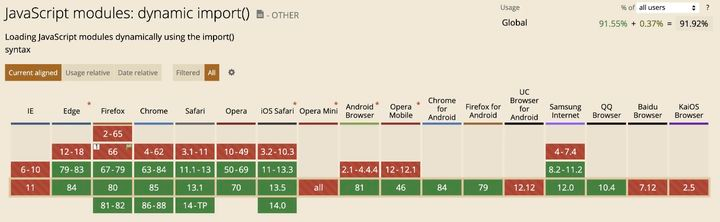
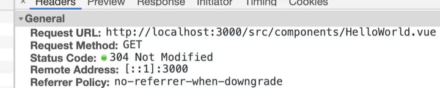
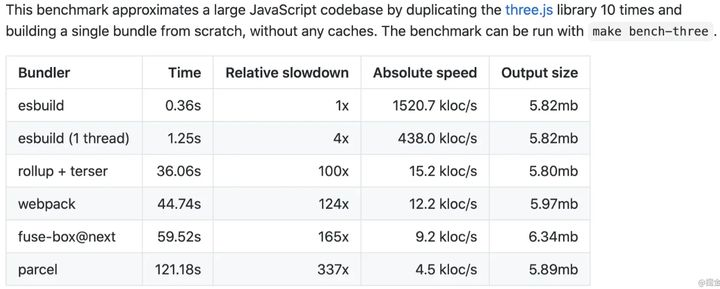

<a name="cZTZn"></a>

## ESM

ESM 是 es6 出现后，浏览器支持的一种模块化方案，允许在浏览器实现模块化。与 CommonJS、AMD 不同，ESM 对外借口只是一种静态定义，为编译时记载，遇到模块加载命令 import，就会生成一个只读引用。等脚本真正执行时，再根据这个只读引用，到被加载的那个模块内取值。由于 ESM 编译时就能确定模块的依赖关系，因此能够只包含要运行的代码，可以显著减少文件体积，降低浏览器压力。

以下为其浏览器的支持能力：


- ESM 的解析过程

```vue
<template>
  
  <HelloWorld msg='Hello Vue 3.0 + Vite' />
</template>

<script script='setup'>
  import HelloWorld from './components/HelloWorld.vue'
</script>
```

当浏览器解析 `import HelloWorld from './components/HelloWorld.vue'` 时，会向当前于i域名发送一个请求获取对应的资源 (ESM 支持解析相对路径)。

浏览器下载对应的资源，然后解析成模块记录。接下来会进行实例化，为模块分配内存，然后按照导入、导出语句建立模块和内存的映射关系。最后，运行上述代码，把内存空间填充为真实的值。 <a name="KyarL"></a>

## esbuild

vite 采用 esbuild 进行打包，esbuild 是一个全新的 js 打包工具，支持如 babel、压缩等功能。其底层使用了 go 语言实现，整体打包会快 10 ～ 100 倍。同时大量使用了并行操作，可以充分利用 cpu 资源。

- esbuild 对比 其他打包工具如下：



- esbuild 支持以下的功能：
  - 加载器
  - 压缩
  - 打包
  - tree-shaking
  - source map 生成
    :::info
    esbuild 总共提供了四个函数：transform、build、buildSync、Service
    ::: <a name="GSb0p"></a>

## rollup

在生产环境下，vite 使用 rollup 来进行打包

rollup 是基于 ESM 的 javaScript 打包工具，相比于 webpack，他总能打出更小、更快的包。因为 rollup 基于 ESM 模块，比 webpack 和 Browserify 使用的 CommonJS 模块机制更高效。rollup 的亮点在于同一个地方，一次性加载。能针对源码进行 tree shaking，以及 scope hoisting 以减小输出文件大小，提升运行性能。

rollup 分为 build(构建) 阶段和 output generate(输出生成) 阶段。主要过程如下：

1. 获取入口文件的内容，包装成 module，生成 ast
2. 对入口文件 ast 进行依赖解析
3. 生成最终代码
4. 写入目标文件
