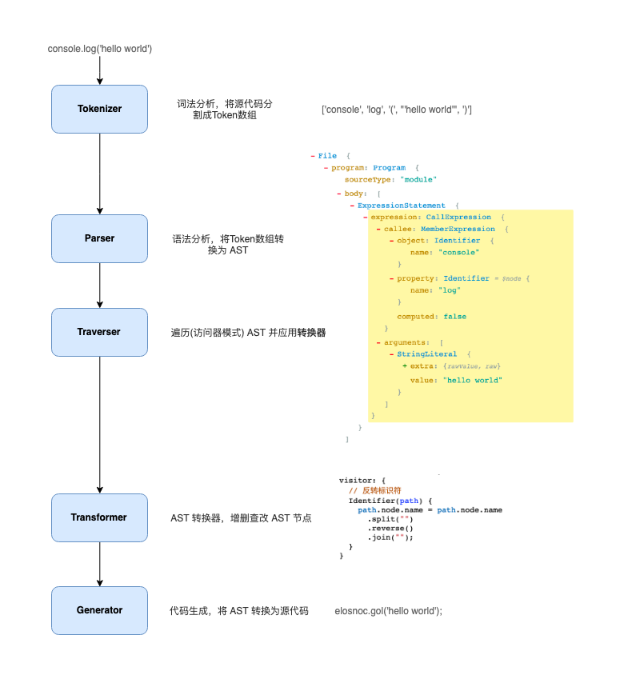
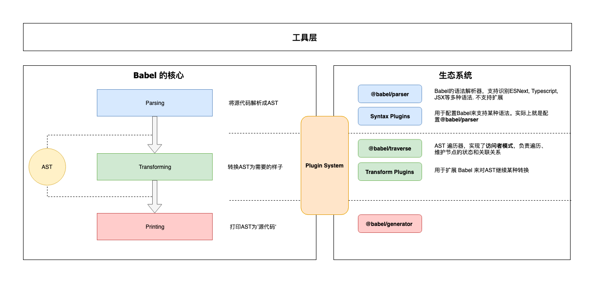

<a name="FUqRV"></a>

## Babel 处理步骤

`babel` 大概分为三个部分：解析 `parse`、转换 `transform`、生成 `generate` <a name="gvSJj"></a>

### 解析 `parse`

:::success
将代码转换为 `ast` 抽象语法树
::: <a name="JxSrN"></a>

#### 词法分析

:::success
将字符串形式的代码转换为令牌 `token` 流，即语法片段组成的数组
:::

```javascript
n * n

[
  { type: { ... }, value: "n", start: 0, end: 1, loc: { ... } },
  { type: { ... }, value: "*", start: 2, end: 3, loc: { ... } },
  { type: { ... }, value: "n", start: 4, end: 5, loc: { ... } },
  ...
]
  
// 每一个 type 有一组属性来描述该令牌
{
  type: {
    label: 'name',
    keyword: undefined,
    beforeExpr: false,
    startsExpr: true,
    rightAssociative: false,
    isLoop: false,
    isAssign: false,
    prefix: false,
    postfix: false,
    binop: null,
    updateContext: null
  },
  ...
}
  
// 和 AST 节点一样它们也有 start，end，loc 属性。
```

<a name="zpTXR"></a>

#### 语法分析

:::success
将一个 `token` 流(上一步生成的数组)转换成 `ast` 的形式。这个阶段会使用令牌中的信息把他们转换成一个 `ast` 的表述结构，这样更易于后续操作
::: <a name="cRt2A"></a>

### 转换 `transform`

:::success
接收 `ast` 并对其进行遍历，在此过程中对节点进行添加、更新及移除等操作，最终产出新的 `ast`。这是 `babel` 或是其他编译器中最复杂的过程，同时也是插件将要介入工作的部分
::: <a name="ErZ8J"></a>

### 生成 `generate`

:::success
把最终(经过一系列转换之后)的 `ast` 转换成字符串形式的代码，同时还会创建源码映射(`source map`)
:::

:::info
`taro` 就是利用 `babel` 完成的小程序语法转换；通过**关键字**来进行词法分析。
::: <a name="DaTkJ"></a>

## Babel 处理流程

 <a name="Y4qoH"></a>

## Babel 的架构


Babel 是一个 [MonoRepo](https://github.com/lerna/lerna) 项目， 不过组织非常清晰，下面就源码上我们能看到的模块进行一下分类， 配合上面的架构图让你对Babel有个大概的认识:

<a name="qtNtO"></a>

### 1. 核心

`@babel/core` 这也是上面说的‘微内核’架构中的‘内核’。对于 `babel` 来说，这个内核主要干这些事情：

- 加载和处理配置(`config`)
- 加载插件
- 调用 `Parser` 进行语法解析，生成 `ast`
- 调用 `Traverser` 遍历 `ast`，并使用访问者模式应用’插件’对 `ast` 进行转换
- 生成代码，包括 `source-map` 转换和源代码生成

```javascript
import * as babel from "@babel/core"

babel.transform(code, options, function (err, result) {
  console.log(result) // { code, map, ast }
})
```

<a name="QGsG4"></a>

### 2. 核心周边支撑

- `Parser`(`@babel/parser`)： 将源代码解析为 `ast` 。 它已经内置支持很多语法. 例如 `JSX`、`TypeScript`、`flow`、以及最新的 `ECMAScript` 规范。目前为了执行效率，`Parser` 是[不支持扩展的](https://babeljs.io/docs/en/babel-parser#faq)，由官方进行维护。如果你要支持自定义语法，可以 `fork` 它，不过这种场景非常少。
- `Traverser`(`@babel/traverse`)： 实现了**访问者模式**，对 `ast` 进行遍历，转换插件会通过它获取感兴趣的 `ast` 节点，对节点继续操作，下文会详细介绍**访问器模式**。

```javascript
// 使用 @babel/parser @babel/traverse 一起遍历和更新节点:
import * as parser from "@babel/parser"
import traverse from "@babel/traverse"

const code = `function square(n) {
  return n * n
}`

const ast = parser.parse(code)

traverse(ast, {
  enter(path) {
    if (path.isIdentifier({ name: "n" })) {
      path.node.name = "x"
    }
  },
  // 此外，我们可以针对语法树中的特定节点类型
  FunctionDeclaration: function(path) {
    path.node.id.name = "x"
  }
})
```

- `generator`(`@babel/generator`)： 将 `ast` 转换为源代码，支持 `source-map`

```javascript
// @babel/generator 是 Babel 的代码生成器，它将转换成源代码
import parser from "@babel/parser"
import generate from "@babel/generator"

const code = `function square(n) {
  return n * n
}`

const ast = parser.parse(code)

generate(ast, {}, code)
// {
//   code: "...",
//   map: "...",
// }

// 或者传递参数
generate(ast, {
  retainLines: false,
  compact: "auto",
  concise: false,
  quotes: "double",
  // ...
}, code)
```

<a name="MKkFE"></a>

### 3. 插件

打开 `babel` 的源代码，会发现有好几种类型的 **"插件"**。

- **语法插件**(`@babel/plugin-syntax-*`)：上面说了 `@babel/parser` 已经支持了很多 `JavaScript` 语法特性，`Parser` 也不支持扩展。因此 `plugin-syntax-*` 实际上只是用于开启或者配置 `parser` 的某个功能特性。一般用户不需要关心这个，`transform` 插件里面已经包含了相关的 `plugin-syntax-*` 插件了。用户也可以通过 [parserOpts](https://babeljs.io/docs/en/options#parseropts) 配置项来直接配置 `Parser`
- **转换插件**： 用于对  `ast` 进行转换, 实现转换为 `es5` 代码、压缩、功能增强等目的。`babel` 仓库将转换插件划分为两种(只是命名上的区别)：
  - `@babel/plugin-transform-*`： 普通的转换插件
  - `@babel/plugin-proposal-*`： 还在 **"提议阶段"**(非正式)的语言特性, 目前有[这些](https://babeljs.io/docs/en/next/plugins#experimental)
- **预定义集合(**`**@babel/preset-***`**)**： 插件集合或者分组，主要方便用户对插件进行管理和使用。
  - 比如 `@babel/preset-env` 含括所有的标准的最新特性
  - 比如 `@babel/preset-react` 含括所有 `react` 相关的插件
  - 比如 `@babel/typescript`包含所有 `typescript` 相关的插件 <a name="Kxctu"></a>

### 4. 插件开发辅助

- `@babel/template`： 某些场景直接操作 `ast` 太麻烦，就比如我们直接操作 `dom` 一样，所以 `babel` 实现了这么一个简单的模板引擎，可以将字符串代码转换为 `ast`。比如在生成一些辅助代码(`helper`)时会用到这个库
- `@babel/types`： `ast` 节点构造器和断言，插件开发时使用很频繁
- `@babel/helper-*`： 一些辅助器，用于辅助插件开发，例如：简化 `ast` 操作
- `@babel/helper`： 辅助代码，单纯的语法转换可能无法让代码运行起来，比如低版本浏览器无法识别 `class`关键字，这时候需要添加辅助代码，对 `class` 进行模拟。 <a name="RQWjE"></a>

### 5. 工具

- `@babel/node`： `Node.js CLI`，通过它直接运行需要 `babel` 处理的 `javaScript` 文件
- `@babel/register`： `Patch NodeJs`  的 `require` 方法，支持导入需要 `babel` 处理的 `javaScript` 模块
- `@babel/cli`： `CLI` 工具 <a name="xdUAd"></a>

## 编写 Babel 插件

```javascript
// 源代码
foo === bar;
```

其 `AST` 形式如下：

```javascript
{
  type: "BinaryExpression",
  operator: "===",
  left: {
    type: "Identifier",
    name: "foo"
  },
  right: {
    type: "Identifier",
    name: "bar"
  }
}
```

添加 `BinaryExpression`访问者(`visitor`)方法开始：

```javascript
export default function(babel) {
  const { types: t } = babel
  
  return {
    visitor: {
      BinaryExpression(path) {
        if (path.node.operator !== "===") {
          return
        }
        path.node.left = t.identifier("sebmck")
      }
    }
  }
}
```

运行插件后可以得到：

```javascript
sebmck === bar
```

接下来需要替换 `right` 属性

```javascript
export default function(babel) {
  const { types: t } = babel
  
  return {
    visitor: {
      BinaryExpression(path) {
        if (path.node.operator !== "===") {
          return
        }
        path.node.left = t.identifier("sebmck")
        path.node.right = t.identifier("dork")
      }
    }
  }
}
```

最终结果：

```javascript
sebmck === dork
```
