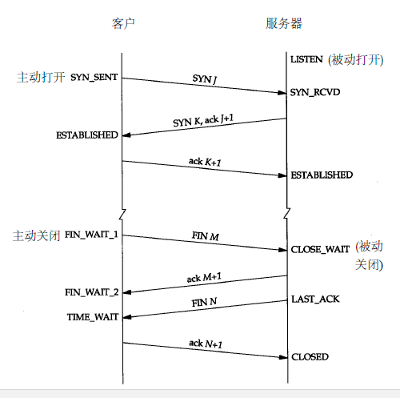
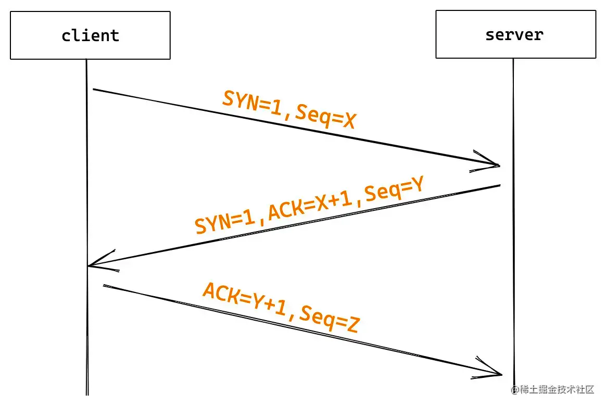
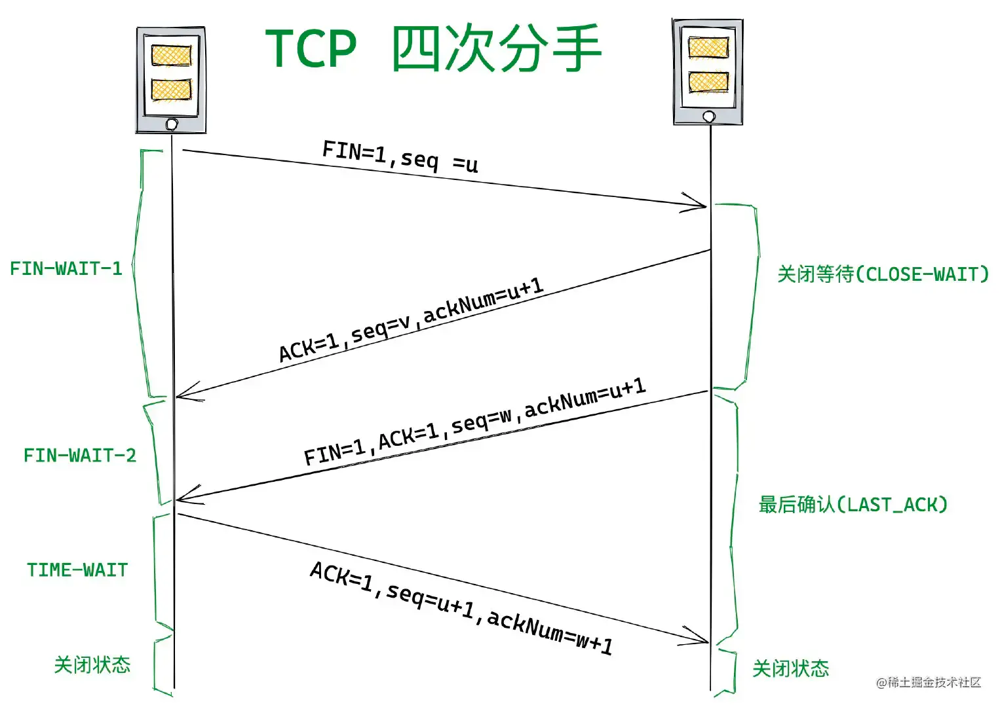

## 建立连接

- http 和 https 都需要在建立连接的基础上来进行数据传输
- 当客户在浏览器输入网址并按下回车，浏览器会在**浏览器 dns 缓存**、**本地 dns 缓存** 以及 **host** 中寻找对应记录，如果没有获取到则会请求 **dns** 服务来获取对应 **ip**
- 获取 **ip** 后，**tcp** 连接会进行三次握手建立连接

 

## 三次握手

:::tips
作用：确认客户端和服务端的接收与发送能力是否正常
:::

1. 建立连接时，客户端发送 syn 包到服务端，并进入 syn\_send 状态
2. 服务端收到 syn 包后，向客户端发送 syn + ack 包，服务器进入 syn\_rcvd 状态
3. 客户端收到服务端的 syn + ack 包后，向服务器发送 ack 确认包，发送完后，两边同时进入 establish 状态 

### 总结

1. 第一次握手：客服端发送网络包，服务端收到了。这样服务端可以得到结论：客户端的发送能力、服务端的接收能力是正常的
2. 第二次握手：服务端发包，客户端收到了。这样客户端可以得到结论：服务端的接收、发送能力，客户端的接收、发送能力是正常的。不过此时服务器并不能确认客户端的接收能力是否正常
3. 第三次握手：客户端发包，服务端收到了。这样服务端可以得到结论：客户端的接收、发送能力正常，服务器自己的发送、接收能力也正常 

## 四次挥手

1. tcp 向服务端发送 fin 包，用来关闭客户端到服务端之间的传输
2. 服务端收到 fin 包，返回一个 ack 包
3. 服务器关闭客户端的连接，发送一个 fin 包给客户端
4. 客户端发送 ack 报文进行确认 

### 总结

刚开始客户端和服务端都处于连接状态，然后某一方发起关闭请求，加入客户端发起关闭请求

1. 第一次挥手：客户端发送一个 FIN 报文，报文中会只定义个序列号。此时客户端处于 FIN\_WAIT1 状态
2. 第二次握手：服务端收到 FIN 之后，会发送 ACK 报文，且把客户端的序列号值 +1 作为 ACK 报文的序列号值，表明已经收到客户端的报文了，此时服务端处于 CLOSE\_WAIT 状态
3. 第三次挥手：如果服务端也想断开连接了，和客户端的第一次挥手一样，发给 FIN 报文，且指定一个序列号。此时服务端处于 LAST\_ACK 状态
4. 第四次挥手：客户端收到 FIN 之后，一样发送一个 ACK 报文作为应答，且把服务端的序列号值 +1 作为自己 ACK 报文的序列号值，此时客户端处于 TIME\_WAIT 状态。需要过一段时间，以确保服务端收到自己的 ACK 报文之后才会进入 CLOSE 状态
