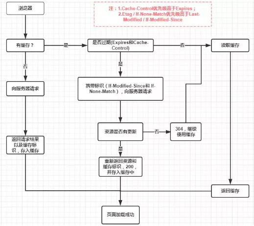
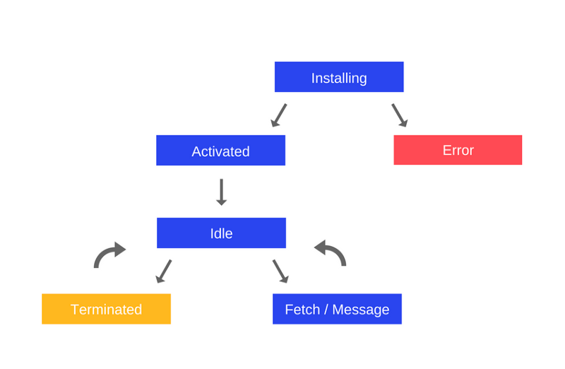

<a name="Hcavq"></a>

## http 缓存

浏览器中的缓存作用分为两种情况：需要发送 `http` 请求 和 不需要发送 `http` 请求。因此，会**依次检查** **强缓存策略 **和 **协商缓存策略**。
 <a name="VvZQw"></a>

### 强缓存

强缓存表示在缓存期间不需要发送 http 请求，因此它的 http 状态码为 200。

强缓存主要通过请求头中的相应字段来进行检查。

- http/1.0：Expires
- http/1.1：Cache-Control

:::tips
优先级：Cache-Control > Expires
::: <a name="fyH3X"></a>

#### Expires

Expires 即过期时间。存在于服务端返回的响应头中，告诉浏览器在这个过期时间之前可以直接从缓存里获取数据，无需再次请求

    // 例子：资源会在 2022-11-22 08:41 过期
    Expires: Wed, 22 Nov 2022 08:41:00 GMT

:::danger
缺陷：服务器时间和浏览器时间可能不一致，那么服务器返回的这个过期时间可能就是不准确的。
::: <a name="zxsvk"></a>

#### Cache-Control

在 http/1.1 中，采用了一个非常关键的字段：Cache-Control。这个字段也是存在于服务端返回的响应头中

它和 Expires 本质的不同在于它并没有采用**具体的过期时间点**这个方式，而是**采用过期时长**来控制缓存，对应的字段是 `max-age`

    // 例子：在一个小时内可以直接使用缓存
    Cache-Contorl:max-age=3600

<a name="SuHOm"></a>

#### Cache-Control 的其他属性

- **no-cache**：可以在本地进行缓存，但每次请求时，都需要向服务器进行验证，若服务器允许，才可使用本地缓存(缓存服务器在进行缓存前，必须校验是否过期)
- **no-store**：响应报文中可能存在机密信息，不可缓存
- public：明确指明缓存可以给所有用户使用
- private：明确知名缓存不可以给其他用户使用
- must-revalidate：如果缓存未过期则返回；否则代理在返回缓存数据之前，必须想源服务器发起请求，验证缓存是否有效。如果无法连接上源服务器，则返回 504 网关超时
- proxy-revalidate：所有缓存服务器在返回缓存数据前，都要向源服务器发起请求验证有效性
- s-maxage=\[秒]：缓存资源的时间小于指定时间时，直接返回缓存 <a name="oHYS7"></a>

### 协商缓存

强缓存失效之后，浏览器在**请求头携带相应的缓存 tag** 来向服务器发请求，由服务器根据这个 tag 来决定是否使用缓存，这就是协商缓存。

具体来说，这样的缓存 tag 分为两种：**Last-Modified** 和 **ETag**，二者各有优劣。

当浏览器发送请求验证资源时，如果资源没有做改变，那么服务端会返回 304 状态码，并且更新浏览器中缓存的有效期。
:::tips
优先级：Etag > Last-Modified
::: <a name="txoR6"></a>

#### Last-Modified

:::tips
Last-Modified 表示本地文件的最后修改日期。
:::

1. 浏览器第一次给服务器发送请求后，服务器会在响应头中加上这个字段。

2. 浏览器接收到后，如果再次请求，会在请求头中携带 **If-Modified-Since **字段，这个字段的值也就是**服务器传来的最后修改时间**

3. 服务器拿到请求头中的 **If-Modified-Since** 的字段后，会和这个服务器中该资源的最后修改时间进行对比。
   - 如果请求头中 **If-Modified-Since** 的值 < 最后修改时间，说明需要更新，此时会返回新资源
   - 反之，则返回 304，告诉浏览器直接使用缓存
     :::danger
     Last-Modified 的弊端：

4. 如果本地打开缓存文件，即使没有对文件进行修改，还是会造成 Last-Modified 被修改，服务端将不能命中缓存，导致发送相同的资源

5. 由于 Last-Modified 只能以秒计时，如果在不可感知的时间内修改完成文件的话，那么服务器就会认为依旧在缓存的失效内，将不会返回正确的资源
   ::: <a name="Hwbgw"></a>

#### Etag

:::tips
由于 Last-Modified 的弊端，所以在 http/1.1 出现了 Etag。
Etag 类似于文件指纹，是服务器根据当前文件的内容，给文件生成的**唯一标识**，只要文件内容有所改动，这个值就会发生改变。
:::

1. 服务器通过响应头把这个值传递给浏览器
2. 浏览器接收到 **Etag** 的值，会在下次请求时，将这个值作为 **If-None-Match **这个字段内容，并放到请求头中，然后发送给服务器
3. 服务器接收到 **If-None-Match** 后，会将服务器上该资源的 **ETag** 进行比对
   - 如果二者不相同，说明需要更新。此时会返回新资源
   - 反之，则返回 304，告诉浏览器直接使用缓存 <a name="E7lJP"></a>

### 不设置缓存策略

如果什么缓存策略都没有设置，那么浏览器会采用一个启发式算法，该算法通常会取响应头中的 **Date - Last-Modified 值的 10%** 作为缓存失效时间 <a name="vrUNH"></a>

### 三种刷新方式对 http 缓存的影响

- 正常操作：地址栏输入 url，跳转链接，前进后退等
- 手动刷新：f5，点击刷新按钮，右键菜单刷新
- 强制刷新：ctrl + f5，shift+command+r
  :::warning
  正常操作：强缓存有效，协商缓存有效；
  手动刷新：强缓存失效，协商缓存有效；
  强制刷新：强缓存失效，协商缓存失效；
  ::: <a name="COxpQ"></a>

## 浏览器缓存机制

- 通过在一段时间内保留已收到的 web 资源的一个副本，如果在有效时间内，发起了对这个资源的再一次请求，浏览器将直接使用缓存副本，而不是再次发起请求
- 可以提高页面的打开速度，减少不必要的带宽消耗 <a name="oM2nV"></a>

## 浏览器缓存位置

<a name="SYHFm"></a>

### Service Worker

:::info
Service Worker 的缓存与浏览器其他内建的缓存机制不同，它可以让我们自由控制缓存哪些文件，如何匹配缓存、如何读取缓存，并且缓存是可持续性的
::: <a name="DbXt8"></a>

#### 概念

Service worker 是一个服务器与浏览器之间的中间人角色，如果网站中注册了 Service worker，那么它可以拦截当前网站所有的请求，然后进行判断。

如果需要向服务器发起请求，那么就转发给服务器；如果可以使用缓存，那么就直接返回缓存内容而不再转发给服务器，从而嗒哒提高浏览体验 <a name="lR0tN"></a>

#### 生命周期

Service worker 的生命周期与 web 页面完全分离，它包含以下几个阶段：

- 下载

这是浏览器下载包含 Service worker 的 .js 文件的时候

- 安装

在安装过程中，通常需要缓存某些静态资产，如果某些资源已经成功缓存，那么 Service worker 就安装完毕；如果任何文件下载失败或缓存失败，那么安装步骤也将会失败，Service worker 也就无法激活(也就是说，不会安装)。如果发生这种情况，不必担心，它下次会再试一次

- 激活

安装成功之后，接下来就是激活步骤，通常会在这个阶段管理旧缓存。要为 web 应用程序安装 Service worker，必须先注册它，这一步可以在 JavaScript 代码中完成。注册 Service worker 后，它会提示浏览器在后台启动 Service worker 安装步骤。
 <a name="Mlfvm"></a>

#### Service worker 经常配合哪种缓存使用

经常配合 CacheStorage 离线缓存一起使用

```javascript
if ("serviceWorker" in navigator) {
  navigator.serviceWorker.register("./sw.js");
}

// sw.js
var VERSION = "v1";

// 缓存
self.addEventListener("install", function (event) {
  event.waitUntil(
    caches.open(VERSION).then(function (cache) {
      return cache.addAll(["./start.html", "./static/jquery.min.js", "./static/mm1.jpg"]);
    })
  );
});

// 缓存更新
self.addEventListener("activate", function (event) {
  event.waitUntil(
    caches.keys().then(function (cacheNames) {
      return Promise.all(
        cacheNames.map(function (cacheName) {
          // 如果当前版本和缓存版本不一致
          if (cacheName !== VERSION) {
            return caches.delete(cacheName);
          }
        })
      );
    })
  );
});

// 捕获请求并返回缓存数据
self.addEventListener("fetch", function (event) {
  event.respondWith(
    caches
      .match(event.request)
      .catch(function () {
        return fetch(event.request);
      })
      .then(function (response) {
        caches.open(VERSION).then(function (cache) {
          cache.put(event.request, response);
        });
        return response.clone();
      })
      .catch(function () {
        return caches.match("./static/mm1.jpg");
      })
  );
});
```

<a name="Sdh0F"></a>

### Memory Cache

:::info
Memory Cache 是内存中的缓存，读取内存中的数据肯定比读取磁盘中的数据快。但是内存缓存虽然读取高效，但是缓存持续性很短，会随着进程的释放而释放
::: <a name="WVKZW"></a>

### DIsk Cache

:::info
Disk Cache 是存储在硬盘中的缓存，虽然读取速度慢，但是都可以存储到磁盘中，但是胜在容量和存储时效性上
::: <a name="s9Hdu"></a>

### Push Cache

:::info
Push Cache 是 http/2 中的内容，当以上三种缓存都没有命中时，它才会被使用，并且缓存时间也很短暂，只在 session 会话中存在，一旦会话结束也将被释放
::: <a name="UhvEp"></a>

### 网络请求

:::info
如果所有缓存都没有命中的话，那么只能发起请求来获取资源了
::: <a name="hD56L"></a>

## indexDB

- indexDB 是浏览器提供的本地数据库，它可以被网页脚本创建和操作。indexDB 允许储存大量数据，提供查找接口，还能够建立索引。
- indexDB 不属于关系型数据库，更接近于 NoSQL 数据库
