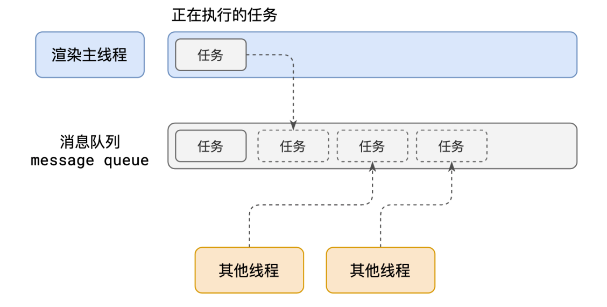
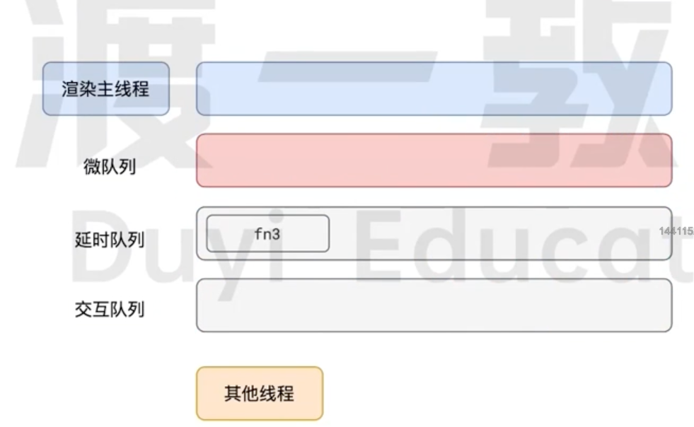
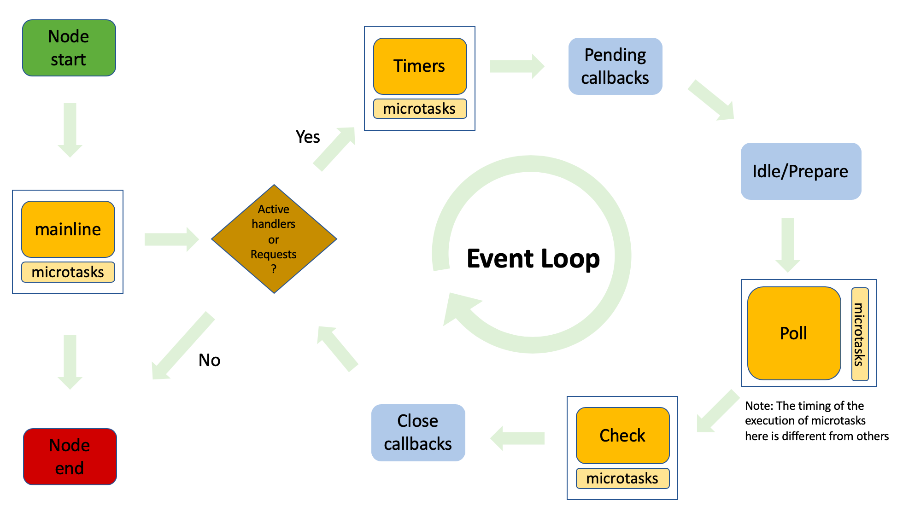
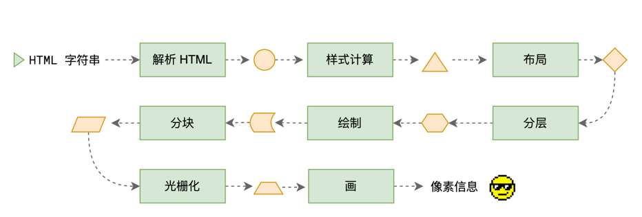
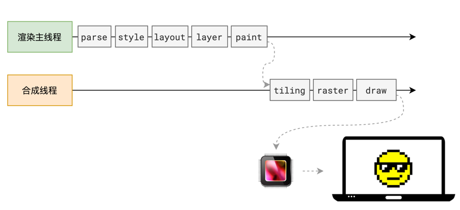

<a name="JEo5n"></a>

## 进程和线程

<a name="nBfC3"></a>

### 进程

- 概念：进程是操作系统进行资源分配和管理的最小单位，是能够拥有系统资源的最小单位。一个正在执行程序的实例，包括程序计数器、寄存器和变量的当前值
- 理解：任何程序运行都需要有它自己专属的内存空间，可以把这块内存空间简单理解为进程。每个应用至少有一个进程，进程之间相互独立，即使要通信，也需要双方同意 <a name="GsUdR"></a>

### 线程

- 概念：线程是进程中执行运算的最小单位
- 理解：在拥有进程后，就可以运行程序代码，而运行代码的 "人" 称之为线程。一个进程至少有一个线程，所以在进程开启后会自动创建一个线程来运行代码，该线程也被称为**主线程**。如果程序需要同时执行多块代码，主线程就会启动更多的线程来执行代码，所以**一个进程中可以包含多个线程** <a name="oBx5h"></a>

### 进程和线程的区别

- 进程是计算机管理运行程序的一种方式，一个进程下可包含一个或者多个线程。线程可以理解为子进程
- 一个线程只能属于一个进程，而一个进程可以包含多个线程
- 线程无地址空间，它包括在进程的地址空间里
- 线程的开销和代价比进程小 <a name="b3IF7"></a>

### 浏览器有哪些进程和线程

**浏览器是一个多进程多线程的应用程序**，其内部工作极其复杂，为了避免各工作间相互影响，同时减少连环崩溃的几率，当启动浏览器后，它将会自动启动多个进程。（另外，可以在浏览器的任务管理器中查看当前的所有进程）
最主要的进程如下：

1. 浏览器进程：主要负责界面显示、用户交互、子进程管理等。浏览器进程内部会启动多个线程处理不同的任务
2. 网络进程：负责加载网络资源。网络进程内部会启动多个线程来处理不同的网络任务
3. **渲染进程**：渲染进程启动后，会开启一个**渲染主线程**，它负责执行 html、css、js 代码

默认情况下，浏览器会为每个标签页开启一个新的渲染进程，以保证不同的标签页之间不相互影响（未来可能会限制同一个域下共用一个渲染进程，具体需要参考 [chrome 官网文档](https://chromium.googlesource.com/chromium/src/+/main/docs/process_model_and_site_isolation.md#Modes-and-Availability)） <a name="NuMU7"></a>

### 渲染主线程是如何工作的

渲染主线程是浏览器中最繁忙的线程，需要它处理的任务包括但不限于

- 解析 html
- 解析 css
- 计算样式
- 布局
- 处理图层
- 每秒把页面画 60 次
- 执行全局 js 代码
- 执行时间处理函数
- 执行计时器的回调函数
- ...... <a name="npC5D"></a>

### 为什么 js 是单线程

因为多个线程同时操作 dom，会发生冲突，出现意料之外的情况。所以说，**单线程是异步产生的原因** <a name="krL6t"></a>

### 渲染主线程的排队机制（事件循环 or 消息循环）



1. 最开始时，渲染主线程会进入一个**无限循环**
2. 每一次循环会**检查消息队列**中是否有任务存在。如果有，就取出第一个任务来执行，执行完当前任务后，进入下一次循环；如果没有任务等待被执行，则进入休眠状态
3. 其他所有线程（包括其他进程的线程）可以随时向消息队列中添加任务。新任务会被添加到消息队列的末尾。在添加新任务时，如果主线程是休眠状态，则会将其唤醒以继续通过循环来拿取任务 <a name="o1x4y"></a>

## 事件循环

<a name="EqdKK"></a>

### 如何理解 js 的异步

1. js 是一门**单线程**的语言，这是因为它运行在浏览器的**渲染主线程**中，而**渲染主线程只有一个**。同时渲染主线程承担着诸多的工作，页面渲染、js 执行都在其中运行。
2. 如果采用同步的方式，极有可能导致主线程产生阻塞，从而导致**消息队列（事件队列）**中的很多其他任务无法得到执行。这样一来，一方面会导致繁忙的主线程白白消耗时间，另一方面会导致页面无法及时更新，给用户造成页面卡死的现象
3. 因此浏览器采取异步的方式来避免以上情况。具体做法是：当某些任务发生时，如**计时器、网络、事件监听**等，**主线程**将任务**交给其他线程**去处理，**自身立即结束任务的执行**，转而**执行后续的任务**。当其他线程完成时，将事先传递的**回调函数包装成任务**，加入到**消息队列（事件队列）的末尾排队**，**等待主线程调度执行**
4. 在这种异步模式下，浏览器永不阻塞，从而最大幅度的保证了单线程的流畅运行 <a name="ohRDl"></a>

### 浏览器的事件循环机制 event loop

- 事件循环又叫做消息循环（chrome 里叫 message loop），是**浏览器渲染主线程的工作方式**（也是**异步的实现方式**）
- 在 chrome 的源码中，它会开启一个不会结束的 for 循环，每次循环从消息队列中取出第一个任务执行，而其他线程只需要在合适的时机将任务加入到队列末尾即可
- 过去把消息队列简单分为宏任务队列和微任务队列，这种说法目前已无法满足复杂的浏览器环境，取而代之的是一种更加灵活多变的处理方式
- 根据 w3c 官方的解释，每个任务有不同的类型，同类型的任务必须在同一个队列，不同的任务可以属于不同的队列。不同任务队列有不同的优先级，在一次事件循环中，由浏览器自行决定取哪一个队列的任务。但浏览器必须拥有一个微任务队列，微任务队列的任务一定具有最高的优先级，从而优先调度执行 <a name="l0hIq"></a>

### js 中计时器是否能做到精准计时

无法做到精准计时

1. 计算机硬件没有原子钟，无法做到精准计时
2. 操作系统的计时函数本身就存在少量偏差，由于 js 计时器最终调用的是操作系统的函数，因此也会携带这些偏差
3. 根据 w3c 标准，浏览器在实现计时器时，如果嵌套层级超过 5 层，从第 6 层开始会带有 4ms 的延迟时间，因此在计时时间 < 4ms 时又带来了些许偏差
4. 受事件循环的影响，计时器的回调函数只能在主线程空闲时运行，因此又带来了偏差 <a name="HlZmO"></a>

### 执行栈和事件队列

- 执行栈：类似**函数调用栈**的运行容器，执行栈为空时，js 引擎会检查事件队列是否为空，如果不为空，那么将第一个任务压入执行栈中执行
- 事件队列 or 消息队列：一个**存储着待执行任务**的队列，其中的任务**严格按照时间顺序**来执行，**队首的任务率先执行**，**队尾的任务最后执行**。同时每次仅执行一个任务 <a name="TeWGN"></a>

### 任务或消息队列的优先级

任务没有优先级，它在消息队列中先进先出。然而**消息队列是有优先级的**
根据 w3c 的最新解释：

- 每个任务都有一个任务类型，同一个类型的任务必须在一个队列，不同类型的任务可以分属于不同的队列。在一次事件循环中，浏览器可以根据实际情况从不同的队列中取出任务执行。
- 浏览器必须准备好一个微任务队列，[微任务队列中的任务优先于所有其他任务执行](https://html.spec.whatwg.org/multipage/webappapis.html#perform-a-microtask-checkpoint) <a name="IKSWL"></a>

### 任务队列都有哪些


在目前的 chrome 的实现中，至少包含了下面的队列：

- 延时队列：用以存放**计时器到达后的回调任务**，优先级 - 中
  - setTimeout
  - setInterval
  - setImmediate
- 交互队列：用于存放**用户操作后产生的事件处理任务**，优先级 - 高
- 微任务队列：用以存放**需要最快被执行的任务**，优先级 - 最高
  - promise 回调 - 必须有 resolve or reject 结果，同一块作用域内多个 resolve 中，期中一个执行完毕后其余的皆不再执行
  - node.js 的 process.nextTick
  - MutationObserver -  对 dom 变化进行监听

> 浏览器认为与用户交互相关的任务优先级可能比延时任务的优先级更高

<a name="cUQDd"></a>

### requestAnimationFrame 和 requestIdleCallback

前者是在渲染前执行的，因为动画会更改 dom 结构，后者是用来处理计算量大但不紧急的事件，当队列中没有任务执行时，会清空它内部的回调，也可以传入 timeout 参数，强制 timeout 秒后执行，但是会阻塞其他代码的执行

***

<a name="KLzYc"></a>

### ⚠️ 旧 - 浏览器事件循环机制 event loop

- js 是单线程执行的，在代码执行的过程中，通过将不同函数的**执行上下文**压入**执行栈**中来保证代码的有序执行
- 最开始将整个 **script 脚本作为一个宏任务**执行，执行过程中**同步代码**直接执行
- 执行同步代码时，如果遇到了异步事件，js 引擎将不会一直等待其返回结果，而是将这个事件暂时挂起，继续执行**执行栈**中的其它任务
- 在异步事件执行完毕后，判断任务类型，将其回调函数插入分别插入到**宏任务队列**或**微任务队列，宏任务队列和微任务队列都属于消息队列**
- 当执行栈中的任务执行完毕后，js 引擎会首先判断**微任务队列**中是否有任务可以执行，如果有就将微任务队列队首的事件压入**执行栈**中等待执行，直到微任务队列的所有任务全部执行完毕，之后执行宏任务队列中的任务
- 首先执行浏览器的 ui 线程渲染工作，渲染阶段会收到以下因素的影响
  - 屏幕分辨率改变，如果页面性能太差，为了不丢帧，浏览器会选择降低帧率
  - 浏览器判断本次渲染是否会造成视觉上的改变，比如背景色改变
  - map of animation frame callbacks 为空
- 接着检查是否有 web worker 任务，有则执行
  - 对需要渲染的文档，如果窗口发生了变化，就会调用 resize 事件（resize 自带节流）
  - 对需要渲染的文档，如果页面发生了滚动，就会调用 scroll 事件（scroll 自带节流）
  - 对需要渲染的文档，执行 requestAnimationFrame 回调
  - 调用 IntersectionObserver 回调，重新渲染页面
  - 最后会检查宏任务队列和微任务队列是否为空，如果为空会调用 idle 空闲周期算法，检测 requestIdleCallback 是否为空，如果不为空就会执行里面的回调
- 执行完**本轮宏任务**后，执行**下一轮宏任务**

***

<a name="ASXwF"></a>

### node.js 中事件循环的 6 个阶段

下面为 node 执行的整个过程，如果执行了任何非阻塞的异步代码，则会进入事件循环：


- **定时器 timers**：本阶段执行已经被 setTimeout 和 setInterval 的调度回调函数
- **待定回调 pending callbacks**：执行延迟到下一个循环迭代的 I/O 回调
- **idle，prepare**：仅系统内部使用
- **轮询 poll**：检索新的 I/O 事件；执行与 I/O 相关的回调(几乎所有情况下，除了 close callbacks，那些由定时器和 setImmediate 调度的之外)，其余情况 node 将在适当的时候在此阻塞
- **检测 check**：setImmediate 回调函数在这里执行
- **关闭的回调函数 close callbacks**：一些关闭的回调函数。如：`socket.on('close', ...)`

> 每个阶段都会有一个 FIFO 先进先出的回调队列，都会尽可能地执行完当前阶段中所有的回调，或到达了系统相关限制后，才会进入下一阶段

> poll 阶段执行微任务的时机：每一个回调执行时执行相应的微任务
> timers 和 check 阶段执行微任务的时机：在所有回调执行完毕后，统一执行相应的微任务

<a name="bh0wY"></a>

### node.js 中的微任务

- process.nextTick 注册的回调函数 - nextTick task queue
- promise.then 注册的回调函数 - promise task queue

node.js 在执行微任务时，优先执行 nextTick task queue 中的任务，执行完后接着执行 promise task queue 中的任务，所以若二者同时处于主线程或事件循环的相同阶段，process.nextTick 回调函数的优先级 > promise.then 回调函数的优先级 <a name="h2KYD"></a>

### node.js 的事件循环

- 当 node.js 启动后，会初始化事件循环，处理已提供的输入脚本，同时可能会调用一些异步 api、调度定时器、process.nextTick，然后开始处理事件循环
- 执行事件循环的每个阶段
- 在相应阶段的回调函数执行时或执行完毕后，执行微任务

> node < 10：执行 1-6 阶段的任务；执行 nextTick 中的任务；执行微任务队列中的任务
> node >= 11：node 在 setTimeout 执行后会手动清空微任务队列，用来保证计算结果和浏览器相近

<a name="DFxcp"></a>

### node.js 中定时器和 process.nextTick 执行时机

- setImmediate：触发一个异步回调，在事件循环的 check 阶段立即执行
- setTimeout：触发一个异步回调，当计时器过期后，在事件循环的 timers 阶段执行，仅执行一次，可使用 clearTimeout 取消
- setInterval：触发一个异步回调，每次计时器过期后，都会在事件循环的 timers 阶段执行一次回调，可使用 clearInterval 取消
- process.nextTick：触发一个微任务异步回调，既可以在主线程 mainline 中执行，也可以在事件循环中的某一个阶段中执行 <a name="TJa6Z"></a>

### node.js 中事件循环的案例

```javascript
async function async1() {
    console.log('async1 start')
    await async2()
    console.log('async1 end')
}
 
async function async2() {
    console.log('async2')
}
 
console.log('script start')
 
setTimeout(function () {
    console.log('setTimeout0')
}, 0)
 
setTimeout(function () {
    console.log('setTimeout2')
}, 300)
 
setImmediate(() => console.log('setImmediate'));
 
process.nextTick(() => console.log('nextTick1'));
 
async1();
 
process.nextTick(() => console.log('nextTick2'));
 
new Promise(function (resolve) {
    console.log('promise1')
    resolve();
    console.log('promise2')
}).then(function () {
    console.log('promise3')
})
 
console.log('script end')
```

- 先找到同步任务，输出 script start
- 遇到第一个 setTimeout，将里面的回调函数放到 timer 队列中
- 遇到第二个 setTimeout，300ms 后将里面的回调函数放到 timers 队列中
- 遇到第一个 setImmediate，将里面的回调函数放到 check 队列中
- 遇到第一个 nextTick，将其里面的回调函数放到本轮同步任务执行完毕后执行
- 执行 async1 函数，输出 async1 start
- 执行 async2 函数，输出 async2，async2 后面的输出 async1 end 进入微任务队列，等待下一轮的事件循环
- 遇到第二个 nextTick，将其里面的回调函数放到本轮同步任务执行完毕后执行
- 遇到 new Promise，执行里面的立即执行函数，输出 promise1、promise2
- then 里面的回调函数进入微任务队列
- 遇到同步任务，输出 script end
- 执行下一轮回调函数，先依次输出 nextTick 的函数，分别是 nextTick1、nextTick2
- 然后执行微任务队列，依次输出 async1 end、promise3
- 执行 timers 队列，依次输出 setTimeout0
- 接着执行 check 队列，依次输出 setImmediate
- 300ms 后，timer 队列存在任务，执行输出 setTimeout2

执行结果如下：

```shell
script start
async1 start
async2
promise1
promise2
script end
nextTick1
nextTick2
async1 end
promise3
setTimeout0
setImmediate
setTimeout2
```

<a name="rIfN9"></a>

## 浏览器的渲染原理

<a name="ihQFN"></a>

### 渲染流水线

 <a name="Y9GAc"></a>

### 渲染完整过程

 <a name="SByHk"></a>

### 浏览器如何对页面进行渲染

当浏览器的网络线程收到 html 文档后，会产生一个渲染任务，并将其传递给渲染主线程的消息队列。在事件循环机制的作用下，渲染主线程取出消息队列中的渲染任务，开启渲染流程
整个渲染流程分为多个阶段，分别是：**「html 解析 parse」**、**「样式计算 style」**、**「布局 layout」**、**「分层 layer」**、**「绘制 paint」**、**「分块 tiling」**、**「光栅化 raster」**、**「画 draw」**。每个阶段都有明确的输入输出，上一个阶段的输出会成为下一个阶段的输入。这样整个渲染流程就形成了一套组织严密的生产流水线

- 渲染的第一步是解析 html
  - 解析过程中遇到 css 解析 css，遇到 js 执行 js。为了提高解析效率，浏览器在开始解析前，会启动一个**预解析的线程**，率先下载 html 中的**外部 css 文件**和**外部的 js 文件**
  - 如果主线程解析到 link 位置，此时外部的 css 文件还没有下载解析好，**主线程不会等待**，继续解析后续的 html。这是因为下载和解析 css 的工作是在**预解析线程**中进行的。**这就是 css 不会阻塞 html 解析的根本原因**
  - 如果主线程解析到 script 位置，会停止解析 html，转而等待 js 文件下载好，并将全局代码解析执行完成后，才能继续解析 html。这是因为 js 代码的执行过程**可能会修改当前的 dom 树**，所以 dom 树的生成**必须暂停**。**这就是 js 会阻塞 html 解析的根本原因**
  - 第一步完成后，会得到 **dom 树**和 **cssom（css object model）树**，浏览器的**默认样式**、**内部样式**、**外部样式**、**行内样式**均会包含在 cssom 树中
- 渲染的下一步是样式计算
  - 主线程会遍历得到的 dom 树，依次为树中的每个节点计算出它最终的样式，称之为 `Computed Style`
  - 在这一过程中，很多预设值会变成绝对值，比如 `red` 会变成 `rgb(255,0,0)`；相对单位会变成绝对单位，比如 `em` 会变成 `px`
  - 这一步完成后，会**得到一颗带有样式的 dom 树**
- 接下来是布局，布局完成后会得到布局树
  - 布局阶段会依遍历 dom 树的每一个节点，**计算每个节点的几何信息**。
    - 例如节点的宽高、相对**包含块**的位置
  - 大部分时候，dom 树和布局树并非一一对应。
    - 例如 `display: none`的节点没有几何信息，因此不会生成到布局树
    - 又比如使用了伪元素选择器，虽然 dom 树中不存在这些伪元素节点，但它们拥有几何信息，所以会生成到布局树中
    - 还有**匿名行盒**、**匿名块盒**等等都会导致 dom 树和布局树无法一一对应
- 下一步是分层
  - 主线程会使用一套复杂的策略对整个布局树进行分层
  - **分层的好处**：将来某一个层改变后，**仅仅只会对该层进行后续处理**，从而**提升效率**
  - 滚动条、堆叠上下文、transform、opacity 等样式都会或多或少的影响分层结果，也可以通过使用 `will-change`属性更大程度的影响分层结果
- 再下一步是绘制
  - 主线程会为每个层单独产生**绘制指令集**，用于描述这一层的内容应该如何画出来
- 交给**合成线程**分块
  - 完成绘制后，主线程会将每个图层的绘制信息提交给**合成线程**，剩余工作将会由合成线程来完成
  - 合成线程首先对**每个图层进行分块**，将其划分为更多的小区域
  - 它会从**线程池**中拿去多个线程来完成分块工作
- 分块完成后，进入**光栅化**阶段
  - 合成线程会将块信息**交给 gpu 进程**，以极高的速度完成光栅化
  - gpu 进程会开启多个线程来完成光栅化，并且**优先处理靠近视口区域**的块
  - 光栅化的结果，就是一块一块的位图
- 最后一个阶段就是画
  - 合成线程拿到每个层、每个块的位图后，生成一个个**「指引 quad」**信息
  - 指引会标识出每个位图应该画到屏幕的哪个位置，以及会考虑到**旋转、缩放**等变形
  - **变形发生在合成线程**，与**渲染主线程无关**，**这就是 transform 效率高的本质原因**
  - 合成线程会把 quad 提交给 gpu 进程，由 gpu 进程产生系统调用，提交给 gpu 硬件，最终完成屏幕成像

***

包含块
行盒，块盒&#x20;
内容必须在行盒中
行盒和块盒不能相邻 匿名行盒

合成线程和渲染主线程在渲染进程里面，是放在沙盒里的，安全

***

<a name="WFMRQ"></a>

### 什么是 reflow - 回流

- reflow 的本质就是重新计算**布局（layout）树**
- 当进行了会影响**布局（layout）树**的操作后，需要重新计算布局树，会引发 layout
- 为了避免连续的多次操作导致**布局（layout）树**反复计算，浏览器会**合并**这些操作，当 js 代码**全部完成**后再**进行统一计算**。所以，**改动属性**造成的 reflow 是**异步**完成的
- 也同样因为如此，当 js 获取布局属性时，就可能造成**无法获取到最新的**布局信息
- 浏览器在反复权衡下，最终决定获取属性时立即 reflow <a name="lT9JU"></a>

### 什么是 repaint - 重绘

- repaint 的本质就是重新根据**分层信息**计算了**绘制指令**
- 当改动了**可见样式**后，就需要**重新计算**，会引发 repaint
- 由于**元素的布局信息**也属于**可见样式**，所以 reflow 一定会引起 repaint <a name="XMc3j"></a>

### 为什么 transform 效率高

- 因为 transform 既不会影响**布局（layout**），也不会影响**绘制指令**，它影响的只是渲染流程的最后一个 - **draw 阶段**
- 由于 **draw 阶段**在**合成线程**中，所以 transform 的变化**几乎不会影响渲染主线程**。反之，渲染主线程无论如何忙碌，也不会影响 transform 的变化 <a name="i9uyF"></a>

## 位运算

<a name="l9E0I"></a>

### 位运算符

- 按位与 **&**
  - a & b：只有当 a 和 b 中对应的位都是 1 时，结果位才是 1
  - 用途：常用于位掩码
- 按位或 **|**
  - a | b：如果 a 和 b 中至少有一个对应位是 1，则结果位是 1
  - 用途：设置位掩码
- 按位异或 **^**
  - a ^ b：当 a 和 b 中对应位不相同时，结果位是 1
  - 用途：切换位掩码
- 按位非 **~**
  - \~a：反转 a 的所有位（1 变 0，0 变 1）
  - 用途：常用于位掩码的反转
- 左移 **<<**
  - a << b：将 a 的二进制表示向左移动 b 位（从右侧补 0）
  - 用途：相当于乘以 2 的 b 次幂
- 有符号右移 **>>**
  - a >> b：将 a 的二进制表示向右移动 b 位，保留符号位（正数前面补 0，负数前面补-）
  - 用途：相当于除以 2 的 b 次幂，保持符号
- 无符号右移 **>>>**
  - a >>> b：将 a 的二进制表示向右移动 b 位，不保留符号位（前面补 0）
  - 用途：对于正数和负数的右移操作，结果总是正数 <a name="X9BfX"></a>

### 使用场景

1. **设置和清除特定位**：使用 &、| 和 ~ 来设置、清除或切换特定位。这在处理位掩码或状态标志时非常有用
   - 设置第 i 位：`num |= (1 << i)`
   - 清除第 i 位：`num &= ~(1 << i)`
   - 切换第 i 位：`num ^= (1 << i)`
   - 检查第 i 位是否设置：`(num & (1 << i)) != 0`
2. **权限控制**：位运算常用于实现权限控制系统，其中每个位代表一种权限，通过位运算来添加、移除和检查权限
   - 假设每个位代表一个权限，可以用位运算符来控制权限的开启和关闭
   - `permissions |= (1 << READ)` 可以开启读权限
3. **两数交换不用额外变量**：使用 ^ 可以在不使用临时变量的情况下交换两个数

```javascript
let a = 5, b = 9
a ^= b // output: 12，a = 12，b = 9
b ^= a // output: 5，b = 5，a = 12
a ^= b // output: 9，a = 9，b = 5
```

4. **计算两数的和**：通过 ^ 和 & 操作，可以实现两个数的加法而不使用加号或减号

```javascript
while (b != 0) {
    let carry = a & b;
    a = a ^ b;
    b = carry << 1;
}
```

5. **求绝对值**：利用 >> 和 ^ 操作可以计算一个数的绝对值

```javascript
int abs(int x) {
    int mask = x >> 31;
    return (x ^ mask) - mask;
}
```

6. **判断奇偶性**：使用 & 检查一个数的最低位，可以快速判断一个数是奇数还是偶数

```javascript
// 利用最低位判断数字奇偶性
if (num & 1) {
  // 奇数
} else {
// 偶数
}
```

7. **乘除以 2 的幂**：使用 << 和 >> 操作可以实现乘除以 2 的幂
8. **快速访问数组元素**：在处理像图像处理这样的大型数组时，位运算可以用于快速计算索引，提高效率
   - 在图像处理中，可以用位运算来计算像素的位置：`let index = (row << shift) + column`
   - 这里假设每行有 2 的幂个像素
9. **单一位的状态切换**：使用 ^ 可以快速切换一个位的状态
   - `flag ^= (1 << i)`
   - 这可以快速切换第 i 位的状态
10. **二进制反转或位反转**：对整数进行位反转，这在某些特定的数学运算和算法问题中非常有用

- 将一个数的二进制表示反转：例如，将 0b1101 变为 0b1011

11. **求两数的最大公约数**：使用位运算结合递归或迭代方法可以高效求解最大公约数
12. **求解子集问题**：在处理组合问题时，位运算可以用来枚举集合的所有子集

```javascript
for (let subset = 0; subset < (1 << n); ++subset) {
  // 处理子集，n 是集合中元素数量
}
```
