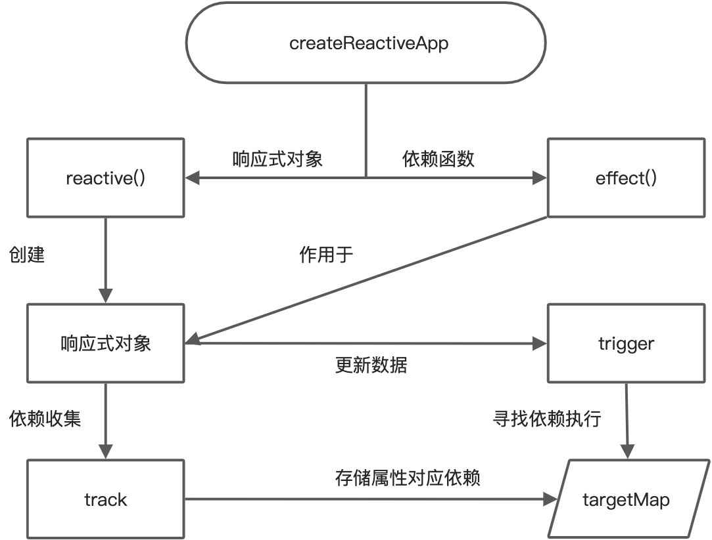

 <a name="vKrFR"></a>

## 核心逻辑

```javascript
const isObject = obj => typeof obj === 'object' && obj !== null
const hasOwn = (target, key) => target.hasOwnProperty(key)

// 已有代理的存储
let toProxy = new WeakMap()
let toRaw = new WeakMap()

// 当前激活的 effect 栈
let activeEffectStack = []
// 依赖映射表
let targetMap = new Map()

// 核心逻辑
const baseHandler = {
  // proxy + reflect
  // target: 实例化 Proxy 时使用的对象
  // key: 属性名
  // receiver: 实例化 Proxy 自身，即 proxy
  get(target, key, receiver) {
    // 可能无法访问 key、target[key] 是否成功不会报错，所以使用 reflect
    const res = Reflect.get(target, key, receiver) // => target[key]
    // 触发 get 时进行依赖收集
    track(target, key)
    console.log('getter', target, key)
    return res
  },
  set(target, key, value, receiver) {
    const res = Reflect.set(target, key, value, receiver) // 返回 true/false
    // 在触发 set 的时候进行触发依赖
    trigger(target, key)
    console.log('setter', target, key) // => target[key] = value
    return res
  }
}

function reactive(target) {
  // 创建一个响应式对象 set、map、array、object
  return createReactiveObject(target, baseHandler)
}

function createReactiveObject(target, baseHandler) {
  // 如果不是对象，不需要代理
  if (!isObject(target)) return target
  
  // 检查是否已代理过该对象
  let proxy = toProxy.get(target)
  if (proxy) return proxy
  
  if (toRaw.has(target)) return target
  
  let observed = new Proxy(target, baseHandler)
  
  // 维护 proxy 表
  toProxy.set(target, observed)
  toRaw.set(observed, target)
  
  return observed
}

// dep & track & trigger
function createDep(effects) {
  const dep = new Set(effects)
  return dep
}

function track(target, key) {
  // 当前激活栈的栈顶就是当前激活的 effect
  const effect = activeEffectStack[activeEffectStack.length - 1]
  if (effect) {
    // 维护依赖表
    let depsMap = targetMap.get(target)
    if (!depsMap) {
      depsMap = new Map()
      targetMap.set(target, depsMap)
    }
    let dep = depsMap.get(key)
    if (!dep) {
      // 新建依赖项
      dep = createDep()
      depsMap.set(key, dep)
    }
    if (!dep.has(effect)) {
      dep.add(effect)
    }
  }
}

function trigger(target, key) {
  // 从依赖表中获取 effect 并逐个执行
  let depsMap = targetMap.get(target)
  if (depsMap) {
    let dep = depsMap.get(key)
    if (dep) {
      dep.forEach(effect => {
        effect()
      })
    }
  }
}

// 依赖函数
function effect(fn) {
  const effectFunc = function() {
    try {
      // 加入 effect 栈
      activeEffectStack.push(effectFunc)
      return fn()
    } finally {
      activeEffectStack.pop()
    }
  }
  // 创建 effect 就会触发一次
  effectFunc()
  return effectFunc
}

const state = reactive({
  msg: 'this is a message',
  name: 'zs'
})
console.log('before', state.msg)
state.msg = 'this is a new message'
console.log('after', state.msg)

effect(() => {
  console.log(state.name)
})
state.name = 'lisi'
```
