[链接](https://www.cnblogs.com/jaxu/p/11309385.html)

在计算机科学中，树是一种十分重要的数据结构。树被描述为一种分层数据抽象模型，常用来描述数据间的层级关系和组织结构。树也是一种非顺序的数据结构。下图展示了树的定义：
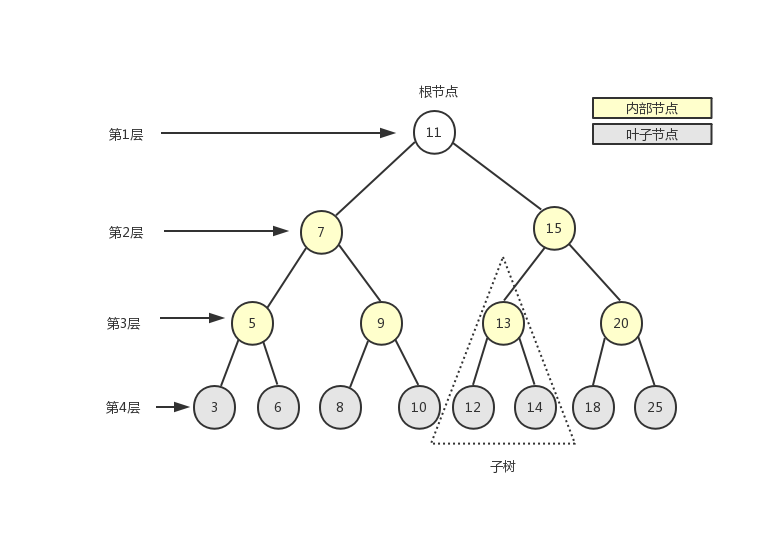
在介绍如何用 JavaScript 实现树之前，我们先介绍一些和树相关的术语。
如上图所示，一棵完整的树包含一个位于树顶部的节点，称之为根节点（11），它没有父节点。树中的每一个元素都叫做一个节点，节点分为内部节点（图中显示为黄色的节点）和外部节点（图中显示为灰色的节点），至少有一个子节点的节点称为内部节点，没有子元素的节点称为外部节点或叶子节点。一个节点可以有祖先（根节点除外）和后代。子树由节点本身和它的后代组成，如上图中三角虚框中的部分就是一棵子树。节点拥有的子树的个数称之为节点的度，如上图中除叶子节点的度为 0 外，其余节点的度都为 2。从根节点开始，根为第 1 层，第一级子节点为第 2 层，第二级子节点为第 3 层，以此类推。树的高度（深度）由树中节点的最大层级决定（上图中树的高度为 4）。
在一棵树中，具有相同父节点的一组节点称为兄弟节点，如上图中的 3 和 6、5 和 9 等都是兄弟节点。

<a name="8178ad6f"></a>

### 二叉树

二叉树中的节点最多只能有两个子节点，一个是左子节点，一个是右子节点。左右子节点的顺序不能颠倒。因此，二叉树中不存在度大于 2 的节点。
二叉搜索树（BST——Binary Search Tree）是二叉树的一种，它规定在左子节点上存储小（比父节点）的值，在右子节点上（比父节点）存储大（或等于）的值。上图就是一个二叉搜索树。
下面我们重点来看一下二叉搜索树的实现。
根据二叉树的描述，一个节点最多只有两个子节点，我们可以使用[《JavaScript 数据结构——链表的实现与应用》](https://www.cnblogs.com/jaxu/p/11277732.html)一文中的双向链表来实现二叉搜索树中的每一个节点。下面是二叉搜索树的数据结构示意图：
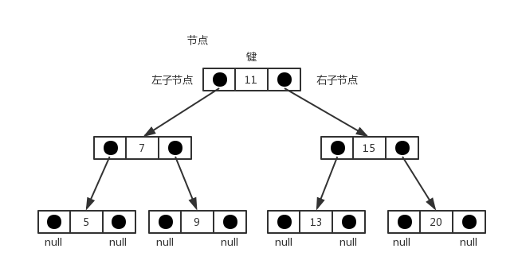
以下是我们要实现的 BinarySearchTree 类的骨架部分：


```javascript
class BinarySearchTree {
    constructor() {
        this.root = null
    }

    // 向树中插入一个节点
    insert(key) {}

    // 在树中查找一个节点
    search(key) {}

    // 通过中序遍历方式遍历树中的所有节点
    inOrderTraverse() {}

    // 通过先序遍历方式遍历树中的所有节点
    preOrderTraverse() {}

    // 通过后序遍历方式遍历树中的所有节点
    postOrderTraverse() {}

    // 返回树中的最小节点
    min() {}

    // 返回树中的最大节点
    max() {}

    // 从树中移除一个节点
    remove(key) {}
}
```

先来看看向树中添加一个节点。我们借用[《JavaScript 数据结构——链表的实现与应用》](https://www.cnblogs.com/jaxu/p/11277732.html)一文中的双向链表 DoubleLinkedList 类来模拟树中的节点，在 DoubleLinkedList 类中，每一个节点有三个属性：element、next 和 prev。我们在这里用 element 表示树中节点的 key，用 next 表示树中节点的右子节点（right），用 prev 表示树中节点的左子节点（left）。

```javascript
insert (key) {
    let newNode = new Node(key);

    if (this.root === null) this.root = newNode;
    else insertNode(this.root, newNode);
}
```

当树的 root 为 null 时，表示树为空，这时直接将新添加的节点作为树的根节点。否则，我们需要借助于私有函数 insertNode()来完成节点的添加。在 insertNode()函数中，我们需要根据新添加节点的 key 的大小来递归查找树的左侧子节点或者右侧子节点，因为根据我们的二叉搜索树的定义，值小的节点永远保存在左侧子节点上，值大的节点（包括值相等的情况）永远保存在右侧子节点上。下面是 insertNode()函数的实现代码：

```javascript
let insertNode = function (node, newNode) {
    if (newNode.element < node.element) {
        if (node.prev === null) node.prev = newNode
        else insertNode(node.prev, newNode)
    } else {
        if (node.next === null) node.next = newNode
        else insertNode(node.next, newNode)
    }
}
```

所有新节点只能作为叶子节点被添加到树中。在本文一开始给出的树的结构图中，如果要添加节点 2，对应的操作步骤如下：
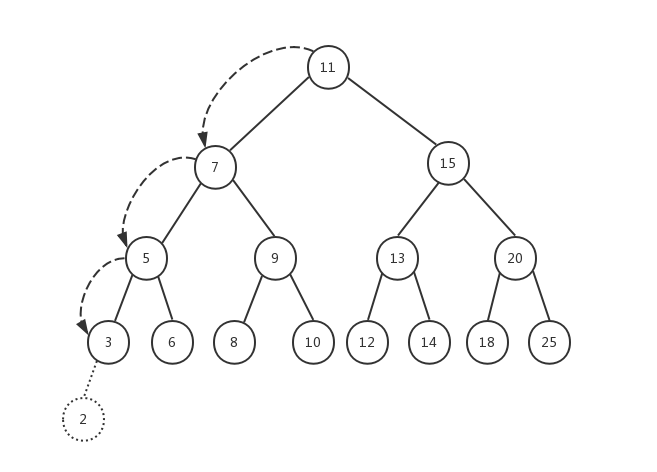
我们传入树的根节点，依次进行递归，找到对应的叶子节点，然后修改节点的 prev（左子节点）或 next（右子节点）指针，使其指向新添加的节点。在上例中，如果要添加节点 4，它对应的位置应该是节点 3 的右子节点，因为 4 比 3 大。如果要添加节点 21，对应的位置应该是节点 25 的左子节点......
下面我们来看看树的三种遍历方式：

- 前序遍历（NLR——Preorder Traversal）也叫先序遍历，访问根节点的操作发生在遍历其左右子树之前。
- 中序遍历（LNR——Inorder Traversal），访问根节点的操作发生在遍历其左右子树之间。
- 后序遍历（LRN——Postorder Traversal），访问根节点的操作发生在遍历其左右子树之后。

下面的三个方法对应树的三种遍历方式：

```javascript
// 前序遍历
let preOrderTraverseNode = function (node, callback) {
    if (node !== null) {
        callback(node.element)
        preOrderTraverseNode(node.prev, callback)
        preOrderTraverseNode(node.next, callback)
    }
}

// 中序遍历
let inOrderTraverseNode = function (node, callback) {
    if (node !== null) {
        inOrderTraverseNode(node.prev, callback)
        callback(node.element)
        inOrderTraverseNode(node.next, callback)
    }
}

// 后续遍历
let postOrderTraverseNode = function (node, callback) {
    if (node !== null) {
        postOrderTraverseNode(node.prev, callback)
        postOrderTraverseNode(node.next, callback)
        callback(node.element)
    }
}
```

可以看到，这三个函数的内容很相似，只是调整了左右子树和根节点的遍历顺序。这里的 callback 是一个回调函数，可以传入任何你想执行的函数，这里我们传入的函数内容是打印树的节点的 key 值。我们将 BinarySearchTree 类的这三个遍历方法的内容补充完整：

```javascript
preOrderTraverse (callback) {
    preOrderTraverseNode(this.root, callback);
}

inOrderTraverse (callback) {
    inOrderTraverseNode(this.root, callback);
}

postOrderTraverse (callback) {
    postOrderTraverseNode(this.root, callback);
}
```

为了构建本文一开始的那棵树，我们执行下面的代码，然后测试 preOrderTraverse()方法：

```javascript
let tree = new BinarySearchTree()
tree.insert(11)
tree.insert(7)
tree.insert(15)
tree.insert(5)
tree.insert(9)
tree.insert(13)
tree.insert(20)
tree.insert(3)
tree.insert(6)
tree.insert(8)
tree.insert(10)
tree.insert(12)
tree.insert(14)
tree.insert(18)
tree.insert(25)

tree.preOrderTraverse(value => console.log(value))
```

注意节点插入的顺序，顺序不同，你可能会得到不一样的树。preOrderTraverse()方法采用 ES6 的语法传入了一个匿名函数作为参数 callback 的值，这个匿名函数的主要作用就是打印树中节点的 key 值，可以对照上面三个遍历树节点的函数中的 callback(node.element)语句，这里的 callback 就是这个匿名函数，node.element 就是节点的 key 值（还记得前面我们说过，借用双向链表类 DoubleLinkedList 来模拟树的节点吗？）下面是前序遍历的执行结果：

    11
    7
    5
    3
    6
    9
    8
    10
    15
    13
    12
    14
    20
    18
    25

我们参照前序遍历的定义，借住下面的示意图来理解整个遍历过程：
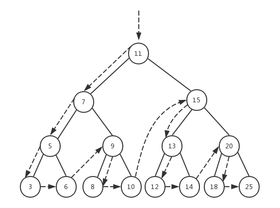
在前序遍历函数 preOrderTraverseNode()中，先执行 callback(node.element)，然后再依次递归左子树和右子树。我们将树的根节点作为第一个节点传入，首先打印的就是根节点 11，然后开始遍历左子树，这将依次打印左子树中的所有左子节点，依次是 7、5、3。当节点 3 的 prev 为 null 时，递归返回，继续查找节点 3 的右子节点，此时节点 3 的 next 值也为 null，于是继续向上返回到节点 5，开始遍历节点 5 的右子节点，于是打印节点 6......最终所有的节点就按照这个递归顺序进行遍历。
然后我们再来看看中序遍历的情况。

```javascript
tree.inOrderTraverse(value => console.log(value))
```

    3
    5
    6
    7
    8
    9
    10
    11
    12
    13
    14
    15
    18
    20
    25


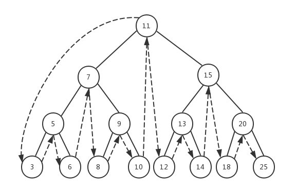
在中序遍历函数 inOrderTraverseNode()中，先递归左子树，然后执行 callback(node.element)，最后再递归右子树。同样的，我们将根节点作为第一个节点传入，递归到左子树的最后一个左子节点 3，由于节点 3 的 prev 为 null，所以递归返回，打印节点 3，然后继续查找节点 3 的右子节点，节点 3 的 next 值也为 null，递归返回到上一层节点 5，开始打印节点 5，之后再查找节点 5 的右子节点......最终整棵树按照这个顺序完成遍历。
最后再来看看后序遍历的情况。

```javascript
tree.postOrderTraverse(value => console.log(value))
```

    3
    6
    5
    8
    10
    9
    7
    12
    14
    13
    18
    25
    20
    15
    11


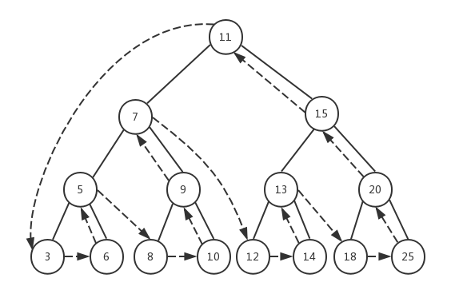
在后序遍历函数 postOrderTraverseNode()中，先递归左子树，然后再递归右子树，最后执行 callback(node.element)。同样的，我们将根节点作为第一个节点传入，递归到左子树的最后一个左子节点 3，由于节点 3 的 prev 为 null，所以递归返回，此时继续查找节点 3 的右子节点，节点 3 的 next 值也为 null，递归返回并打印节点 3，之后递归返回到上一层节点 5，开始查找节点 5 的右子节点，节点 5 的右子节点是节点 6，由于节点 6 是叶子节点，所以直接打印节点 6，然后递归返回并打印节点 5。之后递归再向上返回到节点 7 并递归节点 7 的右子节点......按照这个顺序最终完成对整棵树的遍历。
接下来我们再来看看对树的搜索。有三种要经常执行的搜索方式：

- 搜索树中的最小值
- 搜索树中的最大值
- 搜索树中的特定值

搜索树中的最小值和最大值比较简单，由于我们的二叉搜索树规定了值小的节点永远在左子树（左子节点）中，值大（或相等）的节点永远在右子树（右子节点）中，所以，搜索最大值我们只需要递归查找树的右子树直到叶子节点，就能找到值最大的节点。搜索最小值只需要递归查找树的左子树直到叶子节点，就能找到值最小的节点。下面是这两个函数的实现：

```javascript
let minNode = function (node) {
    if (node === null) return null

    while (node && node.prev !== null) {
        node = node.prev
    }
    return node
}

let maxNode = function (node) {
    if (node === null) return null

    while (node && node.next !== null) {
        node = node.next
    }
    return node
}
```

第三种方式是搜索特定的值，我们需要比较要搜索的值与当前节点的值，如果要搜索的值小于当前节点的值，则从当前节点开始递归查找左子数（左子节点）。如果要搜索的值大于当前节点的值，则从当前节点开始递归查找右子树（右子节点）。按照这个逻辑，我们的 searchNode()函数实现如下：

```javascript
let searchNode = function (node, key) {
    if (node === null) return null

    if (key < node.element) return searchNode(node.prev, key)
    else if (key > node.element) return searchNode(node.next, key)
    else return node
}
```

如果找到了对应的节点，就返回该节点，否则就返回 null。我们将 BinarySearchTree 类的这三个搜索方法的内容补充完整：

```javascript
search (key) {
    return searchNode(this.root, key);
}

min () {
    return minNode(this.root);
}

max () {
    return maxNode(this.root);
}
```

下面是一些测试用例及结果：

```javascript
console.log(tree.min().element) // 3
console.log(tree.max().element) // 25
console.log(tree.search(1) ? "Key 1 found." : "Key 1 not found.") // Key 1 not found.
console.log(tree.search(8) ? "Key 8 found." : "Key 8 not found.") // Key 8 found.
```

让我们来看一下 search()方法的执行过程是怎样的。


搜索 key=1 的节点，首先我们传入树的根节点和 key=1，由于 1 小于根节点的值 11，递归查找根节点的左子节点 7，1<7，继续查找节点 7 的左子节点，直到找到叶子节点 3，1 仍然小于 3，但是节点 3 没有左子节点了，所以返回 false，整个递归开始向上返回，最终返回的结果是 false，表示树中没有 key=1 的节点。


相应地，对于搜索 key=8 的节点，也是先遍历根节点的左子节点 7，由于 8>7，所以会遍历节点 7 的右子节点，找到节点 9，8<9，遍历节点 9 的左子节点，此时找到节点 9 的左子节点正好是 8，所以返回 true，然后整个递归向上返回，最终的返回结果就是 true，表示树中找到了 key=8 的节点。


最后我们再来看一下从树中移除一个节点的过程，这个过程要稍微复杂一些。先来看看删除树节点的函数 removeNode()的代码，稍后我们再来详细讲解整个执行过程。


```javascript
let removeNode = function (node, key) {
    if (node === null) return null

    if (key < node.element) {
        node.prev = removeNode(node.prev, key)
        return node
    } else if (key > node.element) {
        node.next = removeNode(node.next, key)
        return node
    } else {
        // 第一种情况：一个叶子节点（没有子节点）
        if (node.prev === null && node.next === null) {
            node = null
            return node
        }
        // 第二种情况：只包含一个子节点
        if (node.prev === null) {
            node = node.next
            return node
        } else if (node.next === null) {
            node = node.prev
            return node
        }

        // 第三种情况：有两个子节点
        let aux = minNode(node.next)
        node.element = aux.element
        node.next = removeNode(node.next, aux.element)
        return node
    }
}
```

首先要找到树中待删除的节点，这需要进行递归遍历，从根节点开始，如果 key 值小于当前节点的值，则遍历左子树，如果 key 值大于当前节点的值，则遍历右子树。注意，在递归遍历的过程中，我们将 node（这里的 node 传入的是树的根节点）的 prev 指针或 next 指针逐级指向下一级节点，然后返回整个 node。当找到要删除的节点后，我们要处理三种情况：

- 该节点为叶子节点（没有子节点）
- 该节点只有一个子节点（左子节点或右子节点）
- 该节点有两个子节点（左右子节点都存在）

我们先看第一种情况：
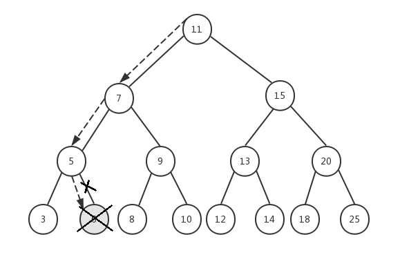
假设我们要删除节点 6，传入根节点 11，整个执行过程如下：

1. node=11，key=6，6<11，递归执行 removeNode(7, 6)
2. node=7，key=6，6<7，递归执行 removeNode(5, 6)
3. node=5，key=6，6>5，递归执行 removeNode(6, 6)
4. node=6，key=6，6=6，并且节点 6 的 prev 和 next 都为 null，所以我们将节点 6 设置为 null，并且返回 null
5. 递归返回到步骤 3，节点 5 的 next 将获取步骤 4 的返回值 null
6. 递归返回到步骤 2，节点 7 的 prev 依然指向节点 5，保持不变
7. 递归返回到步骤 1，节点 11 的 prev 依然指向节点 7，保持不变
8. 最后返回节点 11

然后我们来看只有一个子节点的情况：
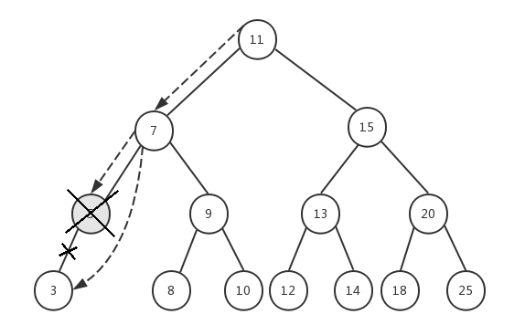
前面已经删除了节点 6，假设我们现在要删除节点 5，它有一个左子节点 3，我们依然传入根节点 11，来看看整个执行过程：

1. node=11，key=5，5<11，递归执行 removeNode(7, 5)
2. node=7，key=5，5<7，递归执行 removeNode(5, 5)
3. node=5，key=5，5=5，并且节点 5 的 prev=3，next=null，所以我们将节点 5 替换成它的左子节点 3，并返回节点 3
4. 递归返回到步骤 2，节点 7 的 next 将获取步骤 3 的返回值 3
5. 递归返回到步骤 1，节点 11 的 prev 依然指向节点 7，保持不变
6. 最后返回节点 11

我们不需要将节点 5 从内存中删除，它会自动被 JavaScript 的垃圾回收器清理掉，这个在[《JavaScript 数据结构——链表的实现与应用》](https://www.cnblogs.com/jaxu/p/11277732.html)一文中已经介绍过。以上步骤是针对目标节点有左子节点的情况，对于有右子节点情况，执行过程是类似的。
最后再来看第三种情况：
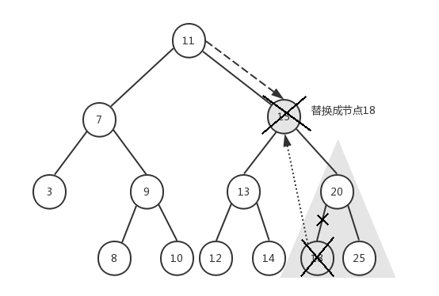
前面已经删除了节点 6 和节点 5，现在我们要删除节点 15，它有左右子树，我们传入根节点 11，来看下具体执行过程：

1. node=11，key=15，15>11，递归执行 removeNode(15, 15)
2. node=15，key=15，15=15，此时我们需要找到节点 15 的右子树中的最小节点 18，将节点 15 的 key 替换成节点 18 的 key，然后将节点 15 的 next 节点（即节点 20）作为起始节点进行遍历，找到并删除节点 18，最后再将节点 15（此时它的 key 是 18）的 next 指针指向节点 20，并返回节点 15
3. 递归返回到步骤 1，节点 11 的 next 依然指向节点 15，但此时节点 15 的 key 已经变成 18 了
4. 最后返回节点 11

试想一下，当删除节点 15 之后，为了保证我们的二叉搜索树结构稳定，必须用节点 15 的右子树中的最小节点来替换节点 15，如果直接将 11 的 next 指向 20，则 20 将会有三个子节点 13、18、25，这显然已经不符合我们二叉树的定义了。如果将节点 25 用来替换节点 15，节点 20 的值比节点 25 的值小，不应该出现在右子节点，这也不符合我们的二叉搜索树的定义。所以，只有按照上述过程才能既保证不破坏树的结构，又能删除节点。
我们已经完成了一开始我们定义的二叉搜索树 BinarySearchTree 类的所有方法，下面是它的完整代码：

```javascript
let insertNode = function (node, newNode) {
    if (newNode.element < node.element) {
        if (node.prev === null) node.prev = newNode
        else insertNode(node.prev, newNode)
    } else {
        if (node.next === null) node.next = newNode
        else insertNode(node.next, newNode)
    }
}

let preOrderTraverseNode = function (node, callback) {
    if (node !== null) {
        callback(node.element)
        preOrderTraverseNode(node.prev, callback)
        preOrderTraverseNode(node.next, callback)
    }
}

let inOrderTraverseNode = function (node, callback) {
    if (node !== null) {
        inOrderTraverseNode(node.prev, callback)
        callback(node.element)
        inOrderTraverseNode(node.next, callback)
    }
}

let postOrderTraverseNode = function (node, callback) {
    if (node !== null) {
        postOrderTraverseNode(node.prev, callback)
        postOrderTraverseNode(node.next, callback)
        callback(node.element)
    }
}

let minNode = function (node) {
    if (node === null) return null

    while (node && node.prev !== null) {
        node = node.prev
    }
    return node
}

let maxNode = function (node) {
    if (node === null) return null

    while (node && node.next !== null) {
        node = node.next
    }
    return node
}

let searchNode = function (node, key) {
    if (node === null) return false

    if (key < node.element) return searchNode(node.prev, key)
    else if (key > node.element) return searchNode(node.next, key)
    else return true
}

let removeNode = function (node, key) {
    if (node === null) return null

    if (key < node.element) {
        node.prev = removeNode(node.prev, key)
        return node
    } else if (key > node.element) {
        node.next = removeNode(node.next, key)
        return node
    } else {
        // 第一种情况：一个叶子节点（没有子节点）
        if (node.prev === null && node.next === null) {
            node = null
            return node
        }
        // 第二种情况：只包含一个子节点
        if (node.prev === null) {
            node = node.next
            return node
        } else if (node.next === null) {
            node = node.prev
            return node
        }

        // 第三种情况：有两个子节点
        let aux = minNode(node.next)
        node.element = aux.element
        node.next = removeNode(node.next, aux.element)
        return node
    }
}

class BinarySearchTree {
    constructor() {
        this.root = null
    }

    // 向树中插入一个节点
    insert(key) {
        let newNode = new Node(key)

        if (this.root === null) this.root = newNode
        else insertNode(this.root, newNode)
    }

    // 在树中查找一个节点
    search(key) {
        return searchNode(this.root, key)
    }

    // 通过先序遍历方式遍历树中的所有节点
    preOrderTraverse(callback) {
        preOrderTraverseNode(this.root, callback)
    }

    // 通过中序遍历方式遍历树中的所有节点
    inOrderTraverse(callback) {
        inOrderTraverseNode(this.root, callback)
    }

    // 通过后序遍历方式遍历树中的所有节点
    postOrderTraverse(callback) {
        postOrderTraverseNode(this.root, callback)
    }

    // 返回树中的最小节点
    min() {
        return minNode(this.root)
    }

    // 返回树中的最大节点
    max() {
        return maxNode(this.root)
    }

    // 从树中移除一个节点
    remove(key) {
        this.root = removeNode(this.root, key)
    }
}
```

<a name="4242da52"></a>

### 自平衡树

上面的 BST 树（二叉搜索树）存在一个问题，树的一条边可能会非常深，而其它边却只有几层，这会在这条很深的分支上添加、移除和搜索节点时引起一些性能问题。如下图所示：
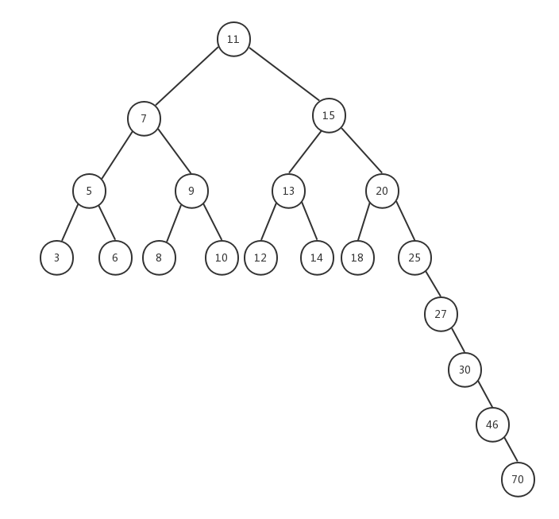
为了解决这个问题，我们引入了自平衡二叉搜索树（AVL——Adelson-Velskii-Landi）。在 AVL 中，任何一个节点左右两棵子树的高度之差最多为 1，添加或移除节点时，AVL 树会尝试自平衡。对 AVL 树的操作和对 BST 树的操作一样，不同点在于我们还需要重新平衡 AVL 树，在讲解对 AVL 树的平衡操作之前，我们先看一下什么是 AVL 树的平衡因子。
前面我们介绍过什么是树（子树）的高度，对于 AVL 树来说，每一个节点都保存一个平衡因子。
**节点的平衡因子 = 左子树的高度 - 右子树的高度**
观察下面这棵树，我们在上面标注了每个节点的平衡因子的值：
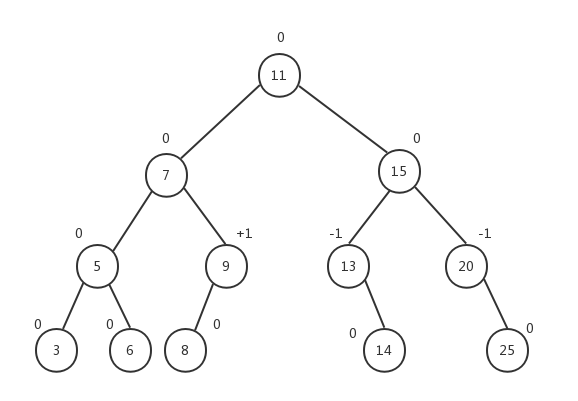
所有子节点的平衡因子都为 0，因为子节点没有子树。节点 5 的左右子树的高度都为 1，所以节点 5 的平衡因子是 0。节点 9 的左子树高度为 1，右子树高度为 0，所以节点 9 的平衡因子是+1。节点 13 的左子树高度为 0，右子树高度为 1，所以节点 13 的平衡因子是-1......AVL 树的所有节点的平衡因子保持三个值：0、+1 或-1。同时，我们也注意到，当某个节点的平衡因子为+1 时，它的子树是向左倾斜的（left-heavy）；而当某个节点的平衡因子为-1 时，它的子树是向右倾斜的（right-heavy）；当节点的平衡因子为 0 时，该节点是平衡的。一颗子树的根节点的平衡因子代表了该子树的平衡性。
为了使 AVL 树重新达到平衡状态，我们需要对 AVL 树中的部分节点进行重新排列，使其既符合二叉搜索树的定义，又符合自平衡二叉树的定义，这个过程叫做 AVL 树的旋转。
AVL 树的旋转一共分为四种：

- LL（left-left）旋转，新添加的节点位于树的根节点的左子树的左子树上。以非平衡因子的节点为中心将整棵树向右旋转。
- LR（left-right）旋转，新添加的节点位于树的根节点的左子树的右子树上。先执行 RR 旋转，然后再执行 LL 旋转。
- RR（right-right）旋转，新添加的节点位于树的根节点的右子树的右子树上。以非平衡因子的节点为中心将整棵树向左旋转。
- RL（right-left）旋转，新添加的节点位于树的根节点的右子树的左子树上。先执行 LL 旋转，然后再执行 RR 旋转。

下面是这四种旋转的操作示意图，后面我们会详细介绍每一种旋转的操作过程：
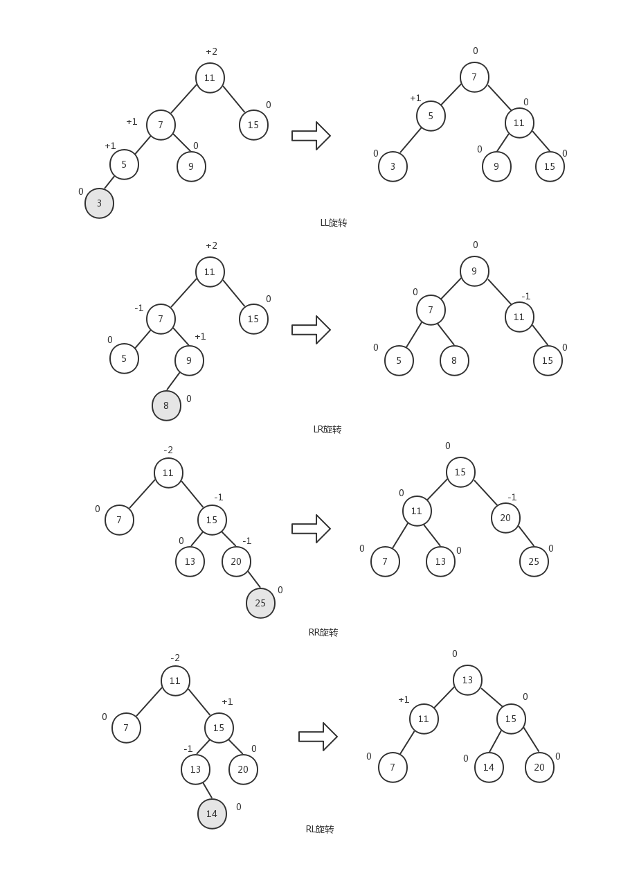
对于 LL 旋转，在节点 5 的右子节点上添加节点 4 与在左子节点上添加节点 3 等同。对于 LR 旋转，在节点 9 的左子节点上添加节点 8 与在右子节点上添加节点 10 等同。对于 RR 旋转，在节点 20 的右子节点上添加节点 25 与在左子节点上添加节点 18 等同。对于 RL 旋转，在节点 13 的右子节点上添加节点 14 与在左子节点上添加节点 12 等同。
我们的自平衡二叉树 AVLTree 类将从 BinarySearchTree 类继承，同时我们需要新增一个方法 getNodeHeight()用来获取任意节点的高度。

```javascript
class AVLTree extends BinarySearchTree {
    constructor() {
        super()
    }

    // 计算节点的高度
    getNodeHeight(node) {
        if (node === null) return 0
        return Math.max(this.getNodeHeight(node.prev), this.getNodeHeight(node.next)) + 1
    }
}
```

测试一下 getNodeHeight()方法，我们还是以本文一开始的那棵树为例，然后看一下不同节点的高度。

```javascript
let tree = new AVLTree()
tree.insert(11)
tree.insert(7)
tree.insert(15)
tree.insert(5)
tree.insert(9)
tree.insert(13)
tree.insert(20)
tree.insert(3)
tree.insert(6)
tree.insert(8)
tree.insert(10)
tree.insert(12)
tree.insert(14)
tree.insert(18)
tree.insert(25)

console.log(tree.getNodeHeight(tree.root)) // 4
console.log(tree.getNodeHeight(tree.search(7))) // 3
console.log(tree.getNodeHeight(tree.search(5))) // 2
console.log(tree.getNodeHeight(tree.min(7))) // 1
```

根节点的高度为 4，最小节点 3 的高度为 1，节点 5 和节点 7 的高度分别为 2 和 3。
下面是四种旋转对应的实现代码：

```javascript
/**
 * LL旋转: 向右旋转
 *
 *       b                           a
 *      / \                         / \
 *     a   e -> rotationLL(b) ->   c   b
 *    / \                         /   / \
 *   c   d                       f   d   e
 *  /
 * f
 *
 * @param node Node<T>
 */
rotationLL(node) {
    let tmp = node.prev;
    node.prev = tmp.next;
    tmp.next = node;
    return tmp;
}

/**
 * RR旋转: 向左旋转
 *
 *     a                              b
 *    / \                            / \
 *   c   b   -> rotationRR(a) ->    a   e
 *      / \                        / \   \
 *     d   e                      c   d   f
 *          \
 *           f
 *
 * @param node Node<T>
 */
rotationRR(node) {
    let tmp = node.next;
    node.next = tmp.prev;
    tmp.prev = node;
    return tmp;
}

/**
 * LR旋转: 先向左旋转，然后再向右旋转
 * @param node Node<T>
 */
rotationLR(node) {
    node.prev = this.rotationRR(node.prev);
    return this.rotationLL(node);
}

/**
 * RL旋转: 先向右旋转，然后再向左旋转
 * @param node Node<T>
 */
rotationRL(node) {
    node.next = this.rotationLL(node.next);
    return this.rotationRR(node);
}
```

对于 LL 旋转和 RR 旋转，我们可以按照上面的示意图来看下执行过程。
LL 旋转，node=11，node.prev 是 7，所以 tmp=7。然后将 node.prev 指向 tmp.next，即将 11 的 prev 指向 9。接着将 tmp.next 指向 node，即将 7 的 next 指向 11。即完成了图中所示的旋转。
RR 旋转，node=11，node.next 是 15，所以 tmp=15。然后将 node.next 指向 tmp.prev，即将 11 的 next 指向 13。接着将 tmp.prev 指向 node，即将 15 的 prev 指向 11。即完成了图中所示的旋转。
LR 旋转是 RR 旋转和 LL 旋转的组合：
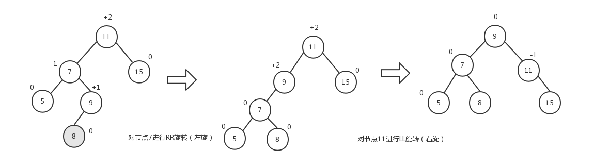
RL 旋转是 LL 旋转和 RR 旋转的组合：
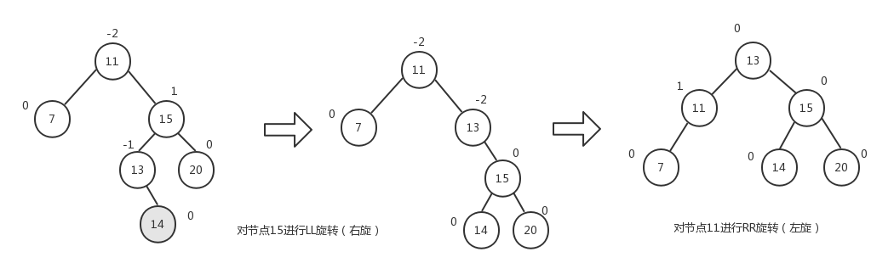
按照上面给出的示意图，我们的 AVLTree 类的 insert()方法的实现如下：

```javascript
insert (key) {
    super.insert(key);

    // 左子树高度大于右子树高度
    if (this.getNodeHeight(this.root.prev) - this.getNodeHeight(this.root.next) > 1) {
        if (key < this.root.prev.element) {
            this.root = this.rotationLL(this.root);
        }
        else {
            this.root = this.rotationLR(this.root);
        }
    }
    // 右子树高度大于左子树高度
    else if (this.getNodeHeight(this.root.next) - this.getNodeHeight(this.root.prev) > 1) {
        if (key > this.root.next.element) {
            this.root = this.rotationRR(this.root);
        }
        else {
            this.root = this.rotationRL(this.root);
        }
    }
}
```

我们依次测试一下这四种情况。按照上面示意图中树的结构添加节点，然后按照前序遍历的方式打印节点的 key。
LL 旋转的结果：

```javascript
let tree = new AVLTree()
tree.insert(11)
tree.insert(7)
tree.insert(15)
tree.insert(5)
tree.insert(9)
tree.insert(3)

tree.preOrderTraverse(value => console.log(value))
```

```javascript
7
5
3
11
9
15
```

LR 旋转的结果：

```javascript
let tree = new AVLTree()
tree.insert(11)
tree.insert(7)
tree.insert(15)
tree.insert(5)
tree.insert(9)
tree.insert(8)

tree.preOrderTraverse(value => console.log(value))
```

```javascript
9
7
5
8
11
15
```

RR 旋转的结果：

```javascript
let tree = new AVLTree()
tree.insert(11)
tree.insert(7)
tree.insert(15)
tree.insert(13)
tree.insert(20)
tree.insert(25)

tree.preOrderTraverse(value => console.log(value))
```

```javascript
15
11
7
13
20
25
```

RL 旋转的结果：

```javascript
let tree = new AVLTree()
tree.insert(11)
tree.insert(7)
tree.insert(15)
tree.insert(13)
tree.insert(20)
tree.insert(14)

tree.preOrderTraverse(value => console.log(value))
```

```javascript
13
11
7
15
14
20
```

我们用同样的方式修改 remove()方法，然后测试下面两种情况下的节点删除：
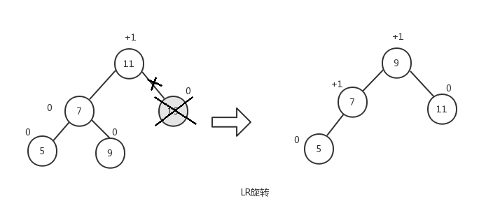

```javascript
let tree = new AVLTree()
tree.insert(11)
tree.insert(7)
tree.insert(15)
tree.insert(5)
tree.insert(9)

tree.remove(15)
tree.preOrderTraverse(value => console.log(value))
```

```javascript
9
7
5
11
```

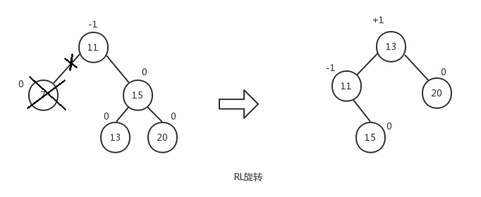

```javascript
let tree = new AVLTree()
tree.insert(11)
tree.insert(7)
tree.insert(15)
tree.insert(13)
tree.insert(20)

tree.remove(7)
tree.preOrderTraverse(value => console.log(value))
```

```javascript
13
11
15
20
```

完整的自平衡二叉搜索树 AVLTree 类的代码如下：

```javascript
class AVLTree extends BinarySearchTree {
    constructor() {
        super()
    }

    // 计算节点的高度
    getNodeHeight(node) {
        if (node === null) return 0
        return Math.max(this.getNodeHeight(node.prev), this.getNodeHeight(node.next)) + 1
    }

    // 获取节点的平衡因子

    /**
     * LL旋转: 向右旋转
     *
     *       b                           a
     *      / \                         / \
     *     a   e -> rotationLL(b) ->   c   b
     *    / \                         /   / \
     *   c   d                       f   d   e
     *  /
     * f
     *
     * @param node Node<T>
     */
    rotationLL(node) {
        let tmp = node.prev
        node.prev = tmp.next
        tmp.next = node
        return tmp
    }

    /**
     * RR旋转: 向左旋转
     *
     *     a                              b
     *    / \                            / \
     *   c   b   -> rotationRR(a) ->    a   e
     *      / \                        / \   \
     *     d   e                      c   d   f
     *          \
     *           f
     *
     * @param node Node<T>
     */
    rotationRR(node) {
        let tmp = node.next
        node.next = tmp.prev
        tmp.prev = node
        return tmp
    }

    /**
     * LR旋转: 先向左旋转，然后再向右旋转
     * @param node Node<T>
     */
    rotationLR(node) {
        node.prev = this.rotationRR(node.prev)
        return this.rotationLL(node)
    }
    /**
     * RL旋转: 先向右旋转，然后再向左旋转
     * @param node Node<T>
     */
    rotationRL(node) {
        node.next = this.rotationLL(node.next)
        return this.rotationRR(node)
    }

    insert(key) {
        super.insert(key)

        // 左子树高度大于右子树高度
        if (this.getNodeHeight(this.root.prev) - this.getNodeHeight(this.root.next) > 1) {
            if (key < this.root.prev.element) {
                this.root = this.rotationLL(this.root)
            } else {
                this.root = this.rotationLR(this.root)
            }
        }
        // 右子树高度大于左子树高度
        else if (this.getNodeHeight(this.root.next) - this.getNodeHeight(this.root.prev) > 1) {
            if (key > this.root.next.element) {
                this.root = this.rotationRR(this.root)
            } else {
                this.root = this.rotationRL(this.root)
            }
        }
    }

    remove(key) {
        super.remove(key)

        // 左子树高度大于右子树高度
        if (this.getNodeHeight(this.root.prev) - this.getNodeHeight(this.root.next) > 1) {
            if (key < this.root.prev.element) {
                this.root = this.rotationLL(this.root)
            } else {
                this.root = this.rotationLR(this.root)
            }
        }
        // 右子树高度大于左子树高度
        else if (this.getNodeHeight(this.root.next) - this.getNodeHeight(this.root.prev) > 1) {
            if (key > this.root.next.element) {
                this.root = this.rotationRR(this.root)
            } else {
                this.root = this.rotationRL(this.root)
            }
        }
    }
}
```

尽管自平衡二叉搜索树 AVL 可以很有效地帮助我们解决许多树节点的操作问题，但是在插入和移除节点时其性能并不是最好的。更好的选择是红黑树，红黑树也是一种自平衡二叉搜索树，但是它对其中的节点做了很多特殊的规定，使得在操作树节点的性能上要优于 AVL。
