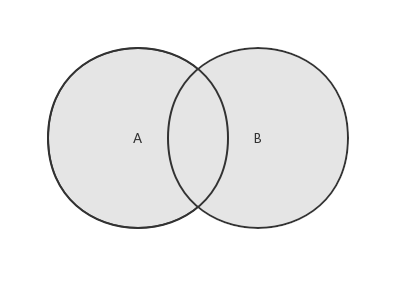
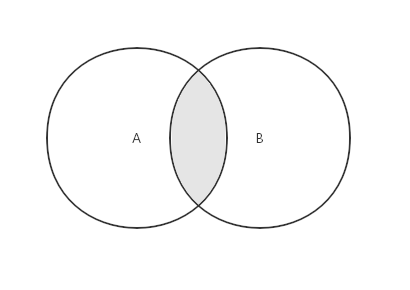
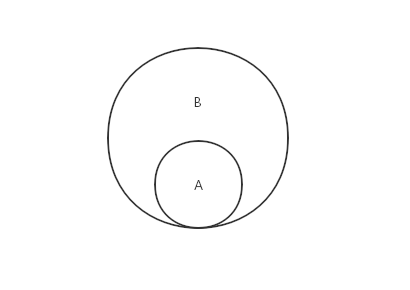

[链接](https://www.cnblogs.com/jaxu/p/11287315.html)

与数学中的集合概念类似，集合由一组无序的元素组成，且集合中的每个元素都是唯一存在的。可以回顾一下中学数学中集合的概念，我们这里所要定义的集合也具有空集（即集合的内容为空）、交集、并集、差集、子集的特性。
在 ES6 中，原生的 Set 类已经实现了集合的全部特性，稍后我们会介绍它的用法。
我们使用 JavaSctipt 的对象来表示集合，下面是集合类的主要实现方法：


```javascript
class Set {
    constructor() {
        this.items = {}
    }

    add(value) {
        // 向集合中添加元素
        if (!this.has(value)) {
            this.items[value] = value
            return true
        }
        return false
    }

    delete(value) {
        // 从集合中删除对应的元素
        if (this.has(value)) {
            delete this.items[value]
            return true
        }
        return false
    }

    has(value) {
        // 判断给定的元素在集合中是否存在
        return this.items.hasOwnProperty(value)
    }

    clear() {
        // 清空集合内容
        this.items = {}
    }

    size() {
        // 获取集合的长度
        return Object.keys(this.items).length
    }

    values() {
        // 返回集合中所有元素的内容
        return Object.values(this.items)
    }
}
```

在使用 JavaScript 对象{ }来表示集合时，我们可以像操作数组一样通过\[ ]来设置和获取集合内元素的值。通过这种方式，在设置集合元素的值时，如果元素不存在，则创建一个新元素，如果元素存在，则修改对应的值；在获取集合元素的值时，如果元素存在，则返回对应的值，如果元素不存在，则返回 undefined。此外，JavaScript 对象还提供了一些基础方法以方便我们对集合进行一些操作，例如 hasOwenProperty()方法返回一个表明对象是否具有特定属性的布尔值，Object.keys()方法返回指定对象的所有属性名称的数组，Object.values()方法方法指定对象的所有属性值的数组。
上述代码很简单，这里就不再详细解释了。下面是一些测试用例和测试结果：


```javascript
let set = new Set()
set.add(1)
console.log(set.values()) // [ 1 ]
console.log(set.has(1)) // true
console.log(set.size()) // 1

set.add(2)
console.log(set.values()) // [ 1, 2 ]
console.log(set.has(2)) // true
console.log(set.size()) // 2

set.delete(1)
console.log(set.values()) // [ 2 ]

set.delete(2)
console.log(set.values()) // []
```

下面我们来看看集合的数学运算：并集、交集、差集、子集。

<a name="c4d10be6"></a>

### 并集

对于给定的两个集合，并集返回一个包含两个集合中所有元素的新集合。示意图如下：

并集的实现代码：


```javascript
union (otherSet) { // 并集
    let unionSet = new Set();
    this.values().forEach(value => unionSet.add(value));
    otherSet.values().forEach(value => unionSet.add(value));
    return unionSet;
}
```

首先遍历第一个集合，将所有的元素添加到新集合中，然后再遍历第二个集合，将所有的元素添加到新集合中。然后返回新集合。不用担心会添加重复的元素，因为集合的 add()方法会自动排除掉已添加的元素。
测试用例及结果：

```javascript
let setA = new Set()
setA.add("first")
setA.add("second")
setA.add("third")

let setB = new Set()
setB.add("third")
setB.add("fourth")
setB.add("fifth")
setB.add("sixth")

console.log(setA.union(setB).values()) // [ 'first', 'second', 'third', 'fourth', 'fifth', 'sixth' ]
```

<a name="5a48d8c5"></a>

### 交集

对于给定的两个集合，交集返回一个包含两个集合中共有元素的新集合。示意图如下：

交集的实现代码：

```javascript
intersection (otherSet) { // 交集
    let intersectionSet = new Set();
    this.values().forEach(value => {
       if (otherSet.has(value)) intersectionSet.add(value);
    });
    return intersectionSet;
}
```

遍历第一个集合，如果元素出现在第二个集合中，则将它添加到新集合。然后返回新集合。
测试用例及结果：

```javascript
let setA = new Set()
setA.add("first")
setA.add("second")
setA.add("third")

let setB = new Set()
setB.add("second")
setB.add("third")
setB.add("fourth")

console.log(setA.intersection(setB).values()) // [ 'second', 'third' ]
```

<a name="e75b500f"></a>

### 差集

对于给定的两个集合，差集返回一个包含所有存在于第一个集合且不存在于第二个集合的元素的新集合。示意图如下：

差集的实现代码：

```javascript
difference (otherSet) { // 差集
    let differenceSet = new Set();
    this.values().forEach(value => {
       if (!otherSet.has(value)) differenceSet.add(value);
    });
    return differenceSet;
}
```

遍历第一个集合，如果元素没有出现在第二个集合中，则将它添加到新集合。然后返回新集合。
测试用例及结果：

```javascript
let setA = new Set()
setA.add("first")
setA.add("second")
setA.add("third")

let setB = new Set()
setB.add("second")
setB.add("third")
setB.add("fourth")

console.log(setA.difference(setB).values()) // [ 'first' ]
```

<a name="f6a25ee8"></a>

### 子集

验证一个给定集合是否是另一个集合的子集，即判断给定的集合中的所有元素是否都存在于另一个集合中，如果是，则这个集合就是另一个集合的子集，反之则不是。示意图如下：

子集的实现代码：

```javascript
subset (otherSet) { // 子集
    if (this.size() > otherSet.size()) return false;

    let isSubset = true;
    this.values().every(value => {
        if (!otherSet.has(value)) {
            isSubset = false;
            return false;
        }
        return true;
    });

    return isSubset;
}
```

如果集合 A 比集合 B 的长度大，则直接返回 false，因为这种情况 A 不可能是 B 的子集。然后使用 every()函数遍历集合 A 的所有元素，一旦碰到其中的元素没有在集合 B 中出现，则直接返回 false，并终止遍历。这里我们没有使用 forEach 来遍历集合 A，是因为你无法根据某个条件来终止 forEach 循环。考虑下面这种情况：

```javascript
var arr = ["first", "second", "third", "fourth"]
arr.forEach(item => {
    if (item === "third") return true
    console.log(item)
})
```

输出结果是：

    first
    second
    fourth

很显然，这里的 return true 语句并不能退出 forEach 循环，它只能保证本次循环中余下的语句不被执行，而接下来其它的元素还是会被遍历到。
在我们的 subset()方法中，如果使用 forEach 语句，每一次都会遍历集合中的所有元素，如果遇到其中的元素没有在集合 B 中出现，就将 isSubset 变量的值设置为 false，但并不能退出 forEach，isSubset 变量的值可能会被多次覆盖。为了提高执行效率，推荐使用 every()函数，它会遍历集合中的元素，直到其中一个返回结果为 false，就终止遍历，并返回 false，否则就遍历所有的元素并返回 true。有关 every()函数的详细介绍可以看[这里](https://developer.mozilla.org/zh-CN/docs/Web/JavaScript/Reference/Global_Objects/Array/every)。与 every()函数功能相似还有一个 some()函数，它在遍历集合的过程中，遇到返回结果为 true 时就终止遍历，具体内容可以看[这里](https://developer.mozilla.org/zh-CN/docs/Web/JavaScript/Reference/Global_Objects/Array/some)。
差集的测试用例及结果：

```javascript
let setA = new Set()
setA.add("first")
setA.add("second")

let setB = new Set()
setB.add("first")
setB.add("second")
setB.add("third")

let setC = new Set()
setC.add("second")
setC.add("third")
setC.add("fourth")

console.log(setA.subset(setB)) // true
console.log(setA.subset(setC)) // false
```

文章的开头说过，ES6 提供了原生的 Set 类，让我们来看看它的一些使用方法：

```javascript
let set = new Set()
set.add(1)
set.add(2)
set.add(3)
console.log(set.values()) // [Set Iterator] { 1, 2, 3 }
console.log(set.has(1)) // true
console.log(set.size) // 2

set.delete(1)
console.log(set.values()) // [Set Iterator] { 2, 3 }

set.clear()
console.log(set.values()) // [Set Iterator] {  }
```

和前面我们自定义的 Set 类稍微有一点不同，values()方法返回的不是一个数组，而是 Iterator 迭代器。另一个就是这里的 size 是一个属性而不是方法，其它部分都和我们前面定义的 Set 类相同。由于 ES6 的 Set 类不包含对集合的数学运算，我们可以按照前面我们提供的方法来对其进行扩充。
