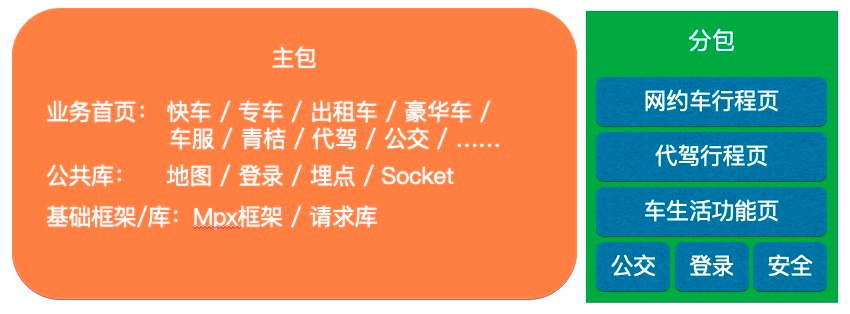
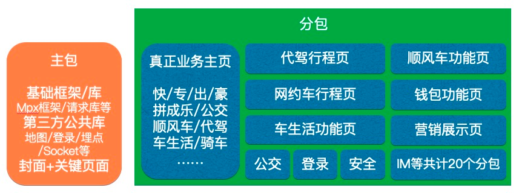

## 背景

微信对小程序包体积的要求是总体积不得超过 12M，主包及单个分包体积不得超过 2M，支付宝对与小程序包体积的计算方式虽和微信略有差别，不过整体大同小异

在 18 至 19 年初，滴滴出行小程序里承载的业务只有网约车，且业务需求较少，在主包内都可以搞定。但是在下半年时，为了将**微信钱包**、**支付宝九宫格**入口迁移到小程序，小程序开始新增诸如**公交**、**代价**、**车服**、**单车**、**顺风车**等众多业务线，同时网约车的业务需求也要做全面的补齐，业务量和代码量一起呈爆炸式增长 

### 业务

#### 高频页面

- 首页

在滴滴出行的产品逻辑，所有业务线的表达逻辑都放在首页承载，为了良好的切换体验，在首页采用了**单页顶导**的方案进行业务线展示。即每个业务线在首页中提供了一个需求表达组件，当用户切换顶导业务线后，切换出对应的业务线组件。(在这种设计下，所有业务线的需求表达逻辑都几种在首页这个单一页面中，导致在业务迭代过程中，主包体积迅速增长，很快达到了 2M 上下，对后续的业务迭代与发展带来巨大阻碍)

- 订单详情页

各个业务线的订单详情页则承载了具体的出行订单展示逻辑 

#### 功能页面

- 个人中心
- 营销页面
- 设置
- 历史行程 

#### 出行业务

- 快车
- 专车
- 出租车
- 豪华车
- 拼车
- 单车
- 代驾
- 顺风车
- 公交
- 车生活 

## 体积控制

### 基础优化手段

对于小程序来说，基础包体积优化手段包括

- 资源压缩
- 去除代码冗余
- 资源 cdn 化
- 异步加载

mpx 框架的编译构建完全基于 webpack，兼容 webpack 内部生态，天然可以使用 webpack 提供的能力对包体积进行优化

小程序中支持部分静态资源(如图像视频等)使用 cdn 地址加载，我们会尽可能的将相关的资源压缩后放到 cdn 上，避免这部分资源对包体积的占用

小程序场景下无法像 web 可以使用 script 标签便捷地进行异步加载，但是小程序平台后期纷纷支持了**分包加载**的方案来实现该能力，由于分包加载是小程序特有的技术规范，webpack 无法直接支持，因此 mpx 框架专门针对该技术规范进行了良好的适配支持

除此之外，mpx 框架还针对小程序场景进行了许多包体积优化的适配工作，如尽可能减少框架运行时包体积占用(压缩后占用 56kb)，对引用到的页面/组件按需进行打包构建，声明公共样式进行样式复用，分包内公共模块抽取等

在 mpx 框架的这些能力的支持下，基本不需要额外配置就能构建出一个经过初步优化的小程序包

### 分析体积

虽然框架已经提供了许多在体积功能方面的优化，但是随着业务迭代我们发现主包体积依然偏大。我们可以通过使用 webpack-bundle-analyzer 来查看各个模块的大小占比分析图

另外，在项目中一直是采用源码编译的，这可以让整个项目里的公共依赖实现仅有一份就可一起共用。简而言之，也有助于减少项目代码体积

要完美发挥源码编译的效果，需要上下游一起建立整套源码编译生态，如主项目的依赖方在声明公用依赖时，就应该使用 peerDep 或者 devDep 来声明一些公有依赖，这些共有依赖应该在主项目中统一声明，避免因版本不同装出两份公共依赖，那样反而会增大体积。由于滴滴出行主小程序设计业务线及团队众多，部分团队可能并不知道这件事情，因此代码在实际上可能出现上述劣化场景。而依照分析图，可以容易地发现这种问题，这样可以推动相关团队清楚这些重复依赖

同时，我们依照体积分析图，对其中体积较大的文件重点分析，进行了一轮业务代码梳理和精简，删除了一些无用代码，精简了 websocket 的消息题描述文件等 

### 配置分包

分包是小程序给出的类似 web 异步引入的一个方案，把一些初始进入时不需要的页面可以放进分包里，跳转到对应页面时才去下载分包，将这些页面及其附属资源放到分包里可以有效减少主包体积

mpx 框架早期对分包规范进行了初步支持，资源访问规则保持和微信一致，主要根据资源存放的目录判断应该输入到主包还是分包。有了这个能力后，我们把行程中业务抽离到了分包，大概抽离了 200 多 kb 左右的空间

有了行程中的成功拆分后，我们开始对所有的非首页代码进行分包操作，比如起终点选择和个人中心。以及部分业务线的接入是通过 npm 的方式接入，我们也尽可能地将这些业务线的所有非首页代码放到了分包

另外，在 mpx 早期设计时，使用了 packages 形式的业务组合方案，可以很方便地让业务独立开发，也可以方便的整合，这和微信的分包 json 配置设计和 packages 很类似，因此在此基础上支持了微信的分包，用户仅需在原 packages 基础上加上 query 标记分包的名字即可

初期拆分工作进行完毕后，总计从主包拆分了差不多 400kb 左右的空间到分包中 

### 分包资源精细化管理

在 mpx 框架初期的分包处理规则是完全按照微信的方式，把在分包路径下的资源收集到分包里，而 npm 管理的资源因为都在 node\_modules 目录下，不属于任何分包路径，则会被全部收集进主包

例如行程中模块的业务，虽然该模块自有的状态管理 store 整个都在行程中分包路径下，会被收集到行程中分包中。但是行程中还用到了封装好的 didi-socket 库，这个库是公共的 npm 包，即使它只在行程中分包内被使用，但由于它的路径是在 node\_modules 下的，因此将会被收集到主包里

随着业务迭代，后续大量业务线的接入都是通过 npm 来进行的，就会有大量的 npm 资源，他们都在 node\_modules 目录下，因此全部会被收集到主包中，因此 mpx 框架进行了一系列改造：

1. 在构建的依赖收集过程中，我们会对收集到的依赖搭上标记，记录它是被哪些分包引入的，一旦它只有一个分包引入，那么它就会被输出到这个分包中
2. 我们会根据用户定义的分包配置，自动在 SplitChunksPlugin 中生成各个分包的 cacheGroups，把分包中的复用模块抽取到分包下的 bundle 中
3. 对于组件和静态资源，如果他们被多个分包所引用并且未在主包中引用，为了确保主包体积最优，这些资源将产生多份副本分别输出到对应分包中，而不占用主包体积

因此，无论分包中引用的资源原本在什么位置，最终输出时都会尽可能将其输出到 dist 的分包目录下，避免占用主包空间。最终我们可以讲业务线分包中引用的 npm 资源成功输出到其所在的分包目录下 

### 封面方案

因为滴滴出行小程序需要替换微信/支付宝里原有的 webapp 入口，小程序接入的业务线迅速增加，包体积迅速增长

这个部分体积增长的主要原因是：所有业务先都需要接入到主页来展示，这是因为业务特点所决定的，因为滴滴出行提供了丰富的出行产品线，包括快车、专车、出租车、豪华车、拼车、单车、代驾、顺风车等产品。用户可能需要反复切换选型，这个过程还需要保留起终点车型之类的信息，必须是**一个页面内切换组件 + 一整套非常复杂的大型状态管理**才能比较流畅顺滑地实现。而不能像一些电商、信息平台一样，将不同的功能拆分到不同页面，让用户通过首页的菜单进入子页面再进行操作，首页只承载入口，只有较少的业务逻辑，分包处理起来就会容易很多

因此各个业务线都需要提供首页组件进行接入，这个组件会在首页被用到，所以无论如何也无法拆分到分包里。最终，整个首页主包部分的体积可以分为两个部分：基础库 + 业务代码，二者的体积占比大概是 1M : 1M

如此庞大的基础库体积主要因为滴滴出行的业务线以及业务团队众多，各方均拥有一些自己的基础依赖，如网约车依赖的长连接通信 pb 数据描述文件，地图会赖大量计算库，顺风车会依赖 cml 框架运行时，代驾依赖了通信网关库，包括公用的组件库和 polyfill 等

因此滴滴出行小程序在当时已经无法使用纯技术方案在短期内快速解决问题了，于是我们做了一个工程架构调整，也可以叫做**封皮页**方案，解决了主包问题

封皮页方案简单来说，就是做一个带有滴滴出行 logo 的封面作为启动页面，一旦页面加载，就会立即跳转到另一个页面，这个页面真正用来承载业务，并且它被放到分包里

这个操作的意义在于，主包里就只剩下了所有方案需要依赖的基础框架/库，而业务全部被抽离到了分包内

这样一来，我们将可以有 2M 的主包空间来存放基础的公共库，有 2M 左右的分包来存放前面提出的滴滴出行集成各条业务线组件的 "大首页"。拆分后大概差不多有 1.2M 的主包，800k 的业务主分包

这个改造最优的一点在于：后续的业务迭代产生的体积增长几乎全是在业务主分包内，剩下的 1.1M+ 的空间留给业务迭代还是比较充裕的，而主包的体积在理想条件下是可以长期保持不变的，这样就不会因为业务需求的不断开发反复导致主包体积临近超标，不再需要为主包体积感到焦虑

当然，可以看到，这个方案本身是没有消减任何体积的，只是把位置变换了一下。除此之外，这个封面页方案其实也存在一些缺陷，比如：首屏业务的展示会变慢，因为要加载的内容会变多，不过小程序本身有较好的缓存资源的能力，因此还算可以接受

相比于因体积问题卡住需求迭代以及产品线的接入，目前这个方案至少能解决问题。后续也会持续跟进关注体积问题，看是否会有产品方案变更或者小程序本身给出一些解决方案来进一步优化这个部分

#### 问题

封皮页方案会大幅降低业务首屏展示速度，这是加载性能中最重要的指标项。新的分包异步化技术能够打破之前的分包资源访问限制，在经过充分的落地优化后，可以大幅降低必须放置在主包中的资源数量，而主包优化出来的体积则有望重新承载业务首页功能，将目前加载流程中的页面跳转和分包加载阶段完全移除，从而大幅提升业务首屏幕展示速度。(需要除微信平台外的其他平台也支持分包异步化能力)
