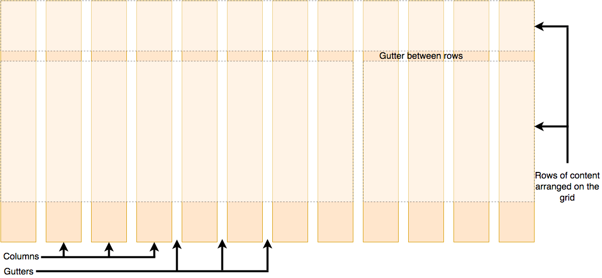

## 盒模型

### 什么是 css 盒模型

完整的 css 盒模型应用于块级盒子，内联盒子只使用盒模型中定义的部分内容。模型定义了盒的每个部分 - margin、border、padding and content。合在一起就可以创建我们在页面上看到的内容。为了增加一些额外的复杂性，有一个标准的和替代 ie 的盒模型

- 标准盒模型：内容的宽度 = **content box + padding + border**
- 替代盒模型（ie）：内容的宽度 = **content box** 

### 改变元素盒模型的方式

通过使用 box-sizing 来改变元素的盒模型

- `box-sizing: content-box;` 标准盒模型(默认值)
- `box-sizing: border-box;` 替代盒模型 ie 

### 盒模型的各个部分

在 css 中组成一个块级盒子需要：

- Content box：这个区域是用来显示内容；大小可以通过设置 width 和 height
- Padding box：包围在内容区域外部的空白区域；大小通过 padding 相关属性设置
- Border box：边框盒包裹内容和内边距；大小通过 border 相关属性设置
- Margin box：这是最外面的区域，是盒子和其他元素之间的空白区域；大小通过 margin相关属性设置 

### 区块格式化上下文 BFC

区块格式化上下文 Block Formatting Context 是 web 页面的可视 css 渲染的一部分，是**块级盒子**的布局过程发生的区域，也是**浮动元素与其他元素交互**的区域 

#### 创建块格式化上下文的方式

1. 文档的根元素：`<html />`
2. 浮动元素：float 的值不为 none 的元素
3. 绝对定位元素：position 值为 absolute 或 fixed 的元素
4. 行内块元素：display 值为 inline-block 的元素
5. 表格单元格：display 值为 table-cell，html 表格单元格默认值
6. 表格标题：display 值为 table-caption，html 表格标题默认值
7. 匿名表格单元格元素
   1. display 值为 table，html 表格默认值
   2. table-row 表格行默认值
   3. table-row-group 表格体默认值
   4. table-header-group 表格头部默认值
   5. table-footer-group 表格尾部默认值
   6. inline-table
8. overflow 不为 visible 或 clip 的块级元素
9. display 值为 flow-root 的元素
10. contain 值为 layout、content 或 paint 的元素
11. 弹性元素：display 值为 flex 或 inline-flex 元素的直接子元素，如果它们本身即不是弹性、网格也不是表格容器
12. 网格元素：display 值为 grid 或 inline-grid 元素的直接子元素，如果它们本身即不是弹性、网格也不是表格容器
13. 多列容器：column-count 或 column-width 值不为 auto，且含有 `column-count: 1`的元素
14. column-span 值为 all 的元素始终会创建一个新的格式化上下文，即使该元素没有包裹在一个多列容器中 

#### 格式化上下文的作用

格式化上下文影响布局，通常，我们会为定位和清楚浮动创建新的 BFC，而不是更改布局，因为它将：

- **包含内部浮动**
- **排除外部浮动**
- **阻止外边距重叠** 

### 行内格式化上下文 IFC

#### 核心概念

行内格式化上下文是一个网页渲染结果的一部分。期中，各行内框 inline-boxes 一个接一个地排列，其排列顺序根据书写模式 writing-mode 的设置来决定

- 对于水平书写模式，各个框从左边开始水平地排列
- 对于垂直书写模式，各个框从顶部开始水平地排列 

#### 在块方向上对齐

行内框 inline boxes 可以使用 vertical-align 属性，以不同的方式在块的方向上进行对齐 

#### 在行内方向上对齐

如果行内方向上还有额外空间，那么 text-align 可用于将各行内框 inline-boxes 在行框 line box 内对齐 

#### 浮动造成的效果

在行内方向上，各行框 line boxes 通常具有相同的尺寸，即在水平书写模式下，它们具有相同的宽度；在垂直书写模式下，它们具有同样的高度。但是，如果同一个块格式化上下文中存在一个 float，则这个浮动元素将导致包裹了它的各行框变短 

### 块级盒子和内联盒子

在 css 中我们广泛地使用两种"盒子" - **块级盒子 block box** 和**内联盒子 inline-box**。这两种盒子会在页面流 page flow 和元素之间的关系方面表现出不同的行为 

#### 块级盒子 - block 的表现行为

- 盒子会**在内联的方向上扩展**并**占据父容器在该方向上的所有可用**空间，在**绝大多数情况下**意味着**盒子会和父容器一样宽**
- 每个盒子都会换行
- width 和 height 属性可以发挥作用
- 内边距 padding，外边距 margin 和边框 border 会将其他元素从当前盒子周围**推开**

> 除非特殊制定，诸如标题 h1 等和段落 p 默认情况下都是块级的盒子

#### 内联盒子 - inline 的表现行为

- 盒子不会产生换行
- width 和 height 属性将不起作用
- 垂直方向的内边距、外边距以及边框会被应用但是不会把其他处于 inline 状态的盒子**推开**
- 水平方向的内边距、外边距以及边框会被应用且会把其他处于 inline 状态的盒子**推开**

> 用做链接的 a 元素、span、em 以及 strong 都是默认处于 inline 状态的

### 弹性盒子

弹性盒子是一种**用于按行或按列布局元素的一纬布局方法**。元素可以**膨胀以填充**额外的空间，**收缩以适应**更小的空间 

#### flex 模型说明

当元素表现为 flex 框时，它们沿两个轴来布局

- **主轴 - main axis** 是沿着 flex 元素放置的方向延伸的轴（比如页面上的横向的行、纵向的咧）。该轴的开始和结束被称为 main start 和 main end
- **交叉轴 - cross axis** 是垂直于 flex 元素放置方向的轴。该轴的开始和结束被称为 cross start 和 cross end
- 设置了 display: flex 的父元素被称之为 **flex 容器（flex container）**
- 在 flex 容器中表现为弹性的盒子的元素被称之为 flex 项（flex item） 

#### flex 的缩写与全写

flex 是一个可以指定最多三个不同值的缩写属性：

- **flex-grow**：**设置 flex 项主尺寸的 flex 增常系数**。用于决定项目在有剩余空间的情况下是否放大，默认为 0 不放大。设置之后，即使设置了固定宽度，也会放大
- **flex-shrink**：**指定了 flex 元素的收缩规则**。用于决定项目在空间不足时是否缩小，默认为 1，即空间不足时一起等比例缩小。设置之后，计时设置了固定宽度也会缩小
- **flex-basis**：**指定了 flex 元素在主轴方向上的初始大小**。用于设置项目宽度，默认为 auto，即项目会保持默认宽度，或者以 width 为自身宽度。设置之后，会覆盖 width 属性

> `flex: "0 1 auto";` 等价于 `flex-grow: 0; flex-shrink: 1; flex-basis: "auto";`

#### 一些其他的属性

- flex-flow：flex-direction 和 flex-wrap 的集合。默认值 `row nowrap`
- align-content：用于控制多行项目的对齐方式，如果项目只有一行则不起作用
- order：用于决定项目的排列顺序，数值越小，项目排列越靠前，默认为 0
- align-self：表示继承父容器的 align-items 属性，如果没有父元素，则默认为 stretch，用于让个别项目拥有与其他项目不同的对齐方式，各个值的表现与父容器的 align-items 属性完全一致 

### 网格

**css 网格 grid **是一个用于 web 的**二纬布局系统**。利用网格，可以把内容按照行与列的格式进行排版。另外，网格还能非常轻松地实现一些复杂的布局 

#### 网格布局说明

网格是由一系列水平及垂直的线构成的一种布局模式。根据网格，我们能够将设计的元素进行排列，版主我们设计一些具有固定位置以及宽度的元素的页面，使我们的网站页面更加统一
一个网格通常具有许多的**列 column** 与**行 row**，以及行与行、列与列之间的间隙，这个间隙一般被称为**沟槽 gutter**
 

## 包含块

包含块的英文全称为 containing block，实际上平时在书写 css 时，大多数情况下无法感知到它的存在，但实际上在 css 规范中是明确书写了这个概念：<https://drafts.csswg.org/css2/#containing-block-details>
 

### 包含块的影响

元素的**尺寸和位置**，会受它的**包含块**所影响。对于一些属性，例如 width、height、padding、margin，绝对定位元素的偏移值（比如 position 被设置为 absolute 或 fixed），**当我们对其赋予百分比值时，这些值的计算值，就是通过元素的包含块计算得来** 

### 确定包含块

- 根元素 `<html />` 所在的包含块是一个被称为**初始包含块 initial containing block 的矩形**。它具有**视口**对于连续媒体）或**页面区域**（对于分页媒体）的**尺寸**。一般来讲，**初始包含块的大小 = 视口 viewport 大小**，基点在画布的原点（视口左上角）。它是作为元素绝对定位和固定定位的参照物
- 对于非根元素的包含块判定就有几种不同的情况，大致分为以下几种：
  - 如果 **position 属性为 static、relative 或 sticky**，那么包含块可能由它的最近的**祖先块元素**（比如说 inline-block、block 或 list-item 元素）的内容区的边缘组成，也可能会**建立格式化上下文**（比如说 a、table container、flex container、grid container 或者是 the block container 自身）
  - 如果 **position 属性为 absolute**，包含块就是由它的最近的 position 的值不是 static（也就是值为 fixed、absolute、relative 或 sticky）的**祖先元素的内边距区的边缘组成**
  - 如果 **position 属性是 fixed**，在连续媒体的情况下（continuous media）包含块是**视口（viewport）**，在分页媒体（paged media）下的情况下包含块是**分页区域（page area）**
  - 如果 **position 属性是 absolute 或 fixed**，包含块也可能是由满足以下条件的最近父级元素的内边距区的边缘组成的
    - transform 或 perspective 的值不是 none
    - will-change 的值是 transform 或 perspective
    - filter 的值不是 none 或 will-change 的值是 filter（只在 Firefox 下生效）
    - contain 的值是 layout、paint、strict 或 content（例如：`contain: paint;`）
    - backdrop-filter 的值不是 none（例如：`backdrop-filter: blur(10px);`） 

## css 属性计算过程

### 确定声明值

声明值就是所书写的 css 样式 

### 层叠冲突

- **比较来源的重要性**：**页面作者样式 > 用户样式 > 用户代理样式**
  - 浏览器会有一个基本的样式表来给任何网页设置默认样式，这些样式统称为**用户代理样式**
  - 网页的作者可以定义文档的样式，这是最常见的样式表，称为**页面作者样式**
  - 浏览器的用户，可以使用自定义样式表来定制使用体验，称为**用户样式**
- **比较优先级：相同来源则比较选择器优先级**
  - **id 选择器**：选择器中包含 id 选择器则百位权重得 1 分
  - **类选择器**：选择器中包含**类选择器**、**属性选择器**或者**伪类**则十位权重得 1 分
  - **元素选择器**：选择器中包含**元素**、**伪元素**选择器则个位得 1 分
  - **通用选择器 ***、**关系选择器 （+、>、~、''）**和调**整优先级的选择器 :where **不会影响优先级
  - 否定 `:not()` 和任意匹配 `:is()` 伪类本身对优先级没有影响，但它们的参数则会带来影响。参数中，**对优先级算法有贡献的参数的优先级的最大值**将作为该伪类选择器的优先级
- **比较次序：后面的覆盖前面的** 

### 使用继承

具体需查看相关属性介绍得知是否可继承 

### 使用默认值

如果上面几步都无法确定最终样式，则将直接**使用默认值**
