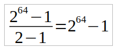
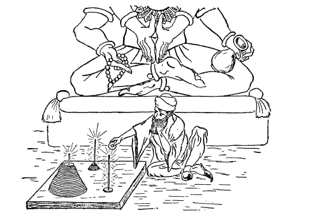

[链接](https://www.cnblogs.com/jaxu/p/11264017.html)

在计算机编程中，栈是一种很常见的数据结构，它遵从后进先出（LIFO——Last In First Out）原则，新添加或待删除的元素保存在栈的同一端，称作栈顶，另一端称作栈底。在栈中，新元素总是靠近栈顶，而旧元素总是接近栈底。
让我们来看看在 JavaScript 中如何实现栈这种数据结构。


```javascript
function Stack() {
    let items = []

    // 向栈添加新元素
    this.push = function (element) {
        items.push(element)
    }

    // 从栈内弹出一个元素
    this.pop = function () {
        return items.pop()
    }

    // 返回栈顶的元素
    this.peek = function () {
        return items[items.length - 1]
    }

    // 判断栈是否为空
    this.isEmpty = function () {
        return items.length === 0
    }

    // 返回栈的长度
    this.size = function () {
        return items.length
    }

    // 清空栈
    this.clear = function () {
        items = []
    }

    // 打印栈内的所有元素
    this.print = function () {
        console.log(items.toString())
    }
}
```

我们用最简单的方式定义了一个 Stack 类。在 JavaScript 中，我们用 function 来表示一个类。然后我们在这个类中定义了一些方法，用来模拟栈的操作，以及一些辅助方法。代码很简单，看起来一目了然，接下来我们尝试写一些测试用例来看看这个类的一些用法。

```javascript
let stack = new Stack()
console.log(stack.isEmpty()) // true

stack.push(5)
stack.push(8)
console.log(stack.peek()) // 8

stack.push(11)
console.log(stack.size()) // 3
console.log(stack.isEmpty()) // false

stack.push(15)
stack.pop()
stack.pop()
console.log(stack.size()) // 2
stack.print() // 5,8

stack.clear()
stack.print() // undefined
```

返回结果也和预期的一样！我们成功地用 JavaScript 模拟了栈的实现。但是这里有个小问题，由于我们用 JavaScript 的 function 来模拟类的行为，并且在其中声明了一个私有变量 items，因此这个类的每个实例都会创建一个 items 变量的副本，如果有多个 Stack 类的实例的话，这显然不是最佳方案。我们尝试用 ES6（ECMAScript 6）的语法重写 Stack 类。

```javascript
class Stack {
    constructor() {
        this.items = []
    }

    push(element) {
        this.items.push(element)
    }

    pop() {
        return this.items.pop()
    }

    peek() {
        return this.items[this.items.length - 1]
    }

    isEmpty() {
        return this.items.length === 0
    }

    size() {
        return this.items.length
    }

    clear() {
        this.items = []
    }

    print() {
        console.log(this.items.toString())
    }
}
```

没有太大的改变，我们只是用 ES6 的简化语法将上面的 Stack 函数转换成了 Stack 类。类的成员变量只能放到 constructor 构造函数中来声明。虽然代码看起来更像类了，但是成员变量 items 仍然是公有的，我们不希望在类的外部访问 items 变量而对其中的元素进行操作，因为这样会破坏栈这种数据结构的基本特性。我们可以借用 ES6 的 Symbol 来限定变量的作用域。

```javascript
let _items = Symbol()

class Stack {
    constructor() {
        this[_items] = []
    }

    push(element) {
        this[_items].push(element)
    }

    pop() {
        return this[_items].pop()
    }

    peek() {
        return this[_items][this[_items].length - 1]
    }

    isEmpty() {
        return this[_items].length === 0
    }

    size() {
        return this[_items].length
    }

    clear() {
        this[_items] = []
    }

    print() {
        console.log(this[_items].toString())
    }
}
```

这样，我们就不能再通过 Stack 类的实例来访问其内部成员变量\_items 了。但是仍然可以有变通的方法来访问\_items：

```javascript
let stack = new Stack()
let objectSymbols = Object.getOwenPropertySymbols(stack)
```

通过 Object.getOwenPropertySymbols()方法，我们可以获取到类的实例中的所有 Symbols 属性，然后就可以对其进行操作了，如此说来，这个方法仍然不能完美实现我们想要的效果。我们可以使用 ES6 的 WeakMap 类来确保 Stack 类的属性是私有的：

```javascript
const items = new WeakMap()

class Stack {
    constructor() {
        items.set(this, [])
    }

    push(element) {
        let s = items.get(this)
        s.push(element)
    }

    pop() {
        let s = items.get(this)
        return s.pop()
    }

    peek() {
        let s = items.get(this)
        return s[s.length - 1]
    }

    isEmpty() {
        return items.get(this).length === 0
    }

    size() {
        return items.get(this).length
    }

    clear() {
        items.set(this, [])
    }

    print() {
        console.log(items.get(this).toString())
    }
}
```

现在，items 在 Stack 类里是真正的私有属性了，但是，它是在 Stack 类的外部声明的，这就意味着谁都可以对它进行操作，虽然我们可以将 Stack 类和 items 变量的声明放到[闭包](https://www.w3schools.com/js/js_function_closures.asp)中，但是这样却又失去了类本身的一些特性（如扩展类无法继承私有属性）。所以，尽管我们可以用 ES6 的新语法来简化一个类的实现，但是毕竟不能像其它强类型语言一样声明类的私有属性和方法。有许多方法都可以达到相同的效果，但无论是语法还是性能，都会有各自的优缺点。

```javascript
let Stack = (function () {
    const items = new WeakMap()
    class Stack {
        constructor() {
            items.set(this, [])
        }

        push(element) {
            let s = items.get(this)
            s.push(element)
        }

        pop() {
            let s = items.get(this)
            return s.pop()
        }

        peek() {
            let s = items.get(this)
            return s[s.length - 1]
        }

        isEmpty() {
            return items.get(this).length === 0
        }

        size() {
            return items.get(this).length
        }

        clear() {
            items.set(this, [])
        }

        print() {
            console.log(items.get(this).toString())
        }
    }
    return Stack
})()
```

下面我们来看看栈在实际编程中的应用。

<a name="d8936c87"></a>

### 进制转换算法

将十进制数字 10 转换成二进制数字，过程大致如下：
10 / 2 = 5，余数为 0
5 / 2 = 2，余数为 1
2 / 2 = 1，余数为 0
1 / 2 = 0, 余数为 1
我们将上述每一步的余数颠倒顺序排列起来，就得到转换之后的结果：1010。
按照这个逻辑，我们实现下面的算法：

```javascript
function divideBy2(decNumber) {
    let remStack = new Stack()
    let rem,
        binaryString = ""

    while (decNumber > 0) {
        rem = Math.floor(decNumber % 2)
        remStack.push(rem)
        decNumber = Math.floor(decNumber / 2)
    }

    while (!remStack.isEmpty()) {
        binaryString += remStack.pop().toString()
    }

    return binaryString
}

console.log(divideBy2(233)) // 11101001
console.log(divideBy2(10)) // 1010
console.log(divideBy2(1000)) // 1111101000
```

Stack 类可以自行引用本文前面定义的任意一个版本。我们将这个函数再进一步抽象一下，使之可以实现任意进制之间的转换。

```javascript
function baseConverter(decNumber, base) {
    let remStack = new Stack()
    let rem,
        baseString = ""
    let digits = "0123456789ABCDEF"

    while (decNumber > 0) {
        rem = Math.floor(decNumber % base)
        remStack.push(rem)
        decNumber = Math.floor(decNumber / base)
    }

    while (!remStack.isEmpty()) {
        baseString += digits[remStack.pop()]
    }

    return baseString
}

console.log(baseConverter(233, 2)) // 11101001
console.log(baseConverter(10, 2)) // 1010
console.log(baseConverter(1000, 2)) // 1111101000

console.log(baseConverter(233, 8)) // 351
console.log(baseConverter(10, 8)) // 12
console.log(baseConverter(1000, 8)) // 1750

console.log(baseConverter(233, 16)) // E9
console.log(baseConverter(10, 16)) // A
console.log(baseConverter(1000, 16)) // 3E8
```

我们定义了一个变量 digits，用来存储各进制转换时每一步的余数所代表的符号。如：二进制转换时余数为 0，对应的符号为 digits\[0]，即 0；八进制转换时余数为 7，对应的符号为 digits\[7]，即 7；十六进制转换时余数为 11，对应的符号为 digits\[11]，即 B。

<a name="a0e1b915"></a>

### 汉诺塔

有关汉诺塔的传说和由来，读者可以自行百度。这里有两个和汉诺塔相似的小故事，可以跟大家分享一下。

1. 有一个古老的传说，印度的舍罕王（Shirham）打算重赏国际象棋的发明人和进贡者，宰相西萨·班·达依尔（Sissa Ben Dahir）。这位聪明的大臣的胃口看来并不大，他跪在国王面前说：“陛下，请您在这张棋盘的第一个小格内，赏给我一粒小麦；在第二个小格内给两粒，第三格内给四粒，照这样下去，每一小格内都比前一小格加一倍。陛下啊，把这样摆满棋盘上所有 64 格的麦粒，都赏给您的仆人吧！”。“爱卿。你所求的并不多啊。”国王说道，心里为自己对这样一件奇妙的发明所许下的慷慨赏诺不致破费太多而暗喜。“你当然会如愿以偿的。”说着，他令人把一袋麦子拿到宝座前。计数麦粒的工作开始了。第一格内放一粒，第二格内放两粒，第三格内放四粒，......还没到第二十格，袋子已经空了。一袋又一袋的麦子被扛到国王面前来。但是，麦粒数一格接以各地增长得那样迅速，很快就可以看出，即便拿来全印度的粮食，国王也兑现不了他对西萨·班·达依尔许下的诺言了，因为这需要有 18 446 744 073 709 551 615 颗麦粒呀！
   
   这个故事其实是一个数学级数问题，这位聪明的宰相所要求的麦粒数可以写成数学式子：1 + 2 + 22 + 23 + 24 + ...... 262 + 263
   推算出来就是：
   
   其计算结果就是 18 446 744 073 709 551 615，这是一个相当大的数！如果按照这位宰相的要求，需要全世界在 2000 年内所生产的全部小麦才能满足。
2. 另外一个故事也是出自印度。在世界中心贝拿勒斯的圣庙里，安放着一个黄铜板，板上插着三根宝石针。每根针高约 1 腕尺，像韭菜叶那样粗细。梵天在创造世界的时候，在其中的一根针上从下到上放下了由大到小的 64 片金片。这就是所谓的梵塔。不论白天黑夜，都有一个值班的僧侣按照梵天不渝的法则，把这些金片在三根针上移来移去：一次只能移一片，并且要求不管在哪一根针上，小片永远在大片的上面。当所有 64 片都从梵天创造世界时所放的那根针上移到另外一根针上时，世界就将在一声霹雳中消灭，梵塔、庙宇和众生都将同归于尽。这其实就是我们要说的汉诺塔问题，和第一个故事一样，要把这座梵塔全部 64 片金片都移到另一根针上，所需要的时间按照数学级数公式计算出来：1 + 2 + 22 + 23 + 24 + ...... 262 + 263 = 264 - 1 = 18 446 744 073 709 551 615
   一年有 31 558 000 秒，假如僧侣们每一秒钟移动一次，日夜不停，节假日照常干，也需要将近 5800 亿年才能完成！
   
   好了，现在让我们来试着实现汉诺塔的算法。
   为了说明汉诺塔中每一个小块的移动过程，我们先考虑简单一点的情况。假设汉诺塔只有三层，借用百度百科的图，移动过程如下：
   
   一共需要七步。我们用代码描述如下：

```javascript
function hanoi(plates, source, helper, dest, moves = []) {
    if (plates <= 0) {
        return moves
    }
    if (plates === 1) {
        moves.push([source, dest])
    } else {
        hanoi(plates - 1, source, dest, helper, moves)
        moves.push([source, dest])
        hanoi(plates - 1, helper, source, dest, moves)
    }
    return moves
}
```

下面是执行结果：

```javascript
console.log(hanoi(3, "source", "helper", "dest"))
```

```shell
[
  [ 'source', 'dest' ],
  [ 'source', 'helper' ],
  [ 'dest', 'helper' ],
  [ 'source', 'dest' ],
  [ 'helper', 'source' ],
  [ 'helper', 'dest' ],
  [ 'source', 'dest' ]
]
```

可以试着将 3 改成大一点的数，例如 14，你将会得到如下图一样的结果：

如果我们将数改成 64 呢？就像上面第二个故事里所描述的一样。恐怕要令你失望了！这时候你会发现你的程序无法正确返回结果，甚至会由于超出递归调用的嵌套次数而报错。这是由于移动 64 层的汉诺塔所需要的步骤是一个很大的数字，我们在前面的故事中已经描述过了。如果真要实现这个过程，这个小程序恐怕很难做到了。
搞清楚了汉诺塔的移动过程，我们可以将上面的代码进行扩充，把我们在前面定义的栈的数据结构应用进来，完整的代码如下：

```javascript
function towerOfHanoi(plates, source, helper, dest, sourceName, helperName, destName, moves = []) {
    if (plates <= 0) {
        return moves
    }
    if (plates === 1) {
        dest.push(source.pop())
        const move = {}
        move[sourceName] = source.toString()
        move[helperName] = helper.toString()
        move[destName] = dest.toString()
        moves.push(move)
    } else {
        towerOfHanoi(plates - 1, source, dest, helper, sourceName, destName, helperName, moves)
        dest.push(source.pop())
        const move = {}
        move[sourceName] = source.toString()
        move[helperName] = helper.toString()
        move[destName] = dest.toString()
        moves.push(move)
        towerOfHanoi(plates - 1, helper, source, dest, helperName, sourceName, destName, moves)
    }
    return moves
}

function hanoiStack(plates) {
    const source = new Stack()
    const dest = new Stack()
    const helper = new Stack()

    for (let i = plates; i > 0; i--) {
        source.push(i)
    }

    return towerOfHanoi(plates, source, helper, dest, "source", "helper", "dest")
}
```

我们定义了三个栈，用来表示汉诺塔中的三个针塔，然后按照函数 hanoi()中相同的逻辑来移动这三个栈中的元素。当 plates 的数量为 3 时，执行结果如下：

    [
      {
        source: '[object Object]',
        helper: '[object Object]',
        dest: '[object Object]'
      },
      {
        source: '[object Object]',
        dest: '[object Object]',
        helper: '[object Object]'
      },
      {
        dest: '[object Object]',
        source: '[object Object]',
        helper: '[object Object]'
      },
      {
        source: '[object Object]',
        helper: '[object Object]',
        dest: '[object Object]'
      },
      {
        helper: '[object Object]',
        dest: '[object Object]',
        source: '[object Object]'
      },
      {
        helper: '[object Object]',
        source: '[object Object]',
        dest: '[object Object]'
      },
      {
        source: '[object Object]',
        helper: '[object Object]',
        dest: '[object Object]'
      }
    ]
