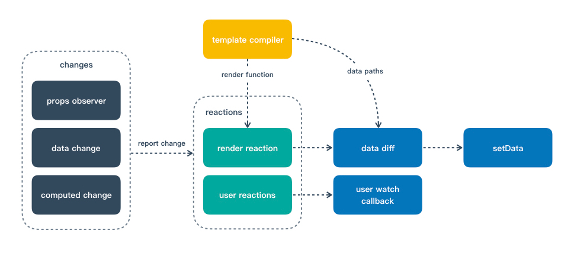
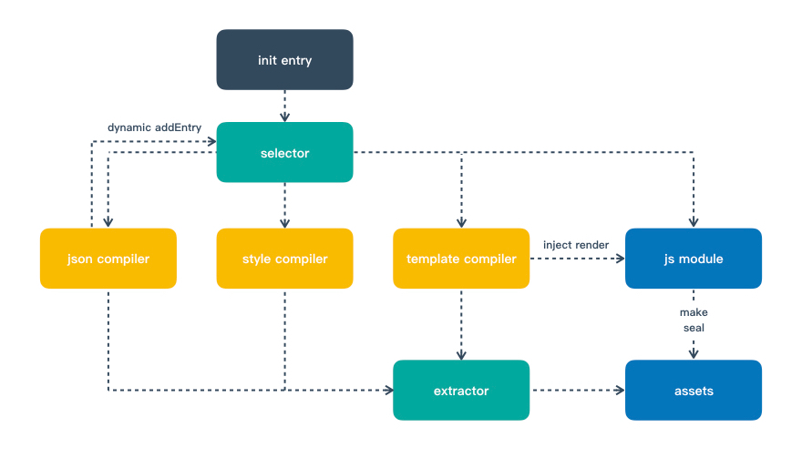

## 状态管理

Mpx 参考 vuex 设计实现了外部状态管理系统（store），其中的概念与 api 与 vuex 保持一致，为了更好地支持状态模块管理和跨团队合作场景，我们提出多实例 store 作为 vuex 中 modules 的替代方案，该方案在模块拆分及合并上的灵活性远高于 modules。

与 vuex 中的不同的地方在于，vuex 奉行单一状态树，一个应用当中只存在一个 store 示例，用户能够在组件中通过 this.$store 隐式地访问到当前应用的 store；而 Mpx 当中为了追求灵活便捷的状态模块化管理及跨团队合作的能力，支持了多实例 store，用户需要显式地引入 store 实例，并通过计算属性将其注入到组件当中。

在实际的跨团队业务当中，我们既希望不同团队间的数据管理尽量解耦，也希望一些共同的部分能够复用，这就要求我们的 store 实例可以以某种方式组合起来使用，我们提供了 deps 能来实现多实例 store 的合并与继承。 

## Mixin

Mpx 提供了一套完善的 mixin 机制，有人可能要问，原生小程序中已经支持了 behaviors，为何我们还需要提供 mixin 呢？主要有以下两点原因：

1. Behaviors 是平台限度的，只有在部分小程序平台中可以使用，而且内置 behaviors 承载了除了 mixin 外的其他功能，框架提供的 mixin 是一个与平台无关的基础能力；
2. Behaviors 只有组件支持使用，页面不支持，而且只支持局部声明，框架提供的 mixin 与组件页面无关，且支持全局 mixin 声明。 

## 分包异步化

在小程序中，不同的分包对应不同的下载单元；因此，除了非独立分包可以依赖主包外，分包之间不能互相使用自定义组件或进行 require。 「分包异步化」特性将允许通过一些配置和新的接口，使部分跨分包的内容可以等待下载后异步使用，从而一定程度上解决这个限制。 

## 图像资源引入有三种方式

1. Template 中通过 image src 指定图像资源
   - 直接指定图像的远程资源地址
   - 资源为本地路径，若配置 publicPath，则 publicPath 与 webpack loader 中配置的 name 进行拼接
2. Style 中通过 src 指定图像资源
3. Style 中通过 class 指定图像资源

Wxss文件中只能用 CDN 地址或 Base64, 针对第二、三种方式引入的资源，可以通过配置决定使用 CDN 还是 Base64，且 Mpx 中图像资源处理会优先检查 Base64，具体配置参数如下：

- publicPath：资源存放 CDN 地址，可选
- limit: 资源大小限制，可根据资源的大小判断走 Base64 还是 CDN， 可选
- publicPathScope: 限制输出 CDN 图像资源的范围，可选 styleOnly、all，默认为 styleOnly。（图像引用方式分两大类 Template, Style）
- outputPathCDN: 设置 CDN 图像对应的本地相对地址（相对于当前编译输出目录的地址，如 dist,或者 dist/wx），可写脚本将本地图像批量上传到 CDN 

## 类名样式绑定

Mpx利用wxs完整实现了Vue中的类名样式绑定，性能优良且没有任何使用限制（很多小程序框架基于字符串解析来实现该能力，只支持在模板上写简单的字面量，大大限制了使用场景） 

## 极致性能

Mpx在性能上做到了极致，我们在框架中通过模板数据依赖收集进行了深度的setData优化，做到了程序上的最优，让用户能够专注于业务开发；
其次，Mpx的编译构建完全基于依赖收集，支持按需进行的npm构建，能够自动根据用户的分包配置抽离共用模块，确保用户最终产出项目的包体积最优；
最后，Mpx的运行时框架部分仅占用51KB； 

## 对比其他小程序框架

目前业内的小程序框架主要分为两类，一类是以uniapp，taro2为代表的静态编译型框架，这类框架以静态编译为主要手段，将React和Vue开发的业务源码转换到小程序环境中进行适配运行。这类框架的主要优点在于web项目迁移方便，跨端能力较强。但是由于React/Vue等web框架的DSL与小程序本身存在较大差距，无法完善支持原web框架的全部能力，开发的时候容易踩坑。
另一类是以kbone，taro3为代表的运行时框架，这类框架利用小程序本身提供的动态渲染能力，在小程序中模拟出web的运行时环境，让React/Vue等框架直接在上层运行。这类框架的优点在于web项目迁移方便，且在web框架语法能力的支持上比静态编译型的框架要强很多，开发时遇到的坑也会少很多。但是由于模拟的web运行时环境带来了巨大的性能开销，这类框架并不适合用于大型复杂的小程序开发。
不同于上面两类框架，Mpx以小程序本身的DSL为基础，通过编译和运行时手段结合对其进行了一系列拓展增强，没有复杂庞大的转译和环境抹平，在提升用户开发体验和效率的同时，既能保障开发的稳定和可预期性，又能保障接近原生的良好性能，非常适合开发大型复杂的小程序应用。
在跨端方面，Mpx重点保障跨小程序平台的跨端能力，由于各家小程序标准具有很强的相似性，Mpx在进行跨端输出时，以静态编译为主要手段，辅以灵活便捷的条件编译，保障了跨端输出的性能和可用性。 

## 运行时增强原理

数据响应作为Vue最核心的特性，在我们的日常开发中被大量使用，能够极大地提高前端开发体验和效率，我们在框架设计初期最早考虑的就是如何将数据响应特性加入到小程序开发中。在数据响应的实现上，我们引入了MobX，一个实现了纯粹数据响应能力的知名开源项目。借助MobX和mixins，我们在小程序组件创建初期建立了一个响应式数据管理系统，该系统观察着小程序组件中的所有数据(data/props/computed)并基于数据的变更驱动视图的渲染(setData)及用户注册的watch回调，实现了Vue中的数据响应编程体验。与此同时，我们基于MobX封装实现了一个Vuex规范的数据管理store，能够方便地注入组件进行全局数据管理。为了提高跨团队开发的体验，我们对store添加了多实例可合并的特性，不同团队维护自己的store，在需要时能够合并他人或者公共的store生成新的store实例，我们认为这是一种比Vuex中modules更加灵活便捷的跨团队数据管理模式
作为一个接管了小程序setData的数据响应开发框架，我们高度重视Mpx的渲染性能，通过小程序官方文档中提到的性能优化建议可以得知，setData对于小程序性能来说是重中之重，setData优化的方向主要有两个：

1. 尽可能减少setData调用的频次
2. 尽可能减少单次setData传输的数据

为了实现以上两个优化方向，我们做了以下几项工作：

- 将组件的静态模板编译为可执行的render函数，通过render函数收集模板数据依赖，只有当render函数中的依赖数据发生变化时才会触发小程序组件的setData，同时通过一个异步队列确保一个tick中最多只会进行一次setData，这个机制和Vue中的render机制非常类似，大大降低了setData的调用频次；
- 将模板编译render函数的过程中，我们还记录输出了模板中使用的数据路径，在每次需要setData时会根据这些数据路径与上一次的数据进行diff，仅将发生变化的数据通过数据路径的方式进行setData，这样确保了每次setData传输的数据量最低，同时避免了不必要的setData操作，进一步降低了setData的频次。

Mpx数据响应机制流程示意图 

## 编译构建原理

我们希望使用目前设计最强大、生态最完善的编译构建工具Webpack来实现小程序的编译构建，让用户得到web开发中先进强大的工程化开发体验。使用过Webpack的同学都知道，通常来说Webpack都是将项目中使用到的一系列碎片化模块打包为一个或几个bundle，而小程序所需要的文件结构是非常离散化的，如Ï何调解这两者的矛盾成为了我们最大的难题。一种非常直观简单的思路在于遍历整个src目录，将其中的每一个.mpx文件都作为一个entry加入到Webpack中进行处理，这样做的问题主要有两个：

1. src目录中用不到的.mpx文件也会被编译输出，最终也会被小程序打包进项目包中，无意义地增加了包体积；
2. 对于node\_modules下的.mpx文件，我们不认为遍历node\_modules是一个好的选择。

最终我们采用了一种基于依赖分析和动态添加entry的方式来进行实现，用户在Webpack配置中只需要配置一个入口文件app.mpx，loader在解析到json时会解析json中pages域和usingComponents域中声明的路径，通过动态添加entry的方式将这些文件添加到Webpack的构建系统当中（注意这里是添加entry而不是添加依赖，因为只有entry能生成独立的文件，满足小程序的离散化文件结构），并递归执行这个过程，直到整个项目中所有用到的.mpx文件都加入进来，在输出前，我们借助了CommonsChunkPlugin/SplitChunksPlugin的能力将复用的模块抽取到一个外部的bundle中，确保最终生成的包中不包含重复模块。我们提供了一个Webpack插件和一个.mpx文件对应的loader来实现上述操作，用户只需要将其添加到Webpack配置中就可以以打包web项目的方式正常打包小程序，没有任何的前置和后置操作，支持Webpack本身的完整生态。

Mpx编译构建机制流程示意图Ï
