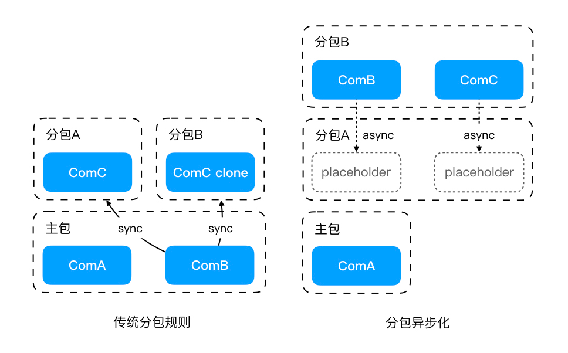
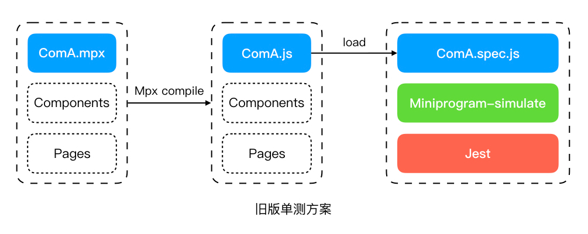
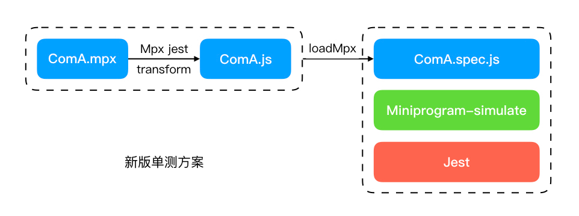

<a name="xd2sP"></a>

### mpx v2.7

mpx 是一款开源的增强型跨端小程序框架，它具有良好的开发体验，极致的应用性能和一份源码同构输出所有小程序平台及 web 环境的跨端能力。

mpx v2.7 基于 webpack5 彻底重构了框架的核心编译构建流程，利用持久化缓存大幅度提升了编译构建速度，最高提升可达 10 倍。除此之外，mpx v2.7 版本还带来了一系列重要的功能更新，包括分包输出能力增强，完善的单元测试支持和用户 rules 应用等 <a name="aiwRw"></a>

### 编译构建提速

随着小程序生态的日渐发展壮大，各类线上小程序业务体量和复杂度的不断升级，小程序的包体积从最开始的 2M 以内膨胀到 20M 甚至 30M，已经远远不复当初的小程序之名。随着小程序项目大小的不断增加，采用框架进行小程序开发的开发者们往往都会面临一个问题：框架的编译耗时过长

在滴滴主小程序项目中，目前的总包体积已经超过 25M，包含近 30000 个 js 模块，400 多个页面和 3000 多个组件，在本地进行一次完整构建需要等待 15 分钟，CI 环境下甚至需要近半个小时，远远超出能够忍受的范围，对小程序开发体验和开发效率造成了极大的影响。虽然旧版本中的 watch 模式能够在很大程度上缓解我们在开发调试过程中面临的编译耗时问题，但我们在日常开发中，仍然有很多场景无法使用 watch 模式(首次构建、CI 环境、需真机预览等)，基于内存缓存的 watch 模式也无法长期运行。对于这个问题，我们在过去做了许多技术尝试，如支持 watch:prod 模式，局部编译，多线程编译，dll 预编译等等，但是在整体尝试下来这些方案要么收敛有限，要么适用面不足，都没能搜索到一个能从根本上解决问题的方案。

在 webpack5 发布之后，基于文件系统的持久化缓存能力的出现，让我们找到了问题的解决方案。对于 webpack5 来说，对比于 webpack4 有着非常多的升级改动，而 mpx 的编译构建在过去的版本中也存在着各种历史遗留问题，我们花了较长的时间吃透 webpack5 的源码以及重新思考 mpx 中存在的不合理设计，经过 3 个多月的开发，彻底重构了 mpx 的核心编译流程，使其能够完整安全地利用 webpack5 持久化缓存能力进行构建提速，同时也彻底解决了旧版 mpx 中存在的历史遗留问题。

对于编译提速，大部分人首先想到的是 vite，虽然 vite 是一个富有创造力的技术方案，但是在小程序场景下，却不一定是最合适的方案，这主要源于 vite 最核心的设计利用了现代浏览器原生支持的 esm，而目前没有任何一家小程序环境能够原生支持 esm，这就使得 vite 最核心的按需编译能力无法得到发挥，而 vite 使用 esbuild 带来的编译速度提升，在 webpack 环境中也可以选择使用 esbuild-loader 提供的能力来替换 babel/terser，而且目前 esbuild 提供的编译能力成熟度还远不能和 babel/terser 相比，再加上 mpx 的编译构建流程很大程度上依赖了 webpack 提供的能力，从成本和收益上考虑采用 webpack5 来说是更好的方案 <a name="A1Q1L"></a>

#### 开启持久化缓存

```javascript
module.exports = {
  cache: {
    type: 'filesystem',
    // 声明构建配置，注意如果声明某个文件夹为构建配置，需要在文件夹下放置空的 package.json文件，避免构建依赖收集时将主项目的依赖项视为构建依赖
    buildDependencies: {
      build: [resolve('build/')],
      config: [resolve('config/')]
    },
    cacheDirectory: resolve('.cache/')
  },
  snapshot: {
    // 如果希望修改 node_modules 下的文件时对应的缓存可以失效，可以将此处的配置改为 managedPaths: []
    managedPaths: [resolve('node_modules/')]
  },
}
```

<a name="NOLRo"></a>

#### 总体收益

在 webpack5 升级后，有缓存情况下(大部分场景)，本地构建耗时可降低至1分钟左右，CI 流程构建耗时可降低至3分钟以内，提速均达到10倍以上；无缓存情况下(少数场景)，本地构建耗时9分钟左右，CI构建耗时约16分钟，优化了大约40%。随着我们对 CI 流程的持久化缓存改造完成，可以确保在日常的大部分构建场景都会在有缓存的环境下进行 <a name="xhkQG"></a>

### 分包输出能力增强

在 mpx v2.7 版本中，我们对小程序分包能力的支持进行了进一步的完善增强 <a name="NZNJ6"></a>

#### 独立分包初始化模块

在过去的版本中，我们对独立分包进行过专门的构建支持，以满足独立分包资源独占的需求。不过在使用独立分包进行业务开发时，往往会面临一个棘手问题：初始化逻辑无处安放。这是由于独立分包没有 app.js，而在小程序中，组件的 js 逻辑会早于页面 js 执行，具体的执行顺序又和组件的嵌套关系有关，因此我们无法找到一个确定的代码位置来存放独立分包的初始化逻辑

在 mpx v2.7 中，针对独立分包新增了一个全新的增强特性，让用户能够声明独立分包的初始化模块，该模块将会在独立分包启动时全局最先执行，其实现思路大致如下：在构建时为独立分包中所有组件和页面都添加模块引用，指向用户声明的初始化模块，这样在独立分包启动时，无论哪个组件/页面的 js 最先执行，都能保障这个初始化模块最先执行，同时由于模块缓存的存在，后续的组件/页面执行时，该模块也不会被重复执行。 <a name="jWbXg"></a>

#### 分包异步化

分包异步化是微信小程序在去年下半年提出的全新技术特性，该特性打破了传统分包只能引用自身和主包资源的规则限制，通过相关配置和声明，允许分包异步地引用其他分包内的资源，对于复杂小程序的包体积和加载性能优化具有极其重要的意义

在过去，受限于小程序分包资源引用规则，mpx 在编译构建时对于跨分包公用的资源有两种处理策略，其一是将其输出到主包中，让多个分包能够通过主包访问，这种策略下可以达到总包体积最优，但是往往会对主包体积造成过大的压力。当主包超出 2M 限制时，我们就需要采用第二种策略，将这部分跨分包共用的资源冗余地输出到各自的分包中，消除其对于主包体积的占用。在实际的 mpx 编译构建当中，这两种策略是同时存在的，具体什么时候采用哪种策略是根据资源类型和用户配置来决定的

由于分包异步化技术打破了传统分包资源引用规则的限制，理想情况下：我们可以做到主包不超限的同时总包无冗余，不过该技术目前也存在一些不足：一个跨平台支持度不佳，只有微信支持，然而支付宝也在推进该功能；二是对交互和体验会带来一些影响，同时存在业务改造成本，但这依然不妨碍该技术成为大型小程序优化包体积和加载性能的最优路径

在 mpx v2.7 中对分包异步化中最常用的跨分包自定义组件引用进行了完整支持，与原生小程序不同，mpx 中资源的分包归属不由源码位置决定，而是由资源引用关系决定，因此在跨分包资源引用的场景下，用户需要声明引用的资源属于哪个分包，简单使用示例如下：

```json
{
  "usingComponents": {
    // 通过 root query 声明组件所属的分包，与 packages 语法下使用 root query 声明 package 所属分包的语义保持一致
    "button": "../subPackageA/components/button?root=subPackageA",
    "list": "../subPackageB/components/full-list?root=subPackageB",
    "simple-list": "../components/simple-list"
  },
  "componentPlaceholder": {
    "button": "view",
    "list": "simple-list"
  }
}
```

<a name="BcCTy"></a>

#### 单元测试支持

mpx 自从 20 年开始就对单元测试有了初步的支持，但过去的单测方案在设计上存在一些缺陷，可用性不高，业务落地困难，在 mpx v2.7 中，重新设计了一套全新的技术方案，克服了原有方案中存在的所有问题，在可用性上得到了质的飞跃

- 旧方案

通过 mpx 编译构建预先将完整的项目源码构建输出为原生小程序格式，再通过 jest + miniprogram-simulate 加载构建产出的原生小程序组件来执行测试 case。该方案的优点在于编译流程统一，方案实现成本较低，缺点在于执行任何 case 都需要执行完成的构建流程，耗时较长；而且构建本身不基于 jest 进行，也无法使用 jest 提供的模块 mock 功能


- 新方案

在 fork 了 miniprogram-simulate 仓库对其扩展了 load mpx 组件的能力，在资源加载的 transform 过程中通过 mpx-jest 插件将 mpx 组件编译为原生小程序组件，再将内容传递给 miniprogram-simulate 执行渲染并运行测试 case。该方案中模块加载完全基于 jest 并能够实现组件的按需编译，完美规避了旧方案中存在的问题，缺点在于编译流程基于 jest api 重构，与 mpx 基于 webpack 的编译流程独立，存在额外的维护成本，后续我们会将通用的编译逻辑抽离维护，在 webpack 和 jest 两侧复用
 <a name="LrdwS"></a>

#### 分包预加载和预请求

随着分包异步化技术的应用和微信对于分包预加载功能的修复，我们会重新梳理分包结构，优化资源加载，并配置合理的分包预加载规则加快后续页面的打开速度。

预请求是我们在业务优化过程中探索出来的另一项优化手段，核心是在发生页面跳转时，把后一个页面所需的关键请求在发起跳转前提前发出，将业务请求与路由跳转并行化，以提升后一个页面的展现速度。目前我们通过这项技术大幅改善了预估页面的展现速度(提速约 40%)，后续我们会基于 request api 将预请求封装为通用技术能力，并在更大的业务范围内进行推广落地。 <a name="oNxh3"></a>

### module.rules 复用

mpx 的单文件支持很大程度上参考了 vue-loader 的设计，在 vue-loader@15 版本之前，对于单文件组件中各个区块(block)的 loaders 应用逻辑默认内置在 loader 当中，如需对某些区块进行自定义配置，需要向 loader 和 options 中传递额外的 loader 应用规则，无法复用 webpack 配置的 module.rules 中已经定义好的规则，这往往会导致我们需要在 loader options 和 module.rules 中维护重复的 loader 规则，同样的问题也存在于旧版的 mpx-loader 中

在 vue-loader@15 版本发布之后，其通过克隆用户原始的 rules 的方式实现了 module.rules 的复用，用户不再需要往 loader options 中传递冗余的 loaders 规则，本次全新 mpx v2.7 版本也支持了该特性，我们使用了 webpack 提供的 matchResource 能力实现了 module.rules 的复用，该方案相较于 clone  rules 的方式实现起来更加简洁优雅
