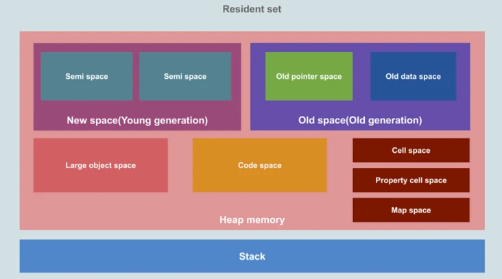
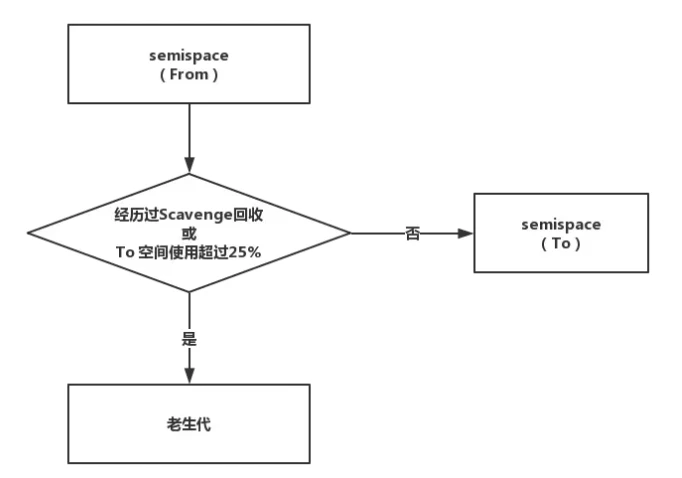
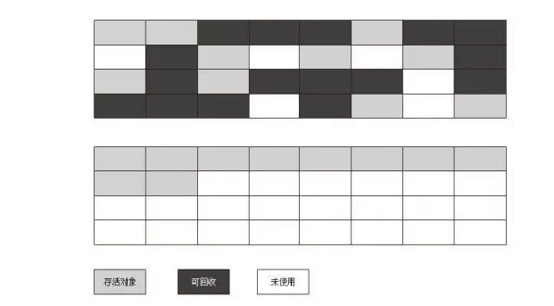
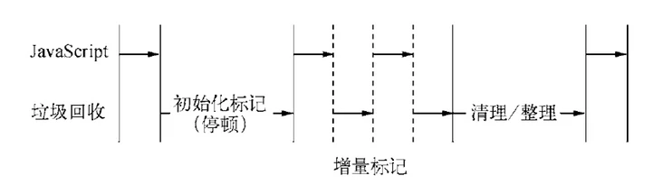

<a name="GstLU"></a>

## 内存

<a name="BTwKV"></a>

### 生命周期

- 内存分配

声明变量、函数、对象的时候，javaScript 会自动分配内存

- 内存使用

调用的时候，使用的时候

- 内存回收

javaScript 的垃圾回收机制 <a name="dh5lP"></a>

### 存储方式

- 栈内存 stack

自动分配内存空间，大小固定，会自动释放

- 堆内存 heap

动态分配内存，大小不固定，不会自动释放 <a name="EUJQP"></a>

## javaScript 的垃圾回收机制

<a name="gXogo"></a>

### 什么是 GC

GC(Garbadge Collection 垃圾回收)，在程序运行过程中会产生很多垃圾，这些垃圾可能是 **程序不用的内存** 或 **不再需要使用的内存空间**，而 GC 就是负责回收垃圾的，也就是我们常说的 **垃圾回收机制** <a name="OUB8p"></a>

### 垃圾的产生

在编写代码的过程中，声明的变量、对象往往都需要占用内存，而不同类型的数据是保存在不同的内存中的

- 基本数据类型(number、string、boolean、undefined、null、symbol、bigInt)
  :::tips
  存储在栈内存中，其特点是：大小固定、占据空间小，通过值来访问，属于被频繁使用的数据
  :::

- 引用数据类型(object、array、function)
  :::tips
  存储在堆内存中，其特点是：大小不固定、占据空间大，通过指针来访问
  ::: <a name="Fa01v"></a>

### 垃圾回收方法

在 javaScript 内存管理中有一个该概念叫做 **可达性**，表示的是以某种方式可访问或可用的值，它们被包转存储在内存中，反之不可访问则需要回收(即：定期找出不用的内存，然后释放)。 <a name="fdb9h"></a>

#### 引用计数法缺陷很多

它的核心策略是跟踪记录每个变量值被使用的次数

- 当声明了一个变量并将一个引用类型赋值给变量时，这个值的引用次数 +1
- 如果用一个值被赋给另一个变量，那么引用次数 +1
- 如果该变量的值被其它值覆盖了，那么引用次数 +1
- 当这个值的引用次数变为 0 时，说明没有变量在使用，这时会回收空间，垃圾回收器会在运行的时候清理掉引用次数为 0 的值所占用的内存 <a name="VbeS2"></a>

##### 优点

当引用次数变为 0 时，会被回收，因此可以立即回收垃圾 <a name="HPfOJ"></a>

##### 缺点

1. 需要新增一个计数器，但计数器需要占用很大的位置
2. 我们不清楚被引用数量的上限
3. 无法解决循环引用所导致的无法回收的问题，这种情况会造成内存泄漏 <a name="D7KCY"></a>

#### 标记清除法最常用

到目前为止，大多数浏览器的 javaScript 引擎都在采用标记清除法来回收内存

- 垃圾收集器在运行时会给内存中的所有变量都加上一个标记。假设内存中的所有对象都是垃圾，全部标记为 0
- 接着从各个根对象开始进行遍历，把不是垃圾的节点标记为 1
- 清理所有标记为 0 的垃圾节点，销毁并回收它们所占用的内存空间
- 最后，把所有内存中对象的标记修改为 0，等待下一轮垃圾回收 <a name="FVuwh"></a>

##### 优点

实现比较简单，标记的方式通过二进制位 0 和 1 就可以解决 <a name="f8T90"></a>

##### 缺点

1. 由于会从根对象(全局对象)开始查找，因此一些无法从根对象查询到的对象都将被清除。
2. 内存碎片化。空闲的内存块不是连续的，容易出现很多空间内存块，还可能出现分配所需内存过大的对象时无法找到连续的内存空间
3. 分配速度慢。因为即使使用 first-fit(找到>=size 的块后立即返回)的策略，其操作仍旧是一个 O(n) 的操作，最坏的情况是：每次都需要遍历到最后，同时因为碎片化，大的对象的分配效率就会变得更慢。 <a name="d8A3r"></a>

## 内存泄漏

1. 意外的全局变量
2. 未被清除的定时器、订阅内容或者回调函数
3. 不合理地使用闭包
4. 脱离 dom 的引用

```javascript
const elements = {
	image: document.querySelector('#image')
}
// 会造成内存泄漏
document.body.removeChild(document.querySelector('#image'))
// 正确的使用方式
elements.image = null 
```

<a name="CFXFP"></a>

## Nodejs v8回收机制

v8 的回收机制基于 **分代回收机制**，将内存分为：新生代(young generation) 和 老生代(tenured generation)。

- 新生代：存活时间较短的对象
- 老生代：存活时间较长或者常驻内存的变量 <a name="tJRjz"></a>

### v8 堆的构成

v8 将堆分成了几个不同的区域


- 新生代(New Space/Young Generation)：大多数新生对象被分配到这，分为两块空间，整体占据小块空间，垃圾回收的频率较高，采用的回收算法为 **Scavenge 算法**
- 老生代(Old Space/Old Generation)：大多数在新生区存活一段时间后的对象会转移至此，采用的回收算法为 **标记清除 & 整理算法(Mark-Sweep & Mark-compact，Major GC)**，内部再细分为两个空间
  - 指针空间(Old pointer space)：存储的对象含有指向其他对象的指针
  - 数据空间：存储的对象仅包含数据，无指向其他对象的指针
- 大对象空间(Large Object Space)：存储超过其他空间(Space)限制的大对象，垃圾回收器从不移动此空间中的对象
- 代码空间(Code Space)：代码对象，用于存放代码段，是**唯一拥有执行权限的内存空间**，需要注意的是：如果代码对象太大而被移入大对象空间，这个代码对象在大对象空间内也是拥有执行权限的，但不能因此说大对象空间也有执行权限
- Cell 空间、属性空间、Map 空间(Cell，Property，Map Space)：这些区域存放 Cell、属性 Cell 和 Map，每个空间因为都是存放大小相同的元素，因此内存结构很简单 <a name="nRhSZ"></a>

### Scavenge 算法

Scavenge 算法是新生代空间中的主要算法，该算法由 C.J. Cheney 在 1970 年在论文 [A nonrecursive list compacting algorithm](https://link.segmentfault.com/?enc=2MXpNEEIQ6lZda4j1X55yA%3D%3D.cQM0pgzjhMjEsvKJZuTkoYWz3TuFArSmJclq4DkPUooVgJZmvfxML2GEC8d1tr06) 提出
Scavenge 主要采用了 Cheney 算法，Cheney 算法新生代空间的堆内存分为 2 块同样大小的空间，称为 Semi space，处于使用状态的称为 From 空间，闲置的称为 To 空间。垃圾回收过程如下：

- 检查 From 空间，如果 From 空间被分配满了，则执行 Scavenge 算法进行垃圾回收
- 如果未分配满，则检查 From 空间是否有存活对象，如果如存活对象，则直接释放未存活对象的空间
- 如果存活，将检查对象是否符合晋升条件，如果符合晋升条件，则被移入老生代空间，否则将对象直接复制进 To 空间
- 完成复制后将 From 和 To 空间角色互换，然后再从第一步开始执行 <a name="LBFQx"></a>

#### 晋升条件

1. 经历过一次 Scavenge 算法
2. To 空间内存使用超过 25%

 <a name="cWPJf"></a>

### 标记清除 & 整理算法(Mark-Sweep & Mark-Compact，Major GC)算法

之前说过，标记清除策略会产生内存碎片，从而影响内存的使用，这里 标记整理算法(Mark-Compact)的出现就能很好的解决这个问题。标记整理算法是在 标记清除(Mark-Sweep)的基础上演变而来的，整理算法会将活跃的对象往边界移动，完成移动后，再清除不活跃的对象。

由于需要移动移动对象，所以在处理速度上，会慢于 Mark-Sweep <a name="ShUgB"></a>

### 全停顿(Stop The World)

为了避免应用逻辑与垃圾回收器看到的逻辑不一样，垃圾回收器在执行回收时会停止应用逻辑，执行完回收任务后，再继续执行应用逻辑，这种行为就是 **全停顿**。停顿的时间取决于不同引擎执行一次垃圾回收的时间。这种停顿对新生代空间的影响较小，但对老生代空间可能会造成停顿的现象 <a name="q8Idc"></a>

### 增量标记(Incremental Marking)

为了解决全停顿的现象，2011 年 v8 推出了增量标记。v8 将标记过程分为一个个的子标记过程，同时让垃圾回收标记和 js 应用逻辑交替进行，直至标记完成

