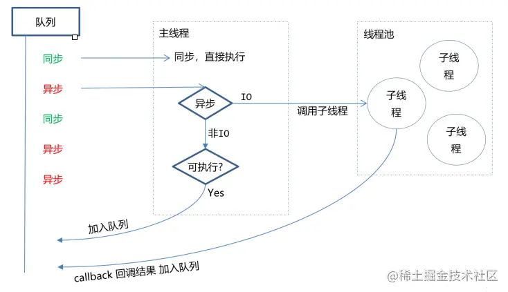
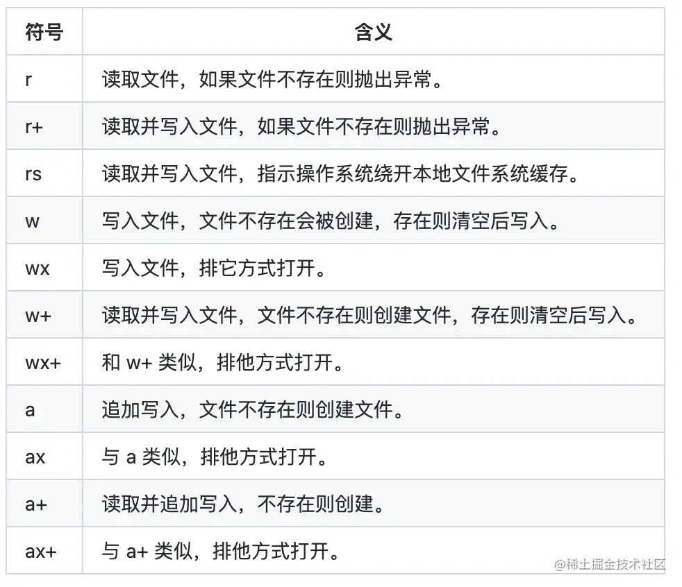
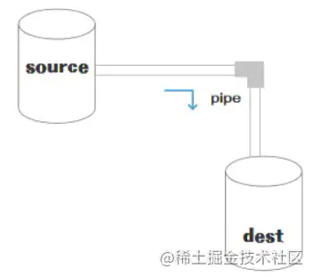
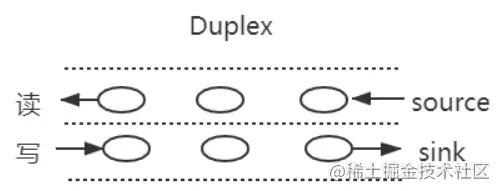
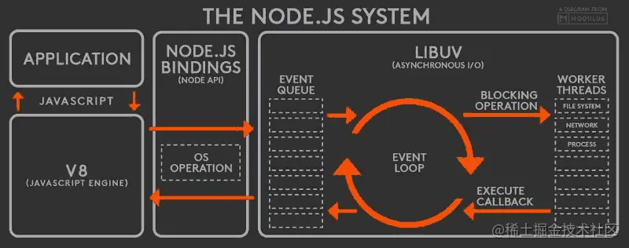
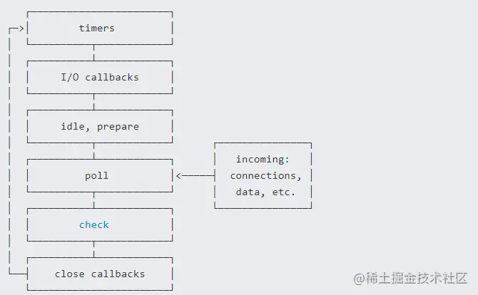
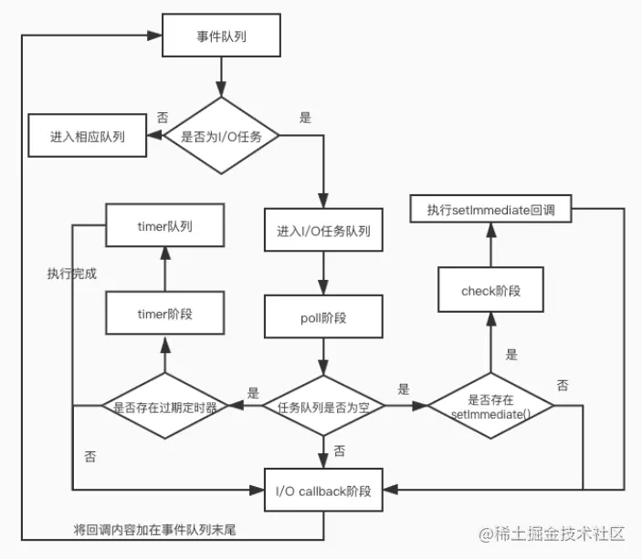
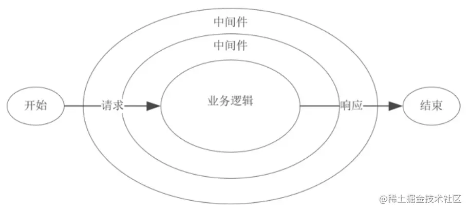
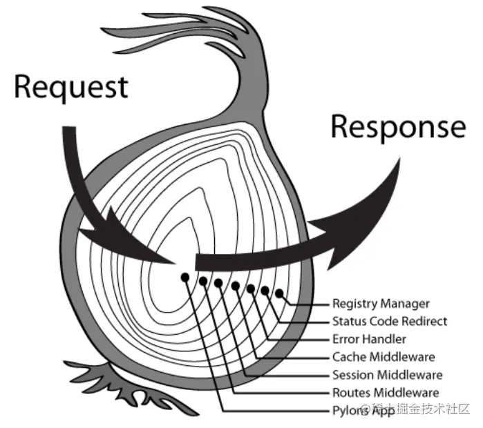

<a name="14640111"></a>

# 一、Node 基础概念

<a name="885b7fb2"></a>

## 1.1 Node 是什么

Node.js 是一个开源与跨平台的 JavaScript 运行时环境。在浏览器外运行 V8 JavaScript 引擎（Google Chrome 的内核），利用事件驱动、非阻塞和异步输入输出模型等技术提高性能。我们可以理解为：Node.js 就是一个服务器端的、非阻塞式 I/O 的、事件驱动的 JavaScript 运行环境。
理解 Node，有几个基础的概念：非阻塞异步和事件驱动。

- **非阻塞异步：** Nodejs 采用了非阻塞型 I/O 机制，在做 I/O 操作的时候不会造成任何的阻塞，当完成之后，以时间的形式通知执行操作。例如，在执行了访问数据库的代码之后，将立即转而执行其后面的代码，把数据库返回结果的处理代码放在回调函数中，从而提高了程序的执行效率。
- **事件驱动：** 事件驱动就是当进来一个新的请求的时，请求将会被压入一个事件队列中，然后通过一个循环来检测队列中的事件状态变化，如果检测到有状态变化的事件，那么就执行该事件对应的处理代码，一般都是回调函数。比如，读取一个文件，文件读取完毕后，就会触发对应的状态，然后通过对应的回调函数来进行处理。



<a name="532bae4f"></a>

## 1.2 Node 的应用场景及存在的缺点

<a name="52c34190"></a>

### 1.2.1 优缺点

Node.js 适合用于 I/O 密集型应用，值的是应用在运行极限时，CPU 占用率仍然比较低，大部分时间是在做 I/O 硬盘内存读写操作。缺点如下：

- 不适合 CPU 密集型应用
- 只支持单核 CPU，不能充分利用 CPU
- 可靠性低，一旦代码某个环节崩溃，整个系统都崩溃

对于第三点，常用的解决方案是，使用 Nnigx 反向代理，开多个进程绑定多个端口，或者开多个进程监听同一个端口。

<a name="6c69ebca"></a>

### 1.2.1 应用场景

在熟悉了 Nodejs 的优点和弊端后，我们可以看到它适合以下的应用场景：

- 善于 I/O，不善于计算。因为 Nodejs 是一个单线程，如果计算（同步）太多，则会阻塞这个线程。
- 大量并发的 I/O，应用程序内部并不需要进行非常复杂的处理。
- 与 WeSocket 配合，开发长连接的实时交互应用程序。

具体的使用场景如下：

1. 用户表单收集系统、后台管理系统、实时交互系统、考试系统、联网软件、高并发量的 web 应用程序。
2. 基于 web、canvas 等多人联网游戏。
3. 基于 web 的多人实时聊天客户端、聊天室、图文直播。
4. 单页面浏览器应用程序。
5. 操作数据库、为前端和移动端提供基于 json 的 API。

<a name="706d7949"></a>

# 二、Node 全部对象

在浏览器 JavaScript 中，window 是全局对象， 而 Nodejs 中的全局对象则是 **global**。
在 NodeJS 里，是不可能在最外层定义一个变量，因为所有的用户代码都是当前模块的，只在当前模块里可用，但可以通过 exports 对象的使用将其传递给模块外部。所以，在 NodeJS 中，用 var 声明的变量并不属于全局的变量，只在当前模块生效。像上述的 global 全局对象则在全局作用域中，任何全局变量、函数、对象都是该对象的一个属性值。

<a name="a6c8674d"></a>

## 2.1 常见全局对象

Node 常见的全局对象有如下一些：

- Class:Buffer
- process
- console
- clearInterval、setInterval
- clearTimeout、setTimeout
- global

`Class:Buffer` 可以用来处理二进制以及非 `Unicode` 编码的数据，在 `Buffer` 类实例化中存储了原始数据。`Buffer` 类似于一个整数数组，在 `V8` 堆原始存储空间给它分配了内存，一旦创建了 `Buffer` 实例，则无法改变大小。

`process` 表示进程对象，提供有关当前过程的信息和控制。包括在执行 `node` 程序的过程中，如果需要传递参数，我们想要获取这个参数需要在 `process` 内置对象中。比如，我们有如下一个文件：

```javascript
process.argv.forEach((val, index) => {
    console.log(`${index}: ${val}`)
})
```

当我们需要启动一个进程时，可以使用下面的命令：

```shell
node index.js
```

`console` 主要用来打印 `stdout` 和 `stderr`，最常用的比如日志输出：`console.log`。清空控制台的命令为：`console.clear`。如果需要打印函数的调用栈，可以使用命令 `console.trace`。

`setInterval` 用于设置定时器，语法格式如下：

```javascript
setInterval(callback, delay[, ...args])
```

`clearInterval` 则用于清除定时器，`callback` 每 `delay` 毫秒重复执行一次。

和 `setInterval` 一样，`setTimeout` 主要用于设置延时器，而 `clearTimeout` 则用于清除设置的延时器。

`global` 是一个全局命名空间对象，前面讲到的 `process`、`console`、`setTimeout` 等可以放到 `global` 中，例如：

```javascript
console.log(process === global.process) //输出 true
```

<a name="a987960b"></a>

## 2.2 模块中的全局对象

除了系统提供的全局对象外，还有一些只是在模块中出现，看起来像全局变量，如下所示：

- `__dirname`
- `__filename`
- `exports`
- `module`
- `require`

`__dirname` 主要用于获取当前文件所在的路径，不包括后面的文件名。比如，在 `/Users/mjr` 中运行 `node example.js`，打印结果如下：

```javascript
console.log(__dirname) // 打印: /Users/mjr
```

`__filename` 用于获取当前文件所在的路径和文件名称，包括后面的文件名称。比如，在 `/Users/mjr` 中运行 `node example.js`，打印的结果如下：

```javascript
console.log(__filename) // 打印: /Users/mjr/example.js
```

`module.exports` 用于导出一个指定模块所的内容，然后也可以使用 `require()` 访问里面的内容。

```javascript
exports.name = name
exports.age = age
exports.sayHello = sayHello
```

`require` 主要用于引入模块、`JSON`、或本地文件， 可以从 `node_modules` 引入模块。可以使用相对路径引入本地模块或 `JSON` 文件，路径会根据 `__dirname` 定义的目录名或当前工作目录进行处理。

<a name="7a19c723"></a>

# 三、谈谈对 process 的理解

<a name="fcea9dd2"></a>

## 3.1 基本概念

我们知道，进程计算机系统进行资源分配和调度的基本单位，是操作系统结构的基础，是线程的容器。当我们启动一个 js 文件，实际就是开启了一个服务进程，每个进程都拥有自己的独立空间地址、数据栈，像另一个进程无法访问当前进程的变量、数据结构，只有数据通信后，进程之间才可以数据共享。
process 对象是 Node 的一个全局变量，提供了有关当前 Node.js 进程的信息并对其进行控制。 由于 JavaScript 是一个单线程语言，所以通过 node xxx 启动一个文件后，只有一条主线程。

<a name="46d5f104"></a>

## 3.2 常用属性和方法

process 的常见属性如下：

- process.env：环境变量，例如通过 \`process.env.NODE\_ENV 获取不同环境项目配置信息
- process.nextTick：这个在谈及 EventLoop 时经常为会提到
- process.pid：获取当前进程 id
- process.ppid：当前进程对应的父进程
- process.cwd()：获取当前进程工作目录
- process.platform：获取当前进程运行的操作系统平台
- process.uptime()：当前进程已运行时间，例如：pm2 守护进程的 uptime 值

进程事件： process.on(‘uncaughtException’,cb) 捕获异常信息、 process.on(‘exit’,cb）进程推出监听

- 三个标准流： process.stdout 标准输出、 process.stdin 标准输入、 process.stderr 标准错误输出
- process.title：用于指定进程名称，有的时候需要给进程指定一个名称

<a name="d381b7d6"></a>

# 四、谈谈你对 fs 模块的理解

<a name="9ea26fe6"></a>

## 4.1 fs 是什么

fs（filesystem）是文件系统模块，该模块提供本地文件的读写能力，基本上是 POSIX 文件操作命令的简单包装。可以说，所有与文件的操作都是通过 fs 核心模块来实现的。
使用之前，需要先导入 fs 模块，如下：

```javascript
const fs = require("fs")
```

<a name="83aa8750"></a>

## 4.2 文件基础知识

在计算机中，有关于文件的基础知识有如下一些：

- 权限位 mode
- 标识位 flag
- 文件描述为 fd

<a name="8b15b7d7"></a>

### 4.2.1 权限位 mode

 针对文件所有者、文件所属组、其他用户进行权限分配，其中类型又分成读、写和执行，具备权限位 4、2、1，不具备权限为 0。如在 linux 查看文件权限位的命令如下：

```markdown
drwxr-xr-x 1 PandaShen 197121 0 Jun 28 14:41 core -rw-r--r-- 1 PandaShen 197121 293 Jun 23 17:44 index.md
```

在开头前十位中，d 为文件夹，-为文件，后九位就代表当前用户、用户所属组和其他用户的权限位，按每三位划分，分别代表读（r）、写（w）和执行（x），- 代表没有当前位对应的权限。

<a name="d1a14988"></a>

### 4.2.2 标识位

标识位代表着对文件的操作方式，如可读、可写、即可读又可写等等，如下表所示： 

<a name="c39a80ba"></a>

### 4.2.3 文件描述 fd

操作系统会为每个打开的文件分配一个名为文件描述符的数值标识，文件操作使用这些文件描述符来识别与追踪每个特定的文件。

Window 系统使用了一个不同但概念类似的机制来追踪资源，为方便用户，NodeJS 抽象了不同操作系统间的差异，为所有打开的文件分配了数值的文件描述符。

在 NodeJS 中，每操作一个文件，文件描述符是递增的，文件描述符一般从 3 开始，因为前面有 0、1、2 三个比较特殊的描述符，分别代表 process.stdin（标准输入）、process.stdout（标准输出）和 process.stderr（错误输出）。

<a name="dea7c041"></a>

## 4.3 常用方法

由于 fs 模块主要是操作文件的，所以常见的文件操作方法有如下一些：

- 文件读取
- 文件写入
- 文件追加写入
- 文件拷贝
- 创建目录

<a name="f0ae08e8"></a>

### 4.3.1 文件读取

常用的文件读取有 readFileSync 和 readFile 两个方法。其中，readFileSync 表示同步读取，如下：

```javascript
const fs = require("fs")
let buf = fs.readFileSync("1.txt")
let data = fs.readFileSync("1.txt", "utf8")
console.log(buf) // <Buffer 48 65 6c 6c 6f>
console.log(data) // Hello
```

- 第一个参数为读取文件的路径或文件描述符。
- 第二个参数为 options，默认值为 null，其中有 encoding（编码，默认为 null）和 flag（标识位，默认为 r），也可直接传入 encoding。

readFile 为异步读取方法， readFile 与 readFileSync 的前两个参数相同，最后一个参数为回调函数，函数内有两个参数 err（错误）和 data（数据），该方法没有返回值，回调函数在读取文件成功后执行。

```javascript
const fs = require("fs")
fs.readFile("1.txt", "utf8", (err, data) => {
    if (!err) {
        console.log(data)
        // Hello
    }
})
```

<a name="78888f32"></a>

### 4.3.2 文件写入

文件写入需要用到 writeFileSync 和 writeFile 两个方法。writeFileSync 表示同步写入，如下所示。

```javascript
const fs = require("fs")
fs.writeFileSync("2.txt", "Hello world")
let data = fs.readFileSync("2.txt", "utf8")
console.log(data) // Hello world
```

- 第一个参数为写入文件的路径或文件描述符。
- 第二个参数为写入的数据，类型为 String 或 Buffer。
- 第三个参数为 options，默认值为 null，其中有 encoding（编码，默认为 utf8）、 flag（标识位，默认为 w）和 mode（权限位，默认为 0o666），也可直接传入 encoding。

writeFile 表示异步写入，writeFile 与 writeFileSync 的前三个参数相同，最后一个参数为回调函数，函数内有一个参数 err（错误），回调函数在文件写入数据成功后执行。

```javascript
const fs = require("fs")
fs.writeFile("2.txt", "Hello world", err => {
    if (!err) {
        fs.readFile("2.txt", "utf8", (err, data) => {
            console.log(data) // Hello world
        })
    }
})
```

<a name="5b6754f5"></a>

### 4.3.3 文件追加写入

文件追加写入需要用到 appendFileSync 和 appendFile 两个方法。appendFileSync 表示同步写入，如下。

```javascript
const fs = require("fs")
fs.appendFileSync("3.txt", " world")
let data = fs.readFileSync("3.txt", "utf8")
```

- 第一个参数为写入文件的路径或文件描述符。
- 第二个参数为写入的数据，类型为 String 或 Buffer。
- 第三个参数为 options，默认值为 null，其中有 encoding（编码，默认为 utf8）、 flag（标识位，默认为 a）和 mode（权限位，默认为 0o666），也可直接传入 encoding。

appendFile 表示异步追加写入，方法 appendFile 与 appendFileSync 的前三个参数相同，最后一个参数为回调函数，函数内有一个参数 err（错误），回调函数在文件追加写入数据成功后执行，如下所示。

```javascript
const fs = require("fs")
fs.appendFile("3.txt", " world", err => {
    if (!err) {
        fs.readFile("3.txt", "utf8", (err, data) => {
            console.log(data) // Hello world
        })
    }
})
```

<a name="b936db03"></a>

### 4.3.4 创建目录

创建目录主要有 mkdirSync 和 mkdir 两个方法。其中，mkdirSync 为同步创建，参数为一个目录的路径，没有返回值，在创建目录的过程中，必须保证传入的路径前面的文件目录都存在，否则会抛出异常。

```javascript
// 假设已经有了 a 文件夹和 a 下的 b 文件夹
fs.mkdirSync("a/b/c")
```

mkdir 为异步创建，第二个参数为回调函数，如下所示。

```javascript
fs.mkdir("a/b/c", err => {
    if (!err) console.log("创建成功")
})
```

<a name="3d21eed3"></a>

# 五、谈谈你对 Stream 的理解

<a name="d4b7a6c3"></a>

## 5.1 基本概念

流（Stream）是一种数据传输的手段，是一种端到端信息交换的方式，而且是有顺序的，是逐块读取数据、处理内容，用于顺序读取输入或写入输出。在 Node 中，Stream 分成三部分：source、dest、pipe。

其中，在 source 和 dest 之间有一个连接的管道 pipe，它的基本语法是 source.pipe(dest)，source 和 dest 就是通过 pipe 连接，让数据从 source 流向 dest，如下图所示：
&#x20;

<a name="d52b149f"></a>

## 5.2 流的分类

在 Node，流可以分成四个种类：

- **可写流**：可写入数据的流，例如 fs.createWriteStream() 可以使用流将数据写入文件。
- **可读流**： 可读取数据的流，例如 fs.createReadStream() 可以从文件读取内容。
- **双工流**： 既可读又可写的流，例如 net.Socket。
- **转换流**： 可以在数据写入和读取时修改或转换数据的流。例如，在文件压缩操作中，可以向文件写入压缩数据，并从文件中读取解压数据。

在 Node 的 HTTP 服务器模块中，request 是可读流，response 是可写流。对于 fs 模块来说，能同时处理可读和可写文件流可读流和可写流都是单向的，比较容易理解。而 Socket 是双向的，可读可写。

<a name="9c010904"></a>

### 5.2.1 双工流

在 Node 中，比较的常见的全双工通信就是 websocket，因为发送方和接受方都是各自独立的方法，发送和接收都没有任何关系。  基本的使用方法如下：

```javascript
const { Duplex } = require("stream")

const myDuplex = new Duplex({
    read(size) {
        // ...
    },
    write(chunk, encoding, callback) {
        // ...
    }
})
```

<a name="513831a5"></a>

## 5.3 使用场景

流的常见使用场景有：

- get 请求返回文件给客户端
- 文件操作
- 一些打包工具的底层操作

<a name="fe9be06e"></a>

### 5.3.1 网络请求

流一个常见的使用场景就是网络请求，比如使用 stream 流返回文件，res 也是一个 stream 对象，通过 pipe 管道将文件数据返回。

```javascript
const server = http.createServer(function (req, res) {
    const method = req.method
    // get 请求
    if (method === "GET") {
        const fileName = path.resolve(__dirname, "data.txt")
        let stream = fs.createReadStream(fileName)
        stream.pipe(res)
    }
})
server.listen(8080)
```

<a name="e4795cb4"></a>

### 5.3.2 文件操作

文件的读取也是流操作，创建一个可读数据流 readStream，一个可写数据流 writeStream，通过 pipe 管道把数据流转过去。

```javascript
const fs = require("fs")
const path = require("path")

// 两个文件名
const fileName1 = path.resolve(__dirname, "data.txt")
const fileName2 = path.resolve(__dirname, "data-bak.txt")
// 读取文件的 stream 对象
const readStream = fs.createReadStream(fileName1)
// 写入文件的 stream 对象
const writeStream = fs.createWriteStream(fileName2)
// 通过 pipe执行拷贝，数据流转
readStream.pipe(writeStream)
// 数据读取完成监听，即拷贝完成
readStream.on("end", function () {
    console.log("拷贝完成")
})
```

另外，一些打包工具，Webpack 和 Vite 等都涉及很多流的操作。

<a name="7dea4013"></a>

# 六、事件循环机制

<a name="31308610"></a>

## 6.1 什么是浏览器事件循环

Node.js 在主线程里维护了一个事件队列，当接到请求后，就将该请求作为一个事件放入这个队列中，然后继续接收其他请求。当主线程空闲时(没有请求接入时)，就开始循环事件队列，检查队列中是否有要处理的事件，这时要分两种情况：如果是非 I/O 任务，就亲自处理，并通过回调函数返回到上层调用；如果是 I/O 任务，就从 线程池 中拿出一个线程来处理这个事件，并指定回调函数，然后继续循环队列中的其他事件。

当线程中的 I/O 任务完成以后，就执行指定的回调函数，并把这个完成的事件放到事件队列的尾部，等待事件循环，当主线程再次循环到该事件时，就直接处理并返回给上层调用。 这个过程就叫 事件循环 (Event Loop)，其运行原理如下图所示。
 从左到右，从上到下，Node.js 被分为了四层，分别是 应用层、V8 引擎层、Node API 层 和 LIBUV 层。

- **应用层**： 即 JavaScript 交互层，常见的就是 Node.js 的模块，比如 http，fs
- **V8 引擎层**： 即利用 V8 引擎来解析 JavaScript 语法，进而和下层 API 交互
- **Node API 层**： 为上层模块提供系统调用，一般是由 C 语言来实现，和操作系统进行交互 。
- **LIBUV 层**： 是跨平台的底层封装，实现了 事件循环、文件操作等，是 Node.js 实现异步的核心 。

在 Node 中，我们所说的事件循环是基于 libuv 实现的，libuv 是一个多平台的专注于异步 IO 的库。上图的 EVENT\_QUEUE 给人看起来只有一个队列，但事实上 EventLoop 存在 6 个阶段，每个阶段都有对应的一个先进先出的回调队列。

<a name="fd2efd28"></a>

## 6.2 事件循环的六个阶段

事件循环一共可以分成了六个阶段，如下图所示。 

- timers 阶段：此阶段主要执行 timer（setTimeout、setInterval）的回调。
- I/O 事件回调阶段(I/O callbacks)：执行延迟到下一个循环迭代的 I/O 回调，即上一轮循环中未被执行的一些 I/O 回调。
- 闲置阶段(idle、prepare)：仅系统内部使用。
- 轮询阶段(poll)：检索新的 I/O 事件;执行与 I/O 相关的回调（几乎所有情况下，除了关闭的回调函数，那些由计时器和 setImmediate() 调度的之外），其余情况 node 将在适当的时候在此阻塞。
- 检查阶段(check)：setImmediate() 回调函数在这里执行
- 关闭事件回调阶段(close callback)：一些关闭的回调函数，如：socket.on('close', ...)

每个阶段对应一个队列，当事件循环进入某个阶段时, 将会在该阶段内执行回调，直到队列耗尽或者回调的最大数量已执行, 那么将进入下一个处理阶段，如下图所示。 

<a name="50dfc512"></a>

# 七、EventEmitter

<a name="9729e412"></a>

## 7.1 基本概念

前文说过，Node 采用了事件驱动机制，而 EventEmitter 就是 Node 实现事件驱动的基础。在 EventEmitter 的基础上，Node 几乎所有的模块都继承了这个类，这些模块拥有了自己的事件，可以绑定、触发监听器，实现了异步操作。

Node.js 里面的许多对象都会分发事件，比如 fs.readStream 对象会在文件被打开的时候触发一个事件，这些产生事件的对象都是 events.EventEmitter 的实例，用于将一个或多个函数绑定到命名事件上。

<a name="80390061"></a>

## 7.2 基本使用

Node 的 events 模块只提供了一个 EventEmitter 类，这个类实现了 Node 异步事件驱动架构的基本模式：观察者模式。

在这种模式中，被观察者(主体)维护着一组其他对象派来(注册)的观察者，有新的对象对主体感兴趣就注册观察者，不感兴趣就取消订阅，主体有更新会依次通知观察者，使用方式如下。

```javascript
const EventEmitter = require("events")

class MyEmitter extends EventEmitter {}
const myEmitter = new MyEmitter()

function callback() {
    console.log("触发了event事件！")
}
myEmitter.on("event", callback)
myEmitter.emit("event")
myEmitter.removeListener("event", callback)
```

在上面的代码中，我们通过实例对象的 on 方法注册一个名为 event 的事件，通过 emit 方法触发该事件，而 removeListener 用于取消事件的监听。
除了上面介绍的一些方法外，其他常用的方法还有如下一些：

- emitter.addListener/on(eventName, listener) ：添加类型为 eventName 的监听事件到事件数组尾部。
- emitter.prependListener(eventName, listener)：添加类型为 eventName 的监听事件到事件数组头部。
- emitter.emit(eventName\[, ...args])：触发类型为 eventName 的监听事件。
- emitter.removeListener/off(eventName, listener)：移除类型为 eventName 的监听事件。
- emitter.once(eventName, listener)：添加类型为 eventName 的监听事件，以后只能执行一次并删除。
- emitter.removeAllListeners(\[eventName])： 移除全部类型为 eventName 的监听事件。

<a name="a25f2215"></a>

## 7.3 实现原理

EventEmitter 其实是一个构造函数，内部存在一个包含所有事件的对象。

```javascript
class EventEmitter {
    constructor() {
        this.events = {}
    }
}
```

其中，events 存放的监听事件的函数的结构如下：

```javascript
{
  "event1": [f1,f2,f3]，
  "event2": [f4,f5]，
  ...
}
```

然后，开始一步步实现实例方法，首先是 emit，第一个参数为事件的类型，第二个参数开始为触发事件函数的参数，实现如下：

```javascript
emit(type, ...args) {
    this.events[type].forEach((item) => {
        Reflect.apply(item, this, args);
    });
}
```

实现了 emit 方法之后，然后依次实现 on、addListener、prependListener 这三个实例方法，它们都是添加事件监听触发函数的。

```javascript
on(type, handler) {
    if (!this.events[type]) {
        this.events[type] = []
    }
    this.events[type].push(handler);
}

addListener(type,handler){
    this.on(type,handler)
}

prependListener(type, handler) {
    if (!this.events[type]) {
        this.events[type] = []
    }
    this.events[type].unshift(handler)
}
```

实现 once 方法， 再传入事件监听处理函数的时候进行封装，利用闭包的特性维护当前状态，通过 fired 属性值判断事件函数是否执行过。

```javascript
removeListener(type, handler) {
    if (!this.events[type]) {
        return
    }
    this.events[type] = this.events[type].filter(item => item !== handler)
}

off(type,handler){
    this.removeListener(type,handler)
}
```

下面是完成的测试代码：

```javascript
class EventEmitter {
    constructor() {
        this.events = {}
    }

    on(type, handler) {
        if (!this.events[type]) {
            this.events[type] = []
        }
        this.events[type].push(handler)
    }

    addListener(type, handler) {
        this.on(type, handler)
    }

    prependListener(type, handler) {
        if (!this.events[type]) {
            this.events[type] = []
        }
        this.events[type].unshift(handler)
    }

    removeListener(type, handler) {
        if (!this.events[type]) {
            return
        }
        this.events[type] = this.events[type].filter(item => item !== handler)
    }

    off(type, handler) {
        this.removeListener(type, handler)
    }

    emit(type, ...args) {
        this.events[type].forEach(item => {
            Reflect.apply(item, this, args)
        })
    }

    once(type, handler) {
        this.on(type, this._onceWrap(type, handler, this))
    }

    _onceWrap(type, handler, target) {
        const state = { fired: false, handler, type, target }
        const wrapFn = this._onceWrapper.bind(state)
        state.wrapFn = wrapFn
        return wrapFn
    }

    _onceWrapper(...args) {
        if (!this.fired) {
            this.fired = true
            Reflect.apply(this.handler, this.target, args)
            this.target.off(this.type, this.wrapFn)
        }
    }
}
```

<a name="097f5f61"></a>

# 八、中间件

<a name="54ec71ce"></a>

## 8.1 基本概念

中间件（Middleware）是介于应用系统和系统软件之间的一类软件，它使用系统软件所提供的基础服务（功能），衔接网络上应用系统的各个部分或不同的应用，能够达到资源共享、功能共享的目的。 在 Node 中，中间件主要是指封装 http 请求细节处理的方法。例如，在 express、koa 等 web 框架中，中间件的本质为一个回调函数，参数包含请求对象、响应对象和执行下一个中间件的函数，架构示意图如下。

通常，在这些中间件函数中，我们可以执行业务逻辑代码，修改请求和响应对象、返回响应数据等操作。

<a name="7c87a55a"></a>

## 8.2 koa

Koa 是基于 Node 当前比较流行的 web 框架，本身支持的功能并不多，功能都可以通过中间件拓展实现。 Koa 并没有捆绑任何中间件， 而是提供了一套优雅的方法，帮助开发者快速而愉快地编写服务端应用程序。 
Koa 中间件采用的是洋葱圈模型，每次执行下一个中间件都传入两个参数：

- ctx ：封装了 request 和 response 的变量
- next ：进入下一个要执行的中间件的函数

通过前面的介绍，我们知道了 Koa 中间件本质上就是一个函数，可以是 async 函数，也可以是普通函数。下面就针对 koa 进行中间件的封装：

```javascript
// async 函数
app.use(async (ctx, next) => {
    const start = Date.now()
    await next()
    const ms = Date.now() - start
    console.log(`${ctx.method} ${ctx.url} - ${ms}ms`)
})

// 普通函数
app.use((ctx, next) => {
    const start = Date.now()
    return next().then(() => {
        const ms = Date.now() - start
        console.log(`${ctx.method} ${ctx.url} - ${ms}ms`)
    })
})
```

当然，我们还可以通过中间件封装 http 请求过程中几个常用的功能：

**token 校验**

```javascript
module.exports = (options) => async (ctx, next) {
  try {
    // 获取 token
    const token = ctx.header.authorization
    if (token) {
      try {
          // verify 函数验证 token，并获取用户相关信息
          await verify(token)
      } catch (err) {
        console.log(err)
      }
    }
    // 进入下一个中间件
    await next()
  } catch (err) {
    console.log(err)
  }
}
```

**日志模块**

```javascript
const fs = require("fs")
module.exports = options => async (ctx, next) => {
    const startTime = Date.now()
    const requestTime = new Date()
    await next()
    const ms = Date.now() - startTime
    let logout = `${ctx.request.ip} -- ${requestTime} -- ${ctx.method} -- ${ctx.url} -- ${ms}ms`
    // 输出日志文件
    fs.appendFileSync("./log.txt", logout + "\n")
}
```

Koa 存在很多第三方的中间件，如 koa-bodyparser、koa-static 等。

<a name="9edbeff9"></a>

## 8.3 Koa 中间件

**koa-bodyparser** koa-bodyparser 中间件是将我们的 post 请求和表单提交的查询字符串转换成对象，并挂在 ctx.request.body 上，方便我们在其他中间件或接口处取值。

```javascript
// 文件：my-koa-bodyparser.js
const querystring = require("querystring")

module.exports = function bodyParser() {
    return async (ctx, next) => {
        await new Promise((resolve, reject) => {
            // 存储数据的数组
            let dataArr = []

            // 接收数据
            ctx.req.on("data", data => dataArr.push(data))

            // 整合数据并使用 Promise 成功
            ctx.req.on("end", () => {
                // 获取请求数据的类型 json 或表单
                let contentType = ctx.get("Content-Type")

                // 获取数据 Buffer 格式
                let data = Buffer.concat(dataArr).toString()

                if (contentType === "application/x-www-form-urlencoded") {
                    // 如果是表单提交，则将查询字符串转换成对象赋值给 ctx.request.body
                    ctx.request.body = querystring.parse(data)
                } else if (contentType === "applaction/json") {
                    // 如果是 json，则将字符串格式的对象转换成对象赋值给 ctx.request.body
                    ctx.request.body = JSON.parse(data)
                }

                // 执行成功的回调
                resolve()
            })
        })

        // 继续向下执行
        await next()
    }
}
```

**koa-static** koa-static 中间件的作用是在服务器接到请求时，帮我们处理静态文件，比如。

```javascript
const fs = require("fs")
const path = require("path")
const mime = require("mime")
const { promisify } = require("util")

// 将 stat 和 access 转换成 Promise
const stat = promisify(fs.stat)
const access = promisify(fs.access)

module.exports = function (dir) {
    return async (ctx, next) => {
        // 将访问的路由处理成绝对路径，这里要使用 join 因为有可能是 /
        let realPath = path.join(dir, ctx.path)

        try {
            // 获取 stat 对象
            let statObj = await stat(realPath)

            // 如果是文件，则设置文件类型并直接响应内容，否则当作文件夹寻找 index.html
            if (statObj.isFile()) {
                ctx.set("Content-Type", `${mime.getType()};charset=utf8`)
                ctx.body = fs.createReadStream(realPath)
            } else {
                let filename = path.join(realPath, "index.html")

                // 如果不存在该文件则执行 catch 中的 next 交给其他中间件处理
                await access(filename)

                // 存在设置文件类型并响应内容
                ctx.set("Content-Type", "text/html;charset=utf8")
                ctx.body = fs.createReadStream(filename)
            }
        } catch (e) {
            await next()
        }
    }
}
```

总的来说，在实现中间件时候，单个中间件应该足够简单，职责单一，中间件的代码编写应该高效，必要的时候通过缓存重复获取数据。

<a name="480ee596"></a>

# 九、如何设计并实现 JWT 鉴权

<a name="7d9bbac5"></a>

## 9.1 JWT 是什么

JWT（JSON Web Token），本质就是一个字符串书写规范，作用是用来在用户和服务器之间传递安全可靠的，如下图。


在目前前后端分离的开发过程中，使用 token 鉴权机制用于身份验证是最常见的方案，流程如下：

- 服务器当验证用户账号和密码正确的时候，给用户颁发一个令牌，这个令牌作为后续用户访问一些接口的凭证。
- 后续访问会根据这个令牌判断用户时候有权限进行访问。

Token，分成了三部分，头部（Header）、载荷（Payload）、签名（Signature），并以.进行拼接。其中头部和载荷都是以 JSON 格式存放数据，只是进行了编码，示意图如下。 

<a name="bf7e3d7b"></a>

### 9.1.1 header

每个 JWT 都会带有头部信息，这里主要声明使用的算法。声明算法的字段名为 alg，同时还有一个 typ 的字段，默认 JWT 即可。以下示例中算法为 HS256：

```json
{ "alg": "HS256", "typ": "JWT" }
```

因为 JWT 是字符串，所以我们还需要对以上内容进行 Base64 编码，编码后字符串如下：

```json
{ "alg": "HS256", "typ": "JWT" }
```

<a name="74a378af"></a>

### 9.1.2 payload

载荷即消息体，这里会存放实际的内容，也就是 Token 的数据声明，例如用户的 id 和 name，默认情况下也会携带令牌的签发时间 iat，通过还可以设置过期时间，如下：

```json
{
    "sub": "1234567890",
    "name": "John Doe",
    "iat": 1516239022
}
```

同样进行 Base64 编码后，字符串如下：

```javascript
eyJzdWIiOiIxMjM0NTY3ODkwIiwibmFtZSI6IkpvaG4gRG9lIiwiaWF0IjoxNTE2MjM5MDIyfQ
```

<a name="7c0a4684"></a>

### 9.1.3 Signature

签名是对头部和载荷内容进行签名，一般情况，设置一个 secretKey，对前两个的结果进行 HMACSHA25 算法，公式如下：

```javascript
Signature = HMACSHA256(base64Url(header)+.+base64Url(payload),secretKey)
```

因此，就算前面两部分数据被篡改，只要服务器加密用的密钥没有泄露，得到的签名肯定和之前的签名也是不一致的。

<a name="fc688326"></a>

## 9.2 设计实现

通常，Token 的使用分成了两部分：生成 token 和校验 token。

- **生成 token**：登录成功的时候，颁发 token。
- **验证 token**：访问某些资源或者接口时，验证 token。

<a name="b311b79d"></a>

### 9.2.1 生成 token

借助第三方库 jsonwebtoken，通过 jsonwebtoken 的 sign 方法生成一个 token。sign 有三个参数：

- 第一个参数指的是 Payload。
- 第二个是秘钥，服务端特有。
- 第三个参数是 option，可以定义 token 过期时间。

下面是一个前端生成 token 的例子：

```javascript
const crypto = require("crypto"),
    jwt = require("jsonwebtoken")
// TODO:使用数据库
// 这里应该是用数据库存储，这里只是演示用
let userList = []

class UserController {
    // 用户登录
    static async login(ctx) {
        const data = ctx.request.body
        if (!data.name || !data.password) {
            return (ctx.body = {
                code: "000002",
                message: "参数不合法"
            })
        }
        const result = userList.find(
            item => item.name === data.name && item.password === crypto.createHash("md5").update(data.password).digest("hex")
        )
        if (result) {
            // 生成token
            const token = jwt.sign(
                {
                    name: result.name
                },
                "test_token", // secret
                { expiresIn: 60 * 60 } // 过期时间：60 * 60 s
            )
            return (ctx.body = {
                code: "0",
                message: "登录成功",
                data: {
                    token
                }
            })
        } else {
            return (ctx.body = {
                code: "000002",
                message: "用户名或密码错误"
            })
        }
    }
}

module.exports = UserController
```

<a name="6bcae3ff"></a>

### 9.2.2 校验 token

首先，我们需要使用 koa-jwt 中间件进行验证，方式比较简单，在路由跳转前校验即可，如下。

```javascript
app.use(
    koajwt({
        secret: "test_token"
    }).unless({
        // 配置白名单
        path: [/\/api\/register/, /\/api\/login/]
    })
)
```

使用 koa-jwt 中间件进行校验时，需要注意以下几点：

- secret 必须和 sign 时候保持一致。
- 可以通过 unless 配置接口白名单，也就是哪些 URL 可以不用经过校验，像登陆/注册都可以不用校验。
- 校验的中间件需要放在需要校验的路由前面，无法对前面的 URL 进行校验。

获取用户 token 信息的方法如下：

```javascript
router.get('/api/userInfo',async (ctx,next) => {
 const authorization =  ctx.header.authorization // 获取jwt
 const token = authorization.replace('Beraer ','')
 const result = jwt.verify(token,'test_token')
 ctx.body = result
}
```

**注意**：上述的 HMA256 加密算法为单秘钥的形式，一旦泄露后果非常的危险。

在分布式系统中，每个子系统都要获取到秘钥，那么这个子系统根据该秘钥可以发布和验证令牌，但有些服务器只需要验证令牌。这时候可以采用非对称加密，利用私钥发布令牌，公钥验证令牌，加密算法可以选择 RS256 等非对称算法。
Ï
除此之外，JWT 鉴权还需要注意以下几点：

- payload 部分仅仅是进行简单编码，所以只能用于存储逻辑必需的非敏感信息。
- 需要保护好加密密钥，一旦泄露后果不堪设想。
- 为避免 token 被劫持，最好使用 https 协议。

<a name="15496b07"></a>

# 十、Node 性能监控与优化

<a name="d54e2d41"></a>

## 10.1 Node 优化点

Node 作为一门服务端语言，性能方面尤为重要，其衡量指标一般有如下几点：

- CPU
- 内存
- I/O
- 网络

<a name="20eb2623"></a>

### 10.1.1 CPU

对于 CPU 的指标，主要关注如下两点：

- **CPU 负载**：在某个时间段内，占用以及等待 CPU 的进程总数。
- **CPU 使用率**：CPU 时间占用状况，等于 1 - 空闲 CPU 时间(idle time) / CPU 总时间。

这两个指标都是用来评估系统当前 CPU 的繁忙程度的量化指标。Node 应用一般不会消耗很多的 CPU，如果 CPU 占用率高，则表明应用存在很多同步操作，导致异步任务回调被阻塞。

<a name="f7c41a62"></a>

### 10.1.2 内存指标

内存是一个非常容易量化的指标。 内存占用率是评判一个系统的内存瓶颈的常见指标。 对于 Node 来说，内部内存堆栈的使用状态也是一个可以量化的指标，可以使用下面的代码来获取内存的相关数据：

```javascript
// /app/lib/memory.js
const os = require("os")
// 获取当前Node内存堆栈情况
const { rss, heapUsed, heapTotal } = process.memoryUsage()
// 获取系统空闲内存
const sysFree = os.freemem()
// 获取系统总内存
const sysTotal = os.totalmem()

module.exports = {
    memory: () => {
        return {
            sys: 1 - sysFree / sysTotal, // 系统内存占用率
            heap: heapUsed / headTotal, // Node堆内存占用率
            node: rss / sysTotal // Node占用系统内存的比例
        }
    }
}
```

- rss：表示 node 进程占用的内存总量。
- heapTotal：表示堆内存的总量。
- heapUsed：实际堆内存的使用量。
- external ：外部程序的内存使用量，包含 Node 核心的 C++程序的内存使用量。

在 Node 中，一个进程的最大内存容量为 1.5GB，因此在实际使用时请合理控制内存的使用。

<a name="ab218129"></a>

### 10.13 磁盘 I/O

硬盘的 IO 开销是非常昂贵的，硬盘 IO 花费的 CPU 时钟周期是内存的 164000 倍。内存 IO 比磁盘 IO 快非常多，所以使用内存缓存数据是有效的优化方法。常用的工具如 redis、memcached 等。

并且，并不是所有数据都需要缓存，访问频率高，生成代价比较高的才考虑是否缓存，也就是说影响你性能瓶颈的考虑去缓存，并且而且缓存还有缓存雪崩、缓存穿透等问题要解决。

<a name="11a4576d"></a>

## 10.2 如何监控

关于性能方面的监控，一般情况都需要借助工具来实现，比如 Easy-Monitor、阿里 Node 性能平台等。
这里采用 Easy-Monitor 2.0，其是轻量级的 Node.js 项目内核性能监控 + 分析工具，在默认模式下，只需要在项目入口文件 require 一次，无需改动任何业务代码即可开启内核级别的性能监控分析。

```javascript
const easyMonitor = require("easy-monitor")
easyMonitor("项目名称")
```

打开你的浏览器，访问 [http://localhost:12333](https://link.juejin.cn?target=http%3A%2F%2Flocalhost%3A12333) ，即可看到进程界面，更详细的内容请参考[官网](https://link.juejin.cn?target=https%3A%2F%2Fwww.npmjs.com%2Fpackage%2Feasy-monitor)

<a name="959cf5c2"></a>

## 10.3 Node 性能优化

关于 Node 的性能优化的方式有如下几个：

- 使用最新版本 Node.js
- 正确使用流 Stream
- 代码层面优化
- 内存管理优化

<a name="04ddb6f6"></a>

### 10.3.1 使用最新版本 Node.js

每个版本的性能提升主要来自于两个方面：

- V8 的版本更新
- Node.js 内部代码的更新优化

<a name="8888e1ce"></a>

### 10.3.2 正确使用流

在 Node 中，很多对象都实现了流，对于一个大文件可以通过流的形式发送，不需要将其完全读入内存。

```javascript
const http = require("http")
const fs = require("fs")

// 错误方式
http.createServer(function (req, res) {
    fs.readFile(__dirname + "/data.txt", function (err, data) {
        res.end(data)
    })
})

// 正确方式
http.createServer(function (req, res) {
    const stream = fs.createReadStream(__dirname + "/data.txt")
    stream.pipe(res)
})
```

<a name="7d90ae5d"></a>

### 10.3.3 代码层面优化

合并查询，将多次查询合并一次，减少数据库的查询次数。

```javascript
// 错误方式
for user_id in userIds
     let account = user_account.findOne(user_id)

// 正确方式
const user_account_map = {}
 // 注意这个对象将会消耗大量内存。
user_account.find(user_id in user_ids).forEach(account){
    user_account_map[account.user_id] =  account
}
for user_id in userIds
    var account = user_account_map[user_id]
```

<a name="b7d743b1"></a>

### 10.3.4 内存管理优化

在 V8 中，主要将内存分为新生代和老生代两代：

- **新生代**：对象的存活时间较短。新生对象或只经过一次垃圾回收的对象。
- **老生代**：对象存活时间较长。经历过一次或多次垃圾回收的对象。

若新生代内存空间不够，直接分配到老生代。通过减少内存占用，可以提高服务器的性能。如果有内存泄露，也会导致大量的对象存储到老生代中，服务器性能会大大降低，比如下面的例子。

```javascript
const buffer = fs.readFileSync(__dirname + "/source/index.htm")

app.use(
    mount("/", async ctx => {
        ctx.status = 200
        ctx.type = "html"
        ctx.body = buffer
        leak.push(fs.readFileSync(__dirname + "/source/index.htm"))
    })
)

const leak = []
```

当 leak 的内存非常大的时候，就有可能造成内存泄露，应当避免这样的操作。

减少内存使用，可以明显的提高服务性能。而节省内存最好的方式是使用池，其将频用、可复用对象存储起来，减少创建和销毁操作。例如有个图片请求接口，每次请求，都需要用到类。若每次都需要重新 new 这些类，并不是很合适，在大量请求时，频繁创建和销毁这些类，造成内存抖动。而使用对象池的机制，对这种频繁需要创建和销毁的对象保存在一个对象池中，从而避免重读的初始化操作，从而提高框架的性能。
