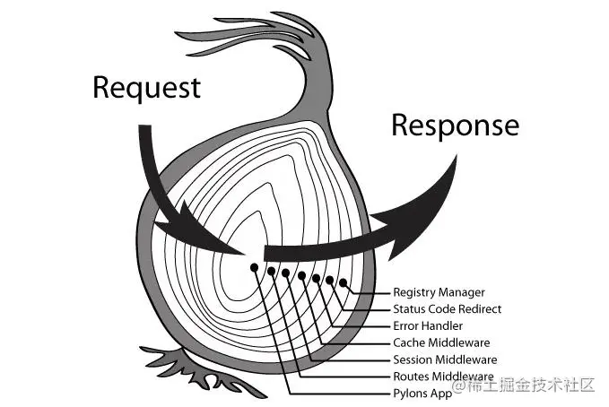

<a name="OXAlW"></a>

### Logger 功能

`Koa` 的最大特色，也是最重要的一个设计，就是中间件（`middleware`）。为了理解中间件，我们先看一下 `Logger` （打印日志）功能的实现 <a name="RMmPQ"></a>

### 中间件的概念

"中间件"（`middleware`），它处在 `HTTP Request` 和 `HTTP Response` 中间，用来实现某种中间功能。`app.use()`用来加载中间件

- 基本上，`Koa` 所有的功能都是通过中间件实现的

- 每个中间件默认接受两个参数，第一个参数是 `Context` 对象，第二个参数是 `next` 函数。只要调用 `next` 函数，就可以把执行权转交给下一个中间件
  :::info
  `express` 和 `koa` 中间件的区别：

- 相同点：
  - 在两种框架中，中间件的执行顺序都是**自上而下**的

- 不同点：
  - 执行顺序上：
    - `Express` 中间件链是基于回调的
    - `Koa` 是基于 `Promise` 的
  - 模型上：
    - `Express` 是线性模型
    - `Koa` 是洋葱圈模型
      :::
       <a name="PjewG"></a>

### 中间件栈

多个中间件会形成一个**栈结构**（`middle stack`），以"先进后出"（`first-in-last-out`）的顺序执行

- 最外层的中间件首先执行。
- 调用 `next` 函数，把执行权交给下一个中间件。
- ...
- 最内层的中间件最后执行。
- 执行结束后，把执行权交回上一层的中间件。
- ...
- 最外层的中间件收回执行权之后，执行 `next` 函数后面的代码

```javascript
const Koa = require('koa');
const app = new Koa();

const one = (ctx, next) => {
  console.log('>> one');
  next();
  console.log('<< one');
}

const two = (ctx, next) => {
  console.log('>> two');
  next();
  console.log('<< two');
}

const three = (ctx, next) => {
  console.log('>> three');
  next();
  console.log('<< three');
}

app.use(one);
app.use(two);
app.use(three);

app.listen(3000);
```

```javascript
>> one
>> two
>> three
<< three
<< two
<< one
```

<a name="SGbqc"></a>

### koa-compose

```javascript
// 完整版
function compose (middleware) {
  // 判断参数是否合法，middleware 要求为数组且其中每个数组元素都为 function
  if (!Array.isArray(middleware)) throw new TypeError('Middleware stack must be an array!')
  for (const fn of middleware) {
    if (typeof fn !== 'function') throw new TypeError('Middleware must be composed of functions!')
  }
  
  /**
  * @param {Object} context
  * @return {Promise}
  * @api public
  */
  
  return function (context, next) {
    // last called middleware #
    let index = -1
    // 递归返回一个函数 该函数返回一个 Promise 的对象
    return dispatch(0)
    function dispatch (i) {
      // 当 next 方法被多次调用时会出现
      if (i <= index) return Promise.reject(new Error('next() called multiple times'))
      index = i
      let fn = middleware[i]
      // 最后一个中间件
      if (i === middleware.length) fn = next
      if (!fn) return Promise.resolve()
      // Promise 封装中间件 进行递归调用
      try {
        return Promise.resolve(fn(context, dispatch.bind(null, i + 1)));
      } catch (err) {
        return Promise.reject(err)
      }
    }
  }
}
```

```javascript
// 简化版
function compose(middleware) {
  return function(context, next) {
    let index = -1
    return dispatch(0)
    function dispatch(i) {
      index = i
      const fn = middleware[i] || next
      if (!fn) return Promise.resolve()
      return Promise.resolve(fn(context, function next() {
        return dispatch(i + 1)
      }))
    }
  }
}
```
