<a name="QUvSI"></a>

## 以Vite为代表的前端构建工具进入加速赛道

ESM 大势所趋，势如破竹，由于 ESM 的普及，而带来的打包工具的革命以及适用于 ESM 下一代 CDN 的发展，业务项目在生产环境开始使用原生的 ESM 代替以前的 Bundle方案，从而导致开发体验及网站速度的大幅提升。
核心代码：

```javascript
<script type="module">
  import lodash from 'https://cdn.skypack.dev/lodash';
</script>
```

还记得我在20年的时候，就吐槽构建速度问题，严重影响我们开发的效率。

其中凭借ESM成长最快的构建框架Vite，一种全新的前端构建工具。你可以把它理解为一个开箱即用的开发服务器 + 打包工具的组合，但是更轻更快。出自尤大之手，目前npm月下载量超过130万次。
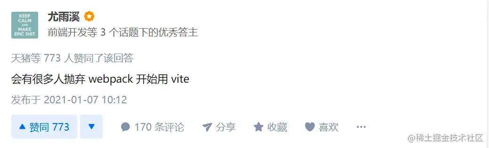 <a name="iHyc4"></a>

### 核心原理

- 开发环境下，模块以原生 esm 的形式被浏览器加载。
- 生产环境下，模块被 Rollup 以传统方式打包，而且做了很多默认优化。
- 开发和生产环境下共享同一套 Rollup 插件机制，所以单个模块的编译在开发和生产环境下是一致的。

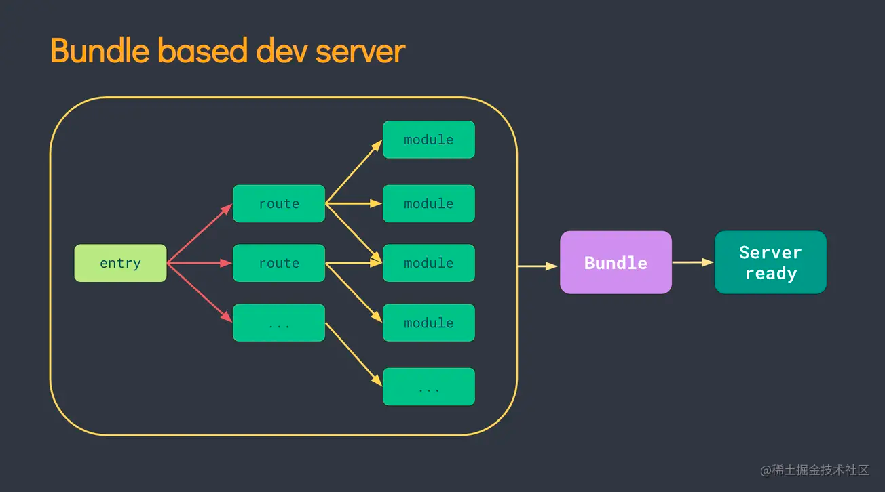
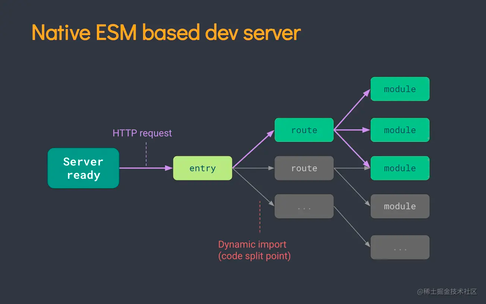 <a name="Rlgis"></a>

### 框架优势

- 快，极速，使用原生ESM文件
- 超快的HMR(热重载)
- Rollup 插件机制
- 天然优先支持Vue3
- .....你来体验挖掘 <a name="qT82n"></a>

### 丰富的生态

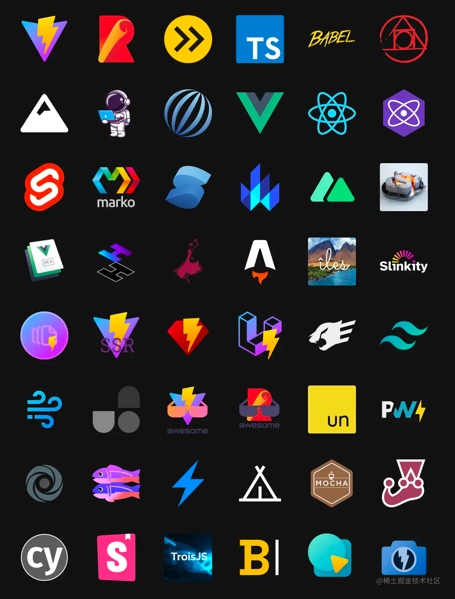
更多构建工具介绍：[css-tricks.com/comparing-t…](https://link.juejin.cn?target=https%3A%2F%2Fcss-tricks.com%2Fcomparing-the-new-generation-of-build-tools%2F) <a name="rcWmI"></a>

## 以Vue3+Ts+Vite+Pinia组合的高效开发套件

上面已提到Vite基于Ts语法，并且对Vue3天然的支持，加上尤大主推的[Pinia](https://link.juejin.cn?target=https%3A%2F%2Fpinia.vuejs.org%2F)作为vuex的最佳替代品。此套组合或成为22年Vue开发的最佳选择。我建个了[Vue3+Vite+Pinia的基础模板](https://link.juejin.cn?target=https%3A%2F%2Fgithub.com%2FMaleWeb%2Fvue3-vite-ts) 供大家参考，后续也会加入一些工具包(自封装的)。这里只是基础，根据自己项目需求可以增加 Volar / Vue Router / Vue Devtools / [VueUse](https://link.juejin.cn?target=https%3A%2F%2Fvueuse.org%2F) / Element Plus / NutUI等。
我们团队是在21年3月份就开始使用Vue3开发项目了，也是第一批使用vite构建项目的。无线端业务最高峰值PV30万+，整体项目运行稳定，比较多的还是安卓端兼容问题(历史问题了)。此套组合整体的优势：

- 面向未来技术栈，不需要维护复杂的依赖升级问题
- 拥抱更多新特性，类似SFC等
- 提高构建效率-翻倍的
- ..... <a name="JsodD"></a>

### 工具包分享

另外分享一下我们团队使用的技术包，可以大大团队提升研发效率

- [pnpm](https://link.juejin.cn/?target=https%3A%2F%2Fpnpm.io%2Fzh%2Fmotivation) 节省你的磁盘空间，让依赖包也能统一管理，按需更新，老板再也不用担心我的C盘臃肿了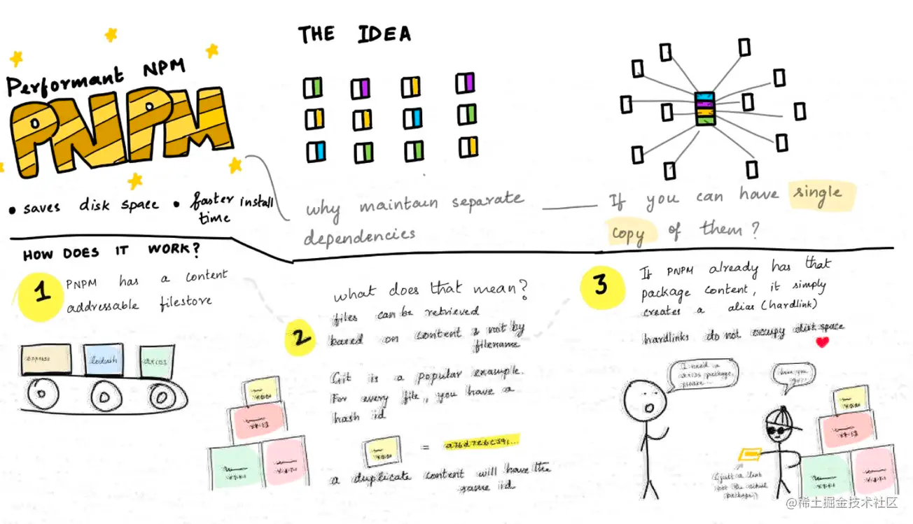
- [tailwindcss](https://link.juejin.cn/?target=https%3A%2F%2Ftailwindcss.com%2F)，艾玛香的一塌糊涂，一行css不写，3分钟出一个页面。不适合初中级前端，建议还是先踏实学基础再用框架。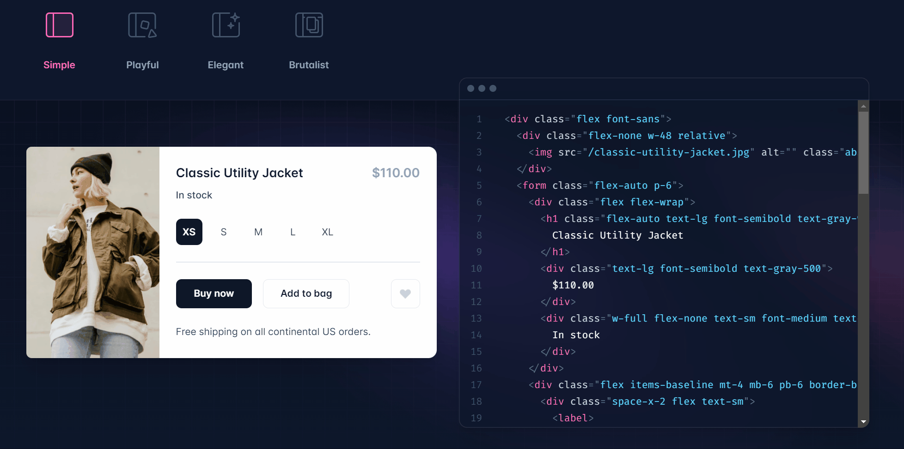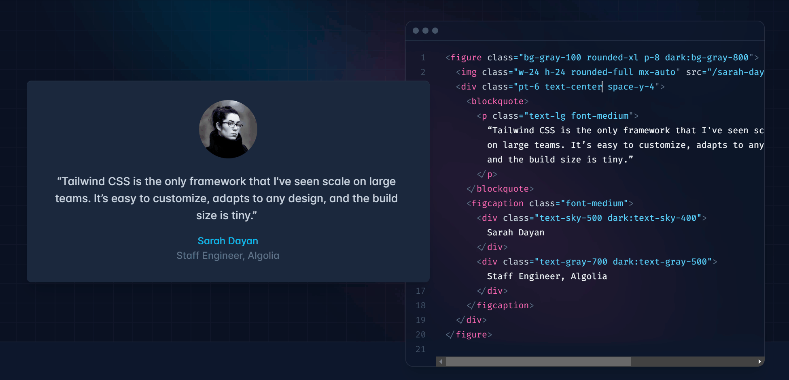
- [Vue I18n](https://link.juejin.cn?target=https%3A%2F%2Fvue-i18n.intlify.dev%2F) 是 Vue.js 的国际化插件，如果你想做开源框架，国际化首选插件。
- [ViteSSG](https://link.juejin.cn?target=https%3A%2F%2Fgithub.com%2Fantfu%2Fvite-ssg)，SEO优化，这个项目有点意思，大家可以玩玩这个方案，之前我都是通过服务端渲染搞SEO，后来了解到这个可以直接在Vue3的服务器上生成。
- [Vitest](https://link.juejin.cn?target=https%3A%2F%2Fgithub.com%2Fvitest-dev%2Fvitest),基于Vite的单元测试工具，目前迭代比较快，尤大金牌赞助。可以持续关注，不建议使用在小项目中。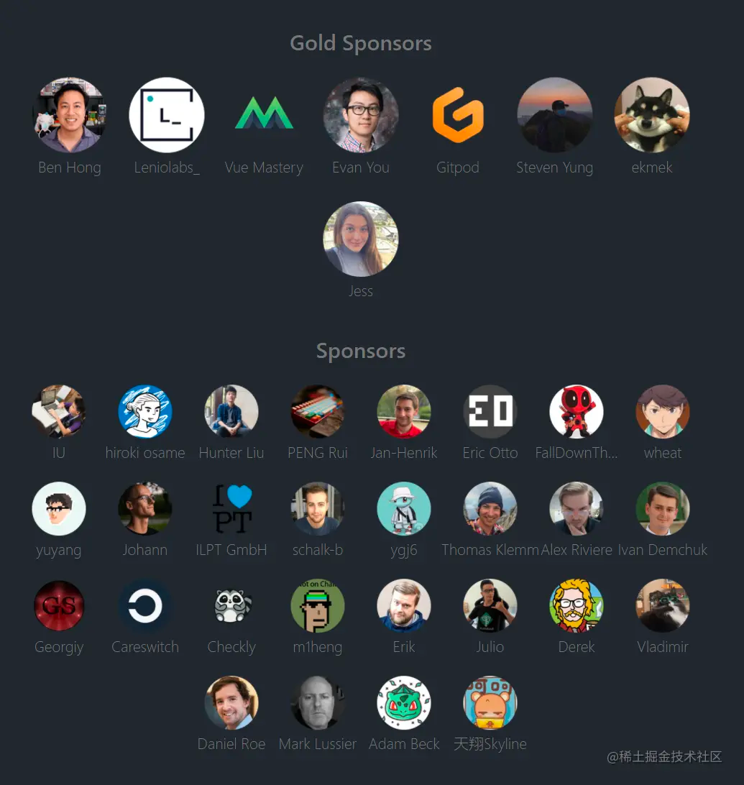 <a name="U0Mcg"></a>

## Web3D图形技术的研究

在之前的分享里我已经写过一部分，这里不做过多趋势发展方向的赘述，主要以我们实际案例聊一下这块技术的发展。 <a name="iawWk"></a>

### 需求背景

10月份左右我们做了个web3D的项目，主要目标是建立一个小型的城市，让大家基于企业文化做一些线下任务并获取奖励，奖励可以用于装修城市或兑换礼品。例如：按时写日报，阅读最新人事公告，积极参与文化活动等等。不再是冷冰冰的Push通知或内部信，调动大家活跃的工作氛围。
这个项目需要思考的是如何玩出花样？铺天盖地的任务机制在各大App随处可见，用户早已玩腻了。宏大的城市模拟需要安装App或较大的人力投入。轻量级的游戏化应用确实近几年的主流，加持C4D视觉的流行，也更加迎合用户新鲜感的期待。
那么定出来的方向是（搞全栈的，后端接口随心所欲，就不多说了）：

- 3D类，轻游戏化城市模拟（基础玩法）
- 好玩，可以保持用户新鲜度（皮肤系统）
- 够轻，Web端打开就能玩 <a name="nuSSd"></a>

### 产出

框架选择[Oasis Engine](https://link.juejin.cn/?target=https%3A%2F%2Foasisengine.cn%2F) ,为了提高美术还原度，我们提供了一套标准化的Blender烘焙流程。过程中遇到模型数量太多，美术人手不足的问题，于是自研了一套模型渲染工作台（未来计划贡献给社区，保持关注），可以快速导出模型代码和渲染图。预览图片非常大不知道能否显示[原图地址](https://link.juejin.cn?target=https%3A%2F%2Fcdn.jsdelivr.net%2Fgh%2FMaleWeb%2Fpicture%2Fimages%2Ftechblog%2F%25E5%25B0%258F%25E9%2595%2587%25E5%25BB%25BA%25E7%25AD%2591-%25E4%25BB%258B%25E7%25BB%258Dnew.gif)
 <a name="pkcmI"></a>

### 分享

通过这个项目，我们团队也尝试了Three.js、[PlayCanvas.js](https://link.juejin.cn/?target=https%3A%2F%2Fplaycanvas.com%2F) 等框架，对图形技术也算是知道了点皮毛。个人建议不要盲目跟随VR、AR、元宇宙等热点冒然入门某个细分领域。毕竟术业有专攻，保持好前端技术敏感性，根据公司业务发展再做定论。如果能带动业务发展，一般企业都会大力扶持，随着项目迭代你才有机会真正深入某一项技术。因为凡是通过简单的学习和了解都不算是入门，很可能在你某个晚间体操后就忘记了某项技能(刹车)。 <a name="YWvJg"></a>

## 对低代码技术的尝试，助力前端进入深水区

低代码能力解决的绝不止10-20倍提速的问题，而是技术发展赋能企业运行效率的最佳实践。通过整合前后端技术应用（这里是应用层面而非技术层面），从而解决企业面临的各种复杂问题。 <a name="hsYDe"></a>

### 原理性

前端通过可视化拖拽式交互操作，后端通过动态表单技术实现。当然，低代码平台也不像我说的那么简单，各家平台融合的技术也各有特色。以下分析几个关键性指标。
首先，数据结构，低代码编程的数据结构是完全托管的， 用户可以创建任意的数据表，选择各类型字段。 除了数据库通用的字段类型外，低代码编程一般会封装额外的字段类型。
其次，数据关联，能否根据模型，自动生成多层级交叉调用的代码，成了低代码工具关键性指标。
再者，页面配置，目前比较主流的方案是通过 [Json Schema](https://link.juejin.cn?target=http%3A%2F%2Fjson-schema.org%2F) ,一种国际规范的词汇表，允许你注释和验证。目前，采用此模式的低代码框架有很多，例如：阿里的[XRender](https://link.juejin.cn?target=https%3A%2F%2Fgithub.com%2Falibaba%2Fx-render)，[vjsf](https://link.juejin.cn?target=https%3A%2F%2Fvue-json-schema-form.lljj.me%2F)等后面介绍。
最后，基于Seveless的事件机制，通过灵活定义函数与事件来满足更加复杂的业务流程。
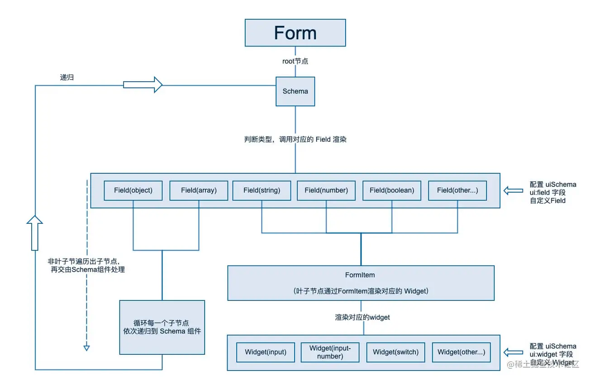 <a name="NRuYF"></a>

### 案例

使用Schema快速搭建一个基于Vue3+antdv的注册表单：[地址](https://link.juejin.cn/?target=https%3A%2F%2Fform.lljj.me%2Fv3%2F%23%2Fdemo%3Fui%3DVueAntForm%26type%3DTest%26schema%3D%257B%2522type%2522%3A%2522object%2522%2C%2522required%2522%3A%255B%2522string_1641808479261x0%2522%2C%2522string_1641808792433x0%2522%2C%2522string_1641808909452x0%2522%255D%2C%2522properties%2522%3A%257B%2522string_1641808479261x0%2522%3A%257B%2522title%2522%3A%2522%25E5%25A7%2593%25E5%2590%258D%2522%2C%2522type%2522%3A%2522string%2522%2C%2522maxLength%2522%3A10%2C%2522ui%3Aoptions%2522%3A%257B%2522placeholder%2522%3A%2522%25E8%25AF%25B7%25E8%25BE%2593%25E5%2585%25A5%25E5%25A7%2593%25E5%2590%258D%2522%2C%2522clearable%2522%3Atrue%2C%2522showWordLimit%2522%3Atrue%257D%257D%2C%2522string_1641808792433x0%2522%3A%257B%2522title%2522%3A%2522%25E6%2580%25A7%25E5%2588%25AB%2522%2C%2522type%2522%3A%2522string%2522%2C%2522ui%3Awidget%2522%3A%2522RadioWidget%2522%2C%2522enum%2522%3A%255B%2522a%2522%2C%2522b%2522%255D%2C%2522enumNames%2522%3A%255B%2522%25E7%2594%25B7%2522%2C%2522%25E5%25A5%25B3%2522%255D%257D%2C%2522string_1641809102205x0%2522%3A%257B%2522title%2522%3A%2522%25E5%25A4%25B4%25E5%2583%258F%2522%2C%2522type%2522%3A%2522string%2522%2C%2522ui%3Awidget%2522%3A%2522UploadWidget%2522%2C%2522ui%3Aoptions%2522%3A%257B%2522action%2522%3A%2522https%3A%2F%2Frun.mocky.io%2Fv3%2F518d7af7-204f-45ab-9628-a6e121dab8ca%2522%2C%2522btnText%2522%3A%2522%25E7%2582%25B9%25E5%2587%25BB%25E4%25B8%258A%25E4%25BC%25A0%25E5%25A4%25B4%25E5%2583%258F%2522%257D%257D%2C%2522color_string_1641809169190x0%2522%3A%257B%2522title%2522%3A%2522%25E5%2596%259C%25E6%25AC%25A2%25E7%259A%2584%25E9%25A2%259C%25E8%2589%25B2%2522%2C%2522type%2522%3A%2522string%2522%2C%2522format%2522%3A%2522color%2522%2C%2522default%2522%3A%2522%2523ff6900%2522%257D%2C%2522boolean_1641809131106x0%2522%3A%257B%2522title%2522%3A%2522%25E6%2598%25AF%25E5%2590%25A6%25E4%25B8%25BA%25E7%25A0%2594%25E5%258F%2591%25E4%25BA%25BA%25E5%2591%2598%2522%2C%2522type%2522%3A%2522boolean%2522%2C%2522ui%3Awidget%2522%3A%2522SelectWidget%2522%2C%2522enumNames%2522%3A%255B%2522%25E6%2598%25AF%2522%2C%2522%25E5%2590%25A6%2522%255D%257D%2C%2522string_1641809212792x0%2522%3A%257B%2522title%2522%3A%2522%25E9%2582%25AE%25E7%25AE%25B1%2522%2C%2522type%2522%3A%2522string%2522%2C%2522ui%3Aoptions%2522%3A%257B%2522placeholder%2522%3A%2522%25E8%25AF%25B7%25E8%25BE%2593%25E5%2585%25A5%25E9%2582%25AE%25E7%25AE%25B1%2522%2C%2522clearable%2522%3Atrue%257D%257D%2C%2522string_1641808909452x0%2522%3A%257B%2522title%2522%3A%2522%25E5%25AF%2586%25E7%25A0%2581%2522%2C%2522type%2522%3A%2522string%2522%2C%2522maxLength%2522%3A10%2C%2522ui%3Aoptions%2522%3A%257B%2522placeholder%2522%3A%2522%25E8%25AF%25B7%25E8%25BE%2593%25E5%2585%25A5%25E5%25AF%2586%25E7%25A0%2581%2522%2C%2522clearable%2522%3Atrue%2C%2522showPassword%2522%3Atrue%257D%257D%257D%2C%2522ui%3Aorder%2522%3A%255B%2522string_1641808479261x0%2522%2C%2522string_1641808792433x0%2522%2C%2522string_1641809102205x0%2522%2C%2522color_string_1641809169190x0%2522%2C%2522boolean_1641809131106x0%2522%2C%2522string_1641809212792x0%2522%2C%2522string_1641808909452x0%2522%255D%257D%26formData%3D%257B%2522string_1641808792433x0%2522%3A%2522a%2522%2C%2522color_string_1641809169190x0%2522%3A%2522%2523ff6900%2522%257D%26uiSchema%3D%257B%257D%26errorSchema%3D%257B%257D%26formFooter%3D%257B%2522formItemAttrs%2522%3A%257B%2522wrapperCol%2522%3A%257B%2522span%2522%3A12%2C%2522offset%2522%3A10%257D%257D%257D%26formProps%3D%257B%2522inline%2522%3Afalse%2C%2522labelPosition%2522%3A%2522top%2522%2C%2522inlineFooter%2522%3Afalse%2C%2522layoutColumn%2522%3A1%2C%2522labelSuffix%2522%3A%2522%25EF%25BC%259A%2522%2C%2522labelCol%2522%3A%257B%2522span%2522%3A10%257D%2C%2522wrapperCol%2522%3A%257B%2522span%2522%3A12%257D%257D)
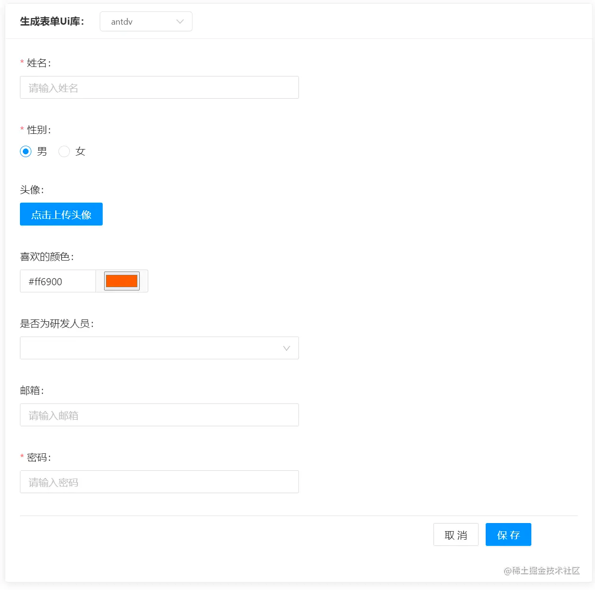
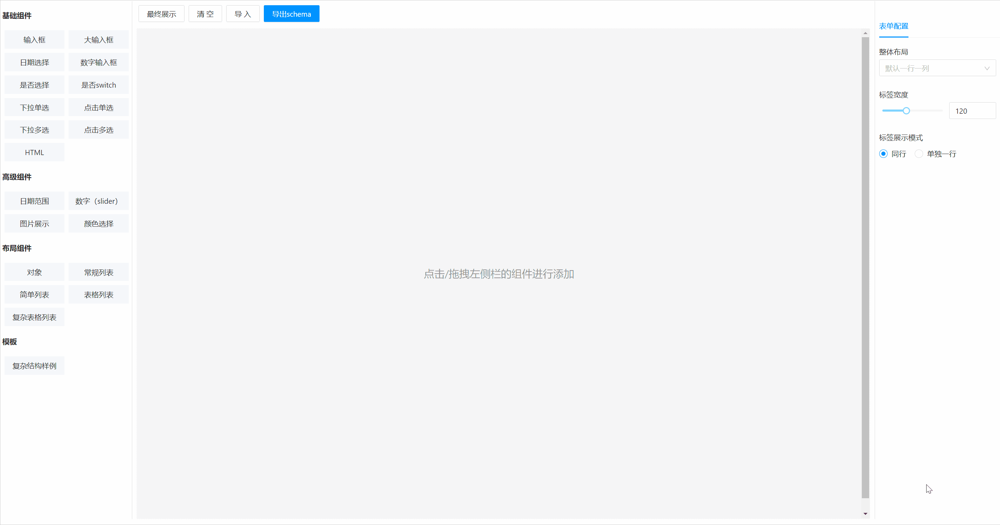
它的好处在于能够让前端研发人员彻底从机械重复性工作中抽离出来，有充足的时间划水研究新技术，解决更棘手的复杂问题。

我们团队从17年就一直在折腾这方面，起初只是解决一些静态页面组装，到后来就是可视化装修业务页面。但因为人员精力不足，缺乏迭代和更新也是停留于内部，未能落地业务。不过也算打下了基础，去年又重新捡起来，参考Json schema的规范，重新基于业务研发了自己的效率工具平台，以解决中后台，业务单一的营销活动，官网，数据大屏等需求。
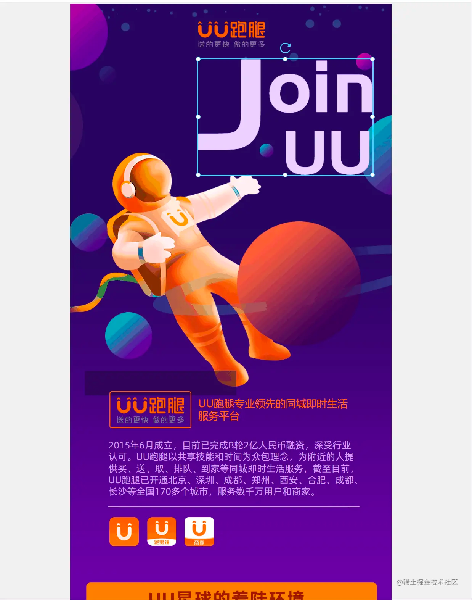
其实，我们也一直在思考如何让更多组件通用。随着低代码场景的丰富，越来越多的复杂组件将被设计出来。如果每个团队都闭门造轮子可能又是个恶性循环。如果，我说如果，能够有一套类似schema的规范来定义各类组件，甚至复杂的业务组件，形成一个统一规范的仓库。那么前端同学就能够很轻便的选购组件和复用组件了，研发效率也将会再一次提升。 <a name="SCGB9"></a>

## DevOps已彻底重构了研发各环节

<a name="H0570"></a>

### 认识DevOps

21年还有一项技术在釜底抽薪一样重塑着开发者的流程，那就是DevOps。从最早的单体架构+瀑布模式开始，全栈是吃香的，自己搞一个Demo研发好，找一台服务器安装好环境，把项目解压上去开启服务就可以了。模式单一，出了问题拉一下日志，为了解放双手自己写一些脚本用于监听日志，自动备份等。
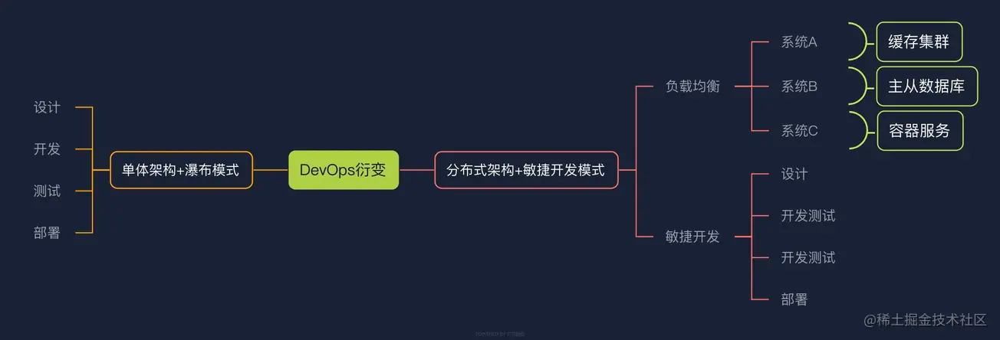
随着业务体量增加，一台机器扛不住，加机器，单机变多机，架构也开始加入Nginx，Redis,CDN,Nat等通用基础服务。随着多机器（大公司动则上千台），多人协作模式的发展，越来越多的问题暴露出来。全栈这个阶段作用减弱，分身乏术，开发专注于业务，运维进场。这时 Ops 的主要职责就是：硬件维护、网络设备维护、DBA 、基础服务维护、数据监控等，运维们擅长写各种部署，监控脚本，减少机械的重复工作。运维要求门槛变高，行业运维开发人员质量参差不齐，短时间无法靠人解决量的问题。随着架构越来越大，流程沟通成本变高，发布流程变长，测试无限排期，需求交付变成了画鸡成鸭。

上线以后，偶尔会出现的结果

微服务+DevOps，主流架构，应对BAT级别体量的技术研发和交付。项目从研发到交付的各个环节都得到了有效治理，而这个阶段的全栈又发挥作用， 不再分散精力学习运维而是专项前后端业务侧。

> wiki定义微服务: 微服务（英语：Microservices）是一种软件架构风格，它是以专注于单一责任与功能的小型功能区块 (Small Building Blocks) 为基础，利用模块化的方式组合出复杂的大型应用程序，各功能区块使用与语言无关 (Language-Independent/Language agnostic）的API集相互通信。

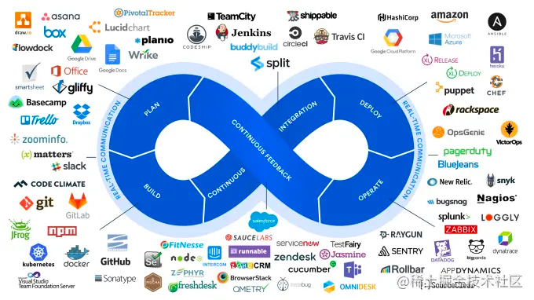
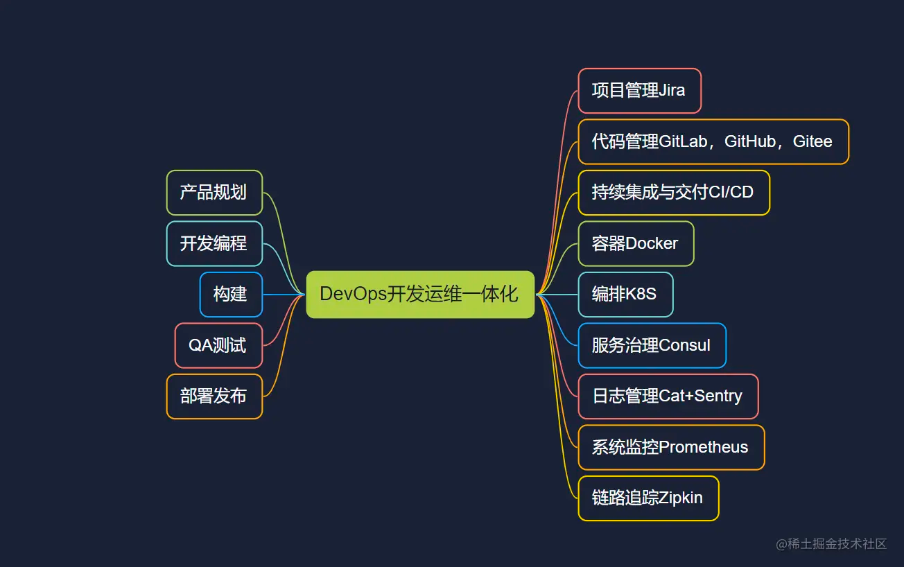 <a name="edfnO"></a>

### DevOps平台

这一类的平台比较多，就不一一列举了，看你们公司具体采购哪一个。分享一下我们团队一些创新项目目前使用的DevOps——[阿里云效](https://link.juejin.cn?target=https%3A%2F%2Fwww.aliyun.com%2Fproduct%2Fyunxiao)，目前新入驻的企业免费，不过限制一定事务处理数量。对于敏捷研发团队来讲，我们不一定要了解每个流程的原理，如果能够让我们更好开展自己的工作，又能低门槛上手的，那么它就是最好的。

我认为阿里云效的优势在于，整合了各种工具以后在此基础上又做了相对友好的上层应用。通过上层应用的方式关联各saas和paas服务，你无需关注底层技术配置，只需要管理好你的业务即可。

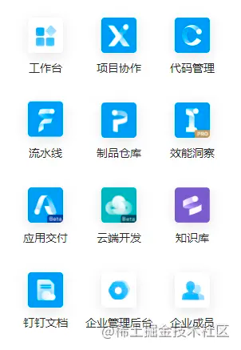

- 项目协作，解决的是PM需求管理问题，内置功能强大的过程管理能力。
- 代码管理，底层相当于gitlab，只是这里生态做了整合，可以上下文系统调用。
- 流水线，这个就很D了，支撑丰富的插件机制，自定义脚本等，CICD的整合。
- 制品仓库，就是镜像仓库，支持Maven，Npm，通用制品等
- 效能洞查，可以理解为一个BI中台，度量报表维度表多，代码提交量，缺陷数，任务数等
- 应用交付，APPStack，用于管理容器集群，K8S集群，应用部署，环境部署等
- 云端开发，阿里自研的云端代码编辑器DevStudio，有幸被下过Offer,体验很不错最快10秒部署，自动分配临时域名用于调试。
- .....自己体验吧 <a name="m10Tn"></a>

### 体验流水线

以[vvt仓库](https://link.juejin.cn?target=https%3A%2F%2Fgithub.com%2FMaleWeb%2Fvue3-vite-ts) 为案例，设计一个流程，如果有main提交或合并动作，就触发代码审查和单元测试，并通知钉钉机器人，再构建代码，最后发布到阿里云服务器指定目录下。

首先，创建流水线，绑定github仓库和分支，配置仓库webhooks，并监听提交事件。
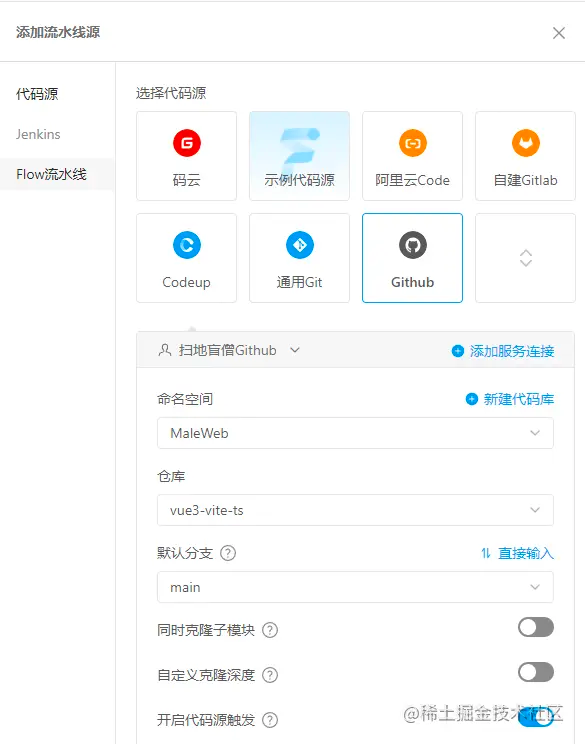
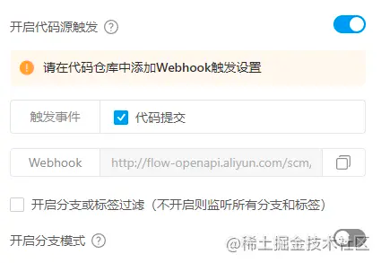
其次，配置代码扫描，可选使用本地ESLint配置，添加钉钉机器人插件(插件机制可以做很多事情)
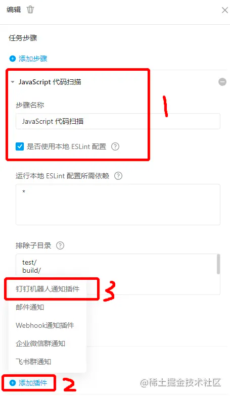
最后，流水线执行操作科尔一看到具体日志，会输出代码扫描的结果，以及单元测试等，无所不能
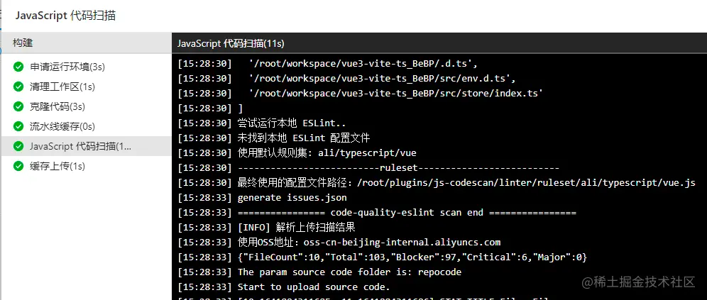
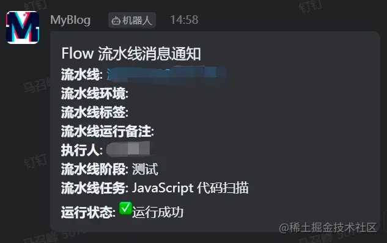
还有很多骚操作：生产环境，正式环境一键切换，自由服务器挂载，集群部署，自动扩容，备份，日志监控Push 等等 <a name="qW3yE"></a>

## 5G在加速Web通信的增强

<a name="FWSfF"></a>

### WebRTC

> WebRTC (Web Real-Time Communications) 是一项实时通讯技术，它允许网络应用或者站点，在不借助中间媒介的情况下，建立浏览器之间点对点（Peer-to-Peer）的连接，实现视频流和（或）音频流或者其他任意数据的传输。WebRTC包含的这些标准使用户在无需安装任何插件或者第三方的软件的情况下，创建点对点（Peer-to-Peer）的数据分享和电话会议成为可能。——出自MDN

- 2012年： 谷歌已经把这款软件集成到Chrome浏览器中，Opera初步集成WebRTC。
- 2013年 6月： Mozilla Firefox\[5]发布22.0版本正式集成及支持WebRTC。
- 2017年11月： W3C WebRTC 1.0 草案正式定稿。
- 2021年1月： WebRTC 被 W3C 和 IETF 发布为正式标准（见《[WebRTC 1.0: Real-Time Communication Between Browsers](https://link.juejin.cn?target=https%3A%2F%2Fwww.w3.org%2FTR%2F2021%2FREC-webrtc-20210126%2F)》）。

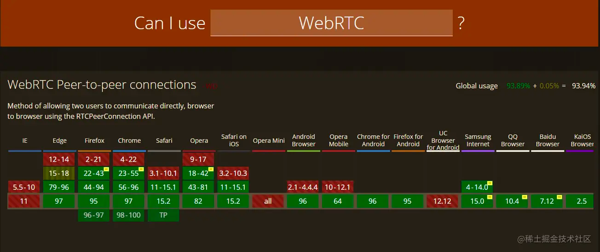

主流浏览器都支持 WebRTC 标准 API ，因此也让浏览器之间无插件化的音视频互通成为可能， 大大降低了音视频开发的门槛，开发者只需要调用 WebRTC API 即可快速构建出音视频应用。

更多关于WebRTC文章
《[开源实时音视频技术WebRTC的现状](https://link.juejin.cn?target=http%3A%2F%2Fwww.52im.net%2Farticle-126-1.html)》 《[简述开源实时音视频技术WebRTC的优缺点](https://link.juejin.cn?target=http%3A%2F%2Fwww.52im.net%2Fthread-225-1-1.html)》
《[访谈WebRTC标准之父：WebRTC的过去、现在和未来](https://link.juejin.cn?target=http%3A%2F%2Fwww.52im.net%2Fthread-227-1-1.html)》
《[良心分享：WebRTC 零基础开发者教程（中文）\[附件下载\]](https://link.juejin.cn?target=http%3A%2F%2Fwww.52im.net%2Fthread-265-1-1.html)》
《[WebRTC实时音视频技术的整体架构介绍](https://link.juejin.cn?target=http%3A%2F%2Fwww.52im.net%2Fthread-284-1-1.html)》
《[新手入门：到底什么是WebRTC服务器，以及它是如何联接通话的？](https://link.juejin.cn?target=http%3A%2F%2Fwww.52im.net%2Fthread-356-1-1.html)》
《[WebRTC实时音视频技术基础：基本架构和协议栈](https://link.juejin.cn?target=http%3A%2F%2Fwww.52im.net%2Fthread-442-1-1.html)》
《[浅谈开发实时视频直播平台的技术要点](https://link.juejin.cn?target=http%3A%2F%2Fwww.52im.net%2Fthread-475-1-1.html)》 <a name="DSScH"></a>

### Chrome97发布，QUIC协议到来

一周前，Chrome 97发布，最大的亮点是WebTransport，得益于强大的QUIC协议，WebTranport可以提供更强更快的双向通信能力，有望用于游戏、直播、视频会议等低延时场景。

| 双向通信协议 | 底层协议 | 优点 | 缺点 |
| --- | --- | --- | --- |
| WebSocket | TCP/TLS | 技术成熟，使用简单 | TCP头部阻塞，不支持不可靠无序通信，不适用于低延时场景 |
| WebRTC data channels | SCTP/DTLS/ICE/UDP | 可以用于适合P2P场景 | 使用难度大，不适用于Client/Server通信 |
| WebTransport | HTTP/3（QUIC/UDP）或者HTTP/2（TLS/TCP） | 延时更低，没有头部阻塞问题，适用场景更多 | 尚未成为正式标准 |

WebTransport默认使用HTTP/3，同时使用HTTP/2作为备胎。
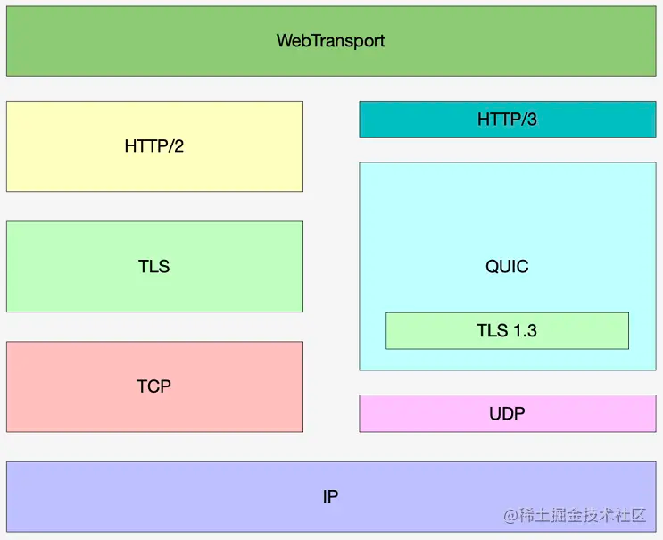

- 提供类似于TCP的可靠通信，处理丢包、拥塞等网络异常情况；
- 基于TLS/1.3进行加密，保证通信的安全性，同时避免中间节点干扰导致协议僵化；
- 提供类似于HTTP/2的多路复用能力，在网络传输层增加了流的概念，解决了TCP协议的头部阻塞问题；

[文献地址](https://link.juejin.cn/?target=https%3A%2F%2Fsupport.google.com%2Fchrome%2Fa%2Fanswer%2F7679408%3Fhl%3Den) <a name="CDqxu"></a>

## 协作神秘面纱OT算法的普及

我在2016年就全栈设计了文档系统，目前在公司内部已发展了5个年头，且已成为默认的Wiki知识库系统。但由于是业余维护一直没有更改原有的Websocket锁模式，也规划22年一定要重构一版完成实时协作的能力。当然，目前协作已经过时不再新鲜了，而背后的OT算法缺悄悄活了起来，已被应用到各种场景。在线图片实时协作，项目实时协作，甚至视频编辑也加入了[OT](https://link.juejin.cn?target=https%3A%2F%2Fgithub.com%2FOperational-Transformation%2Fot.js%2Fblob%2Fmaster%2Flib%2Ftext-operation.js)。

OT算法的关键技术点为：定义原子操作，版本确认机制，操作转换，客户端状态转移。有点懵是吧？为了能让大家通俗易懂，我也绞尽脑汁了，以下是通过可视化演示一下OT的魅力。
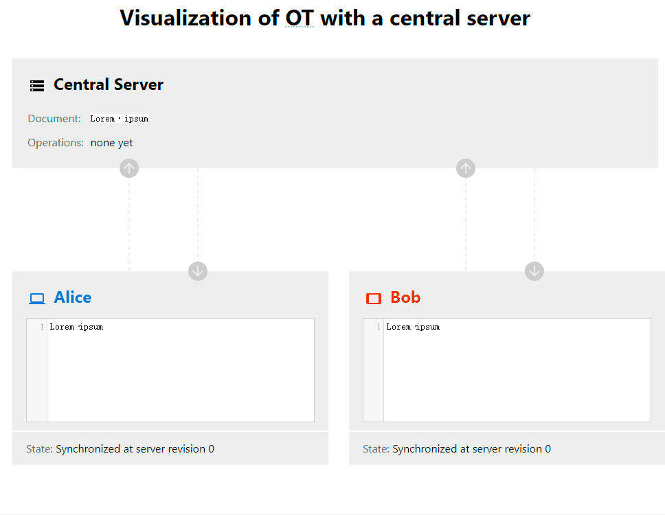
文献地址：

- [深入理解Operational Transformation](https://link.juejin.cn/?target=https%3A%2F%2Fgarinzhang.com%2Fcoding%2Fhow-to-implemente-collaborative-editing-understanding-operational-transformation.html)
- [operational-transformation.github.io](https://link.juejin.cn/?target=https%3A%2F%2Fgithub.com%2FOperational-Transformation%2Fot.js)
