“天下大势，浩浩汤汤，顺之者昌，逆之者亡。”
以下是对前端各位大佬2021总结的一个汇总总结。希望可以看到一些前端行业的动向，排布。 帮助团队和自身制定未来的规划。内容分为四个部分：

1. 基础框架/工程化
2. 语言
3. 行业趋势
4. 底层演进 

# 1. 基础框架/工程化

随着 jQuery.js 渐渐淡出人们的视野，前端开发框架成为了开发人员必不可少的工具，也成为大家最为关注的东西。 

### mv* 框架

- React（Next.js）
- Vue（nuxt.js）
- Svelte
- Angular。

React 即将发布18版本，vue3 成为vue默认版本，Svelte异军突起。 

### 打包工具

- 传统：Webpack, Rollup, Parcel, Esbuild
- ESM相关：Snowpack, Vite；ESM的实现：在开发环境编译时，使用 Server 动态编译 + 浏览器的 ESM，基本上实现了“开发环境 0 编译”的功能。而生产环境编译时，则会调用其他编译工具来完成（如 Vite 使用 Rollup）。 

### 语法规范

- Babel
- Prettier
- ESLint 

### CSS

- Tailwind CSS（原子类） 

### web3D

- Three.js
- Oasis Engine 

### 跨端

- React Native
- Flutter
- Weex
- uni-app
- taro 

### 桌面端

- Tauri（Webview + Rust/.Net/Go）
- electron（Chromium + Nodejs） 

### 微前端

- qiankun
- single-spa
- micro-app 

### E2E 测试

- cypress（node服务，与程序一起运行）
- puppeteer（无头浏览器） 

### shell

- zx

以下是stateOfJs对2016-2021各个框架的趋势统计： 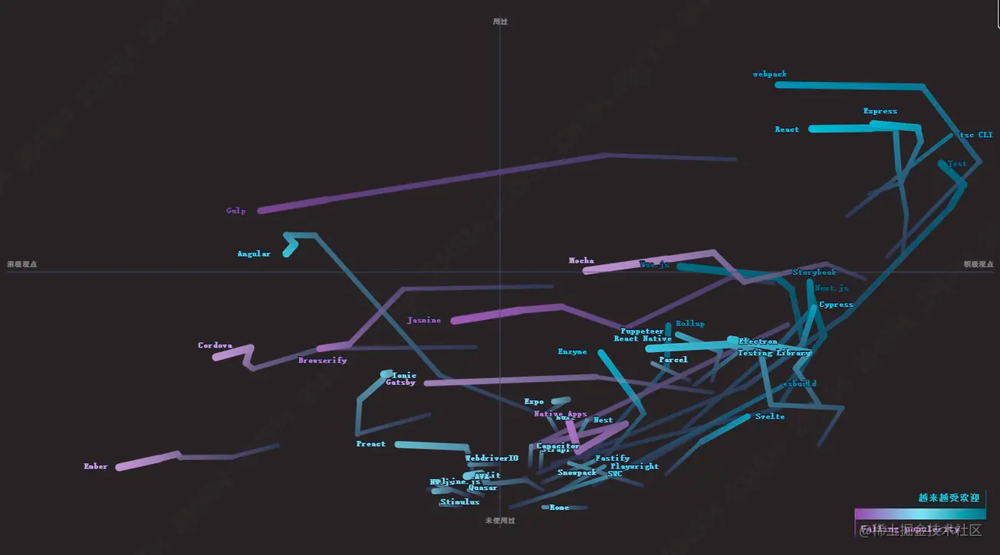 

# 2. 语言

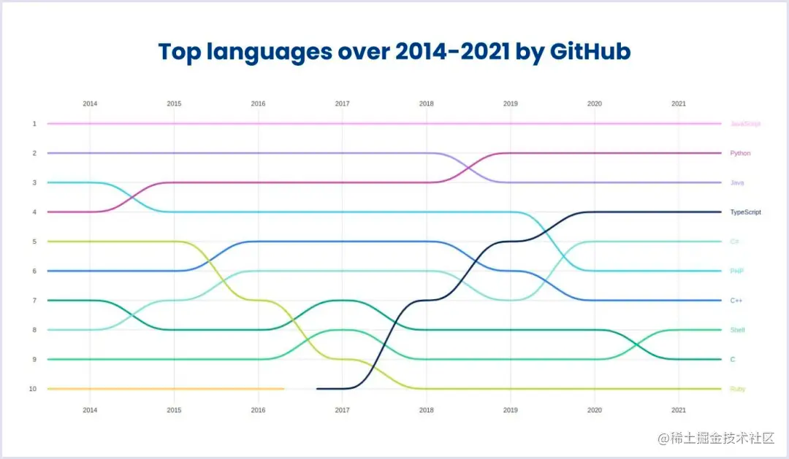
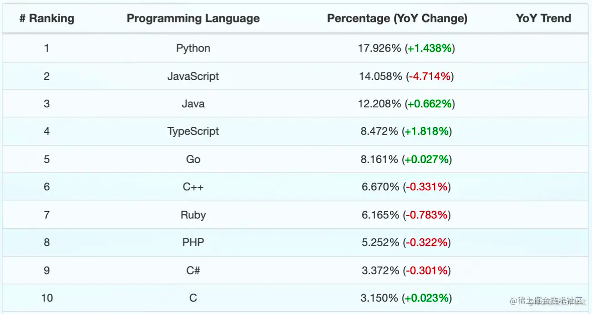[数据来源 ↑](https://link.juejin.cn?target=https%3A%2F%2Fmadnight.github.io%2Fgithut%2F%23%2Fpull_requests%2F2021%2F4)
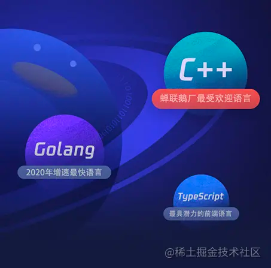
[腾讯2020研发大数据报告 ↑](https://link.juejin.cn?target=http%3A%2F%2Fwww.techweb.com.cn%2Fnews%2F2021-03-19%2F2830859.shtml)
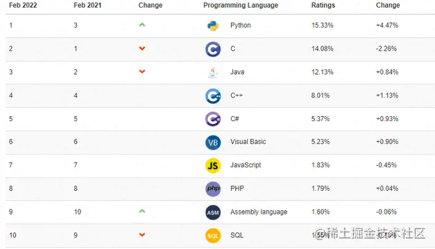
[TIOBE 2月编程语言排行榜 ↑](https://link.juejin.cn?target=https%3A%2F%2Fbaijiahao.baidu.com%2Fs%3Fid%3D1724342431920199243%26wfr%3Dspider%26for%3Dpc)
阿特伍德定律：任何可以用 JavaScript 来写的应用，最终都将用 JavaScript 来写。
随着前端应用大型化、复杂化，TypeScript 肯定会越来越普及。 未来，TypeScript 是否能得到浏览器和 Node.js 原生支持呢？我们一起期待吧。
前端的同学如果有想学习其他语言的，有如下推荐：

- Rust 是 JS 基础设施的未来 - Lee Robinson
- 全栈 —— Go
- AI —— Python
- Flutter —— Dart 

# 3. 行业趋势

### 3.1 前端智能化

- 低代码（LowCode）其实就是早期的搭建系统、组件平台等（宜搭、微搭），这个概念2014年被著名的研究机构Forrester提出。低代码平台的门槛在逐步降低，从专业的技术人员向业务人员进行转变，中国低代码行业比较分散。 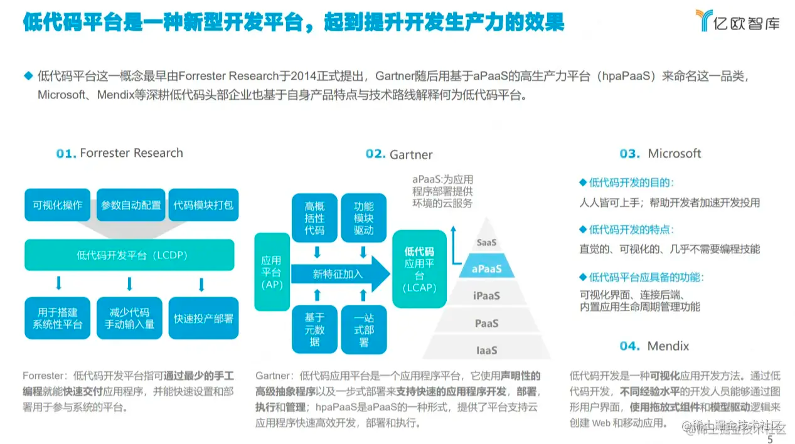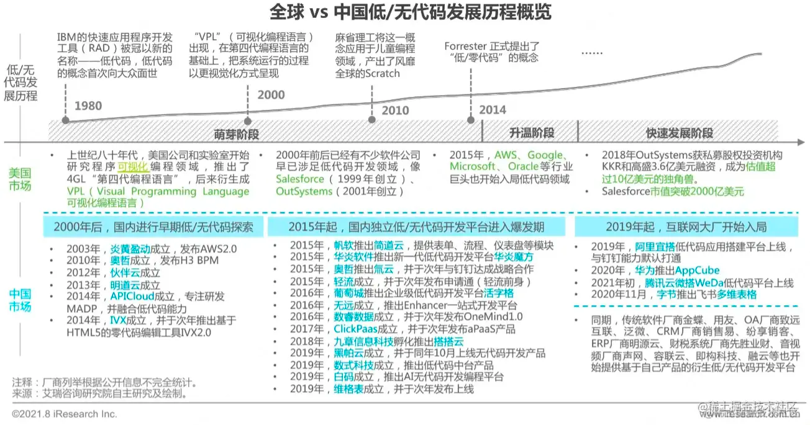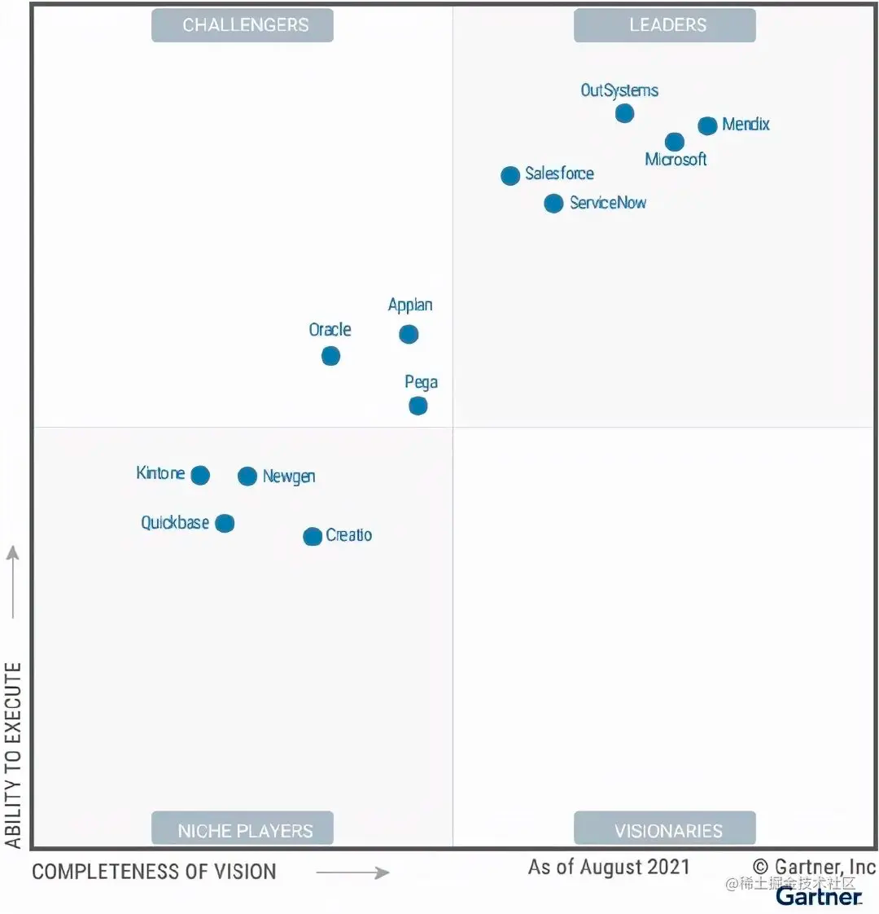其中，OutSystems、Mendix、微软Salesforce、ServiceNow 被评为行业领导者。Appian、Oracle 和 Pega 被评为挑战者。Creatio、Kintone、Newgen 和 Quickbase 被评为利基（niche）市场参与者。今年没有厂商被评为远见者。Gartner 预测： “到 2023 年，超过 70% 的企业将采用低代码（LCAP）作为他们发展战略的关键目标之一"。到 2025 年，整体 LCAP（低代码开发平台）市场规模将达到 290 亿美元，年复合增长率超过 20%；其中，LCAP 的细分市场预计将在 2020——2025 年之间，从 44.5 亿美元增长至 143.8 亿美元，复合年增长率为 26.4%。
- 代码自动生成Sketch2Code，AI 将手绘稿子 转换为 html 代码。imgcook，将Sketch/PSD/图片 转换为 React、Vue、Flutter、小程序等代码。 

### 3.2 大前端（泛前端）

从切图仔、写 HTML 模板的“石器时代”，到前后端分离、大前端的“工业时代”，再到现在跨端技术、低代码的“电气时代”。前端研发的职责一直在改变，同时前端研发需要掌握的技术也在迭代更新。- 字节前端 

#### Serverless

Serverless 是一种基于云计算的简化方式，基本可以理解为 FaaS（函数即服务）+ BaaS（后端即服务），在 BaaS 层进行存储与计算，在 FaaS 层提供云函数。
在 Serverless 的赋能之下，前端工程师能够将页面交互、业务逻辑、数据处理等全部掌控在自己的手中，实现了真正全栈的可能。 

#### 全栈

“全栈开发者”是指“同时掌握前端、后端以及其他网站开发相关技能的开发者”。
一个“全栈开发者”可能会使用以下技能点：
前端：JavaScript、H5、CSS3、sass、less、React、Vue、webpack、jest。
后端：Nodejs/Deno、Go、Java、Spring、Gin、Kafka、Hadoop。
数据库：MySQL、mongoDB、redis、clickhouse。
运维：网络协议、CDN、Nginx、ZooKeeper、Docker、Kubernetes。
值得注意的是，一个优秀的工程师并不是以“栈”数取胜，而取决于你解决了什么层次的问题。

“全栈”或者“专家”仅仅是实现目标的过程状态。吴军在《硅谷来信》中，将工程师划分成五个等级：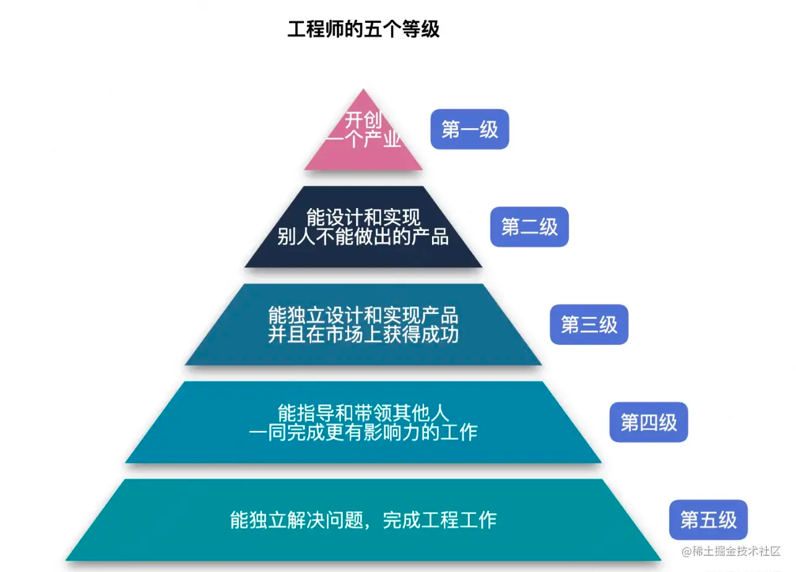从工程师能力模型来看，第一级需要集“天时地利人和”大成，是工程师的最高荣誉。普通人或许可以将目标聚焦在第二、三级。优秀的工程师并不是以“栈”数取胜，更重要的是拥有产品观、全局思维、沟通能力、学习能力、解决问题能力等。[来源：《来自未来，2022 年的前端人都在做什么?》](https://juejin.cn/post/7062617190981173278) 

#### DevOps

DevOps（Development 和 Operations 的组合词）是一种重视“软件开发人员（Dev）”和“IT 运维技术人员（OPS）”之间沟通合作的文化、运动或惯例。透过自动化“软件交付”和“架构变更”的流程，来使得构建、测试、发布软件能够更加地快捷、频繁和可靠。在开发、测试、部署、运维等多个领域进行了共建。
与 Kubernetes 相结合：Kubernetes 是一种开源容器编排系统，容器技术的日益普及是 DevOps 出现的因素之一。使用 Kubernetes DevOps，软件开发人员和运维团队可以快速实时地相互交换大量的应用程序，大大提高了生产力。 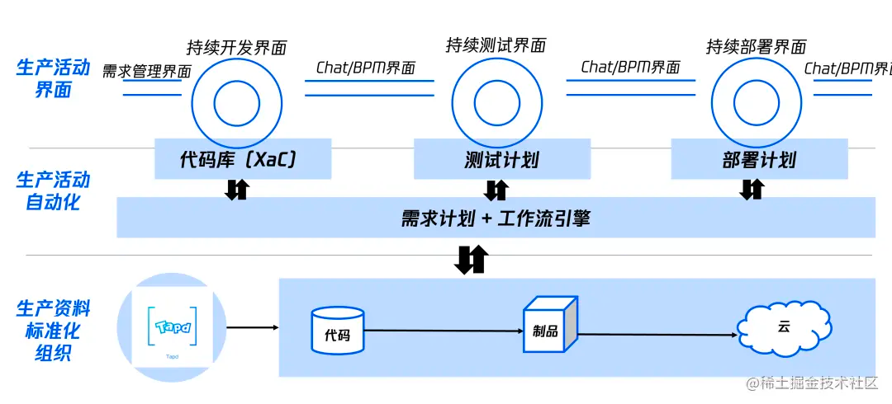 

#### 微前端

微服务架构：微服务架构可以将一个应用分成若干个更小的服务，这让整个开发过程具有很高的敏捷性和可拓展性。
常用的微前端框架包括 qiankun、single-spa、micro-app：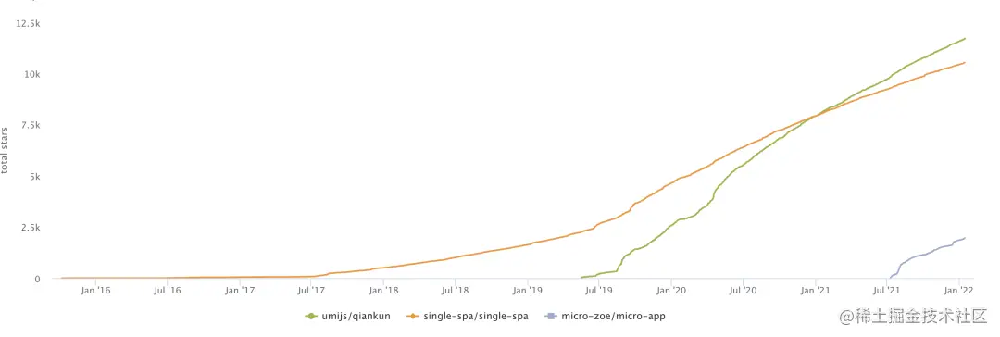
微前端我觉得它其实没有太多的趋势。首先微前端就不是一个大家都要用的。微前端沾了微服务的光，但是微服务是所有后端基本上都要往架构上迁， 微前端很明显不是这样的。它更多的是单页应用并有多框架隔离的需求，然后做出微前端这样一个技术方案。我觉得说实话，微前端就不该这么热，包括很多学生都会问我微前端，我反问你有没有看过微前端解决什么样的问题？如果非要往这上边靠的话，就相当于没有困难创造困难也要上，举个例子，公司一共有四五个前端，就非要用微前端架构，四五个人都可以用不同框架，这其实是没必要的。- 程劭非（winter）
我比较赞同老师说的，我认为一切技术都为于解决某个问题，关键在于我们有没有找准那个关键的问题，是否在解决这个问题。 

#### 小程序

根据winter老师的看法，小程序只是一个前端的技术实现方案，并无大的难点和技术创新，更重要的是看商业模式上的考量。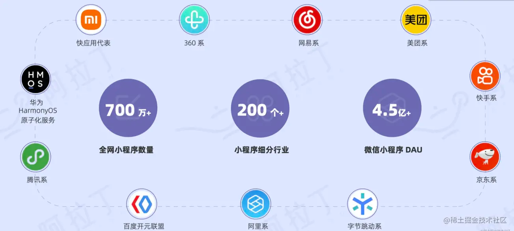上图截选自：阿拉丁《2021 年度小程序互联网发展白皮书》
解决小程序的跨平台开发问题可以采用框架转换：uni-app（Vue）、taro（React）。 

#### 5G时代

5G 时代到来，5G将与超高清视频、VR、AR、消费级云计算、智能家居、智慧城市、车联网、物联网、智能制造等产生深度融合，这些都将为前端技术的发展带来新的增长和机遇。WebGL、WebGPU等技术也将迎来一波发展的机会。

- Web 3D3D 类的 H5 小游戏、在线看房、电子商务、在线教育等，对于技术而言这无疑是一片沃土。随着 5G 技术发展，视频加载速度会非常快，简单的实时渲染会被视频直接替代。复杂的可以通过服务器渲染，将画面传回网页中，只要传输够快，手机的性能就不再是问题。相关的一些库：Three.js、Oasis Engine、Babylon.js、PlayCanvas.js
- WebRTC (Web Real-Time Communications)传统的技术包括：XMLHttpRequest，WebSocket，未来：WebRTC 会在点对点私密传输、娱乐领域，元宇宙领域，低延迟领域大放异彩。 

# 4. 底层演进

#### *前端历年大事件*

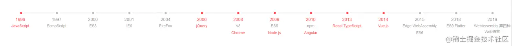*2021 JavaScript大事件 ↓*
**JavaScript**
8.24： TypeScript 新官网上线
12.4： JavaScript 26 岁了
**Node.js**
2.2： npm 7.0 正式可用
3.29： Deno 公司成立
4.21： Node.js 16 发布
7.20： Node-RED 2.0 发布，低代码编程工具
9.20： Node.js 发布 Corepack，用于管理npm、yarn、pnpm、cnpm
10.19： Node.js 17 发布
**Vue**
8.3： Vue.js 被选作维基百科的前端框架
8.5： Vue 3.2 发布
11.24： Pinia 正式成为 vuejs 的一员
**React**
5.28： React 18 alpha 发布
10.5： React 全新文档发布
11.27： Next.js 12 发布
12.14： Create React App 5.0 发布
**打包工具**
2021.1.6 Snowpack 3.0 发布
2021.2.17 Vite 2.0 发布
2021.10.13 Parcel v2 发布
**其他**
2021.3.6 jQuery 3.6.0 发布
2021.3.17 Chrome V8 9.0 发布
2021.10.7 jQuery Mobile 弃用
2021.11.4 Angular v13 发布 

#### 浏览器

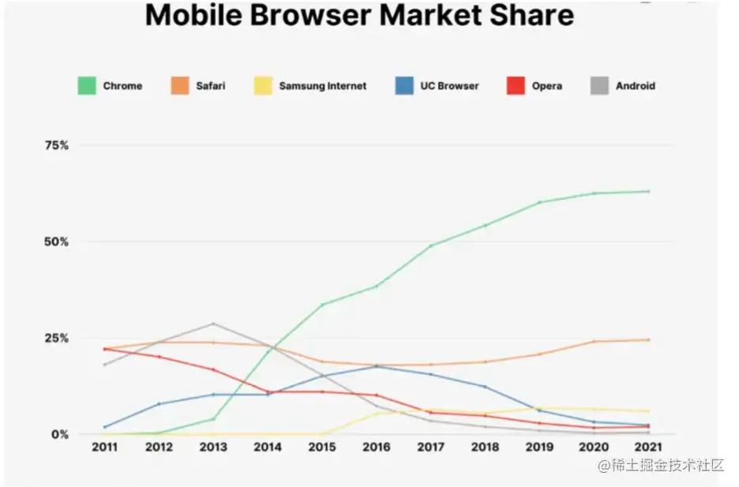Chrome 一家独大，IE 浏览器将于 2022 年 6 月 15 日正式停用。 

#### HTML6.0

支持原生模式、没有 JavaScript 的单页应用程序、自由调整图像大小、专用库、微格式、自定义菜单、增强身份验证、集成摄像头。 

#### WebAssembly

WebAssembly 简称 Wasm，是一种可在 Web 中运行的全新语言格式，同时兼具体积小、性能高、可移植性强等特点，在底层上类似 Web 中的 JavaScript，同时也是 W3C 承认的 Web 中的第 4 门语言。
在前端的游戏、音乐、视频等领域大放异彩，目前很多桌面软件也纷纷通过编译成 Wasm 的形式搬进了浏览器中。
2022 年 Wasm 功能将会不断完善，同时也会有越来越多的传统 PC 软件推出 Web 版本。
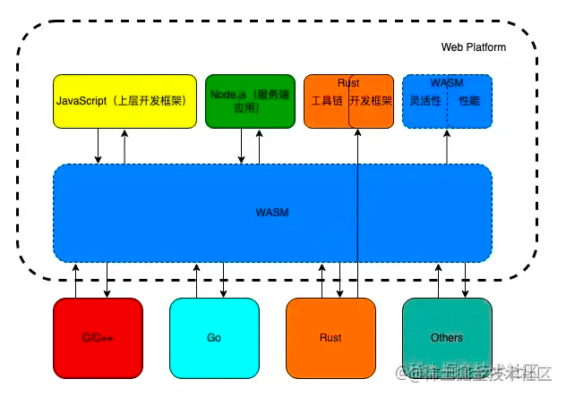
[来源：ELab团队 ↑](https://juejin.cn/post/7056612950412361741) 

#### 开源

首次被列入十四五规划，2021年，中国企业积极构建开源平台。根据GitHub统计，中国开发者已成为全球最大规模的开发者群体。 

#### 元宇宙

游戏、VR/AR、区块链数字资产等等概念的整合。 

#### web 3.0

web1.0: 单向信息，只读；web 2.0的标志：User Generated Content（用户生成内容，例如微博、Facebook）；web3.0: 人和网络以及网络与人的沟通。 

# 5. 总结

在工业4.0的大背景下，随着人工智能、云计算、大数据、物联网、区块链等互联网潮流技术的不断推进，互联网行业走向工业化和智能化。全球疫情的常态化，越来越多的公司选择或者不得不居家办公（WFH），必然给前端行业带来更多的机会。
2023 年底全球软件开发人员达到 2770万，中国将占6％至8％，前端预计30万左右，而JavaScript 在全球目前约有 1400 万开发者。
2005左右才出现前端的岗位，变化非常快，目前还是处在发展期（好事儿），只有把握底层变化，不断思辨和学习，才能把焦虑控制在一定范围内。
另外说到“卷”，还是上进心导致的，对吧？真想躺的话，能躺的办法还是挺多的。如果想要进前端的领域，从学习的角度来讲，我推荐 hard way。也就是说，我们看起来最难的那条路反而是最简单的，那些看起来简单的路，它有可能反而是更绕。你想往山顶上走，肯定选择最陡峭的，你想走下坡路，肯定选择最远的那条路。这个道理是是我想今天传达给大家的，原因还是在于看到太多的同学们想走捷径，或者说想走简单的路，结果反而越走越远，最后绕回来的话反而消耗更大。- 程劭非（winter）
最后，小厂前端团队押宝什么? 押技术落地，押Vue3.0、TS、Three.js，押年轻人！
