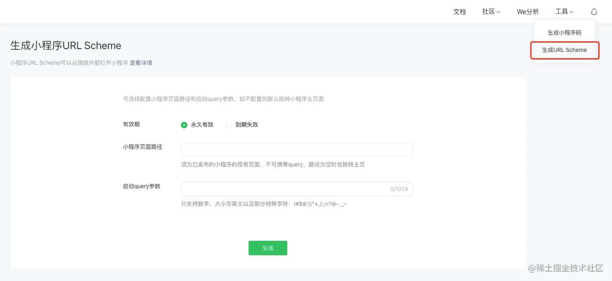

<a name="iuW1G"></a>

## 外部浏览器运行的 h5 页面

通过 `URL Scheme` 的方式来拉起微信打开指定小程序，其核心代码实现为：
`location.href = 'weixin://dl/business/?t= *TICKET*' `，其中，`TICKET` 的值为一个字符串，获取途径有三种方式

iOS 在浏览器可以直接使用 `weixin://dl/business/?t= *TICKET*` 唤起小程序，安卓不可以，必须通过 `location.href` 的形式 <a name="cvXaw"></a>

### 小程序后台生成 scheme 码



- 优点：没有开发量，可在小程序后台直接配置
- 缺点：生成 `schema` 码，跳转到小程序的参数不能动态配置，不一定能满足业务需求 <a name="SBGM3"></a>

### 云函数调用获取 scheme 码

- 小程序端：创建云函数，提供获取小程序 scheme 码 API

- H5：调用小程序云函数，通过 scheme 码打开小程序

- 优点：云开发基于 `node` 实现，完全可控。可以进行动态配置

- 缺点：云开发有一定的学习成本 <a name="wMFW5"></a>

### 调用服务端接口

- 服务端：提供获取小程序 scheme 码的接口

- H5：调用小程序云函数，通过 scheme 码打开小程序

- 优点：可进行动态配置。服务端提供的接口更加稳健，scheme 码可以存储数据库

- 缺点：需要服务端配合提供获取小程序 scheme 码的接口 <a name="B8r0x"></a>

## 其他浏览器环境

在其他浏览器中，H5 页面通过小程序 URL Scheme 码唤起，其核心代码实现为：

```html
<wx-open-launch-weapp id="launch-btn" username="小程序原始账号 ID（gh_ 开头的）" path="要跳转到的页面路径"> <!-- replace -->
   <template>
       <button style="width: 200px; height: 45px; text-align: center; font-size: 17px; display: block; margin: 0 auto; padding: 8px 24px; border: none; border-radius: 4px; background-color: #07c160; color:#fff;">打开小程序</button>
   </template>
</wx-open-launch-weapp>
```

`wx-open-launch-weapp` 为微信官方提供的一个可跳转指定小程序的按钮
