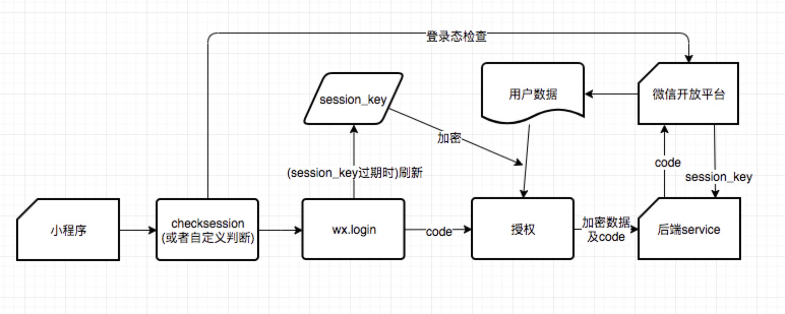
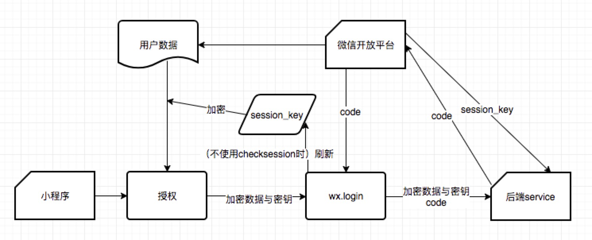

- session\_key 有有效期，有效期并没有被告知开发者，只知道用户越频繁使用小程序，session\_key 有效期越长
- 在调用 wx.login 时会直接更新 session\_key，导致旧 session\_key 失效
- 小程序内先调用 wx.checkSession 检查登录态，并保证没有过期的 session\_key 不会被更新，再调用 wx.login 获取 code。接着用户授权小程序获取用户信息，小程序拿到加密后的用户数据，把加密数据和 code 传给后端服务。后端通过 code 拿到 session\_key 并解密数据，将解密后的用户信息返回给小程序 

### 先授权获取用户信息再 login 会发生什么

- 用户授权时，开放平台使用旧的 session\_key 对用户信息进行加密。调用 wx.login 重新登录，会刷新 session\_key，这时后端服务从开放平台获取到新 session\_key，但是无法对老 session\_key 加密过的数据解密，用户信息获取失败
- 在用户信息授权之前先调用 wx.checkSession 呢？wx.checkSession 检查登录态，并且保证 wx.login 不会刷新 session\_key，从而让后端服务正确解密数据。但是这里存在一个问题，如果小程序较长时间不用导致 session\_key 过期，则 wx.login 必定会重新生成 session\_key，从而再一次导致用户信息解密失败
