- 白屏时间
- 首屏时间
- 用户可操作时间
- 页面总下载时间

***

<a name="KsgrH"></a>

## 三大核心指标

Google 在20年五月提出了网站用户体验的三大核心指标，分别为：

- LCP
- FID
- CLS

LCP 代表了页面的速度指标，虽然还存在其他的一些体现速度的指标，但是上文也说过 LCP 能体现的东西更多一些。一是指标实时更新，数据更精确，二是代表着页面最大元素的渲染时间，通常来说页面中最大元素的快速载入能让用户感觉性能还挺好。

FID 代表了页面的交互体验指标，毕竟没有一个用户希望触发交互以后页面的反馈很迟缓，交互响应的快会让用户觉得网页挺流畅。

CLS 代表了页面的稳定指标，尤其在手机上这个指标更为重要。因为手机屏幕挺小，CLS 值一大的话会让用户觉得页面体验做的很差。 <a name="oPJus"></a>

## RAIL 模型

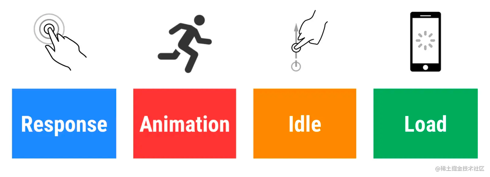 <a name="ROgfK"></a>

## 以用户为中心的性能指标

- First Paint 首次绘制（FP）
- First contentful paint 首次内容绘制 (FCP)
- Largest contentful paint 最大内容绘制 (LCP)
- First input delay 首次输入延迟 (FID)
- Time to Interactive 可交互时间 (TTI)
- Total blocking time 总阻塞时间 (TBT)
- Cumulative layout shift 累积布局偏移 (CLS) <a name="MhZIh"></a>

### FP & FCP

首次绘制，FP(First Paint)，这个指标用于记录页面第一次绘制像素的时间。

首次内容绘制，FCP(First Contentful Paint)，这个指标用于记录页面首次绘制文本、图片、非空白 Canvas 或 SVG 的时间。

这两个指标看起来大同小异，但是 FP 发生的时间一定小于等于 FCP，如下图是掘金的指标：
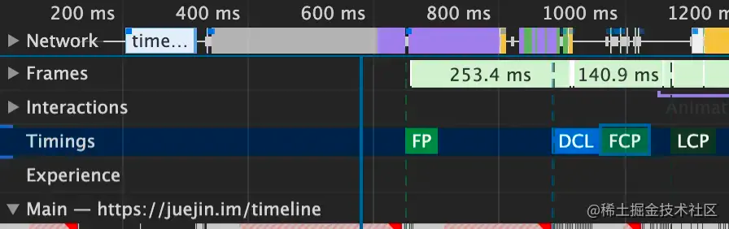
FP 指的是绘制像素，比如说页面的背景色是灰色的，那么在显示灰色背景时就记录下了 FP 指标。但是此时 DOM 内容还没开始绘制，可能需要文件下载、解析等过程，只有当 DOM 内容发生变化才会触发，比如说渲染出了一段文字，此时就会记录下 FCP 指标。因此说我们可以把这两个指标认为是和白屏时间相关的指标，所以肯定是最快越好。
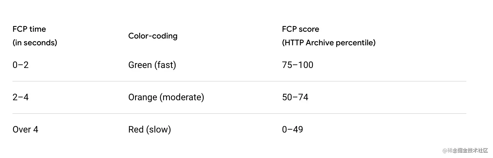上图是官方推荐的时间区间，也就是说如果 FP 及 FCP 两指标在 2 秒内完成的话我们的页面就算体验优秀。 <a name="TMyNU"></a>

### LCP

最大内容绘制，LCP（Largest Contentful Paint），用于记录视窗内最大的元素绘制的时间，该时间会随着页面渲染变化而变化，因为页面中的最大元素在渲染过程中可能会发生改变，另外该指标会在用户第一次交互后停止记录。指标变化如下图：
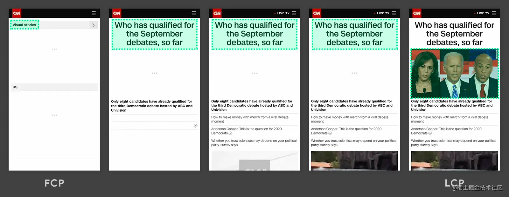

LCP 其实能比前两个指标更能体现一个页面的性能好坏程度，因为这个指标会持续更新。举个例子：当页面出现骨架屏或者 Loading 动画时 FCP 其实已经被记录下来了，但是此时用户希望看到的内容其实并未呈现，我们更想知道的是页面主要的内容是何时呈现出来的。

此时 LCP 指标是能够帮助我们实现想要的需求的。
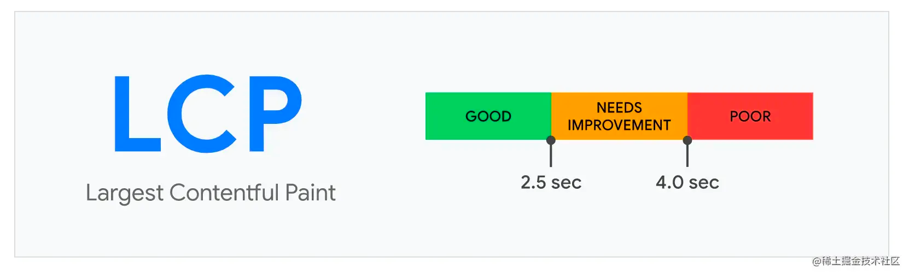
上图是官方推荐的时间区间，在 2.5 秒内表示体验优秀。 <a name="Z9Sjj"></a>

### TTI

首次可交互时间，TTI（Time to Interactive）。这个指标计算过程略微复杂，它需要满足以下几个条件

1. 从 FCP 指标后开始计算
2. 持续 5 秒内无长任务（执行时间超过 50 ms）且无两个以上正在进行中的 GET 请求
3. 往前回溯至 5 秒前的最后一个长任务结束的时间
   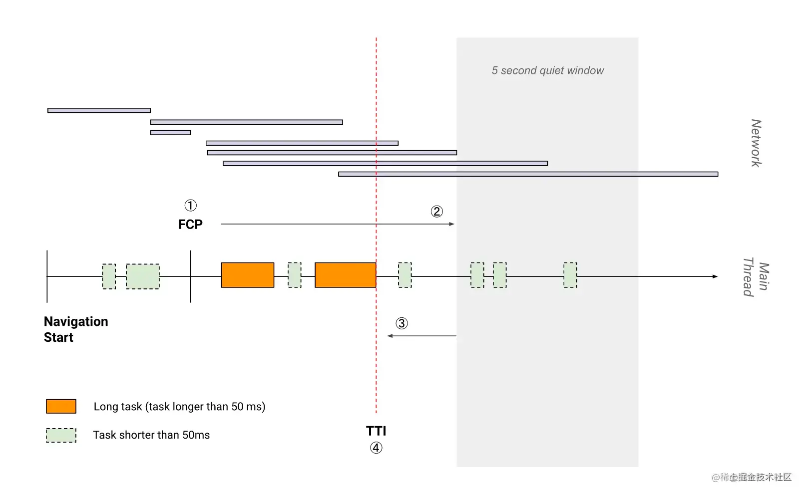
   :::tips
   这里你可能会疑问为什么长任务需要定义为 50ms 以外？
   :::
   对于用户交互（比如点击事件），推荐的响应时间是 100ms 以内。那么为了达成这个目标，推荐在空闲时间里执行任务不超过 50ms（[W3C](https://link.juejin.cn/?target=https%3A%2F%2Fwww.w3.org%2FTR%2F2017%2FWD-longtasks-1-20170907%2F) 也有这样的标准规定），这样能在用户无感知的情况下响应用户的交互，否则就会造成延迟感。

> 长任务也会在 FID 及 TBT 指标中使用到。

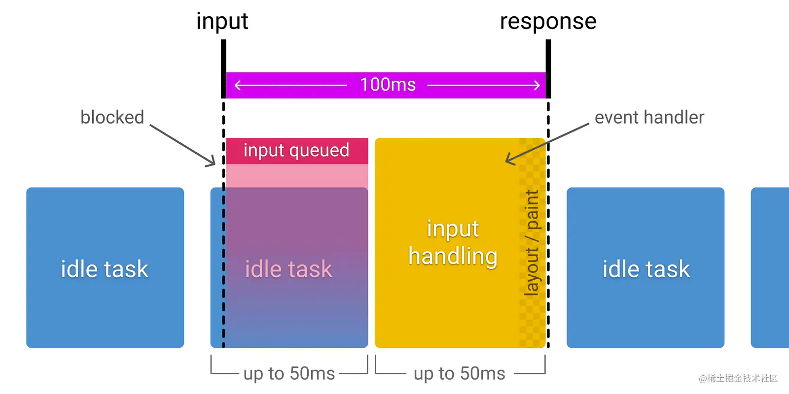
因此这是一个很重要的用户体验指标，代表着页面何时真正进入可用的状态。毕竟光内容渲染的快也不够，还要能迅速响应用户的交互。想必大家应该体验过某些网站，虽然内容渲染出来了，但是响应交互很卡顿，只能过一会才能流畅交互的情况。 <a name="pQ7fG"></a>

### FID

首次输入延迟，FID（First Input Delay），记录在 FCP 和 TTI 之间用户首次与页面交互时响应的延迟。

这个指标其实挺好理解，就是看用户交互事件触发到页面响应中间耗时多少，如果其中有长任务发生的话那么势必会造成响应时间变长。

其实在上文我们就讲过 Google 推荐响应用户交互在 100ms 以内：
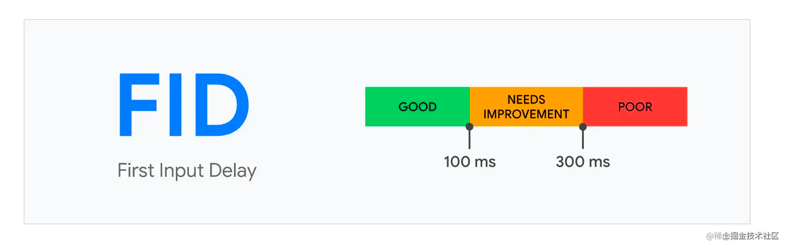 <a name="ZnYFu"></a>

### TBT

阻塞总时间，TBT（Total Blocking Time），记录在 FCP 到 TTI 之间所有长任务的阻塞时间总和。

假如说在 FCP 到 TTI 之间页面总共执行了以下长任务（执行时间大于 50ms）及短任务（执行时间低于 50ms）
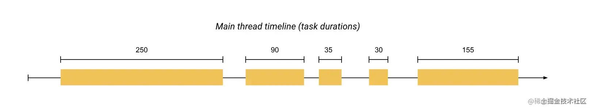
那么每个长任务的阻塞时间就等于它所执行的总时间减去 50ms
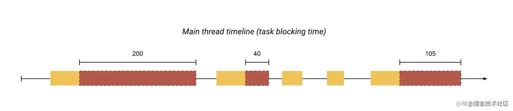
所以对于上图的情况来说，TBT 总共等于 345ms。

这个指标的高低其实也影响了 TTI 的高低，或者说和长任务相关的几个指标都有关联性。 <a name="BYHDN"></a>

### CLS

累计位移偏移，CLS（Cumulative Layout Shift），记录了页面上非预期的位移波动。
大家想必遇到过这类情况：页面渲染过程中突然插入一张巨大的图片或者说点击了某个按钮突然动态插入了一块内容等等相当影响用户体验的网站。这个指标就是为这种情况而生的，计算方式为：位移影响的面积 * 位移距离。
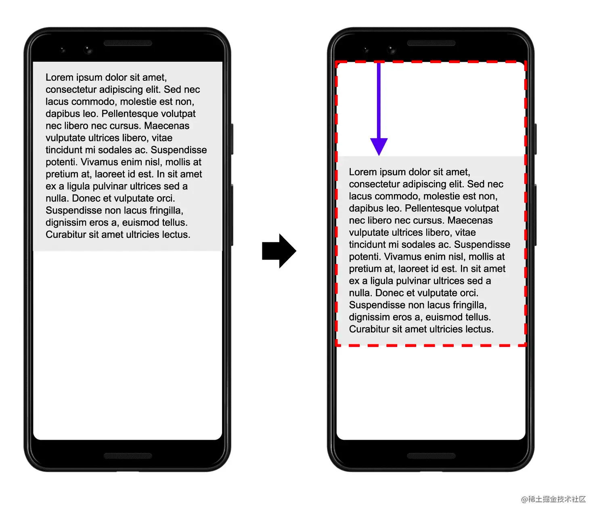
以上图为例，文本移动了 25% 的屏幕高度距离（位移距离），位移前后影响了 75% 的屏幕高度面积（位移影响的面积），那么 CLS 为 0.25 * 0.75 = 0.1875。
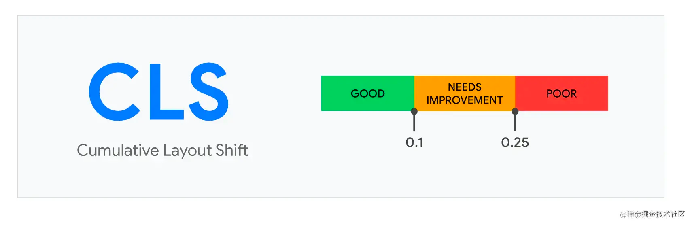

CLS 推荐值为低于 0.1，越低说明页面跳来跳去的情况就越少，用户体验越好。毕竟很少有人喜欢阅读或者交互过程中网页突然动态插入 DOM 的情况，比如说插入广告~

> 介绍完了所有的指标，接下来我们来了解哪些是用户体验三大核心指标、如何获取相应的指标数据及如何优化。

<a name="Xr9N3"></a>

## 如何获取指标

<a name="AhaXl"></a>

### Lighthouse

你可以通过安装 [Lighthouse](https://link.juejin.cn/?target=https%3A%2F%2Fchrome.google.com%2Fwebstore%2Fdetail%2Flighthouse%2Fblipmdconlkpinefehnmjammfjpmpbjk) 插件来获取如下指标
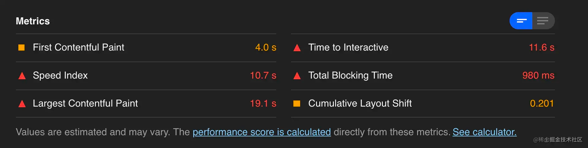 <a name="hoeVh"></a>

### web-vitals-extension

官方出品，你可以通过安装 [web-vitals-extension](https://link.juejin.cn/?target=https%3A%2F%2Fgithub.com%2FGoogleChrome%2Fweb-vitals-extension) 插件来获取三大核心指标
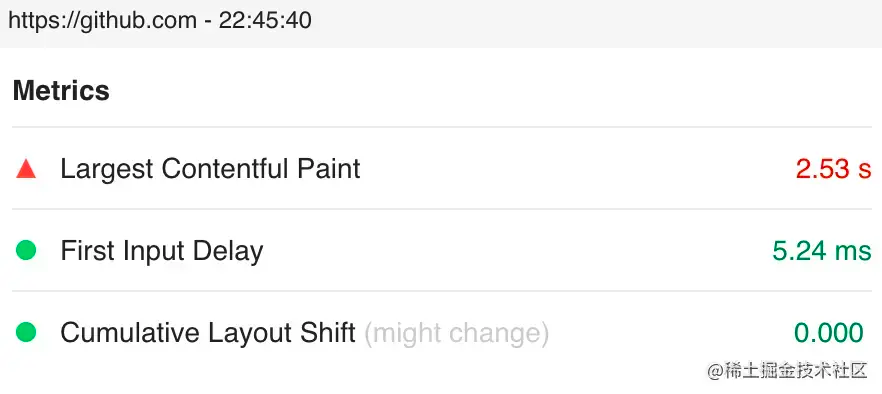 <a name="xEH9Q"></a>

### web-vitals 库

官方出品，你可以通过安装 [web-vitals](https://link.juejin.cn/?target=https%3A%2F%2Fgithub.com%2FGoogleChrome%2Fweb-vitals) 包来获取如下指标
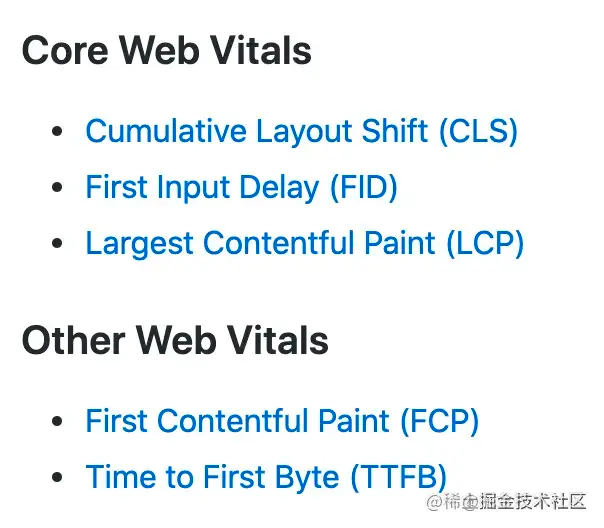
代码使用方式也挺简单：

```javascript
import {getCLS, getFID, getLCP} from 'web-vitals';

getCLS(console.log);
getFID(console.log);
getLCP(console.log);
```

<a name="igAKF"></a>

### Chrome DevTools

打开 Performance 即可快速获取如下指标
 <a name="XgCBK"></a>


<a name="baGV6"></a>


