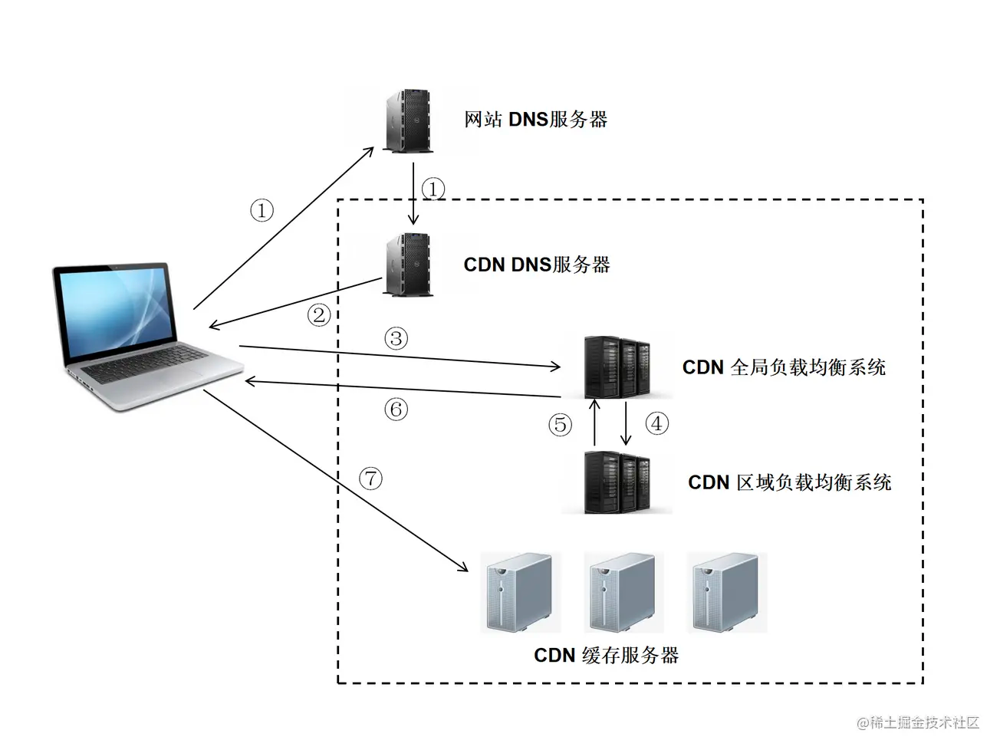

## cdn 服务器

### cdn 概念

CDN（Content Delivery Network，**内容分发网络**）是指一种通过互联网互相连接的电脑网络系统，利用最靠近每位用户的服务器，更快、更可靠地将音乐、图片、视频、应用程序及其他文件发送给用户，来提供高性能、可扩展性及低成本的网络内容传递给用户。
:::info
网站通常将其所有的服务器都放在同一个地方，当用户群增加时，公司就必须在多个地理位置不同的服务器上部署内容。为了缩短 http 请求的时间，我们应该把大量的静态资源放置的离用户近一点。
:::

典型的 cdn 系统由以下三个部分组成：

- 分发服务系统：最基本的工作单元就是：Cache 设备，cache(边缘 cache)负责直接响应最终用户的访问请求，把缓存在本地的内容快速地提供给用户。同时 cache 还负责与源站点进行内容同步，把更新的内容以及本地没有的内容从源站点获取并保存在本地。Cache 设备的数量、规模、总服务能力是衡量一个 CDN 系统服务能力的最基本地指标。
- 负载均衡系统：主要功能是负责对所有发起服务请求的用户进行访问调度，确定提供给用户的最终实际访问地址。两级调度体系分为**全局负载均衡**(GSLB)和**本地负载均衡**(SLB)。**全局负载均衡**主要根据用户就近原则，通过对每个服务节点进行"最优"判断，确定向用户提供服务的 cache 的物理位置。**本地负载均衡**主要负责节点内部的设备负载均衡
- 运营管理系统：运营管理系统分为运行管理和网络管理子系统，负责处理业务层面的与外界系统交互所必须的收集、整理、交付工作，包含客户管理、产品管理、计费管理、统计分析等功能 

### cdn 作用

CDN 一般会来托管 web 资源(包括文本、图片和脚本等)，可提供下载的资源(媒体文件、软件、文档等)，应用程序(门户网站等)。使用 CDN 来加速这些资源的访问。

1. 在性能方面，引入 CDN 的作用在于：

- 用户收到的内容来自最近的数据中心，延迟耕地，内容加载更快
- 部分资源请求分配给了 CDN，减少了服务器的负载

2. 在安全方面，CDN 有助于防御 DDOS、MITM 等网络攻击：

- 针对 DDOS：通过监控分析异常流量，限制其请求频率
- 针对 MITM：从源服务器到 CDN 节点到 ISP(Internet Service Provider)，全链路 HTTPS 通信 

### cdn 原理

CDN和DNS有着密不可分的联系。
:::info
**DNS的解析域名过程**，在浏览器输入 www.test.com 的解析过程如下:

1. 检查浏览器缓存
2. 检查操作系统缓存，常见的如hosts文件
3. 检查路由器缓存
4. 如果前几步都没没找到，会向ISP(网络服务提供商)的LDNS服务器查询
5. 如果LDNS服务器没找到，会向根域名服务器(Root Server)请求解析，分为以下几步：
   1. 根服务器返回顶级域名(TLD)服务器如.com，.cn，.org等的地址，该例子中会返回.com的地址
   2. 接着向顶级域名服务器发送请求，然后会返回次级域名(SLD)服务器的地址，本例子会返回.test的地址
   3. 接着向次级域名服务器发送请求，然后会返回通过域名查询到的目标IP，本例子会返回www.test.com的地址
   4. Local DNS Server会缓存结果，并返回给用户，缓存在系统中
      :::

**用户未使用 CDN 缓存资源的过程：**

1. 浏览器通过DNS对域名进行解析（就是上面的DNS解析过程），依次得到此域名对应的IP地址
2. 浏览器根据得到的IP地址，向域名的服务主机发送数据请求
3. 服务器向浏览器返回响应数据

**用户使用 CDN 缓存资源的过程：**

1. 对于点击的数据的URL，经过本地DNS系统的解析，发现该URL对应的是一个CDN专用的DNS服务器，DNS系统就会将域名解析权交给CNAME指向的CDN专用的DNS服务器。
2. CND专用DNS服务器将CND的全局负载均衡设备IP地址返回给用户
3. 用户向CDN的全局负载均衡设备发起数据请求
4. CDN的全局负载均衡设备根据用户的IP地址，以及用户请求的内容URL，选择一台用户所属区域的区域负载均衡设备，告诉用户向这台设备发起请求
5. 区域负载均衡设备选择一台合适的缓存服务器来提供服务，将该缓存服务器的IP地址返回给全局负载均衡设备
6. 全局负载均衡设备把服务器的IP地址返回给用户
7. 用户向该缓存服务器发起请求，缓存服务器响应用户的请求，将用户所需内容发送至用户终端。

如果缓存服务器没有用户想要的内容，那么缓存服务器就会向它的上一级缓存服务器请求内容，以此类推，直到获取到需要的资源。最后如果还是没有，就会回到自己的服务器去获取资源。

:::info
**CNAME(意为：别名)：**
在域名解析中，实际上解析出来的指定域名对应的IP地址，或者该域名的一个CNAME，然后再根据这个CNAME来查找对应的IP地址。
::: 

### cdn 的使用场景

- **网站站点/应用加速**

站点或者应用中大量静态资源的加速分发，建议将站点内容进行动静分离，动态文件可以结合云服务器 ecs，静态资源如各类图片、html、css、js 文件等，使用 cdn 服务器存储，可以有效加速内容加载速度，轻松搞定网站图片、短视频等内容的分发

- **移动应用加速**

移动 app 更新文件(apk 文件)分发，移动 app 内图片、页面、短视频、UGC 等内容的优化加速分发。提供 httpDNS 服务，避免 DNS 劫持并获得实时精确的 DNS 解析结果，有效缩短用户访问时间，提升用户体验

- **视音频点播/大文件下载分发加速**
- **视频直播加速**

直播本质上是使用流媒体进行传送，CDN 也是支持流媒体传送的，所以直播完全可以使用 CDN 来提高访问速度。CDN 在处理流媒体的时候与处理普通静态文件有所不同，普通文件如果在边缘节点没有找到的话，就会去上一层接着寻找，但是流媒体本身数据量就非常大，如果使用回源的方式，必然会带来性能问题，所以流媒体一般采用的都是主动推送的方式来进行。
:::tips
简单来说，CDN 服务器相当于顺丰快递分布于全国各地的仓库，主仓库将快递运送到这些分仓库，用户可以就近取货，由此加快了速度。
::: 

### cdn 基本思路

- 尽可能避开互联网上有可能影响数据传输速度和稳定性的瓶颈和环节，使内容传输的更快、更稳定；
- 通过在网络各处放置节点服务器，在现有的互联网基础之上构成一层智能虚拟网络；
- cdn 系统能够实时地根据网络流量和各节点的连接、负载情况以及到用户的距离和响应时间等综合信息，将用户的请求重新导向离用户最近的服务节点上。 

### cdn 基础架构

最简单的 cdn 网络由一个 dns 服务器和几台缓存服务器组成：

1. 当用户点击网站页面上内容的 url 时，经过本地 dns 系统解析，dns 系统最终会将域名的解析权交给 cname 指向的 cdn 专用的 dns 服务器；
   :::info
   关于 dns 解析，不一定由 dns 服务器响应，一般从缓存中读取。
   比如电脑缓存、浏览器缓存、路由器缓存、运行商缓存等。
   如果缓存中没有找到，才一级一级地查询：本地 dns -> 权限 dns -> 顶级 dns -> 根 dns。全球只有 13 台根 dns 服务器。
   :::

2. cdn 的 dns 服务器将 cdn 的全局负载均衡设备的 ip 地址返回给用户；

3. 用户向 cdn 的全局负载均衡设备发起内容 url 访问请求；

4. cdn 全局负载均衡设备根据用户的 ip 地址，以及用户请求的内容 url，选择一台用户所属区域的区域负载均衡设备，告诉用户向这台设备发起请求；

5. 区域负载均衡设备会对用户选择一台合适的缓存服务器提供服务，选择的依据包括：
   1. 根据用户 ip 地址，判断哪一台服务器距用户最近；
   2. 根据用户所请求的 url 中携带的内容名称，判断哪一台服务器上有用户所需内容；
   3. 查询各个服务器当前的负载情况，判断哪一台服务器尚有服务能力；
      :::info
      基于以上这些条件的综合分析之后，cdn 区域负载均衡设备会向 cdn 全局负载均衡设备返回一台 cdn 缓存服务器的 ip 地址
      :::

6. cdn 全局负载均衡设备把服务器的 ip 地址返回给用户；

7. 用户向 cdn 缓存服务器发起请求，缓存服务器响应用户请求，将用户所需内容传递到用户终端；如果这台 cdn 缓存服务器上并没有用户想要的内容，但是区域均衡设备依然将它发配给了用户，那么这台 cdn 服务器就要向它的上一级缓存服务器请求内容，直至追溯到网站的源服务器将内容拉到本地。 

## ssr 服务端渲染

依赖现在框架如 vue、react 框架的网站，往往会存在一定的问题，比如 vue 框架 

### vue 渲染面临的问题

首屏渲染时，要下载和解析 app.js (打包过后的 vue.js)之后，才能开始渲染页面。 

### 优化方案

- 构建层模版编译：将模版编译的任务放在了构建层中完成，而不是浏览器
- 数据无关的 prerender 的方式
- 服务端渲染：即将浏览器进行的运算的一部分转移到服务端上

通常采用服务端渲染 ssr 的方式进行优化。所谓 ssr 就是利用服务端优秀的计算能力，将一部分的页面渲染任务交给服务器端进行处理。

服务端渲染可以很好地优化首屏渲染的问题；可以根据业务需求，适当地分配客户端和服务器段的渲染部分，综合利用客户端和服务器端的计算能力，从而达到性能优化的目的。
