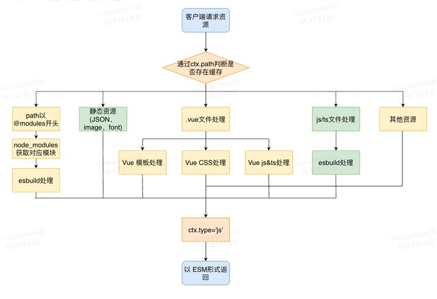
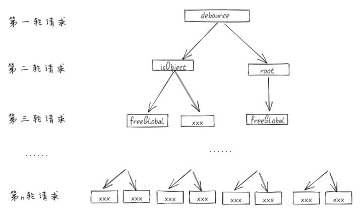
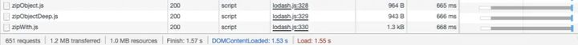
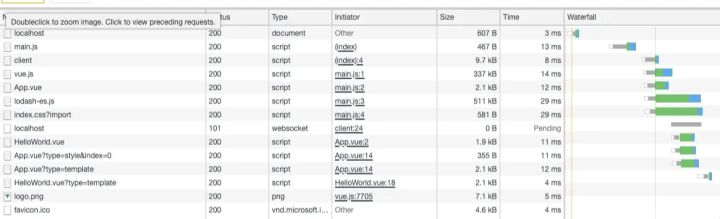
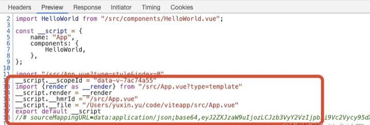

vite 的基本实现原理，就是启动一个 Koa 服务器拦截由浏览器请求 ESM 的请求。通过请求的路径找到目录下对应的文件做一定的处理最终以 ESM 的格式返回给客户端。


<a name="fe289ed9"></a>

### 依赖处理

vite 通过在一开始将应用中的模块区分为依赖和源码两类，改进了开发服务器启动时间。依赖大多为在开发时不会变动的纯 javaScript。一些较大的依赖(例如有上百个模块的组件库)处理的代价也很高。

- 依赖解析

以 Vite 官方 demo 为例，当我们请求 localhost:3000 时，Vite 默认返回 localhost:3000/index.html 的代码。而后发送请求 src/main.js。

```javascript
import { createApp } from "vue"
import App from "./App.vue"
import "./index.css"

createApp(App).mount("#app")
```


可以观察到浏览器请求 vue.js 时， 请求路径是 @modules/vue.js。在 Vite 中约定若 path 的请求路径满足 /^/@modules// 格式时，被认为是一个 node\_modules 模块。

平时开发中，webpack & rollup(rollup 有对应插件) 等打包工具会帮我们找到模块的路径，但浏览器只能通过相对路径去寻找，而如果是直接使用模块名比如：import vue from 'vue'，浏览器就会报错，这个时候就需要一个三方包进行处理。Vite 对 ESM 形式的 js 文件模块使用了 ES Module Lexer 处理。Lexer 会找到代码中以 import 语法导入的模块并以数组形式返回。Vite 通过该数组的值获取判断是否为一个 node\_modules 模块。若是则进行对应改写成 @modules/:id 的写法。

重写完路径后，浏览器会发送 path 为 /@modules/:id 的对应请求，接下来会被 Vite 客户端做一层拦截来解析模块的真实位置。

首先正则匹配请求路径，如果是/@modules  开头就进行后续处理，否则就跳过。若是，会设置响应类型为 js，读取真实模块路径内容，返回给客户端。

客户端注入本质上是创建一个 script 标签（type='module'），然后将其插入到 head 中，这样客户端在解析 html 是就可以执行代码了

```javascript
export const moduleRE = /^\/@modules\//
// plugin for resolving /@modules/:id requests.
app.use(async (ctx, next) => {
  if (!moduleRE.test(ctx.path)) {
    return next()
  }
  // path maybe contain encode chars
  const id = decodeURIComponent(ctx.path.replace(moduleRE, ''))
  ctx.type = 'js'
  const serve = async (id: string, file: string, type: string) => {
    // 在代码中做一个缓存，下次访问相同路径直接从 map 中获取 304 返回
    moduleIdToFileMap.set(id, file)
    moduleFileToIdMap.set(file, ctx.path)
    debug(`(${type}) ${id} -> ${getDebugPath(root, file)}`)
    await ctx.read(file)
    return next()
  }
 }
  // 兼容 alias 情况
  const importerFilePath = importer ? resolver.requestToFile(importer) : root
  const nodeModulePath = resolveNodeModuleFile(importerFilePath, id)
  // 如果是个 node_modules 的模块，读取文件。
  if (nodeModulePath) {
   return serve(id, nodeModulePath, 'node_modules')
  }
})
```

- 依赖预构建

依赖预构建主要有两个目的：

1. CommonJS 和 UMD 兼容性:：开发阶段中，Vite 的开发服务器将所有代码视为原生 ES 模块。因此，Vite 必须先将作为 CommonJS 或 UMD 发布的依赖项转换为 ESM。
2. 性能： Vite 将有许多内部模块的 ESM 依赖关系转换为单个模块，以提高后续页面加载性能。

Vite 使用 esbuild 在初次启动开发服务器前把检测到的依赖进行预构建。Vite 基于 ESM，在使用某些模块时，由于模块依赖了另一些模块，依赖的模块又基于另一些模块。会出现页面初始化时一次发送数百个模块请求的情况。

以 lodash-es 为例，代码中以 import { debounce } from 'lodash' 导入一个命名函数时候，并不是只下载包含这个函数的文件，而是有一个依赖图。
可以看到一共发送了 651 个请求。一共花费 1.53s。

Vite 为了优化这个情况，利用 esbuild 在启动的时候预先把 debounce 用到的所有内部模块全部打包成一个 bundle，这样就浏览器在请求 debounce 时，便只需要发送一次请求了

可以看到预构建后，只发送了 14 个请求。


<a name="3c87507c"></a>

### 静态资源加载

当请求的路径符合 imageRE, mediaRE, fontsRE 或 JSON 格式，会被认为是一个静态资源。静态资源将处理成 ESM 模块返回。

```typescript
// src/node/utils/pathUtils.ts
const imageRE = /\.(png|jpe?g|gif|svg|ico|webp)(\?.*)?$/
const mediaRE = /\.(mp4|webm|ogg|mp3|wav|flac|aac)(\?.*)?$/
const fontsRE = /\.(woff2?|eot|ttf|otf)(\?.*)?$/i
export const isStaticAsset = (file: string) => {
  return imageRE.test(file) || mediaRE.test(file) || fontsRE.test(file)
}

// src/node/server/serverPluginAssets.ts
app.use(async (ctx, next) => {
  if (isStaticAsset(ctx.path) && isImportRequest(ctx)) {
    ctx.type = 'js'
    ctx.body = export default ${JSON.stringify(ctx.path)} // 输出是path
    return
  }
  return next()
})

export const jsonPlugin: ServerPlugin = ({ app }) => {
  app.use(async (ctx, next) => {
    await next()
    // handle .json imports
    // note ctx.body could be null if upstream set status to 304
    if (ctx.path.endsWith('.json') && isImportRequest(ctx) && ctx.body) {
      ctx.type = 'js'
      ctx.body = dataToEsm(JSON.parse((await readBody(ctx.body))!), {
        namedExports: true,
        preferConst: true
      })
    }
  })
}
```

<a name="534a9bc8"></a>

### 文件缓存

当 Vite 遇到一个 .vue 后缀的文件时。由于 .vue 模板文件的特殊性，它被拆分成 template, css, script 模块三个模块进行分别处理。最后会对 script, template, css 发送多个请求获取

如上图中请求 App.vue 获取 script 代码 , App.vue?type=template 获取 template, App.vue?type=style。这些代码都被插入在 App.vue 返回的代码中。


<a name="0ce1095c"></a>

### js/ts 处理

vite 使用 esbuild 将 ts 转译到 js，约是 tsc 速度的 20 ～ 30 倍，同时 hmr 更新反应到浏览器的时间会小于 50ms。但是，由于 esbuild 转换 ts 到 js 对于类型操作仅仅是擦除，所以完全保证不了类型正确，因此需要额外校验类型，比如使用：tsc --noEmit。

将 ts 转译成 js 后，浏览器便可以利用 ESM 直接拿到 js 资源。

<a name="d41d8cd9"></a>

##
