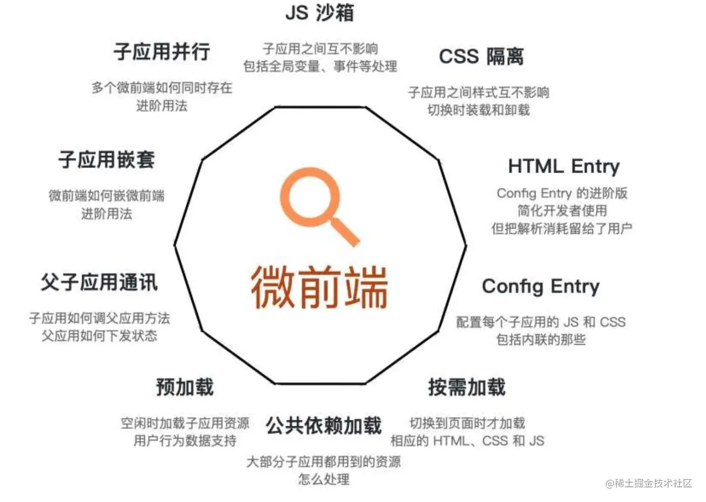
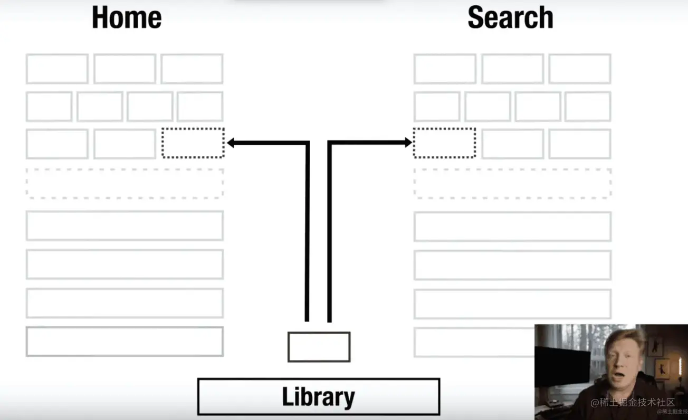
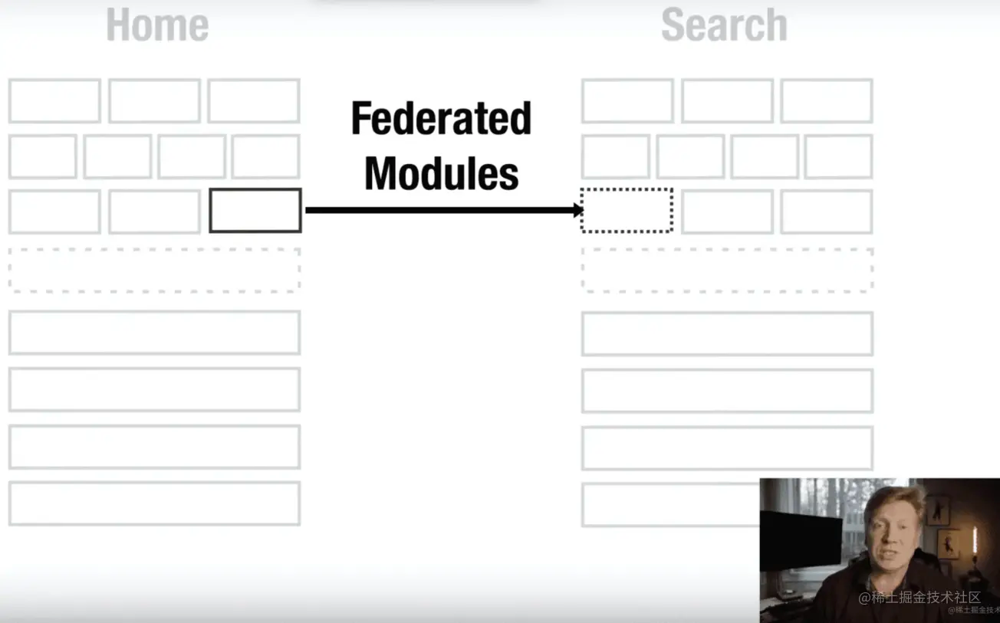
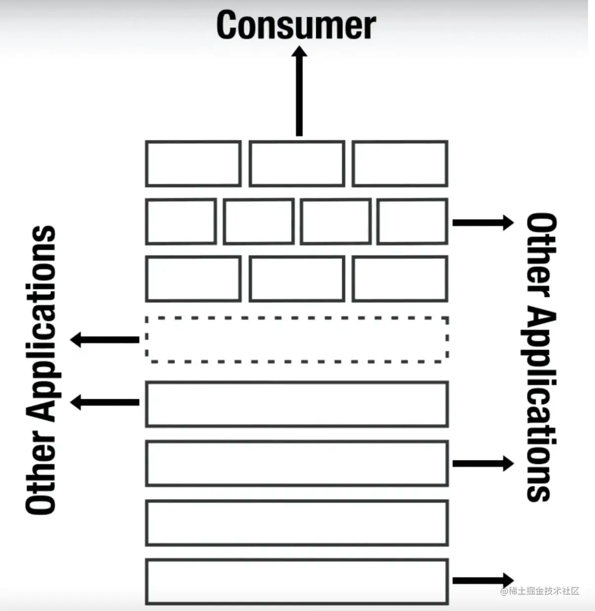

<a name="CY4Z8"></a>

## 内置静态资源构建能力 Asset Modules

在 `webpack v5` 之前，通常使用：

- `raw-loader` 将文件导入为字符串
- `url-loader` 将文件作为 `data URI` 内联到 `bundle` 中
- `file-loader` 将文件发送到输出目录

资源模块类型 `asset module type`，通过添加 `4` 种新的模块类型，来替换所有这些 `loader`：

- `asset/resource` 发送一个单独的文件并导出 `URL`，用来替代 `file-loader`
- `asset/inline` 导出一个资源的 `data URI`，用来替代 `url-loader`
- `asset/source` 导出资源的源代码，用来替代  `raw-loader`
- `asset` 在导出一个 `data URI` 和发送一个单独的文件之间自动选择，之前通过使用 `url-loader`，并且配置 <a name="mm9My"></a>

## 构建速度优化

在 `webpack v4` 中，为了让我们的构建速度更快，通常需要借助一些插件或者额外的配置来达到目的。

1. `cache-loader`webpack5不推荐：针对于一些耗时的工作进行缓存，如：缓存 `babel-loader` 的工作
2. `terser-webpack-plugin`webpack5推荐 / `uglifyjs-webpack-plugin`webpack5不推荐 的 `cache`、`parallel`

我们会借助 `cache-loader` 去对我们构建过程中消耗性能比较大的部分进行缓存，缓存会存放到硬盘中的 `node_modules/.cache/cache-loader`，缓存的读取和存储是会消耗性能的，所以只推荐用在性能开销大的地方。

```javascript
module.exports = {
  module: {
    rules: [
      {
        test: /.js$/,
        use: ['cache-loader', 'babel-loader'],
        include: path.resolve('src')
      }
    ]
  }
}
```

`terserPlugin` 继承自 `uglifyjsPlugin`，可以通过开启插件的 `cache` 以及 `parallel` 特性来加快压缩(`terserPlugin` 是 `webpack` 推荐及内置的压缩插件，`cache` 与 `parallel` 默认为开启状态)，缓存路径在 `node_modules/.cache/terser-webpack-plugin`

```javascript
module.exports = {
  minimizer: {
    new TerserPlugin({
      cache: true, // 开启该插件的缓存，默认缓存到 node_modules/.cache
      parallel: true, // 开启多线程压缩，提高压缩效率
      exclude: /node_modules/
    })
  }
}
```

到了 `webpack5`，可以通过 `cache` 特性来将 `webpack` 工作缓存到硬盘中，存放的路径为 `node_modules/.cache/webpack`

```javascript
module.exports = {
  cache: {
    // 1. 将缓存类型设置为文件系统
    type: 'filesystem', // 默认是 memory
    // 2. 将缓存文件命名为 .temp_cache, 默认路径是 node_modules/.cache/webpack
    cacheDirectory: path.resolve(__dirname, '.temp_cache')
  }
}
```

<a name="iQnAq"></a>

## 包代码体积优化

<a name="hsi64"></a>

### 代码分割

为了让我们打出来的包体积更加小，颗粒度更加明确。我们经常会用到 `webpack` 的代码分割 `split chunk` 以及 `tree shaking`。
在 `webpack5` 中，这两者也得到了优化与加强。

```javascript
module.exports = {
  optimization: {
    splitChunks: {
      chunks: 'async', // 只对异步加载的模块进行处理
      minSize: {
        javascript: 30000, // 模块要大于 30kb 才会进行提取
        style: 50000, // 模块要大于 50kb 才会进行提取
      },
      minRemainingSize: 0, // 代码分割后，文件 size 必须大于该值
      maxSize: 0,
      minChunks: 1, // 被提取的模块必须被引用 1 次
      maxAsyncRequests: 6, // 异步加载代码时同时进行的最大请求数不得超过 6 个
      maxInitialRequests: 4, // 入口文件加载时最大同时请求数不得超过 4 个
      automaticNameDelimiter: '~', // 模块文件名称前缀
      cacheGroups: {
        // 分组，可继承或覆盖外层配置
        // 来自 node_modules 的模块提取到一个公共文件中(由 v4 的 vendors 改名而来)
        defaultVendors: {
          test: /[\\/]node_modules[\\/]/,
          priority: -10
        },
        // 其他不是 node_modules 中的模块，如果有被引用不少于 2 次，那么也提取出来
        default: {
          minChunks: 2,
          priority: -20,
          reuseExistingChunk: true
        }
      }
    }
  }
}
```

<a name="Qiftp"></a>

### Tree shaking

`webpack` 不能 `100%` 安全地进行 `tree-shaking`，`**webpack v4**`** 有些场景是不能将无用代码剔除的**。有些模块导入，只要被引入，就会对应用程序产生重要的影响。一个很好的例子：全局样式表、设置全局配置的 `javaScript` 文件。

`webpack` 认为这样的文件有 "副作用"。具有副作用的文件不应该做 `tree-shaking`，因为这将破坏整个应用程序。`webpack` 的设计者清楚地认识到：不知道哪些文件有副作用的情况下打包代码的风险，因此 `webpack4` 默认地将所有代码视为有副作用。这可以保护你免于删除必要的文件，但这意味着 `webpack` 的默认行为实际上是不进行 `tree-shaking`。
:::info
`webpack v5` 默认会进行 `tree-shaking`
:::

<a name="Hl4o5"></a>

#### 内部模块 tree shaking

`webpack v4` 没有分析模块的导出和导入之间的依赖关系。`webpack v5` 有一个新选项 `optimization.innerGraph`，它在生产模式下默认启用，它对模块中的符号运行分析以找出从导出到导入的依赖关系。

```javascript
import { something } from './something'

function usingSomething() {
  return something
}

export function test() {
  return useingSomething()
}
```

`innerGraph` 将计算出 `something` 仅在使用 `test` 导出时使用。这允许将更多导出标记为未使用并从包中省略更多代码。
当 `"sideEffects": false` 设置，这允许省略甚至更多的模块。在此示例中，`./something` 当 `test` 导出未使用时将被省略。 <a name="TVQ03"></a>

#### commonjs tree shaking

`webpack4` 曾经不进行对 `commonjs` 导出和 `require` 调用时的导出使用分析。`webpack5` 增加了对一些 `commonjs` 构造的支持，允许消除未使用的 `commonjs` 导出，并从 `require` 调用中跟踪引用的导出名称。 <a name="AYeHi"></a>

### 剔除 npm 包内部针对 node.js 模块自动引用的 polyfills

`webpack v4` 编译引入 `npm` 包，有些 `npm` 包里面包含针对 `nodejs` 的 `polyfills`，实际上前端浏览器是不需要的。

```javascript
import CryptoJS from 'crypto-js'
const md5Password = CryptoJS.MD5('123123')
console.log(md5Password)
```

`webpack v4` 引入 `crypto-js` 模块会自动引入 `polyfill：crypto-browerify`，但是部分代码是不需要的，`webpack v5` 默认会自动剔除

`webpack v5` 编译中，会出现 `polyfill` 添加提示，如果不需要 `node polufill`，按照提示 `alias` 设置为 `false` 即可

```javascript
module.exports = {
  resolve: {
    // 1. 不需要 node polyfills
    alias: {
      crypto: false
    },
    // 2. 手动添加 polyfills
    // fallback: {
    //   crypto: require.resolve('crypto-browserify')
    // }
  }
}
```

到了 `webpack v5`，我们需要清楚自己的项目需要引入哪些 `node polyfill`。 <a name="GWjtc"></a>

## 持久化缓存

<a name="hbKWt"></a>

#### 内容哈希

在 `webpack v4` 是**根据代码的结构**生成 `chunkhash`，现在 `webpack v5` 将完全根据内容生成 `chunkhash`，比如修改了内容的注释或者变量则不会引起 `chunkhash` 的变化，让浏览器继续使用缓存 <a name="BOOGe"></a>

#### 默认启用长期缓存算法

在 `webpack v4` 中，`chunkId` 与 `moduleId` 都是**自增 id**。也就是只要我们新增一个模块，那么代码中 `module` 的数量就会发生变化，从而导致 `moduleId` 发生变化，于是文件内容就发生了变化。`chunkId` 也是如此，新增一个入口的时候，`chunk` 数量的变化造成了 `chunkId` 的变化，导致了文件内容变化。

`webpack v4` 可以通过设置 `optimization.moduleIds = "hashed"` 与 `optimization.namedChunks = true` 来解决 这些问题，但是都存在性能损耗等副作用。

```javascript
module.exports = {
  moduleIds: 'hashed',
  namedChunks: true
}
```

而 `webpack v5` 在 `production` 模式下 `optimization.chunkIds` 和 `optimization.moduleIds` 默认会设为 `'deterministic'`，`webpack` 会采用新的算法来计算确定性的 `chunkId` 和 `moduleId`。 <a name="wkxmn"></a>

## 模块联邦

模块联邦制，使 `javaScript` 应用得以从另一个 `javaScript` 应用中动态地加载代码 --- 同时共享依赖。项目分为：消费者 `Host`，被消费者 `Remote`。功能实现主要依靠 `ModuleFederationPlugin` 插件。

```javascript
new ModuleFedrationPlugin({
  name: '', // 名称，唯一 id
  library: {}, // 以什么形式暴露，比如 umd
  filename: '',  // 输出的入口文件名称
  exporse: {}, // 要输出的组件或方法
  shared: [] // 要共享的依赖
})
```

```javascript
const HtmlWebpackPlugin = require('html-webpack-plugin')
const ModuleFederationPlugin = require('webpack/lib/container/ModuleFederationPlugin')

module.exports = {
  // ...
  plugins: [
    new ModuleFederationPlugin({
      // 1. name 当前应用名称，需要全局唯一
      name: 'app_one_remote',
      // 2. remotes 可以讲其他项目的 name 映射到当前项目中
      remotes: {
        app_two: 'app_two_remote',
        app_three: 'app_three_remote'
      },
      // 3. exposes 表示导出的模块，只有在此声明的模块才可以作为远程依赖被使用
      exposes: {
        AppContainer: './src/App'
      },
      // 4. shared 可以让远程加载的模块对应依赖改为使用本地项目的 react/react-dom
      shard: ['react', 'react-dom', 'react-router-dom']
    }),
    new HtmlWebpackPlugin({
      template: './public/index.html',
      chunks: ['main']
    })
  ]
}
```

如果设置了 `remotes: { app_two: 'app_two_remote' }`，在代码中就可以直接利用以下方式直接从对方应用调用模块

```javascript
import { Search } from 'app_two/Search'
// app_two/Search 来自于 app_two 的配置
```

```javascript
export default {
  plugins: [
    new ModuleFederationPlugin({
      name: 'app_two',
      library: {
        type: 'var',
        name: 'app_two'
      },
      filename: 'remoteEntry.js',
      exposes: {
        Search: './src/Search'
      },
      shared: ['react', 'react-dom']
    })
  ]
}
```

正因为 `Search` 被 `exposes` 被导出，因此可以使用 `[name]/[exposes_name]` 这个模块，这个模块对于被引用应用来说是一个本地模块。实际上是直接将一个应用的 `bundle`，应用于另一个应用，动态分发 `runtime` 自模块给其他应用。 <a name="SAqZk"></a>

### 结论

`webpack v5` 的模块联邦让 `webpack` 达到了线上 `runtime` 的效果，让代码直接在项目间利用 `cdn` 直接共享，不再需要本地安装 `npm` 包、构建再发布了。 <a name="QCqbH"></a>

### 微前端架构存在的问题


在当前的为前端架构中，通过了许多技术手段，如：应用分离、`js` 沙箱、`css` 隔离、预加载等实现了整个架构的使用。但对于公共依赖加载目前并没有非常好的解决方案。
通常处理公共依赖的方式是使用 `npm`，将依赖抽离作为 `lib` 公共库进行管理。应用之中使用到 `lib`，将其安装到项目中，再通过 `webpack` 打包上线

这种方式虽然解决了公共依赖问题，但还是需要走本地编译，无法做到项目运行时 `runtime` 调用。

使用 `webpack v5` 模块联邦就可以解决这一问题。

将公共依赖配置成一个远程模块，子应用只需要根据需求动态加载。这种方式可以做到运行时调用，不用考虑本地编译问题。

这就衍生出一种新的应用形态：中心应用，这个应用具备模块输出的能力，可以在线动态的分发运行时的子模块。

:::info
模块联邦在一定程度上弥补了为前端架构中的不足，让为前端架构日益趋向成熟。在可以预见的未来，前端工程化将进入一个新的阶段。
::: <a name="Cp2Ww"></a>

## 对 web 平台功能的全新支持

<a name="ZrL4Q"></a>

#### JSON 模块

- 使用自定义的 `JSON` 解析器：`Rule.parser.parse` 中指定
- 未使用的属性也会被 `optimization.usedExports` 优化丢弃
- 属性会被 `optimization.mangleExports` 优化打乱 <a name="kwUCJ"></a>

#### ProgressPlugin 插件的优化

不仅可以统计模块编译的进度，也可以统计 **入口** 和 **依赖** <a name="ZOl0x"></a>

#### 自动添加唯一命名

`webpack v4` 中，多个 `webpack` 同时运行时可能会在同一个 `html` 页面上发生冲突，这时候会在 `output.jsonpFunction` 配置提供一个自定义的。

`webpack v5` 中，会从 `package.json name` 中自动推断出一个唯一的构建名称，并将其作为 `output.uniqueName` 的默认值，可将 `output.jsonpFunction` 删除。 <a name="Cl9b2"></a>

#### TypeScript 类型

`webpack v5` 可以从源码中生成 `typescript` 类型，并通过 `npm` 包暴露它们 <a name="vOwNF"></a>


