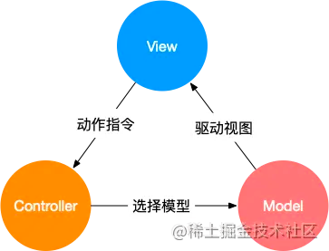
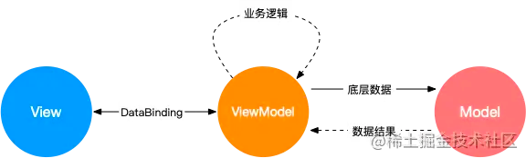

:::info
MVC 代表模型、视图、控制器，视图可以直接访问模型。所以，视图里面会包含模型信息，MVC 关注的是模型不变，所以 MVC 中，模型不依赖视图，但是视图依赖模型。

MVVM 代表模型、视图和 VM，VM 作为模型和视图之间的桥梁，当模型层数据发生改变，VM 会检测到并通知视图层进行响应的修改。
:::

MVC、MVP 和 MVVM 是三种常见的软件架构设计模式，主要通过分离关注点的方式来组织代码结构，优化开发效率。

在开发单页面应用时，往往一个路由页面对应了一个脚本文件，所有的页面逻辑都在一个脚本文件里。页面的渲染、数据的获取，对用户事件的响应所有的应用逻辑都混合在一起，这样在开发简单项目时，可能看不出什么问题，如果项目变得复杂，那么整个文件就会变得冗长、混乱，这样对项目开发和后期的项目维护是非常不利的。

## MVC

MVC 通过分离 Model、View 和 Controller 的方式来组织代码结构。其中 View 负责页面的显示逻辑，Model 负责存储页面的业务数据，以及对相应数据的操作。并且 View 和 Model 应用了观察者模式，当 Model 层发生改变的时候它会通知有关 View 层更新页面。Controller 层是 View 层和 Model 层的纽带，它主要负责用户与应用的响应操作，当用户与页面产生交互的时候，Controller 中的事件触发器就开始工作了，通过调用 Model 层，来完成对 Model 的修改，然后 Model 层再去通知 View 层更新。&#x20;

## MVVM

MVVM 分为 Model、View、ViewModel：

- Model代表数据模型，数据和业务逻辑都在Model层中定义；
- View代表UI视图，负责数据的展示；
- ViewModel负责监听Model中数据的改变并且控制视图的更新，处理用户交互操作；

Model和View并无直接关联，而是通过ViewModel来进行联系的，Model和ViewModel之间有着双向数据绑定的联系。因此当Model中的数据改变时会触发View层的刷新，View中由于用户交互操作而改变的数据也会在Model中同步。

这种模式实现了 Model和View的数据自动同步，因此开发者只需要专注于数据的维护操作即可，而不需要自己操作DOM。
 

## MVP

MVP 模式与 MVC 唯一不同的在于 Presenter 和 Controller。在 MVC 模式中使用观察者模式，来实现当 Model 层数据发生变化的时候，通知 View 层的更新。这样 View 层和 Model 层耦合在一起，当项目逻辑变得复杂的时候，可能会造成代码的混乱，并且可能会对代码的复用性造成一些问题。MVP 的模式通过使用 Presenter 来实现对 View 层和 Model 层的解耦。MVC 中的Controller 只知道 Model 的接口，因此它没有办法控制 View 层的更新，MVP 模式中，View 层的接口暴露给了 Presenter 因此可以在 Presenter 中将 Model 的变化和 View 的变化绑定在一起，以此来实现 View 和 Model 的同步更新。这样就实现了对 View 和 Model 的解耦，Presenter 还包含了其他的响应逻辑。
