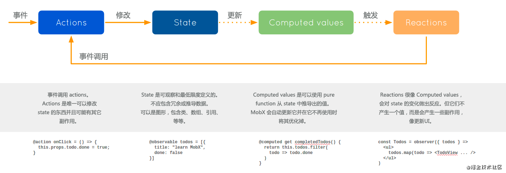

## mobx 工作流程

## mobx 数据流向

触发 action，在 action 中修改 state，通过 computed 拿到 state 的计算值，自动触发对应的 reactions，这里包含 autorun，渲染视图等
:::warning
有一点需要注意：相对于 react 来说，mobx 没有一个全局的状态树，状态分散在各个独立的 store 中
::: 

## mobx 工作原理

使用 proxy 来拦截数据的访问，一旦值发生变化，将会调用 react 的 render 方法来实现重新渲染视图的功能或者触发 autorun 等 

## mobx 核心原理

通过 action 触发 state 变化，进而触发 state 的衍生对象 (computed value & Reactions)
