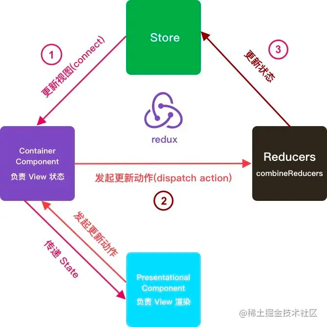

## 

## redux 原理

:::info
**通俗解释:**

1. 首先，用户通过 View 发出 Action，发出方式用到了 Dispatch 方法
2. Store 调用 Reducer，传入两个参数：当前 State 和收到的 Action，Reducer 会返回新的 State
3. State 一旦有变化，Store 就会调用监听函数，来更新 View

以 store 为核心，可以把它看成数据存储中心，但是他要更改数据的时候不能直接修改，数据修改更新的角色由 Reducers 来担任，store 只做存储，中间人，当Reducers 的更新完成以后会通过 store 的订阅来通知 react component，组件把新的状态重新获取渲染，组件中也能主动发送 action，创建 action 后这个动作是不会执行的，所以要 dispatch 这个 action，让 store 通过 reducers 去做更新React Component 就是 react 的每个组件。
::: 

### 概念介绍

- Store

保存数据的地方，你可以把它看作一个容器，整个应用只能有一个 Store

- State

Store 对象包含所有数据，如果想得到某个时点的数据，就要对 Store 生成快照，这种时点的数据集合，就叫 State

- Action

State 的变化，会导致 View 的变化。但是，用户接触不到 State，只能接触到 View。所以，State 的变化必须是 View 导致的。Action 就是 View 发出的通知，表示 State 应该要发生变化了

- Action Creator

View 要发送多少种消息，就会有多少种 Action。如果都手写，会很麻烦，所以我们定义一个函数来生成 Action，这个函数就叫 Action Creator

- Reducer

Store 收到 Action 以后，必须给出一个新的 State，这样 View 才会发生变化。这种 State 的计算过程就叫做 Reducer。Reducer 是一个函数，它接受 Action 和当前 State 作为参数，返回一个新的 State

- Dispatch

是 View 发出 Action 的唯一方法 

### 三个原则

- 单个事件来源

整个应用程序状态存储在单个存储的对象中

- 状态只读

更改状态的唯一方法就是触发一个动作

- 中间件

action -> reducer -> action -> middlewares -> reducer 

## redux 中的异步处理方式

#### redux-thunk

:::success
优点：

1. 体积小：redux-thunk 的实现方式很简单，只有不到 20 行代码

2. 使用简单：redux-thunk 没有引入像 redux-saga 或者 redux-observable :额外的范式，上手简单
   :::
   :::danger
   缺点：

3. 样板代码过多：与 redux 本身一样，通常一个请求需要大量的代码，而且很多都是重复性质的

4. 耦合严重：异步操作与 redux 的 action 耦合在一起，不方便管理

5. 功能孱弱：有一些实际开发中常用的功能需要自行封装
   ::: 

#### redux-saga

:::success
优点：

1. 异步解耦：异步操作被转移到单独的 saga.js 中，不再是掺杂在 action.js 或 component.js 中

2. action 摆脱 thunk function：dispatch 的参数依然是一个纯粹的 action(FSA)，而不是充满"黑魔法"的 thunk function

3. 异常处理：受益于 generator function 的 saga 实现，代码异常/请求失败，都可以直接通过 try/catch 语法直接捕获处理

4. 功能请打：redux-saga 提供了大量的 saga 辅助函数和 effect 创建器供开发者使用，开发者无须封装或者简单封装即可使用

5. 灵活：redux-saga 可以将多个 saga 串行/并行组合起来，形成一个非常实用的异步 flow

6. 易测试，提供了各种 case 的测试方案，包括 mock task，分之覆盖等等
   :::
   :::danger
   缺点：

7. 额外的学习成本：redux-saga 不仅在使用难以理解的 generator function，而且有数十个 API，学习成本远超 redux-thunk，最重要的是额外的学习只服务于这个库，与 redux-observable 不同，redux-observable 的背后是基于 rxjs 的一整套思想

8. 体积庞大：代码略大，接近 2000 行，min 版 25kb 左右

9. 功能过剩：实际上并发控制等功能很难用到，但是我们依然需要引入这些代码

10. ts 支持不友好：yield 无法返回 TS 类型
    ::: 

### redux 属性传递

react-redux 数据传输∶ view-->action-->reducer-->store-->view。看下点击事件的数据是如何通过 redux 传到 view 上：

- view 上的 AddClick 事件通过mapDispatchToProps 把数据传到 action ---> click:()=>dispatch(ADD)
- action 的 ADD 传到 reducer 上
- reducer 传到 store 上 const store = createStore(reducer);
- store 再通过 mapStateToProps 映射穿到 view 上 text:State.text
