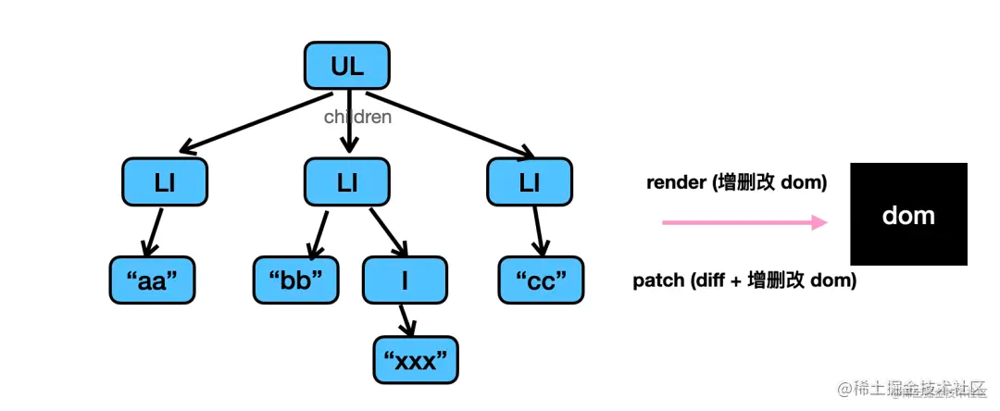
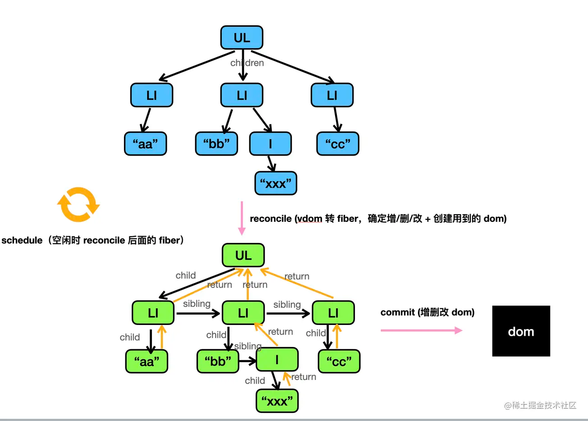

在 v16 之前的 React 里，是直接递归遍历 vdom，通过 dom api 增删改 dom 的方式来渲染的。但当 vdom 过大，频繁调用 dom api 会比较耗时，而且递归又不能打断，所以有性能问题。

<a name="POcFz"></a>

## 

后来就引入了 fiber 架构，先把 vdom 树转成 fiber 链表，然后再渲染 fiber。

 <a name="hkeRd"></a>

## 概述

react fiber 是对核心算法的一次重新实现，随着应用变得越来越庞大，整个更新渲染的过程开始变得吃力，大量的组件渲染会导致主进程长时间被占用，导致一些动画或高频操作出现卡顿和掉帧的情况。其中的关键点就是**同步阻塞**。在之前的调度算法中，react 需要实例化每个类组件，生成一颗组件树，使用**同步递归**的方式进行遍历渲染，而这个过程中最大的问题就是**无法暂停和恢复**。

- 在 react 16 将调度算法进行了重构，将之前的 stack reconciler 重构成新版的 fiber reconciler，变成了具有链表和指针的**单链表树遍历算法**。通过指针映射，每个单元都记录着遍历当下的上一步和下一步，从而使遍历变得可以被暂停和重启。
- 可以理解为任务分割调度算法，主要是将以前同步更新渲染的任务分割成一个个独立的小任务，根据不同的优先级，将小任务分散到浏览器的空闲时间执行，充分利用主进程的事件循环机制

***

<a name="WoocU"></a>

## 什么是 fiber

- fiber 是一种基于浏览器的**单线程调度算法**
- fiber 是一个执行单元，每次执行完一个执行单元，react 就会检查还剩多少事件，如果没有时间则将控制权转让

> 利用浏览器的 requestIdleCallback api 实现，其中如果浏览器一直很忙(如：1000 / 60 ~ 16ms 时间间隔内都有任务执行)，则会判断 requestIdleCallback 的 timeout 函数，如果超过 timeout 的值，或者该回调中的任务的优先级较高，则会在下一帧强制执行回调中的任务，避免卡顿现象。

:::warning
利用 requestIdleCallback 的回调可以充分的通过利用浏览器空闲时间来解决任务调度问题，由于 requestIdleCallback 的兼容性很差，所以 react 采用了 messageChannel 模拟实现了这一 api 的功能
:::

- fiber 是一种数据结构，react fiber 就是采用链表实现的，每个虚拟 dom 都可以表示为 fiber
- fiber 实现了自己的组件调用栈，它以链表的形式遍历组件树，可以灵活的暂停、继续和丢弃执行的任务
  :::info
  浏览器很忙的时候，如 1000 / 60 ～ 16ms 时间间隔内都有任务执行，则会通过判断 requestIdleCallback 的 timeout
  ::: <a name="XfUva"></a>

## react 任务的优先级

1. Immediate：最高优先级，这个优先级的任务应该被马上执行，不能中断
2. UserBlocking：这些任务一般是用户交互的结果，需要即时得到反馈
3. Normal：不需要用户立即就感受到变化，比如网络请求
4. Low：这些任务可以延后，但是最终也需要执行
5. Idle：可以被无限期延后 <a name="tX5RZ"></a>

## fiber 解决的问题/fiber 的背景

- 为了使 react 渲染过程中可以被中断，可以将控制权交还给浏览器，可以让位给高优先级的任务，浏览器空闲后再恢复渲染
- 对于计算量较大的 js 计算或者 dom 计算，就不会显得特别卡断，而是一帧一帧的有规律的执行任务
- react 16.x 之前采用的是递归 diff，想要中断递归是很困到难的。为了解决这个问题，我们将大型计算拆分成一个个小型计算，然后按照执行顺序异步调用，这样就不会长时间霸占线程，UI 也能够在两次计算执行的间隙进行更新，从而给用户及时的反馈 <a name="ebu4e"></a>

## fiber 的执行流程

1. 用户操作引起 setState 被调用，进而初始化一些数据结构
2. 根据优先级插入队列相应位置，初始化两个更新的队列
3. 开始进行任务分片调度，首先更新每个 fiber 的优先级，当 fiber 返回 null 时找到父级节点，然后将所有变化归到 root
4. 把当前的更新添加到调度任务中，根据当前是否异步渲染，作异步调用
5. 判断浏览器空闲时，完成下一个分片的工作，如果没有工作完毕，将会放弃
6. 执行调和阶段和调度阶段 <a name="FiAqV"></a>

## fiber 实现原理

- 拆分：把渲染过程拆分成多个小任务
- 检查：每次执行完一个小任务，就去队列中检查是否有新的响应需要处理
- 继续执行：如果有就执行优化及更高的响应时间，如果没有则继续执行后续任务 <a name="inxO8"></a>

## fiber 的数据结构

fiber 其实指的是一种数据结构，它可以利用 javaScript 对象来表示：

```javascript
const fiber = {
	stateNode, // 节点实例
  child, // 子节点
  sibling, // 兄弟节点
  return, // 父节点
}
```

fiber 是一个链表，有 child 和 sibling 属性，指向第一个子节点和相邻的兄弟节点，从而构成 fiber tree。return 属性指向其父节点

- 更新队列，updateQueue 是一个链表，有 first 和 last 两个属性，指向第一个和最后一个 update 对象
- 每个 fiber 有一个属性 updateQueue 指向其对应的更新队列
- 每个 fiber (当前 fiber 可以称为 current)有一个属性 alternate，开始时指向一个自己的 clone 体，update 的变化会线更新到 alternate 上，当更新完毕，alternate 替换 current <a name="z5p0p"></a>

## fiber 的基本规则

- 调和阶段

找出需要更新的工作 (diff fiber tree)，就是一个计算阶段，计算结果可以被缓存，也可被打断

- 交付阶段

提交所有更新并渲染，为了防止页面都懂，不能被打断
