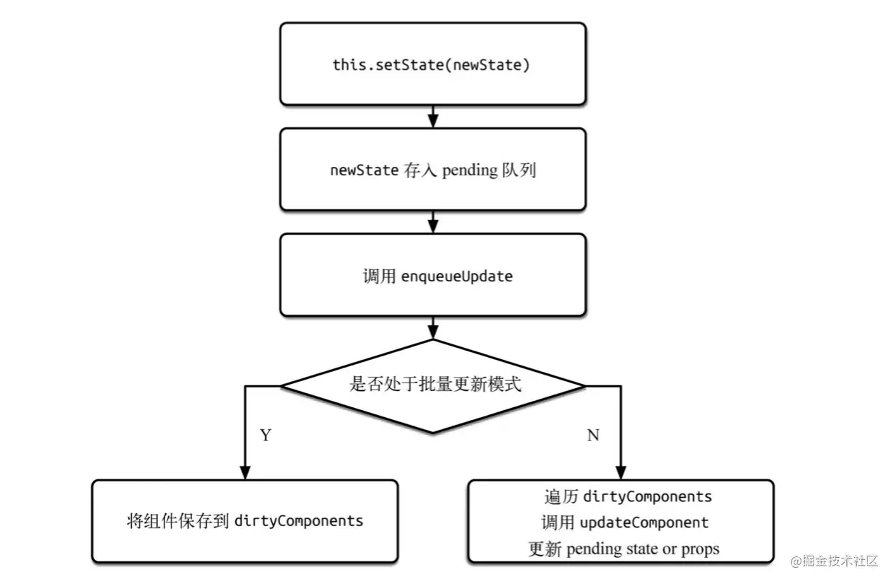

<a name="oBA5a"></a>

## setState 之后发生了什么

<a name="HXVkQ"></a>

### 简单版本

react 利用状态队列机制实现了 setState 的"异步"更新，避免频繁的重复更新 state。首先将新的 state 合并到状态更新队列中，然后根据更新队列和 shouldComponentUpdate 的状态来判断是否需要更新组件。 <a name="yJh1d"></a>

### 复杂版本

1. enqueueSetState 将 state 放入队列中，并调用 enqueueUpdate 处理需要更新的 Component
2. 如果组件当前正处于 update 事务中，则先将 Component 存入 dirtyComponent 中，否则调用 batchedUpdates 处理
3. batchedUpdates 发起一次 transaction.perform() 事务
4. 开始执行事务初始化、运行、结束三个阶段
   1. 初始化：事务初始化阶段没有注册方法，因此无方法要执行
   2. 运行：执行 setState 时传入的 callback 方法
   3. 结束：更新 isBatchingUpdates 为 false，并执行 FLUSH\_BATCHED\_UPDATES 这个 wrapper 中的 close 方法，FLUSH\_BATCHED\_UPDATES 在 close 阶段，会循环遍历所有的 dirtyComponents，调用 updateComponent 刷新组件，并执行它的 pendingCallbacks，也就是 setState 中设置的 callback



***

<a name="LYSey"></a>

## setState 是同步还是异步

setState 有时表现为异步，有时表现为同步

setState 只在 **合成事件 **和 **钩子函数 **中是"异步"的，在 **原生事件 **和 **setTimeout** 中都是同步的

setState 的"异步"并不是说内部由异步代码实现，其本身执行的过程和代码都是同步的，只是 **合成事件** 和 **钩子函数** 的调用顺序在更新之前，导致在合成事件和钩子函数中没法立马拿到更新后的值，形成所谓的 "异步"，当然可以通过**第二个参数** setState(partialState, callback) 中的 callback 拿到更新后的结果

setState 的批量更新优化也是建立在 "异步"(合成事件、钩子函数)之上的，在 **原生事件** 和 **setTimeout **中不会批量更新。在"异步"中如果对同一个值进行 setState，setState 的批量更新策略会对其进行覆盖，取最后一次的执行，如果是同时 setState 多个不同的值，在更新时会对其进行合并批量更新 <a name="kocyt"></a>

### 为什么 setState 不设计为同步的

- 保持内部的一致性和状态的安全性

state、props、refs 一致性

- 性能优化

react 会对依据不同的调用源，给不同的 setState 调用分配不同的优先级。调用源包括：事件处理、网络请求、动画

- 更多的可能性

异步获取数据后，统一渲染页面，保持一致性

***

<a name="LCTa8"></a>

## setState 批量更新的过程是什么

调用 setState 时，组件的 state 并不会立即改变，setState 只是把要修改的 state 放入一个队列，react 会优化真正的执行实际，并处于性能原因，会将 react 事件处理程序中的多次 setState 的状态修改并合并成一次状态修改。最终更新只产生一次组件及其子组件的重新渲染，这对于大型应用程序中的性能提升至关重要

***

<a name="v3o1p"></a>

## setState 的第二个参数作用是什么

setState 的第二个参数是一个可选的回调函数。这个回调函数将在组件重新渲染后执行。等价于在 componentDidUpdate 生命周期内执行。通常建议用 componentDidUpdate 来代替此方式。在这个回调函数中可以拿到更新后的 state 的值。

***

<a name="bJtnG"></a>

## 在 shouldComponentUpdate 中使用 setState 会发生什么

当调用 setState 的时候，实际上会将新的 state 合并到状态更新队列中，并对 partialState 以及 \_pendingStateQueue 更新队列进行合并操作。最终通过 enqueueUpdate 执行 state 更新。
如果在 shouldComponent 中使用 setState，会使得 state 队列(\_pendingStateQueue)不为 null，从而调用 updateComponent 方法，updateComponent 中会继续调用 shouldComponentUpdate，因此会造成死循环。

***

<a name="x4MVA"></a>

## setState 和 replaceState 的区别

:::info
**总结：**&#x20;
setState 是修改其中的部分状态，相当于 Object.assign，只是覆盖，不会减少原来的状态。而 replaceState 是完全替换原来的状态，相当于赋值，将原来的 state 替换为另一个对象，如果新状态属性减少，那么 state 中就没有这个状态了。
::: <a name="IHDSq"></a>

### setState

setState 用于设置状态对象，用法如下：

```javascript
setState(object nextState[, function callback])
```

- nextState，将要设置的新状态，该状态会和当前的state合并
- callback，可选参数，回调函数。该函数会在setState设置成功，且组件重新渲染后调用。

合并 nextState 和当前 state，并重新渲染组件。setState 是 React 事件处理函数中和请求回调函数中触发UI更新的主要方法。 <a name="rZ2U7"></a>

### replaceState

replaceState 方法与 setState 类似，但是方法只会保留 nextState 中的状态，原 state 不在 nextState 中的状态都会被删除，用法如下：

```javascript
replaceState(object nextState[, function callback])
```

- nextState，将要设置的新状态，该状态会替换当前的state。
- callback，可选参数，回调函数。该函数会在replaceState设置成功，且组件重新渲染后调用。

***

<a name="X5G1r"></a>

## 为什么不能直接使用 this.state 改变数据

setState 通过一个队列机制来实现 state 更新。当执行 setState 的时候，会将需要更新的 state 合并后放入状态队列，而不会立刻更新 this.state。队列机制可以高效的批量更新 state，如果不通过 setState 而直接修改 this.state，那么该 state 将不会被放入状态队列中，当下次调用 setState 并对状态队列进行合并时，将会忽略之前被直接修改的 state，而造成无法预知的错误。
