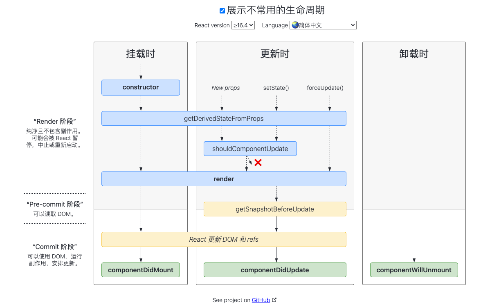
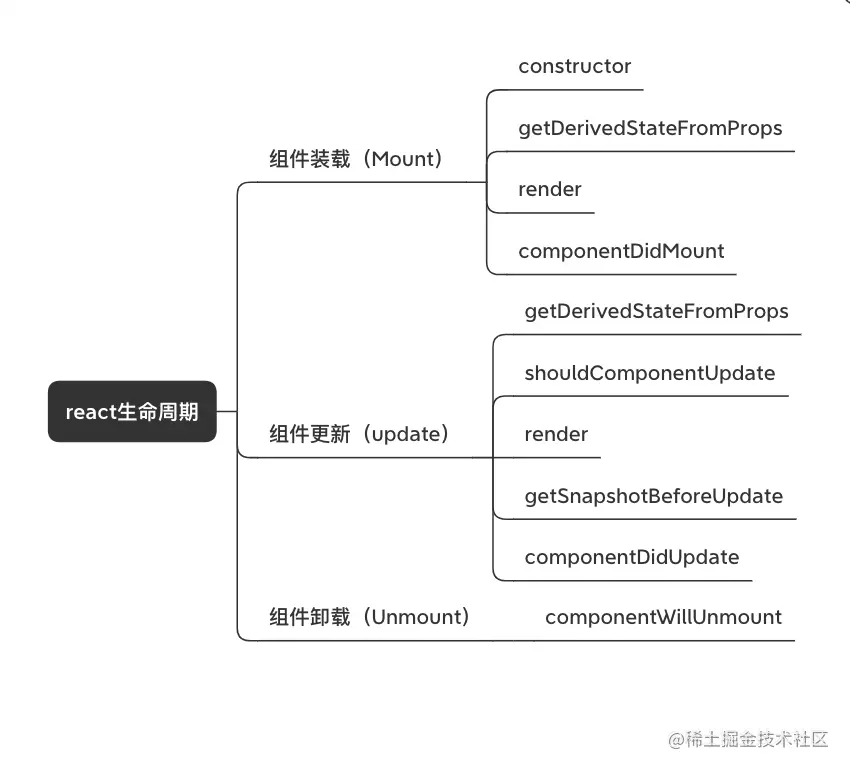
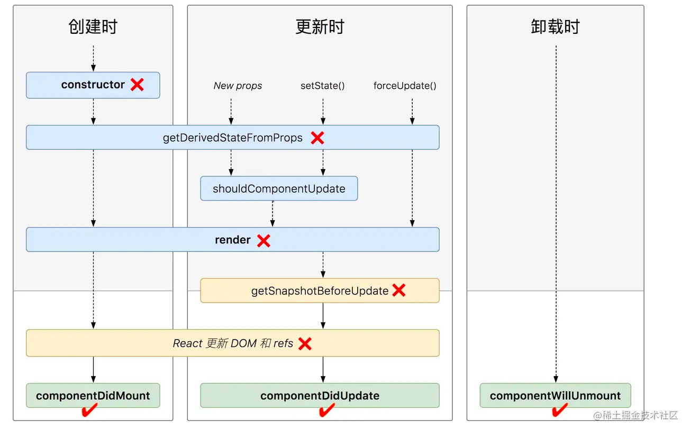

<a name="D1A6O"></a>

## 官方图解



:::info
**执行过程：**

- 挂载阶段，首先执行 `constructor` 构造方法，来创建组件
- 创建完成之后，就会执行 `render` 方法，该方法会返回需要渲染的内容
- 随后，`React` 会将需要渲染的内容挂载到 `DOM` 树上
- 挂载完成之后就会执行 `componentDidMount` 生命周期函数
- 如果我们给组件创建一个 `props`（用于组件通信）、调用 `setState`（更改 `state` 中的数据）、调用 `forceUpdate`（强制更新组件）时，都会重新调用 `render` 函数
- `render` 函数重新执行之后，就会重新进行 `DOM` 树的挂载
- 挂载完成之后就会执行 `componentDidUpdate` 生命周期函数
- 当移除组件时，就会执行 `componentWillUnmount` 生命周期函数
  ::: <a name="U61d0"></a>

## 挂载阶段

- **constructor**

组件状态的初始化，用来读取初始 `state` 和 `props` 以及绑定 `this` 上下文。通常只会在初始化时运行一次

- **static getDerivedStateFromProps **不常用

会在调用 `render` 方法之前调用，并且在初始挂载及后续更新时都会被调用。它应返回一个对象来更新 `state`，如果返回 `null` 则不更新任何内容。
:::info
此方法配合 `componentDidUpdate` 使用，可以覆盖 `componentWillReceiveProps` 所有用法
:::

- **render**

该方法是 `class` 组件中唯一必须实现的方法，同时 `render` 应该为纯函数。当 `render` 被调用时，它会检查 `this.props` 和 `this.state` 的变化并返回相应的渲染内容

- **componentDidMount**

会在组件挂载后(插入 `DOM` 树中)立即调用
:::info
如果在该生命周期直接调用 `setState`，将会触发额外渲染，但此渲染会发生在浏览器更新屏幕之前
:::

:::warning
**注意：下述生命周期方法即将过时，在新代码中应该避免使用它们**

- [UNSAFE\_componentWillMount](https://zh-hans.reactjs.org/docs/react-component.html#unsafe_componentwillmount)：该生命周期会在 render 之前调用(如果在此调用 `setState`，将不会触发重渲染，而是进行 `state` 合并)，所以此时的 `state` 不是最新的，在 `render` 中才可以获取更新后的 `state`
  ::: <a name="XRZyT"></a>

## 更新阶段

- **static getDerivedStateFromProps **不常用

会在调用 `render` 方法之前调用，并且在初始挂载及后续更新时都会被调用。它应返回一个对象来更新 `state`，如果返回 `null` 则不更新任何内容。
:::info
此方法配合 `componentDidUpdate` 使用，可以覆盖 `componentWillReceiveProps` 所有用法
:::

- **shouldComponentUpdate**

返回一个布尔值，用来判断使用触发重渲染
:::info
此方法仅作为性能优化的方式而存在。尽量使用 `PureComponent` 组件，而不是手动编写 `shouldComponentUpdate`，因为 `PureComponent` 会对 `props` 和 `state` 进行浅层比较
:::

- **render**

在更新阶段也会触发此生命周期

- **getSnapshotBeforeUpdate **不常用

会在最近一次渲染输出(提交到 `DOM` 节点)之前调用。它会在组件发生更改之前从 `DOM` 中捕获一些信息(如：滚动位置)。此生命周期方法的任何返回值都将作为参数传递给 `componentDidUpdate`
:::info
返回值会作为 `componentDidUpdate` 的第三个参数
:::

- **componentDidUpdate**

会在更新后被立即调用，首次渲染将不会执行此方法。当组件更新后，可以在此处对 `DOM` 进行操作。如果对更新前后的 `props` 进行了比较，那么可以选择在此处进行网络请求
:::warning

- 可以在该生命周期中直接调用 `setState`，但 `setState` 必须被包裹在一个条件语句中，否则会导致死循环
- 如果 `shouldComponentUpdate` 返回值为 `false`，将不会调用 `componentDidUpdate`
  :::


:::warning
**注意：下述方法即将过时，在新代码中应该避免使用它们**

- [UNSAFE\_componentWillUpdate](https://zh-hans.reactjs.org/docs/react-component.html#unsafe_componentwillupdate)
- [UNSAFE\_componentWillReceiveProps](https://zh-hans.reactjs.org/docs/react-component.html#unsafe_componentwillreceiveprops)
  ::: <a name="slP8w"></a>

## 卸载阶段

- **componentWillUnmount**

会在组件卸载及销毁之前直接调用。通常在此方法中执行必要的清理操作，如清理定时器、取消网络请求、清除在 `componentDidMount` 中创建的订阅等
:::warning
`componentWillUnmount` 中不应该调用 `setState`，因为该组件将永远不会重新渲染。组件实例卸载后，将永远不会再挂载它。
::: <a name="UsgfN"></a>

## 错误处理

当渲染过程，生命周期，或子组件的构造函数中抛出错误时，会调用如下方法：

- **static getDerivedStateFromError**

此生命周期会在后代组件中抛出错误后被调用。它将抛出的错误作为参数，并返回一个值以更新 state

```jsx
class ErrorBoundary extends React.Component {
  constructor(props) {
    super(props);
    this.state = { hasError: false };
  }

  static getDerivedStateFromError(error) {
    // 更新 state 使下一次渲染可以显降级 UI
    return { hasError: true };
  }

  render() {
    if (this.state.hasError) {
      // 你可以渲染任何自定义的降级  UI
      return <h1>Something went wrong.</h1>;
    }

    return this.props.children;
  }
}
```

:::warning
**注意：**`getDerivedStateFromError` 会在渲染阶段调用，因此**不允许执行副作用**。 如遇此类情况，请改用 `componentDidCatch`
:::

- **componentDidCatch**

此生命周期在后代组件抛出错误后被调用。它接收两个参数：`error`(抛出的错误)，`info`(带有 `componentStack key` 的对象，其中包含有关组件引发错误的栈信息)。`componentDidCatch` 会在 “提交” 阶段被调用，因此**允许执行副作用**。通常用于记录错误之类的情况

```jsx
class ErrorBoundary extends React.Component {
  constructor(props) {
    super(props);
    this.state = { hasError: false };
  }

  static getDerivedStateFromError(error) {
    // 更新 state 使下一次渲染可以显示降级 UI
    return { hasError: true };
  }

  componentDidCatch(error, info) {
    // "组件堆栈" 例子:
    //   in ComponentThatThrows (created by App)
    //   in ErrorBoundary (created by App)
    //   in div (created by App)
    //   in App
    logComponentStackToMyService(info.componentStack);
  }

  render() {
    if (this.state.hasError) {
      // 你可以渲染任何自定义的降级 UI
      return <h1>Something went wrong.</h1>;
    }

    return this.props.children;
  }
}
```

**在开发模式下，错误会冒泡至 window**。这意味着任何 `window.onerror` 或 `window.addEventListener('error', callback)` 会中断这些已经被 `componentDidCatch` 捕获的错误。
**在生产模式下，错误不会冒泡**。这意味着任何根错误处理器只会接受那些没有显示地被 `componentDidCatch` 捕获的错误
:::warning
**注意：**如果发生错误，可以通过调用 `setState` 使用 `componentDidCatch` 渲染降级 `UI`，但在未来的版本中将不推荐这样做。可以使用静态方法 `getDerivedStateFromError` 来处理降级渲染
::: <a name="sHTVD"></a>

## 总结

 <a name="sBapQ"></a>

### 不能使用 setState 的生命周期


:::warning
其中打 **❌ **的是不能使用 setState 的，打 ✅ 的是能用 setState 的
::: <a name="t7fn1"></a>

### state 触发更新的生命周期

1. `shouldComponentUpdate`
2. `componentWillUpdate`
3. `componentDidUpdate` <a name="rMqtD"></a>

### props 触发更新的生命周期

1. `shouldComponentUpdate`
2. `componentWillUpdate`
3. `componentDidUpdate`
4. `static componentWillReceiveProps`
