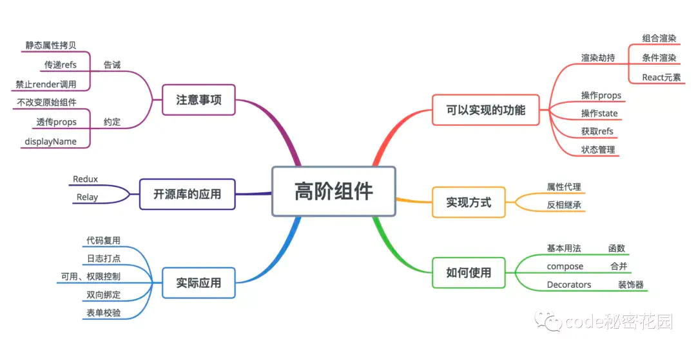

高阶组件就是一个函数，且该函数接受一个组件作为参数，并返回一个新的组件

<a name="xWoDt"></a>

## 属性代理

函数返回一个自己定义的组件，然后在 render 函数中返回要包裹的组件，这样就可以代理所有传入的 props，并且决定如何渲染

```jsx
function proxyHoc(WrapperComponent) {
	return class extends Component {
  	render() {
    	return <WrapperComponent {...this.props} />
    }
  }
}
```

:::tips
对比原生组件增强的功能：

1. 可操作所有传入的 props
2. 可操作组件的生命周期
3. 可操作组件的 static 静态方法
4. 可以获取 refs
   ::: <a name="ghmzm"></a>

## 反向继承

返回一个组件，继承原组件。在 render 函数中调用原组件的 render 方法，由于继承了原组件，因此可以通过 this 访问到原组件的 **生命周期**、**props**、**state**、**render函数** 等，相比于属性代理的方式，可以操作更多的属性。

```javascript
function isHeritHoc(WrapperComponent) {
	return class extends WrapperComponent {
  	render() {
    	return super.render()
    }
  }
}
```

:::tips
对比原生组件增强的功能：

1. 可操作所有传入的 props
2. 可操作组件的生命周期
3. 可操作组件的 static 静态方法
4. 可以获取 refs
5. 可操作 state
6. 可进行渲染劫持
   ::: <a name="gAIkY"></a>

## 应用场景

<a name="YWcXm"></a>

### 可实现的功能

- 组合渲染
- 条件渲染
- 操作 props
- 获取 refs
- 状态管理
- 操作 state
- 渲染劫持 <a name="dE0mo"></a>

### 实际应用

- 日志打点
- 权限控制

```jsx
// HOC.js
function withAdminAuth(WrappedComponent) {
    return class extends React.Component {
        state = {
            isAdmin: false,
        }
        async UNSAFE_componentWillMount() {
            const currentRole = await getCurrentUserRole();
            this.setState({
                isAdmin: currentRole === 'Admin',
            });
        }
        render() {
            if (this.state.isAdmin) {
                return <WrappedComponent {...this.props} />;
            } else {
                return (<div>您没有权限查看该页面，请联系管理员！</div>);
            }
        }
    };
}

// pages/page-a.js
class PageA extends React.Component {
    constructor(props) {
        super(props);
        // something here...
    }
    UNSAFE_componentWillMount() {
        // fetching data
    }
    render() {
        // render page with data
    }
}
export default withAdminAuth(PageA);


// pages/page-b.js
class PageB extends React.Component {
    constructor(props) {
        super(props);
    // something here...
        }
    UNSAFE_componentWillMount() {
    // fetching data
    }
    render() {
    // render page with data
    }
}
export default withAdminAuth(PageB);
```

- 双向绑定
- 表单检验
- 组件渲染性能追踪

```javascript
class Home extends React.Component {
    render() {
        return <h1>Hello World.</h1>
    }
}
function withTiming(WrappedComponent) {
    return class extends WrappedComponent {
        constructor(props) {
            super(props)
            this.start = 0
            this.end = 0
        }
        UNSAFE_componentWillMount() {
            super.componentWillMount && super.componentWillMount()
            this.start = Date.now()
        }
        componentDidMount() {
            super.componentDidMount && super.componentDidMount()
            this.end = Date.now()
            console.log(`${WrappedComponent.name} 组件渲染时间为 ${this.end - this.start} ms`)
        }
        render() {
            return super.render()
        }
    }
}

export default withTiming(Home)
```

:::warning
注意：withTiming 是利用 反向继承 实现的一个高阶组件，功能是计算被包裹组件（这里是 Home 组件）的渲染时间。
:::

- 页面复用

```jsx
const withFetching = fetching => WrappedComponent => {
    return class extends React.Component {
        state = {
            data: [],
        }
        async UNSAFE_componentWillMount() {
            const data = await fetching();
            this.setState({
                data,
            });
        }
        render() {
            return <WrappedComponent data={this.state.data} {...this.props} />;
        }
    }
}

// pages/page-a.js
export default withFetching(fetching('science-fiction'))(MovieList);
// pages/page-b.js
export default withFetching(fetching('action'))(MovieList);
// pages/page-other.js
export default withFetching(fetching('some-other-type'))(MovieList);
```
