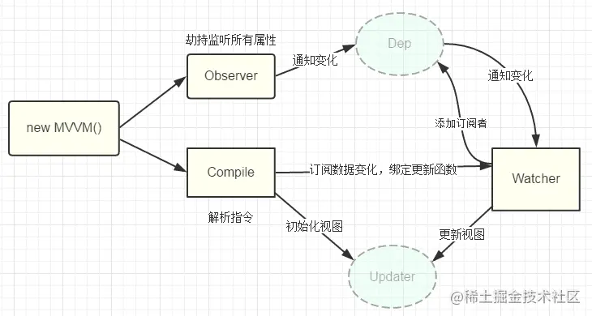

 

### 概述

通过数据劫持结合发布-订阅者模式，通过 Object.defineProperty 来拦截各个属性的 getter 和 setter，当数据发生变化时，发布消息给订阅者，触发相应的监听回调
:::info
在 vue2 中，响应式处理默认是递归的，一旦数据层级太深内存消耗会高，因此数据要尽量扁平化。
::: 

### 核心实现

- 四个核心类
  - Observer：负责将对象、数组转换为响应式的，即数据劫持的工作
  - Compile：编译模版，只要模版内引用了 data 内的属性，就创建一个 Watcher，通过 Watcher 与更新函数、渲染函数之间建立一个关系
  - Watcher：属于中间人的角色，负责依赖收集，收到的依赖是一个个 Dep 类的实例化对象
  - Dep：用于收集当前响应式对象的依赖关系，每个响应式对象都有一个 dep 实例，dep.subs = watcher\[]，当数据发生变更的时候，会通过 dep.notify() 通知各个 watcher
- 三种 watcher
  - initState 和计算属性初始化时，会触发 computed watcher 进行依赖收集
  - initState 和监听属性初始化时，会触发 user watcher 进行依赖收集
  - render 渲染时，会触发 render watcher 进行依赖收集
- 触发更新的流程
  - 组件中对响应式数据进行修改，触发 setter
  - 数据发生变更时，通过 dep.notify 通知各个 watcher
  - 遍历所有 subs，调用每个 watcher 的 update 方法
    :::info
    总结：
    vue2 源码中 src/core 有一个 observer 模块，它就是 vue2 中处理响应式的地方了，在这个模块下，observer 负责将对象、数组转换为响应式的，处理 data 中的 getter 和 setter。当 data 中的选项被访问时，会触发 getter，此时 observer 目录下的 watcher.js 模块就会开始工作，它的任务是进行依赖收集，我们收到的依赖是一个个 Dep 类的实例化对象。而 data 中的选项发生变更时，会触发 setter 的调用，在 setter 的过程中，会触发 dep.notify 函数，派发更新时间，由此实现数据的响应监听
    :::
