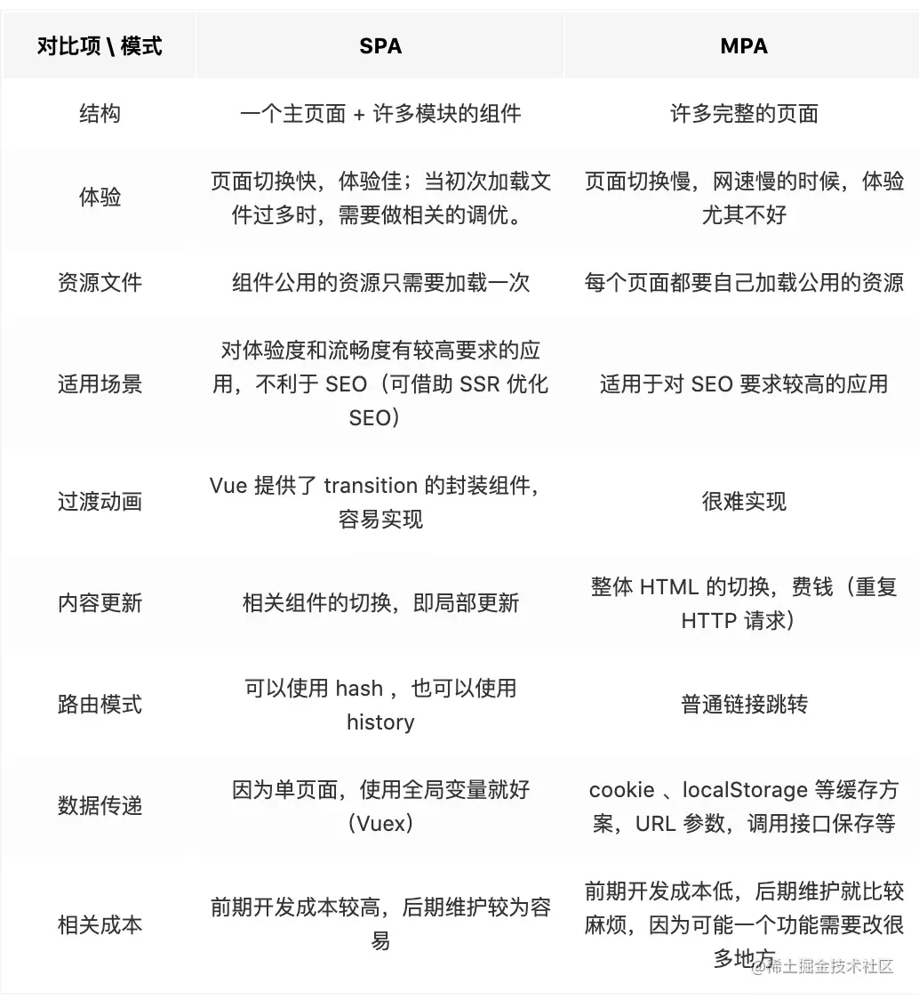

概念：

- SPA单页面应用（SinglePage Web Application），指只有一个主页面的应用，一开始只需要加载一次js、css等相关资源。所有内容都包含在主页面，对每一个功能模块组件化。单页应用跳转，就是切换相关组件，仅仅刷新局部资源。
- MPA多页面应用 （MultiPage Application），指有多个独立页面的应用，每个页面必须重复加载js、css等相关资源。多页应用跳转，需要整页资源刷新。

区别：
