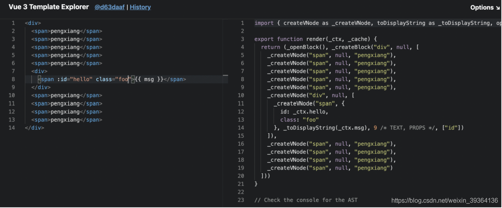
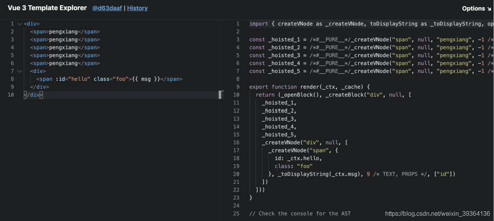
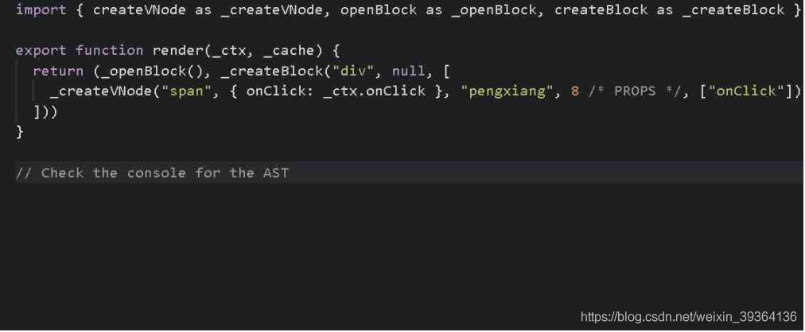
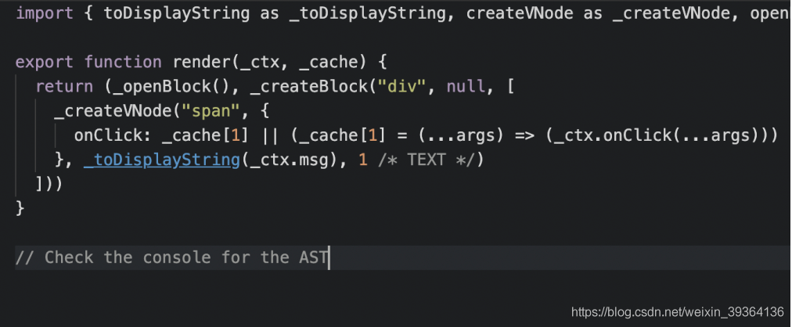

## 响应式核心 api 替换

将响应式核心的 api 从 Object.defineProperty 更换为 Proxy，重构了 Vue 的响应式系统；解决了 Vue2 中存在的响应式问题。 

### Object.defineProperty 的问题

- 无法监听数组的变化

在 vue2 中，通过重写数组原型链上的 push、pop、shift、unshift、splice、sort、reverse 7个方法来解决这个问题

- 无法监听嵌套对象属性的变化

针对嵌套对象，使用 Vue.set 来解决这一问题 

### proxy 的优势

- 拦截对象

针对整个对象，而不是对象的某个属性，因此不需要对 keys 进行遍历(即：不需要深层遍历嵌套对象)

- 拦截数组

proxy 不需要对数组方法进行重载，从而减少了维护成本

- 拦截器 api 更丰富

proxy 第 2 个参数支持 13 种拦截方法，比 Object.defineProperty 更丰富

- 对于 Map、Set、WeakMap、WeakSet 的支持 

## 全局 api 的修改

vue2 中是导出全局的 vue 对象，在单元测试中，很容易污染全局环境以及带来冲突；
vue3 中通过 createApp 创建 app 实例，一切操作修改直接转变为操作 vue 实例子 

## 更好的 tree-shaking，使代码按需编译，代码体积缩小

:::info
tree-shaking 其实就是把无用的模块进行 "剪枝"，很多没有用的 api 就不需要打包到最后的包中
:::
vue3 代码结构调整，把 vue 本身当作一个对象去操作，这样的结果是：使得一些可能不会用到的功能就会被 tree-shaking 掉，从而使代码体积变的更小 

## 模版的变化

- 作用域插槽，2.x 的机制导致作用域插槽变了，父组件会重新渲染，而 3.0 把作用域插槽改成了函数的方式，这样只会影响子组件的重新渲染，提升了渲染的性能。
- 同时，对于 render 函数的方面，vue3.0 也会进行一系列更改来方便习惯直接使用 api 来生成 vdom 

## 支持了 composition api

composition api 专门用于解决功能、数据和业务逻辑分散的问题，使项目更益于模块化开发以及后期维护

它的核心是 setup 函数，这样做的好处是：当应用变得复杂一点时，可以将功能对应的数据和业务逻辑抽离出来，方便更好的逻辑复用和代码组织 

## 更全面的 typescript 类型支持

## 组件渲染优化

vue2 父组件渲染时，子组件也会渲染；
vue3 支持单独渲染父组件、子组件 

## 更加先进的组件实现 (fragment、telport、suspense)

fragment：虚拟容器，使 template 支持多个根节点
telport：传送门，使 vue 创建的组件可以在挂载到全局根节点外
suspense：等待异步组件时渲染一些额外内容，配合 defineAsyncComponent 使用 

## 优化虚拟 DOM

- 模版编译时优化，在创建虚拟 dom 时增加了静态标记，从而提升效率
- slot 优化，将 slot 编译为 lazy 函数，将 slot 渲染的决定权交给子组件
- 模版中内联事件的提取并重用(原本每次渲染都重新生成内联函数) 

### diff 算法的优化

#### 案例

以下图为例，vue2 中的虚拟 dom 通过模版创建虚拟节点(js 对象)，然后使用虚拟节点和上一次缓存的虚拟节点进行全量对比
在 vue3 中做了改进，可以看到图中左侧动态绑定的 msg 和 span 有一处注释，官方叫它 patch flag，在与上次虚拟节点进行对比的时候 ，只要对比带有 patch flag 的节点，并且可以通过 flag 的信息得知当前节点要对比的具体内容，以图中为例，要对比的就是 text 和 props 中的 id
 

### 静态提升 hoistStatic (静态树、静态属性提升)

- vue2 中，在更新时，元素即使没有变化，也会重新创建进行渲染
- vue3 中，不参与更新的元素，会静态提升，只创建一次，下次渲染将直接复用 

#### 案例

把静态的节点进行提升，以下图为例，可以看到所有的静态 span 都被拿到了渲染函数体外面，也就是说应用在第一次的启动被创建了一次后，之后这些虚拟节点会在每次渲染的时候被不停的复用，这样就免去了重复的创建节点，大型应用会受益于这个改动，免去了重复的创建操作，优化了运行时的内存占用
 

### 事件侦听器缓存 cacheHandles

下图是不使用 cacheHandlers，onClick 需要看成是一个动态的绑定，因为绑定的函数可能会被改变，例如：fn 原本是 data 中返回的，之后如果把它替换掉了，这在实际运行过程中是需要进行一次更新的

下图是使用 cacheHandlers，在第一次渲染时会生成一个内联的函数，在内联函数里引用当前的 fn，然后把内联函数 cache 起来，后续的更新会从缓存中读取同一个函数，因为是同一个函数，因此没有必要追踪变化，这样就神奇的把 span 变成了静态的。手写的内联函数也会被 cache 起来，这样就会避免一些没有必要的更新

当我们在组件上使用内联函数，会受益于这个改动
 

## 对外暴露了一些自定义渲染的 api

## 支持 fragement(多个根节点)
