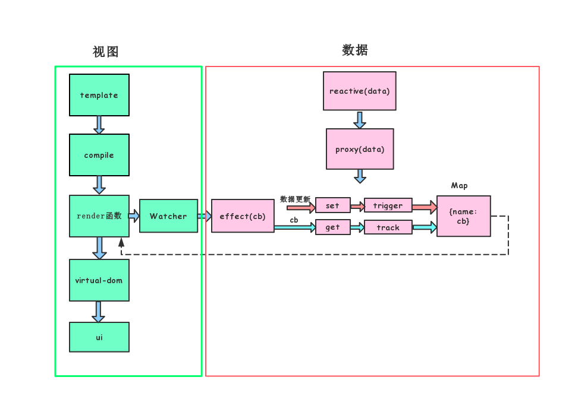
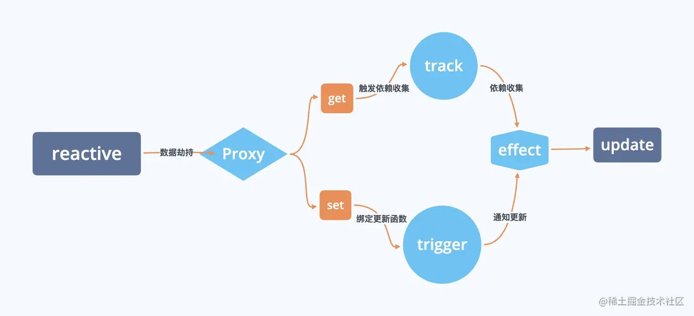
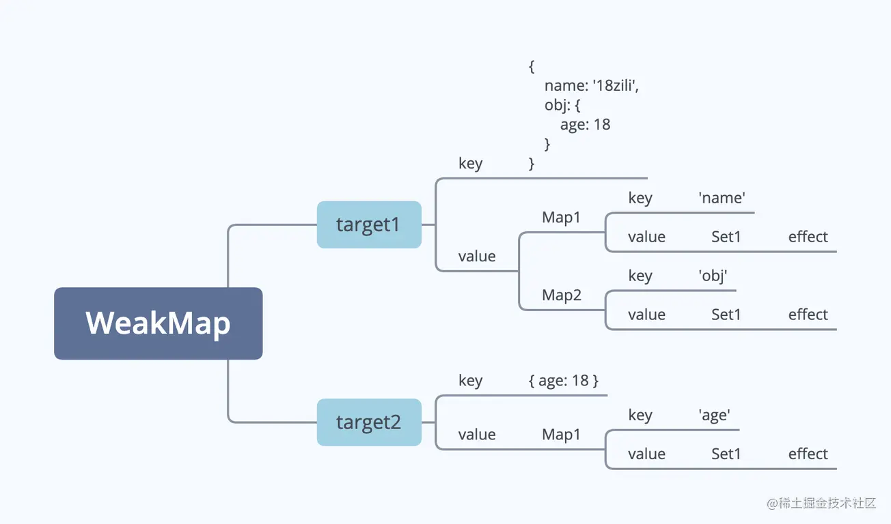
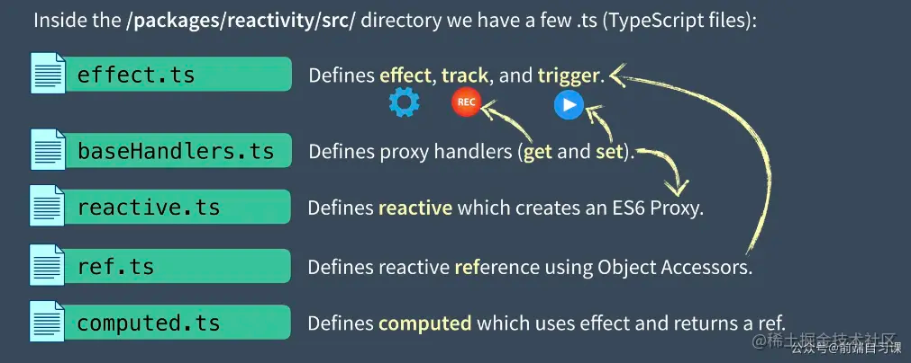

采用 Proxy + Reflect 反射的原理，劫持 getter 和 setter，当数据发生变化时，触发代理对象发生变化，此时发布消息给订阅者，触发相应的监听回调
:::info
在 vue3 中通过 effect 来实现响应式处理和视图更新之间的解耦
:::

 <a name="gtwBg"></a>

## reactive

设置对象为响应式对象。接受一个参数，判断这个参数是否为对象，不是对象则直接返回这个参数，不做响应式处理。创建拦截器 handler，设置 get/set/deleteProperty

- get
  - 收集依赖 track(只有在用户访问更深层次的属性时，才会进行递归)
  - 如果当前 key 的值是对象，则为当前 key 的对象创建拦截器 handler，并设置 get/set/deleteProperty
  - 如果当前的 key 的值不是对象，则返回当前 key 的值
- set
  - 设置的新值和老值不相等时，更新为新值，并触发更新 trigger
  - deleteProperty 当前对象有这个 key 时，删除这个 key 并触发更新

```javascript
function reactive(target) {
  const handler = {
    get(target, key) {
      const res = Reflect.get(target, key);
      // 依赖收集
      track(target, key);
      return typeof res === 'object' ? reactive(res) : res;
    },
    set(target, key, val) {
      // 如果数据没变，就什么都不做
      if (target[key] === val) {
        return;
      }
    
      Reflect.set(target, key, val);
      // 通知变化，触发执行 effect
      trigger(target, key);
    }
  };
  const observed = new Proxy(target, handler);
  return observed;
}
```

<a name="Ak5Za"></a>

## effect

接收一个函数作为参数，作用是：访问响应式对象属性时去收集依赖

```javascript
  function effect(fn, options = {}) {
    // 依赖函数
    let e = createReactiveEffect(fn, options);
    // lazy仕computed配置的
    if (!options.lazy) {
      // 不是懒执行
      e();
    }
    return e;
  }
  function createReactiveEffect(fn, options) {
    // 构造固定格式的effect
    const effect = function effect(...args) {
      return run(effect, fn, args);
    };
    // effect的配置
    effect.deps = [];
    effect.computed = options.computed;
    effect.lazy = options.lazy;
    return effect;
  }
  function run(effect, fn, args) {
    // 执行effect
    // 取出effect 执行
    if (effectStack.indexOf(effect) === -1) {
      try {
        effectStack.push(effect);
        return fn(...args); // 执行effect
      } finally {
        effectStack.pop(); // effect执行完毕
      }
    }
  }
```

<a name="bmhDu"></a>

## track

接受两个参数：target 和 key

- 如果没有 activeEffect，则说明没有创建 effect 依赖
- 如果有 activeEffect，则去判断 WeakMap 集合中是否有 target 属性
- WeakMap 集合中没有 target 属性，则 `set(target, (depsMap = new Map()))`
- WeakMap 集合中有 target 属性，则判断 target 属性的 map 值的 depsMap 中是否有 key 属性
- depsMap 中没有 key 属性，则 `set(key, (dep = new Set())) －depsMap` 中有 key 属性，则添加这个 activeEffect

假如数据是这样的。

```javascript
{
  name: '18zili',
  obj: {
    age: 18
  }
}
```

那么经过 track 的处理，我们就得到了这样的数据格式。


```javascript
  // 存储 effect
  let effectStack = [];
  let targetMap = new WeakMap();
  function track(target, key) {
    const effect = effectStack[effectStack.length - 1];
    if (effect) {
      let depMap = targetMap.get(target);
      if (!depMap) {
        depMap = new Map();
        targetMap.set(target, depMap);
      }
      
      let dep = depMap.get(key);
      if (!dep) {
        dep = new Set();
        depMap.set(key, dep);
      }
      
      if (!dep.has(effect)) {
        // 新增依赖 双向存储 方便查找优化
        dep.add(effect);
        effect.deps.push(dep);
      }
    }
  }
```

<a name="PCt5V"></a>

## trigger

判断 WeakMap 中是否有 target 属性，WeakMap 中有 target 属性，则判断 target 属性的 map 值中是否有 key 属性，有的话循环触发收集的 effect()。

```javascript
  function trigger(target, key) {
    // 数据变化后，通知更新 执行effect
    const depMap = targetMap.get(target);
    if (depMap === undefined) {
      return;
    }
    const effects = new Set();
    if (key) {
      let deps = depMap.get(key);
      deps.forEach((effect) => {
        effects.add(effect);
      });
      effects.forEach((effect) => effect());
    }
  }
```

<a name="dBLon"></a>

## reactivity 文件目录

在源码的 packages/reactivity/src目录下，有以下几个主要文件：

1. effect.ts：用来定义 effect / track / trigger ；
2. baseHandlers.ts：定义 Proxy 处理器（ get 和 set）；
3. reactive.ts：定义 reactive 方法并创建 ES6 Proxy；
4. ref.ts：定义 reactive 的 ref 使用的对象访问器；
5. computed.ts：定义计算属性的方法；


