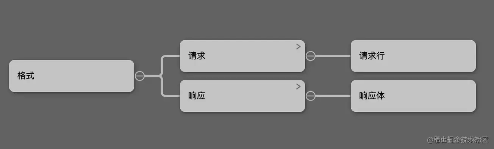
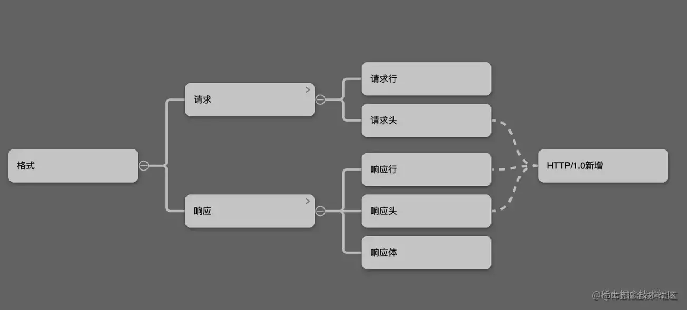
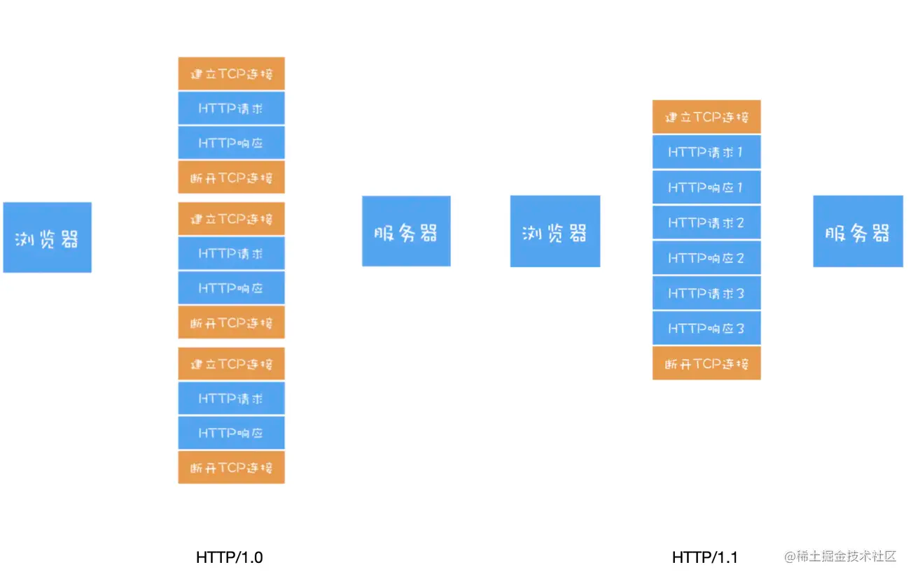
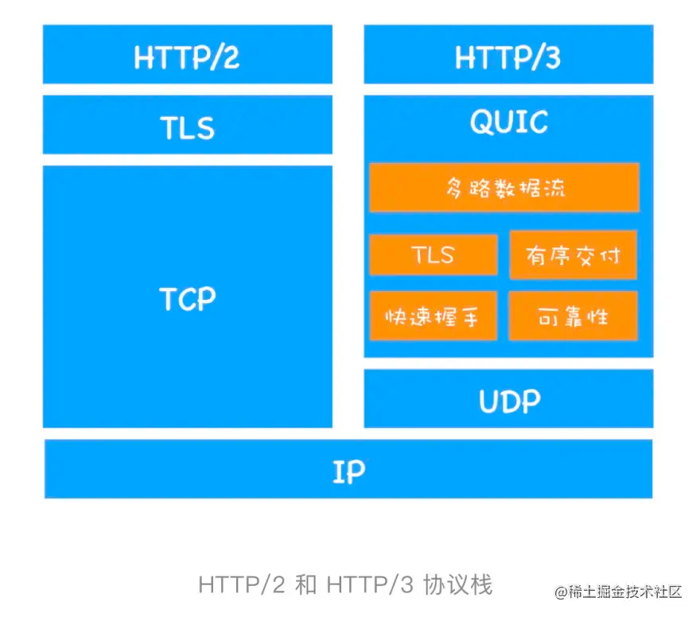
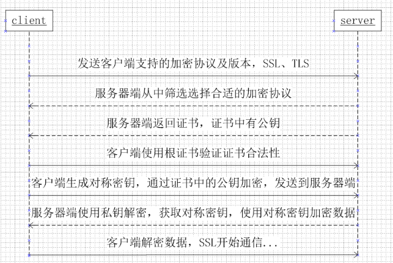

<a name="uavBw"></a>

## http

http 是超文本传输协议，它定义了客户端与服务器之间交换报文的格式和方式，默认使用 80 端口。它使用 tcp 作为传输层协议，保证了数据传输的可靠性

- http 是一个无状态的协议，http 服务器不会保存关于客户的任何信息
- http 有两种连接方式，一种是持续连接，另一种是非持续连接。
  - 非持续连接：服务器必须为每一个请求的对象建立和维护一个全新的连接
  - 持续连接：tcp 连接默认不关闭，可以被多个请求复用
- 采用持续连接的好处是：可以避免每次建立 tcp 连接 3 次握手时所花费的时间。在 http/1.0 以前使用的是非持续的连接，但可以在请求时加上 Connection: keep-alive 来要求服务器不要关闭 tcp 连接。在 http/1.1 以后默认采用的是持续的连接/目前对于同一个域，大多数浏览器支持同时建立 **6** 个持久连接 <a name="oFPXE"></a>

### 请求报文和响应报文

http 报文有两种，一种是请求报文，一种是响应报文 <a name="tmJ4Q"></a>

#### http 请求报文

http 请求报文的格式如下：

```html
GET / HTTP/1.1
User-Agent: Mozilla/5.0 (Macintosh; Intel Mac OS X 10_10_5)
Accept: */*
```

http 请求报文的第一行叫做请求行，后面的行叫做首部行，首部行后还可以根一个实体主体。请求首部之后有一个空行，这个空行不能省略，它用来划分首部与实体

请求行包含三个字段：**方法字段**、**url 字段**和 **http 版本字段**

方法字段可以取几个不同的值：一般有 GET、POST、HEAD、PUT 和 DELETE。一般 GET 方法只被用于 向服务器获取数据。POST 方法用于将实体提交到指定的资源，通常会造成服务器资源的修改。HEAD 方法与 GET 方法类似，但是在返回的响应中，不包含请求对象。PUT 方法用于上传文件到服务器，DELETE 方法用于删除服务器上的对象。虽然请求的方法很多，但更多表达的是一种语义上的区别，并不是说 POST 能做的事情，GET 就更不能做了，主要看我们如何选择 <a name="B5N7E"></a>

#### http 响应报文

http 响应报文的格式如下：

```html
HTTP/1.0 200 OK
Content-Type: text/plain
Content-Length: 137582
Expires: Thu, 05 Dec 1997 16:00:00 GMT
Last-Modified: Wed, 5 August 1996 15:55:28 GMT
Server: Apache 0.84

<html>
  <body>Hello World</body>
</html>
```

http 响应报文的第一行叫做状态行，后面的行是首部行，最后是实体主体

状态行包含了三个字段：**协议版本字段**、**状态码**和**响应的状态信息**

实体部分是报文的主要部分，它包含了所请求的对象。
常见的状态码有：
[常见的 http 状态码](https://www.yuque.com/go/doc/69183233?) <a name="H5oEc"></a>

### http/0.9

http/0.9 只能用来传输体积很小的 html 文件，采用的是 ASCII 字节码编码。请求和响应的格式都很简单，请求只有一个请求行，响应部分也只有一个响应体。
 <a name="Qc4DV"></a>

### http/1.0

因为 http/1.0 支持了更多样的文件格式，在请求发送时需要标注：文件类型、文件编码等，因此请求头产生了。
服务器收到请求后不一定可以按照指定的要求准备数据，所以会在响应头里标注数据最终的组织形式，因此产生了响应头。
 <a name="Qcj6c"></a>

#### 常见的请求头、响应头

浏览器会用请求头告诉服务器它想要的文件类型、文件编码、压缩形式、文件语言...
服务器会用响应头告诉浏览器最终的处理结果 <a name="ygCCe"></a>

##### 文件类型

除了 html，还有 javaScript/css/图片/音频/视频

    // 请求头
    accept: application/json, text/plain, */*
    // 响应头
    content-type: application/json

<a name="F8D1a"></a>

##### 文件压缩格式

为了减轻传输压力，服务器会对数据进行压缩后再传输，所以浏览器需要知道服务器压缩的方法，通常针对 css/js 文件

    // 请求头
    accept-encoding: gzip, deflate, br
    // 响应头
    content-encoding: gzip

<a name="RyboK"></a>

##### 文件编码格式

不同类型的文件，编码形式会不一样，为了能够精准地读取文件，浏览器需要知道文件的编码类型

    // 请求头
    accept:text/plain; charset=utf-8
    // 响应头
    content-type: application/json; charset=utf-8

<a name="j3syU"></a>

##### 缓存

http/1.0 提供了缓存机制，用来缓存已经下载过的数据

    // 请求头 响应头 
    cache-control: no-store, no-cache, must-revalidate

<a name="McH4d"></a>

##### 客户端基础信息

通过 ua，可以知道浏览器的版本、操作系统等信息

    // 请求头
    user-agent: Mozilla/5.0 (Macintosh; Intel Mac OS X 10_15_7)

<a name="xIP3m"></a>

### http/1.1

http/1.1 默认使用了持久连接，多个请求可以复用同一个 tcp 连接，但是在同一个 tcp 连接里面，数据请求的通信次序是固定的。服务器只有处理完一个请求的响应后，才会进行下一个请求的处理，如果前面请求的响应特别慢的话，就会造成许多请求排队等待的情况，这种情况被称为**队头阻塞**。队头阻塞会导致持久连接在达到最大数量时，剩余的资源需要等待其他资源请求完成后才能发起请求

为了避免这个问题，一个是减少请求数，另一个是同时打开多个持久连接。这就是我们对网站优化时，使用雪碧图、合并脚本的原因。 <a name="cflLg"></a>

#### http/1.1 与 http/1.0 的区别


持久连接通过请求头控制，不做特殊处理时候，默认会保持持久连接。

    // 请求头
    connection: keep-alive

可以通过以下方式关闭持久连接

    // 请求头
    connection: close

:::info

1. 连接方面的区别，http1.1 默认使用持久连接，而 http1.0 默认使用非持久连接。http1.1 通过使用持久连接来使多个 http 请求复用同一个 TCP 连接，以此来避免使用非持久连接时每次需要建立连接的时延。
2. 资源请求方面的区别，在 http1.0 中，存在一些浪费带宽的现象，例如客户端只是需要某个对象的一部分，而服务器却将整个对象送过来了，并且不支持断点续传功能，http1.1 则在请求头引入了 range 头域，它允许只请求资源的某个部分，即返回码是 206（Partial Content），这样就方便了开发者自由的选择以便于充分利用带宽和连接。
3. 缓存方面的区别，在 http1.0 中主要使用 header 里的 If-Modified-Since,Expires 来做为缓存判断的标准，http1.1 则引入了更多的缓存控制策略例如 Etag、If-Unmodified-Since、If-Match、If-None-Match 等更多可供选择的缓存头来控制缓存策略。
4. http1.1 中还新增了 host 字段，用来指定服务器的域名。http1.0 中认为每台服务器都绑定一个唯一的 IP 地址，因此，请求消息中的 URL 并没有传递主机名（hostname）。但随着虚拟主机技术的发展，在一台物理服务器上可以存在多个虚拟主机，并且它们共享一个 IP 地址。因此有了 host 字段，就可以将请求发往同一台服务器上的不同网站。
5. http1.1 相对于 http1.0 还新增了很多方法，如 PUT、HEAD、OPTIONS 等。
   ::: <a name="tToff"></a>

### http/2

2009 年，谷歌公开了自行研发的 SPDY 协议，主要解决 http/1.1 效率不高的问题。这个协议在 Chrome 浏览器上证明可行以后，就被当作 http/2 的基础，主要特性都在 http/2 之中得到继承。在 2015 年，http/2 发布。以下是 http/2 的新特性： <a name="ewFuZ"></a>

#### 二进制协议(二进制传输)

- 在 http/1.1 中，报文的头信息必须是文本(ASCII编码)；在 http/2 中，数据体可以是文本，也可以分割所有传输数据，并采用二进制进行编码。
- http/2 则是一个彻底的二进制协议，头信息和数据体都是二进制，并且统称为**帧**，可以分为头信息帧和数据帧。帧的概念是它实现多路复用的基础 <a name="Ya5Iy"></a>

#### 数据流

- http/2 使用了数据流的概念，因为 http/2 的数据包是不按顺序发送的，同一个连接里面连续的数据包，可能属于不同的请求。因此，必须要对数据包做标记，指出它属于哪个请求。
- http/2 将每个请求或回应的所有数据包，称为一个数据流。每个数据流都有一个独一无二的编号。数据包发送的时，都必须标记数据流 id，用来区分它属于哪个数据流 <a name="dsJcb"></a>

#### header 头信息压缩

- http/2 实现了头信息压缩，由于 http/1.1 协议不带有状态，每次请求都必须附带上所有信息。所以，请求的很多字段都是重复的，比如 Cookie 和 User Agent，一模一样的内容，每次请求都必须携带，这样会浪费很多带宽，也影响了速度
- http/2 对这一点做了优化，引入了头部压缩机制
  - 采用 HPACK 算法，在客户端和服务端两端建立**字典**，用索引号表示重复的字符串
  - 采用哈夫曼编码来压缩整数和字符串，可以达到 50% ～ 90% 的高压缩率
- 一方面，头信息使用 gzip 或 compress 压缩后再发送；另一方面，客户端和服务器同时维护一张头信息表，所有字段都会存入这个表，生成一个索引号，以后就不发送同样字段了，只发送索引号，这样就能提高速度了 <a name="Wn2hE"></a>

#### 多路复用

- 采用二进制分帧传输，用帧来标识请求，因为一个 tcp 连接可在多条**流**中，即可以发送多个请求。另外，不存在先后关系，也就不存在等待排队的问题，所以可避免 http/1 中队头阻塞的问题
- 通信双方都可以给对方发送二进制帧，这种二进制帧的双向传输序列，又叫做**流**。http/2 用**流**来在一个 tcp 连接上进行数据帧的通信 <a name="jnfRi"></a>

#### 服务端推送

http/2 允许服务器未经请求，主动向客户端发送资源，这叫做服务端推送。使用服务端推送，提前给客户端推送必要的资源，这样就可以相对减少一些延迟时间。这里需要注意的是 http2 下服务器主动推送的是静态资源，和 webSocket 以及使用 SSE 等方式向客户端发送即时数据推送是不同的

- 服务器不再是完全被动地响应请求，也可以新建**流**主动向客户端发送消息 <a name="dcwcs"></a>

#### 大幅度提高网页性能

- http/1 最大的请求数为 6，会造成对头阻塞，需等待其他资源请求完成后才能发起请求
  :::danger
  **http/2 协议缺点：**
  因为 http/2 使用了多路复用，一般来说，同一域名下只需要使用一个 tcp 连接。由于多个数据流使用同一个 tcp 连接，遵守同一个流量状态控制和拥塞控制。只要一个数据流遭遇到阻塞，剩下的数据流就没办法出去，这样就导致了后面的所有数据都会被阻塞。http/2 出现的这个问题是由于其使用 tcp 协议的问题，与它本身的实现其实没有多大的关系
  ::: <a name="v6GvI"></a>

### http/3

http/3 基于 udp 实现了类似于 tcp 的多路数据流、传输可靠性等功能，这套功能又称为 quic 协议。quic 协议在 udp 协议上实现了多路复用、有序支付、重传等功能

- 实现了类似于 tcp 的流量控制、传输可靠性的功能
- 集成了 tls 加密功能
- 解决了 http/2 下多路复用时丢包产生的问题，即解决了 tcp 协议的一些问题
  :::warning
  和 tcp 不同，quic 协议实现了在同一物理连接上可以有多个独立的逻辑数据流。从而实现了数据流的单独传输，因此就解决了 tcp 中队头阻塞的问题
  ::: <a name="Fz4wD"></a>

## 

<a name="fhgyU"></a>

## https

http 协议是用于 web 浏览器和网站服务器之间传递信息，http 协议以明文的方式来发送内容，不提供任何方式的数据加密。所以，http 协议不适合传输敏感信息。https 就是解决这一缺陷的，用来保证数据传输安全。

:::info
被监听 https 是基于 http 协议的，它在 http 的基础上加入了 ssl/tls 协议。ssl/tls 协议依靠证书来验证服务器的身份，并为浏览器和服务器之间的通信进行加密，这保证了传输过程中的安全性，减少了恶意劫持的可能。
被篡改并且它提供了一种校验机制，信息一旦被篡改，通信双方都会立刻发现。
被伪装它还配备了身份证书，防止身份被冒充的情况出现。
:::
https 很好的解决了 http 的多个缺点(被监听、被篡改、被伪装)。

- https 协议 = http 协议 + ssl/tls 协议
- 加密方式采取了对称加密和非对称加密
- 整体而言，对数据进行对称加密，对称加密所需要使用的密钥通过非对称加密进行传输
  :::info
  https 采用混合加密机制，如果密钥能够保证安全交换，那么全程有可能仅使用对称密钥加密来进行通信，如果不能保证密钥安全交换，可在密钥交换环节使用非对称加密方式，之后使用对称加密方式。这样做的目的是因为对称密钥加密相较非对称秘钥加密处理速度更快。
  但是加密了就安全了吗，就不会被窃听了吗？实际上，即使通信被加密，通信内容还是可以被技术手段窃听到，但是通信加密后就不容易看懂具体的报文信息了，相当于达到了加密的目的。
  https 加密传输过程中需要传输公开密钥，那么公开密钥又是如何保证其正确性呢，当然是数字认证机构颁发的公开密钥证书。
  :::
   <a name="nh9lc"></a>

### TLS 握手过程

1. 第一步：客户端向服务器发起请求，请求中包含使用的**协议版本号**、**生成的一个随机数**、以及**客户端支持的加密方法**

2. 第二步：服务端收到请求后，确认双方使用的加密方法，并**给出服务器的证书**、以及**一个服务器生成的随机数**

3. 第三步：客户端确认服务器证书有效后，生成一个新的随机数，并使用数字证书中的公钥，加密这个随机数，然后发送给服务器。并且还会提供一个前面所有内容的**哈希值**，用来供**服务器检验**

4. 第四步：服务器使用自己的私钥，来解密客户端发送过来的随机数，并提供前面所有内容的**哈希值**，用来供**客户端检验**

5. 第五步：客户端和服务器根据约定的加密方法，**使用前面的三个随机数，生成对话的密钥**，以后的对话过程都使用这个密钥来加密信息
   :::info
   **TLS 的握手过程主要用到了三个方法来保证传输的安全：**

6. 对称加密

7. 非对称加密

8. 数字证书
   ::: <a name="X7Mwv"></a>

### TLS 的实现原理

<a name="hNnfH"></a>

#### 对称加密

加密的密钥和解密的密钥相同
:::danger
**缺陷**：如何保证密钥传输的安全性，因为密钥还是会通过网络进行传输的，一旦密钥被其他人获取到，那么整个加密过程就毫无作用了。因此引出了非对称加密的方法。
::: <a name="SSqF8"></a>

#### 非对称加密

将密钥分为公钥和私钥，公钥可公开，私钥保密。客户端用公钥加密的数据，服务端可以通过私钥解密
:::danger
缺陷：无法确认得到的公钥一定是安全的公钥，可能存在一个中间人，截取了对方发给我们的公钥，然后将他自己的公钥发送给我们，当我们使用他的公钥加密后发送信息，就可以被他用自己的私钥解密。伪装后以同样的方法向对方发送信息，这样信息就被窃取了。所以引出了数字证书的概念
::: <a name="lCL70"></a>

#### 数字证书

- 首先我们使用一种哈希算法来对公钥和其他信息进行加密生成一个信息摘要。
- 然后让有公信力的认证中心(简称CA)，用它的私钥对消息摘要加密，形成签名。
- 最后**将原始的信息和签名结合在一起**，称为**数字证书。**
- 当接收方收到数字证书的时候，先根据原始信息使用同样的哈希算法生成一个摘要，然后使用公证处的公钥来对数字证书中摘要进行解密，最后将解密的摘要和我们生成的摘要进行对比，就能发现我们得到的信息是否被更改了。
- 这个方法最重要的是认证中心的可靠性，一般浏览器内部会内置一些顶层的认证中心证书，相当于我们自动信任了他们，只有这样我们才能够保证数据安全。 <a name="qcWsh"></a>

## http 和 https 的区别

- https 协议需要 CA 证书，一般免费证书表较少，因而需要一定的费用
- http 是超文本传输协议，信息是明文传输；https 则是具有安全性的 ssl 加密传输协议
- http 和 https 使用的是完全不同的连接方式，使用的端口也不同，前者是 80，后者是 443
- http 的连接很简单，是无状态的；https 协议是由 ssl + http 协议构建的可进行加密传输、身份认证的网络协议，比 http 协议安全
- https <a name="GpbQT"></a>

## 对称加密和非对称加密的区别

<https://www.jianshu.com/p/de50d1489359>
