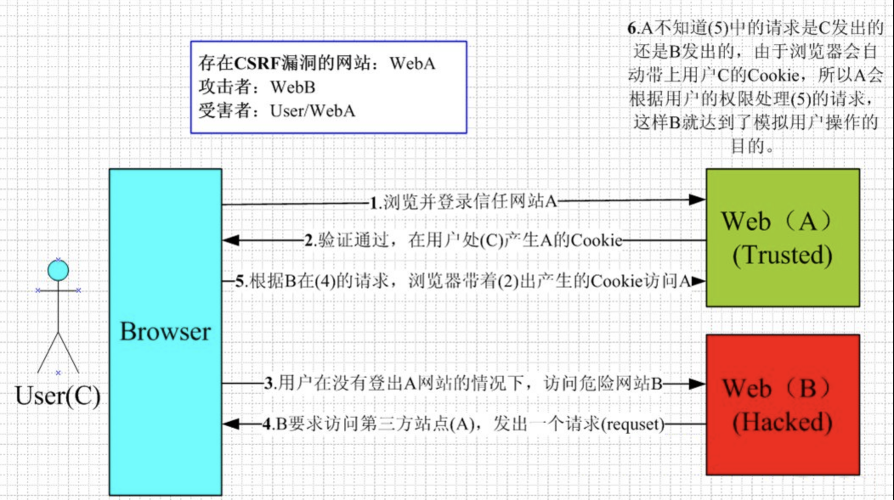

## xss：跨域脚本攻击

不需要做任何的登陆认证，它会通过合法的操作(比如在 url 中输入、在评论框中输入)，向你的页面注入脚本代码。会导致：**用户的 cookie 被调用**、**页面正常结构被破坏从而被插入恶意广告**、**D-doss** 攻击等 

### 攻击方式

- 反射型

发出请求时，xss 代码出现在 url 中，作为输入提交到服务器端，服务器端解析后响应，xss 代码随响应内容一起传回给浏览器，最后浏览器解析执行 xss 代码。这个过程像一次反射，因此叫反射型 xss

- 存储型

存储型 xss 和反射型 xss 的差别在于：提交的代码会存储在服务端(数据库、内存、文件系统)等，下次请求目标页面时不用再提交 xss 代码
:::info
**预防方式：**

1. **数据转义**
2. **富文本资源设置白名单**
   ::: 

## csrf：跨站请求伪造

攻击者诱导用户进入第三方网站，然后向被攻击网站发送跨站请求，如果此时用户处于登陆状态，则可盗用用户信息进行操作。
:::info
**预防方式：**

1. **csrf token 进行随即验证(用的最多)**
2. **隐藏令牌，把 token 隐藏在 http 的 head 头中**
3. **referer 验证(同源检测)**
   :::
    

## xss 和 csrf 的区别

- csrf：
  - 需要用户先登录网站 A，获取 cookie
  - 利用网站 A 本身的漏洞，去请求网站 A 的 api
- xss：
  - 不需要登陆
  - 是向网站 A 注入 JS 代码，然后执行 JS 里的代码，篡改网站 A 的内容 

## 点击劫持

点击劫持是一种视觉欺骗的攻击手段，攻击者将需要攻击的网站通过 iframe 嵌套的方式潜入自己的网页中，并将 iframe 设置为透明，在页面中透出一个按钮，诱导用户点击。
:::info
**预防方式：**
通过在 http header 设置 x-frame-options 来防御 iframe 嵌套的点击劫持攻击
:::
