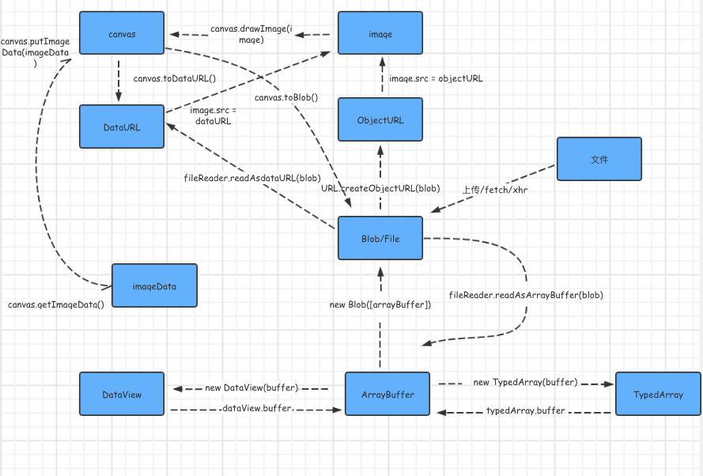
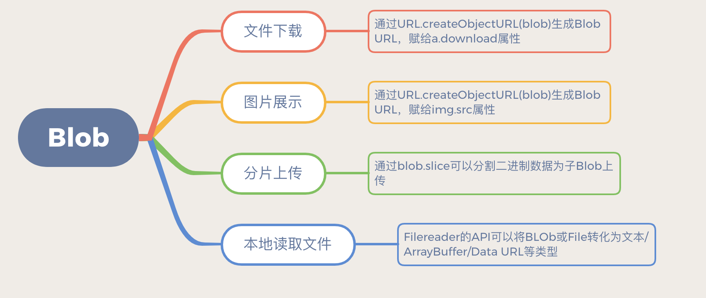
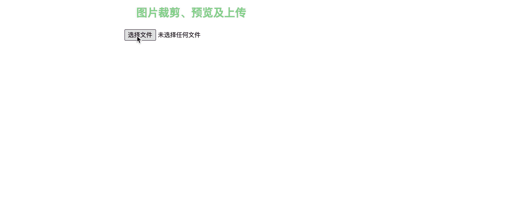

<a name="uL7TE"></a>

## 需求分析

<a name="AcqpV"></a>

### 二进制模块之间的关系

 <a name="J0QwI"></a>

### 步骤

1. 获取文件并读取文件
2. 获取裁剪坐标
3. 裁剪图片
4. 读取裁剪后的图片预览并上传


接下来先了解下二进制相关的 `API` 以方便实现本需求。

<a name="iTqox"></a>

## FileReader

> `HTML5`定义了`FileReader`作为文件`API`的重要成员用于读取文件，根据`W3C`的定义，`FileReader`接口提供了读取文件的方法和包含读取结果的事件模型。

<a name="bDZBa"></a>

### 创建实例

```javascript
const fileReader = new FileReader();
```

<a name="OWf95"></a>

### 属性

| 属性名 | 描述 |
| --- | --- |
| [error](https://developer.mozilla.org/zh-CN/docs/Web/API/FileReader/error) | 一个[DOMException](https://developer.mozilla.org/zh-CN/docs/Web/API/DOMException)，表示在读取文件时发生的错误 。 |
| [readyState](https://developer.mozilla.org/zh-CN/docs/Web/API/FileReader/readyState)  | 一个数字，用来表示 [FileReader](https://developer.mozilla.org/zh-CN/docs/Web/API/FileReader) API 的三种可能状态。 |
| [result](https://developer.mozilla.org/zh-CN/docs/Web/API/FileReader/result) | 文件的内容。该属性仅在读取操作完成后才有效，数据的格式取决于使用哪个方法来启动读取操作。 |

<a name="aQfj5"></a>

### 方法

| 方法名 | 描述 |
| --- | --- |
| abort | 中止读取操作 |
| readAsArrayBuffer | 异步按字节读取文件内容，结果用 ArrayBuffer 对象表示 |
| readAsBinaryString | 异步按字节读取文件内容，结果为文件的二进制串 |
| readAsDataURL | 异步读取文件内容，结果用 data:url 的字符串形式表示 |
| readAsText | 异步按字符读取文件内容，结果用字符串形式表示 |

<a name="sbuiU"></a>

### 事件

| 事件名 | 描述 |
| --- | --- |
| onabort | 中断时触发 |
| onerror | 出错时触发 |
| onload | 文件读取成功完成时触发 |
| onloadend | 读取完成触发（无论成功或失败） |
| onloadstart | 读取开始时触发 |
| onprogress | 读取中 |

<a name="yLN4l"></a>

### 示例

```jsx
/**
 * @description 把一个文件的内容通过字符串的方式读取出来
 */
<input type="file" id="upload" />

const upload = document.getElementById("upload");
upload.addEventListener("change", function() {
	const fileReader = new FileReader();
  fileReader.onload = function() {
  	const reult = fileReader.result;
    console.log(result):
  }
}, false);
```

<a name="5Wz0m"></a>

## ArrayBuffer / TypedArray / DataView

<a name="kGxAm"></a>

### ArrayBuffer

<a name="btbgv"></a>

#### 功能

 <a name="0OTwp"></a>

#### 介绍

`FileReader` 有个 `readAsArrayBuffer()` 方法，如果被读取的文件是二进制数据，那么用次方法读取将是最合适的方案，读取出来的数据将是一个 `ArrayBuffer` 对象。

<a name="oTmSF"></a>

#### 定义

> `ArrayBuffer` 对象用来表示通用的、固定长度的原始二进制数据缓冲区。`ArrayBuffer` 不能直接操作,而是要通过**类型数组对象**或 **`DataView`**** 对象**来操作,它们会将缓冲区中的数据表示为特定的格式,并通过这些格式来读写缓冲区的内容.

`ArrayBuffer`也是一个构造函数，可以分配一段可以存放数据的连续内存区域。

```javascript
const arrayBuffer = new ArrayBuffer(8);
// ArrayBuffer 对象有实例属性 byteLength ，表示当前实例占用的内存字节长度（单位字节）
console.log(arrayBuffer.byteLength);
```

<a name="P6XlH"></a>

#### 属性

| 属性名 | 描述 |
| --- | --- |
| ArrayBuffer.length  | ArrayBuffer 构造函数的 length  属性，其值为 1 。 |
| [ArrayBuffer.prototype.byteLength](https://developer.mozilla.org/zh-CN/docs/Web/JavaScript/Reference/Global_Objects/ArrayBuffer/byteLength) | 只读属性，表示 ArrayBuffer 的 byte 的大小，在 ArrayBuffer 构造完成时生成，不可改变。 |

> 由于无法对 `Arraybuffer` 直接进行操作,所以我们需要借助其他对象来操作. 所有就有了 **`TypedArray`****(类型数组对象)**和 **`DataView`****对象**。

<a name="i0yWR"></a>

### DataView

上方代码生成了一段 8 字节的内存区域。其中每个字节的默认值都是 0。

为了读和写这段内容，需要为它指定视图。 `DataView` 视图的创建，需要提供 `ArrayBuffer` 对象实例作为参数。

`DataView` 视图是一个可以从二进制 `ArrayBuffer` 对象中读写多种数值类型的底层接口。

- `setInt8()` 从 `DataView` 起始位置以 `byte` 为计数的指定偏移量 `byteOffset` 处存储一个 `8-bit` 数(一个字节)。
- `getInt8()` 从 `DataView` 起始位置以 `byte` 为计数的指定偏移量 `byteOffset` 处获取一个 `8-bit` 数(一个字节)。 <a name="FPXub"></a>

#### 调用

```javascript
new DataView(buffer, [, byteOffset [, byteLength]])
```

<a name="7dMHh"></a>

#### 参数

| 参数名 | 描述 |
| --- | --- |
| buffer | 一个 已经存在的[ArrayBuffer](https://developer.mozilla.org/zh-CN/docs/Web/JavaScript/Reference/Global_Objects/ArrayBuffer) 或 [SharedArrayBuffer](https://developer.mozilla.org/zh-CN/docs/Web/JavaScript/Reference/Global_Objects/SharedArrayBuffer)  对象，DataView 对象的数据源。 |
| byteOffset (可选) | 此 DataView 对象的第一个字节在 buffer 中的字节偏移。如果未指定，则默认从第一个字节开始。 |
| byteLength (可选) | 此 DataView 对象的字节长度。如果未指定，这个视图的长度将匹配 buffer 的长度。 |

<a name="DYMal"></a>

#### 异常

- [RangeError](https://developer.mozilla.org/zh-CN/docs/Web/JavaScript/Reference/Global_Objects/RangeError)

如果 `byteOffset` 或者 `byteLength `参数的值导致视图超出了 `buffer` 的结束位置就会抛出此异常。

例如，假设 `buffer` （缓冲对象）是 `16` 字节长度，`byteOffset` 参数为 `8`，`byteLength` 参数为 `10`，这个错误就会抛出，这是因为结果视图试图超出 `buffer` 对象的总长度 `2` 个字节。

<a name="pGWrO"></a>

#### 示例

```javascript
let arrayBuffer = new ArrayBuffer();
console.log(arrayBuffer.byteLength) // 2
let dataView = new DataView(buffer);
dataView.setInt8(0, 1);
dataView.setInt8(1, 2);
console.log(dataView.getInt8(0)); // 1
console.log(dataView.getInt8(1)); // 2
console.log(dataView.getInt16(0)); // 258
```

<a name="D48AE"></a>

### TypedArray

另一种`TypedArray`视图，与`DataView`视图的一个区别是，它不是一个构造函数，而是一组构造函数，代表不同的数据格式。

`TypedArray`对象描述了一个底层的二进制数据缓存区（`binary data buffer`）的一个类数组视图（`view`）。但它本身不可以被实例化，甚至无法访问，你可以把它理解为接口，它有很多的实现。

<a name="KMbHL"></a>

#### 实现方法

| 类型 | 单个元素值的范围 | 大小（bytes） | 描述 |
| --- | --- | --- | --- |
| Int8Array | -128 to 127 | 1 | 8 位二进制有符号整数 |
| Uint8Array | 0 to 255 | 1 | 8 位无符号整数 |
| Int16Array | -32768 to 32767 | 2 | 16 位二进制有符号整数 |
| Uint16Array | 0 to 65535 | 2 | 16 位无符号整数 |

<a name="YKVW1"></a>

#### 示例

```javascript
const arrayBuffer = new ArrayBuffer(8);
console.log(arrayBuffer.byteLength); // 8
const int8Array = new Int8Array(arrayBuffer);
console.log(int8Array.length); // 8
const int16Array = new Int16Array(arrayBuffer);
console.log(int16Array.length); // 4
```

<a name="uI4gF"></a>

## Blob

`Blob` 是用来支持文件操作的。简单的说：在 `JS` 中，有两个构造函数 `File` 和 `Blob`, 而  `File` 继承了所有 `Blob` 的属性。

所以在我们看来， `File` 对象可以看作一种特殊的 `Blob` 对象。

<a name="raSNU"></a>

### 功能

 <a name="EaPkP"></a>

### 构造函数

```javascript
/**
 * @description 返回一个创建的 Blob 对象，其内容由参数中给定的数组串联组成
 */
Blob(blobParts[, options])
```

<a name="pf1Hq"></a>

### 属性

| 属性名 | 描述 |
| --- | --- |
| [Blob.size](https://developer.mozilla.org/zh-CN/docs/Web/API/Blob/size) 只读 | Blob 对象中所包含数据的大小（字节） |
| [Blob.type](https://developer.mozilla.org/zh-CN/docs/Web/API/Blob/type) 只读 | 一个字符串，表明该 Blob 对象所包含数据的 MIME 类型。如果类型未知，则该值为空字符串。 |

<a name="WkN4e"></a>

### 方法

| 方法名 | 描述 |
| --- | --- |
| [Blob.slice(\[start\[, end\[, contentType\]\]\])](https://developer.mozilla.org/zh-CN/docs/Web/API/Blob/slice) | 返回一个新的 Blob 对象，包含了源 Blob 对象中指定范围内的数据。 |
| [Blob.stream()](https://developer.mozilla.org/zh-CN/docs/Web/API/Blob/stream) | 返回一个能读取 blob 内容的 [ReadableStream](https://developer.mozilla.org/zh-CN/docs/Web/API/ReadableStream)。 |
| [Blob.text()](https://developer.mozilla.org/zh-CN/docs/Web/API/Blob/text)
&#x20;| 返回一个 promise 且包含 blob 所有内容的 UTF-8 格式的 [USVString](https://developer.mozilla.org/zh-CN/docs/Web/API/USVString)。 |
| [Blob.arrayBuffer()](https://developer.mozilla.org/zh-CN/docs/Web/API/Blob/arrayBuffer) | 返回一个 promise 且包含 blob 所有内容的二进制格式的 [ArrayBuffer](https://developer.mozilla.org/zh-CN/docs/Web/API/ArrayBuffer)  |

<a name="cOdV9"></a>

## atob 和 btoa

从 `IE10+` 浏览器开始，所有的浏览器就原生提供了 `Base64` 编解码的方法。

<a name="pU3al"></a>

### Base64 解码

```javascript
let decodedData = window.atob(encodedData);
```

<a name="tYOg8"></a>

### Base64 编码

```javascript
let encodedData = window.btoa(stringToEncode);
```

<a name="qn08Z"></a>

## Canvas 中的 ImageData 对象

`ImageData` 对象中存储着 `canvas` 对象真实的像素数据，它包含以下几个只读属性：

- `width` ：图片宽度，单位是像素
- `height` ：图片高度，单位是像素
- `data` ： `Uint8ClampedArray` 类型的一维数组，包含着 `RGBA` 格式的整型数据，范围在 `0` 至 `255` 之间（包括 `255`）。

<a name="GRIwD"></a>

### 创建一个 ImageData 对象

使用 `createImageData()` 方法去创建一个新的，空白的 `ImageData` 对象。

```javascript
let myImageData = ctx.createImageData(width, height);
```

上面代码创建了一个新的具体特定尺寸的`ImageData`对象。所有像素被预设为透明黑。

<a name="9JAP1"></a>

### 得到场景像素数据

为了获得一个包含画布场景像素数据的 `ImageData` 对象，你可以用 `getImageData()` 方法：

```javascript
let myImageData = ctx.getImageData(left, top, width, height);
```

<a name="GaXHf"></a>

### 在场景中写入像素数据

你可以用 `putImageData()` 方法去对场景进行像素数据的写入。

```javascript
ctx.putImageData(myImageData, dx, dy);
```

<a name="4QQ50"></a>

### 使用 toDataURL 将 canvas 转换为 data URI 格式

- 创建一个 `<canvas>` 元素

```html
<canvas id="canvas" width="5" height="5"></canvas>
```

- 获取一个 `data-URL` 

```javascript
let canvas = document.getElementById("canvas");
let dataURL = canvas.toDataURL();
console.log(dataURL);
// "data:image/png;base64,iVBORw0KGgoAAAANSUhEUgAAAAUAAAAFCAYAAACNby
// blAAAADElEQVQImWNgoBMAAABpAAFEI8ARAAAAAElFTkSuQmCC"
```

基本所需要的技术点已经全部列出，接下来我们将实现图片裁剪的需求

<a name="gYiVU"></a>

## 实现图片裁剪

<a name="dXJgb"></a>

### 最终效果

 <a name="g8V1w"></a>

### 代码

```jsx
import React, { useState, useRef } from "react";
import { Input, Row, Col, Button } from "antd";
import {
  ScissorOutlined,
  PlusCircleOutlined,
  MinusCircleOutlined,
  UploadOutlined
} from "@ant-design/icons";

const App = () => {
  const imageRef = useRef(),
    canvasRef = useRef(),
    avatarRef = useRef(),
    [state, setState] = useState({
      file: null,
      dataURL: "",
      times: 1,
      startX: 0,
      startY: 0,
      startDrag: false,
      lastX: 0,
      lastY: 0,
      avatarDataUrl: ""
    });

  function drawImage(left = state.lastX, top = state.lastY) {
    let image = imageRef.current;
    let canvas = canvasRef.current;
    let ctx = canvas.getContext("2d");
    ctx.clearRect(0, 0, canvas.width, canvas.height);
    let imageWidth = image.width;
    let imageHeight = image.height;
    if (imageWidth > imageHeight) {
      let scale = canvas.width / canvas.height;
      imageWidth = canvas.width * state.times;
      imageHeight = imageHeight * scale * state.times;
    } else {
      let scale = canvas.height / canvas.width;
      imageHeight = canvas.height * state.times;
      imageWidth = imageWidth * scale * state.times;
    }
    ctx.drawImage(
      image,
      (canvas.width - imageWidth) / 2 + left,
      (canvas.height - imageHeight) / 2 + top,
      imageWidth,
      imageHeight
    );
  }

  function handleChange(event) {
    let file = event.target.files[0];
    let fileReader = new FileReader();
    fileReader.onload = (event) => {
      setState({
        ...state,
        file,
        dataURL: event.target.result
      });
      imageRef.onload = () => drawImage();
    };
    fileReader.readAsDataURL(file);
  }

  function handleMouseDown(event) {
    setState({
      ...state,
      startX: event.clientX,
      startY: event.clientY,
      startDrag: true
    });
  }

  function handleMouseMove(event) {
    if (state.startDrag) {
      drawImage(
        event.clientX - state.startX + state.lastX,
        event.clientY - state.startY + state.lastY
      );
    }
  }

  function handleMouseUp(event) {
    setState({
      ...state,
      lastX: event.clientX - state.startX + state.lastX,
      lastY: event.clientY - state.startY + state.lastY,
      startDrag: false
    });
  }

  function bigger() {
    setState({
      ...state,
      times: state.times + 0.1
    });
    drawImage();
  }

  function smaller() {
    setState({
      ...state,
      times: state.times - 0.1
    });
    drawImage();
  }

  function confirm() {
    let canvas = canvasRef.current;
    let ctx = canvas.getContext("2d");
    const imageData = ctx.getImageData(100, 100, 100, 100);
    let avatarCanvas = document.createElement("canvas");
    avatarCanvas.width = 100;
    avatarCanvas.height = 100;
    let avatarCtx = avatarCanvas.getContext("2d");
    avatarCtx.putImageData(imageData, 0, 0);
    let avatarDataUrl = avatarCanvas.toDataURL();
    setState({ ...state, avatarDataUrl });
    avatarRef.current.src = avatarDataUrl;
  }

  function upload(event) {
    console.log(state.avatarDataUrl);
    let bytes = atob(state.avatarDataUrl.split(",")[1]);
    console.log("bytes", bytes);
    let arrayBuffer = new ArrayBuffer(bytes.length);
    let uInt8Array = new Uint8Array();
    for (let i = 0; i < bytes.length; i++) {
      uInt8Array[i] = bytes.charCodeAt[i];
    }
    let blob = new Blob([arrayBuffer], { type: "image/png" });
    let xhr = new XMLHttpRequest();
    let formData = new FormData();
    formData.append("avatar", blob);
    xhr.open("POST", "/upload", true);
    xhr.send(formData);
  }

  return (
    <div style={{ padding: "10px" }}>
      <h2>图片裁剪，预览以及上传</h2>
      <Input
        type="file"
        accept="image/*"
        onChange={handleChange}
        style={{ width: "200px" }}
      />
      <Row>
        <Col>
          {state.file && (
            
          )}
        </Col>
      </Row>
      <div
        onMouseDown={handleMouseDown}
        onMouseMove={handleMouseMove}
        onMouseUp={handleMouseUp}
      >
        {state.file && (
          <Row>
            <Col style={{ position: "relative" }}>
              <canvas
                ref={canvasRef}
                width="300"
                height="300"
                style={{ border: "2px dashed #632B21" }}
              ></canvas>
              <div
                style={{
                  width: 100,
                  height: 100,
                  backgroundColor: "blue",
                  opacity: 0.3,
                  position: "absolute",
                  left: 100,
                  top: 100
                }}
              ></div>
            </Col>
            <Col>
              <Button icon={<PlusCircleOutlined />} onClick={bigger}>
                变大
              </Button>
              <Button icon={<MinusCircleOutlined />} onClick={smaller}>
                变小
              </Button>
              <Button icon={<ScissorOutlined />} onClick={confirm}>
                剪切
              </Button>
            </Col>
          </Row>
        )}
      </div>
      <div>
        {state.file && (
          
        )}
      </div>
      <div>
        {state.file && (
          <Button type="primary" icon={<UploadOutlined />} onClick={upload}>
            上传
          </Button>
        )}
      </div>
    </div>
  );
};

export default App;
```

<a name="VacYN"></a>

### 实现

<a name="GV7MB"></a>

#### 一、获取文件并读取文件

给 `input` 绑定事件

```jsx
import React, { useState, useRef } from 'react';

const App = () => {
  const imgRef = useRef();
  const canvasRef = useRef();
  const [file, setFile] = useState();
  const [dataURL, setDataURL] = useState();
  const [startX, setStartX] = useState(0);
  const [startY, setStartY] = useState(0);
  const [lastX, setLastX] = useState(0);
  const [lastY, setLastY] = useState(0);
  const [startDrag, setStartDrag] = useState(false);
  
  const handleChange = event => {
    let file = event.target.files[0];
    let fileReader = new FileReader();
    fileReader.onload = event => {
      setFile(file);
      setDataURL(event.target.result);
      imageRef.current.onload = () => drawImage();
    };
    fileReader.readAsDataURL(file);
  }
  
	return (
    <>
      <input type="file" onChange={handleChange} />
      <br />
      
    </>
  )
}
```

`HTML5` 支持从 `input[type=file]` 元素中直接获取文件信息，也可以读取文件内容。

此处用到了 `FileReader` ，这个类专门用来读取本地文件。纯文本或者二进制都可以进行读取，但是本地文件必须是经过用户允许之后才能读取，也就是说，用户要在 `input[type=file]` 中选择了这个文件，你才可以读取到它。

通过 `FileReader` 我们可以将图片文件转化为 `DataURL` ，就是以 `data:image/png;base64` 开头的一种 `URL` ，然后可以直接放在 `image.src` 里，此时本地图片就会被显示出来。

<a name="GtcFA"></a>

#### 二、获取裁剪坐标

- `mousedown` 

这里要记录鼠标按下时的坐标，即 `startX` 和 `startY` ，同时将标识位 `startDrag` 设为 `true` ，标识鼠标开始移动。

```javascript
const handleMouseDown = event => {
 	setStartX(event.clientX);
  setStartY(event.clientY);
  setStartDrag(true);
}
```

- `mousemove` 

判断 `startDrag` 为 `true`（即鼠标开始移动），然后记录对应移动的距离。

```javascript
const handleMouseMove = event => {
	if (startDrag) {
  	drawImage(
    	event.clientX - startX + lastX,
      event.clientY - startY + lastY
    );
  }
}
```

- `mouseup`     

这里要记录下最终鼠标的落点坐标，对应就是 `lastX` 与 `lastY`。

```javascript
const handleMouseUp = event => {
 	setLastX(event.clientX - startX + lastX);
  setLastY(event.clientY - startY + lastY);
  setStartDrag(false);
}
```

<a name="bip8c"></a>

#### 三、裁剪图片

将图片放置入 `canvas` 时需要调用 `drawImage` :

```javascript
drawImage(image, sx, sy, sWidth, sHeight, dx, dy, dWidth, dHeight)
```

```javascript
const drawImage = (left = lastX, top = lastY) => {
	let image = imgRef.current,
      canvas = canvasRef.current,
      ctx = canvas.getContext('2d');
  ctx.clearRect(0, 0, canvas.width, canvas.height);
  let imageWidth = image.width,
      imageHeight = image.height;
  if (imageWidth > imageHeight) {
  	let scale = canvas.width / canvas.height;
    imageWidth = canvas.width * times;
    imageHeight = imageHeight * scale * times;
  } else {
  	let scale = canvas.height / canvas.width;
    imageHeight = canvas.height * times;
    imageWidth = imageWidth * scale * times;
  }
	ctx.drawImage(
  	image,
    (canvas.width - imageWidth) / 2 + left,
    (canvas.height - imageHeight) / 2 + top,
    imageWidth,
    imageHeight
  )
}
```

加入了 `scale`，这个变量是用来实现图片放大、缩小效果的。同时会判断图片的宽、高的大小关系，从而实现图片在 `canvas` 中对应的适配。

<a name="dvQpj"></a>

#### 四、读取裁剪后的图片并上传

这时我们要获取 `canvas` 中图片的信息，用 `toDataURL` 就可以转换成上面用到的 `DataURL` 。

```javascript
const confirm = () => {
	let canvas = canvasRef.current;
  let ctx = canvas.getContext('2d');
  const imageData = ctx.getImageData(100, 100, 100, 100);
  let avatarCanvas = document.createElement('canvas');
  avatarCanvas.width = 100;
  avatarCanvas.height = 100;
  let avatarCtx = avatarCanvas.getContext('2d');
  avatarCtx.putImageData(imageData, 0, 0);
  let avatarDataUrl = avatarCanvas.toDataURL();
  setAvatarDataUrl(avatarDataUrl);
  avatarRef.current.src = avatarDataUrl;
}
```

然后取出其中 `base64` 信息，再用 `window.atob` 转换成由二进制字符串。但 `window.atob` 转换后的结果仍然是字符串，直接给 `Blob` 还是会出错。所以又要用 `Uint8Array` 转换一下。

这时候裁剪后的文件就储存在 `blob` 里了,我们可以把它当作是普通文件一样，加入到 `FormData` 里，并上传至服务器了。

```javascript
const upload = (event) => {
  // console.log("文件url", this.state.avatarDataUrl);
  let bytes = atob(avatarDataUrl.split(",")[1]);
  console.log("bytes", bytes);
  let arrayBuffer = new ArrayBuffer(bytes.length);
  let uInt8Array = new Uint8Array();
  for (let i = 0; i < bytes.length; i++) {
    uInt8Array[i] = bytes.charCodeAt[i];
  }
  let blob = new Blob([arrayBuffer], { type: "image/png" });
  let xhr = new XMLHttpRequest();
  let formData = new FormData();
  formData.append("avatar", blob);
  xhr.open("POST", "/upload", true);
  xhr.send(formData);
};
```
