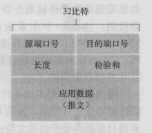
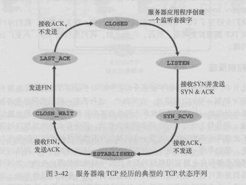

## 传输层

传输层协议主要是为不同主机上的不同进程间提供了逻辑通信的功能。传输层只工作在端系统中。 

### 多路复用与多路分解

将传输层报文段中的数据交付到正确的套接字的工作被称为多路分解。
在源主机上从不同的套接字中收集数据，封装头信息生成报文段后，将报文段传递到网络层，这个过程被称为多路复用。
无连接的多路复用和多路分解指的是 UDP 套接字的分配过程，一个 UDP 套接字由一个二元组来标识，这个二元组包含了一
个目的地址和一个目的端口号。因此不同源地址和端口号的 UDP 报文段到达主机后，如果它们拥有相同的目的地址和目的端
口号，那么不同的报文段将会转交到同一个 UDP 套接字中。
面向连接的多路复用和多路分解指的是 TCP 套接字的分配过程，一个 TCP 套接字由一个四元组来标识，这个四元组包含了
源 IP 地址、源端口号、目的地址和目的端口号。因此，一个 TCP 报文段从网络中到达一台主机上时，该主机使用全部 4 个
值来将报文段定向到相应的套接字。 

### UDP 协议

UDP 是一种无连接的，不可靠的传输层协议。它只提供了传输层需要实现的最低限度的功能，除了复用/分解功能和少量的差
错检测外，它几乎没有对 IP 增加其他的东西。UDP 协议适用于对实时性要求高的应用场景。
特点：

1. 使用 UDP 时，在发送报文段之前，通信双方没有握手的过程，因此 UDP 被称为是无连接的传输层协议。因为没有握手
   过程，相对于 TCP 来说，没有建立连接的时延。因为没有连接，所以不需要在端系统中保存连接的状态。
2. UDP 提供尽力而为的交付服务，也就是说 UDP 协议不保证数据的可靠交付。
3. UDP 没有拥塞控制和流量控制的机制，所以 UDP 报文段的发送速率没有限制。
4. 因为一个 UDP 套接字只使用目的地址和目的端口来标识，所以 UDP 可以支持一对一、一对多、多对一和多对多的交互
   通信。
5. UDP 首部小，只有 8 个字节。 

### UDP 报文段结构

UDP 报文段由首部和应用数据组成。报文段首部包含四个字段，分别是源端口号、目的端口号、长度和检验和，每个字段的长
度为两个字节。长度字段指的是整个报文段的长度，包含了首部和应用数据的大小。校验和是 UDP 提供的一种差错校验机制。
虽然提供了差错校验的机制，但是 UDP 对于差错的恢复无能为力。
 

### TCP 协议

TCP 协议是面向连接的，提供可靠数据传输服务的传输层协议。
特点：

1. TCP 协议是面向连接的，在通信双方进行通信前，需要通过三次握手建立连接。它需要在端系统中维护双方连接的状态信息。
2. TCP 协议通过序号、确认号、定时重传、检验和等机制，来提供可靠的数据传输服务。
3. TCP 协议提供的是点对点的服务，即它是在单个发送方和单个接收方之间的连接。
4. TCP 协议提供的是全双工的服务，也就是说连接的双方的能够向对方发送和接收数据。
5. TCP 提供了拥塞控制机制，在网络拥塞的时候会控制发送数据的速率，有助于减少数据包的丢失和减轻网络中的拥塞程度。
6. TCP 提供了流量控制机制，保证了通信双方的发送和接收速率相同。如果接收方可接收的缓存很小时，发送方会降低发送
   速率，避免因为缓存填满而造成的数据包的丢失。 

### TCP 报文段结构

TCP 报文段由首部和数据组成，它的首部一般为 20 个字节。
源端口和目的端口号用于报文段的多路复用和分解。
32 比特的序号和 32 比特的确认号，用与实现可靠数据运输服务。
16 比特的接收窗口字段用于实现流量控制，该字段表示接收方愿意接收的字节的数量。
4 比特的首部长度字段，该字段指示了以 32 比特的字为单位的 TCP 首部的长度。
6 比特的标志字段，ACK 字段用于指示确认序号的值是有效的，RST、SYN 和 FIN 比特用于连接建立和拆除。设置 PSH 字
段指示接收方应该立即将数据交给上层，URG 字段用来指示报文段里存在紧急的数据。
校验和提供了对数据的差错检测。
 

### TCP 三次握手的过程

第一次握手，客户端向服务器发送一个 SYN 连接请求报文段，报文段的首部中 SYN 标志位置为 1，序号字段是一个任选的
随机数。它代表的是客户端数据的初始序号。
第二次握手，服务器端接收到客户端发送的 SYN 连接请求报文段后，服务器首先会为该连接分配 TCP 缓存和变量，然后向
客户端发送 SYN ACK 报文段，报文段的首部中 SYN 和 ACK 标志位都被置为 1，代表这是一个对 SYN 连接请求的确认，
同时序号字段是服务器端产生的一个任选的随机数，它代表的是服务器端数据的初始序号。确认号字段为客户端发送的序号加
一。
第三次握手，客户端接收到服务器的肯定应答后，它也会为这次 TCP 连接分配缓存和变量，同时向服务器端发送一个对服务
器端的报文段的确认。第三次握手可以在报文段中携带数据。
在我看来，TCP 三次握手的建立连接的过程就是相互确认初始序号的过程，告诉对方，什么样序号的报文段能够被正确接收。
第三次握手的作用是客户端对服务器端的初始序号的确认。如果只使用两次握手，那么服务器就没有办法知道自己的序号是否
已被确认。同时这样也是为了防止失效的请求报文段被服务器接收，而出现错误的情况。
详细资料可以参考：
[《TCP 为什么是三次握手，而不是两次或四次？》](https://www.zhihu.com/question/24853633)
[《TCP 的三次握手与四次挥手》](https://blog.csdn.net/qzcsu/article/details/72861891) 

### TCP 四次挥手的过程

因为 TCP 连接是全双工的，也就是说通信的双方都可以向对方发送和接收消息，所以断开连接需要双方的确认。
第一次挥手，客户端认为没有数据要再发送给服务器端，它就向服务器发送一个 FIN 报文段，申请断开客户端到服务器端的
连接。发送后客户端进入 FIN\_WAIT\_1 状态。
第二次挥手，服务器端接收到客户端释放连接的请求后，向客户端发送一个确认报文段，表示已经接收到了客户端释放连接的
请求，以后不再接收客户端发送过来的数据。但是因为连接是全双工的，所以此时，服务器端还可以向客户端发送数据。服务
器端进入 CLOSE\_WAIT 状态。客户端收到确认后，进入 FIN\_WAIT\_2 状态。
第三次挥手，服务器端发送完所有数据后，向客户端发送 FIN 报文段，申请断开服务器端到客户端的连接。发送后进入 LAS
T\_ACK 状态。
第四次挥手，客户端接收到 FIN 请求后，向服务器端发送一个确认应答，并进入 TIME\_WAIT 阶段。该阶段会持续一段时间，
这个时间为报文段在网络中的最大生存时间，如果该时间内服务端没有重发请求的话，客户端进入 CLOSED 的状态。如果收到
服务器的重发请求就重新发送确认报文段。服务器端收到客户端的确认报文段后就进入 CLOSED 状态，这样全双工的连接就被
释放了。
TCP 使用四次挥手的原因是因为 TCP 的连接是全双工的，所以需要双方分别释放到对方的连接，单独一方的连接释放，只代
表不能再向对方发送数据，连接处于的是半释放的状态。
最后一次挥手中，客户端会等待一段时间再关闭的原因，是为了防止发送给服务器的确认报文段丢失或者出错，从而导致服务器
端不能正常关闭。
详细资料可以参考：
[《前端面试之道》](https://juejin.im/book/5bdc715fe51d454e755f75ef/section/5c447392e51d45524b02eaf5) 

### 状态转化图

 

### ARQ 协议

ARQ 协议指的是自动重传请求，它通过超时和重传来保证数据的可靠交付，它是 TCP 协议实现可靠数据传输的一个很重要的
机制。
它分为停止等待 ARQ 协议和连续 ARQ 协议。
一、停止等待 ARQ 协议
停止等待 ARQ 协议的基本原理是，对于发送方来说发送方每发送一个分组，就为这个分组设置一个定时器。当发送分组的确认
回答返回了，则清除定时器，发送下一个分组。如果在规定的时间内没有收到已发送分组的肯定回答，则重新发送上一个分组。
对于接受方来说，每次接受到一个分组，就返回对这个分组的肯定应答，当收到冗余的分组时，就直接丢弃，并返回一个对冗余
分组的确认。当收到分组损坏的情况的时候，直接丢弃。
使用停止等待 ARQ 协议的缺点是每次发送分组必须等到分组确认后才能发送下一个分组，这样会造成信道的利用率过低。
二、连续 ARQ 协议
连续 ARQ 协议是为了解决停止等待 ARQ 协议对于信道的利用率过低的问题。它通过连续发送一组分组，然后再等待对分组的
确认回答，对于如何处理分组中可能出现的差错恢复情况，一般可以使用滑动窗口协议和选择重传协议来实现。

1. 滑动窗口协议

使用滑动窗口协议，在发送方维持了一个发送窗口，发送窗口以前的分组是已经发送并确认了的分组，发送窗口中包含了已经发
送但未确认的分组和允许发送但还未发送的分组，发送窗口以后的分组是缓存中还不允许发送的分组。当发送方向接收方发送分
组时，会依次发送窗口内的所有分组，并且设置一个定时器，这个定时器可以理解为是最早发送但未收到确认的分组。如果在定
时器的时间内收到某一个分组的确认回答，则滑动窗口，将窗口的首部移动到确认分组的后一个位置，此时如果还有已发送但没
有确认的分组，则重新设置定时器，如果没有了则关闭定时器。如果定时器超时，则重新发送所有已经发送但还未收到确认的分
组。
接收方使用的是累计确认的机制，对于所有按序到达的分组，接收方返回一个分组的肯定回答。如果收到了一个乱序的分组，那
么接方会直接丢弃，并返回一个最近的按序到达的分组的肯定回答。使用累计确认保证了确认号以前的分组都已经按序到达了，
所以发送窗口可以移动到已确认分组的后面。
滑动窗口协议的缺点是因为使用了累计确认的机制，如果出现了只是窗口中的第一个分组丢失，而后面的分组都按序到达的情况
的话，那么滑动窗口协议会重新发送所有的分组，这样就造成了大量不必要分组的丢弃和重传。

1. 选择重传协议

因为滑动窗口使用累计确认的方式，所以会造成很多不必要分组的重传。使用选择重传协议可以解决这个问题。
选择重传协议在发送方维护了一个发送窗口。发送窗口的以前是已经发送并确认的分组，窗口内包含了已发送但未被确认的分组，
已确认的乱序分组，和允许发送但还未发送的分组，发送窗口以后的是缓存中还不允许发送的分组。选择重传协议与滑动窗口协
议最大的不同是，发送方发送分组时，为一个分组都创建了一个定时器。当发送方接受到一个分组的确认应答后，取消该分组的
定时器，并判断接受该分组后，是否存在由窗口首部为首的连续的确认分组，如果有则向后移动窗口的位置，如果没有则将该分
组标识为已接收的乱序分组。当某一个分组定时器到时后，则重新传递这个分组。
在接收方，它会确认每一个正确接收的分组，不管这个分组是按序的还是乱序的，乱序的分组将被缓存下来，直到所有的乱序分
组都到达形成一个有序序列后，再将这一段分组交付给上层。对于不能被正确接收的分组，接收方直接忽略该分组。
详细资料可以参考：
[《TCP 连续 ARQ 协议和滑动窗口协议》](https://blog.csdn.net/guoweimelon/article/details/50879588) 

### TCP 的可靠运输机制

TCP 的可靠运输机制是基于连续 ARQ 协议和滑动窗口协议的。
TCP 协议在发送方维持了一个发送窗口，发送窗口以前的报文段是已经发送并确认了的报文段，发送窗口中包含了已经发送但
未确认的报文段和允许发送但还未发送的报文段，发送窗口以后的报文段是缓存中还不允许发送的报文段。当发送方向接收方发
送报文时，会依次发送窗口内的所有报文段，并且设置一个定时器，这个定时器可以理解为是最早发送但未收到确认的报文段。
如果在定时器的时间内收到某一个报文段的确认回答，则滑动窗口，将窗口的首部向后滑动到确认报文段的后一个位置，此时如
果还有已发送但没有确认的报文段，则重新设置定时器，如果没有了则关闭定时器。如果定时器超时，则重新发送所有已经发送
但还未收到确认的报文段，并将超时的间隔设置为以前的两倍。当发送方收到接收方的三个冗余的确认应答后，这是一种指示，
说明该报文段以后的报文段很有可能发生丢失了，那么发送方会启用快速重传的机制，就是当前定时器结束前，发送所有的已发
送但确认的报文段。
接收方使用的是累计确认的机制，对于所有按序到达的报文段，接收方返回一个报文段的肯定回答。如果收到了一个乱序的报文
段，那么接方会直接丢弃，并返回一个最近的按序到达的报文段的肯定回答。使用累计确认保证了返回的确认号之前的报文段都
已经按序到达了，所以发送窗口可以移动到已确认报文段的后面。
发送窗口的大小是变化的，它是由接收窗口剩余大小和网络中拥塞程度来决定的，TCP 就是通过控制发送窗口的长度来控制报文
段的发送速率。
但是 TCP 协议并不完全和滑动窗口协议相同，因为许多的 TCP 实现会将失序的报文段给缓存起来，并且发生重传时，只会重
传一个报文段，因此 TCP 协议的可靠传输机制更像是窗口滑动协议和选择重传协议的一个混合体。 

### TCP 的流量控制机制

TCP 提供了流量控制的服务，这个服务的主要目的是控制发送方的发送速率，保证接收方来得及接收。因为一旦发送的速率大
于接收方所能接收的速率，就会造成报文段的丢失。接收方主要是通过接收窗口来告诉发送方自己所能接收的大小，发送方根据
接收方的接收窗口的大小来调整发送窗口的大小，以此来达到控制发送速率的目的。 

### TCP 的拥塞控制机制

TCP 的拥塞控制主要是根据网络中的拥塞情况来控制发送方数据的发送速率，如果网络处于拥塞的状态，发送方就减小发送的
速率，这样一方面是为了避免继续增加网络中的拥塞程度，另一方面也是为了避免网络拥塞可能造成的报文段丢失。
TCP 的拥塞控制主要使用了四个机制，分别是慢启动、拥塞避免、快速重传和快速恢复。
慢启动的基本思想是，因为在发送方刚开始发送数据的时候，并不知道网络中的拥塞程度，所以先以较低的速率发送，进行试探
，每次收到一个确认报文，就将发动窗口的长度加一，这样每个 RTT 时间后，发送窗口的长度就会加倍。当发送窗口的大小达
到一个阈值的时候就进入拥塞避免算法。
拥塞避免算法是为了避免可能发生的拥塞，将发送窗口的大小由每过一个 RTT 增长一倍，变为每过一个 RTT ，长度只加一。
这样将窗口的增长速率由指数增长，变为加法线性增长。
快速重传指的是，当发送方收到三个冗余的确认应答时，因为 TCP 使用的是累计确认的机制，所以很有可能是发生了报文段的
丢失，因此采用立即重传的机制，在定时器结束前发送所有已发送但还未接收到确认应答的报文段。
快速恢复是对快速重传的后续处理，因为网络中可能已经出现了拥塞情况，所以会将慢启动的阀值减小为原来的一半，然后将拥
塞窗口的值置为减半后的阀值，然后开始执行拥塞避免算法，使得拥塞窗口缓慢地加性增大。简单来理解就是，乘性减，加性增。
TCP 认为网络拥塞的主要依据是报文段的重传次数，它会根据网络中的拥塞程度，通过调整慢启动的阀值，然后交替使用上面四
种机制来达到拥塞控制的目的。
详细资料可以参考：
[《TCP 的拥塞控制机制》](https://www.jianshu.com/p/7d59f9292b03)
[《网络基本功：TCP 拥塞控制机制》](http://www.voidcn.com/article/p-vrdkquop-ms.html) 

### 网络层

网络层协议主要实现了不同主机间的逻辑通信功能。网络层协议一共包含两个主要的组件，一个 IP 网际协议，一个是路由选
择协议。
IP 网际协议规定了网络层的编址和转发方式，比如说我们接入网络的主机都会被分配一个 IP 地址，常用的比如 IPV4 使用
32 位来分配地址，还有 IPv6 使用 128 位来分配地址。
路由选择协议决定了数据报从源到目的地所流经的路径，常见的比如距离向量路由选择算法等。 

### 数据链路层

数据链路层提供的服务是如何将数据报通过单一通信链路从一个结点移动到相邻节点。每一台主机都有一个唯一的 MAC 地址，
这是由网络适配器决定的，在全世界都是独一无二的。 

### 物理层

物理层提供的服务是尽可能的屏蔽掉组成网络的物理设备和传输介质间的差异，使数据链路层不需要考虑网络的具体传输介质
是什么。
详细资料可以参考：
[《搞定计算机网络面试，看这篇就够了（补充版）》](https://juejin.im/post/5b7be0b2e51d4538db34a51e#heading-1)
[《互联网协议入门（一）》](http://www.ruanyifeng.com/blog/2012/05/internet_protocol_suite_part_i.html)
[《互联网协议入门（二）》](http://www.ruanyifeng.com/blog/2012/06/internet_protocol_suite_part_ii.html)
