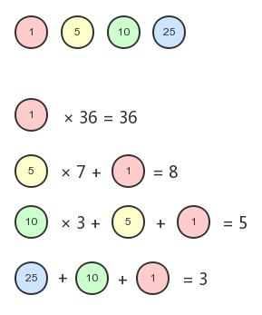

动态规划（Dynamic Programming，DP）是一种将复杂问题分解成更小的子问题来解决的优化算法。

解题思路：

- 明确 状态 和 选择
- 明确 dp 数组定义
- 状态转移方程
- 伪代码转换为代码

下面有一些用动态规划来解决实际问题的算法：

<a name="757a1831"></a>

### 最少硬币找零

给定一组硬币的面额，以及要找零的钱数，计算出符合找零钱数的最少硬币数量。例如，美国硬币面额有 1、5、10、25 这四种面额，如果要找 36 美分的零钱，则得出的最少硬币数应该是 1 个 25 美分、1 个 10 美分和 1 个 1 美分共三个硬币。这个算法要解决的就是诸如此类的问题。我们来看看如何用动态规划的方式来解决。
对于每一种面额，我们都分别计算所需要的硬币数量。具体算法如下：

1. 如果全部用 1 美分的硬币，一共需要 36 个硬币
2. 如果用 5 美分的硬币，则需要 7 个 5 美分的硬币 + 1 个 1 美分的硬币 = 8 个硬币
3. 如果用 10 美分的硬币，则需要 3 个 10 美分的硬币 + 1 个 5 美分的硬币 + 1 个 1 美分的硬币 = 5 个硬币
4. 如果用 25 美分的硬币，则需要 1 个 25 美分的硬币 + 1 个 10 美分的硬币 + 1 个 1 美分的硬币 = 3 个硬币

对应的示意图如下：

方案 4 的硬币总数最少，因此为最优方案。
具体的代码实现如下：

```javascript
function minCoinChange(coins, amount) {
    let result = null
    if (!amount) return result

    const makeChange = (index, value, min) => {
        let coin = coins[index]
        let newAmount = Math.floor(value / coin)
        if (newAmount) min[coin] = newAmount
        if (value % coin !== 0) {
            makeChange(--index, value - coin * newAmount, min)
        }
    }

    const arr = []
    for (let i = 0; i < coins.length; i++) {
        const cache = {}
        makeChange(i, amount, cache)
        arr.push(cache)
    }

    console.log(arr)
    let newMin = 0
    arr.forEach(item => {
        let min = 0
        for (let v in item) min += item[v]
        if (!newMin || min < newMin) {
            newMin = min
            result = item
        }
    })
    return result
}
```

函数 minCoinChange()接收一组硬币的面额，以及要找零的钱数。我们将上面例子中的值传入：

```javascript
const result = minCoinChange2([1, 5, 10, 25], 36)
console.log(result)
```

得到如下结果：

```shell
[
  { '1': 36 },
  { '1': 1, '5': 7 },
  { '1': 1, '5': 1, '10': 3 },
  { '1': 1, '10': 1, '25': 1 }
]
{ '1': 1, '10': 1, '25': 1 }
```

上面的数组是我们在代码中打印出来的 arr 的值，用来展示四种不同面额的硬币作为找零硬币时，实际所需要的硬币种类和数量。最终，我们会计算 arr 数组中硬币总数最少的那个方案，作为 minCoinChange()函数的输出。
当然在实际应用中，我们可以把硬币抽象成任何你需要的数字，这个算法能给出你满足结果的最小组合。

<a name="d39a003f"></a>

### 背包问题

背包问题是一个组合优化问题，它被描述为：给定一个具有固定容量的背包 capacity，以及一组具有价值（value）和重量（weight）的物品，找出一个最优方案，使得装入背包的物品的总重量不超过 capacity，且总价值最大。
假设我们有以下物品，且背包的总容量为 5：

| **物品#** | **重量** | **价值** |
| --- | --- | --- |
| 1 | 2 | 3 |
| 2 | 3 | 4 |
| 3 | 4 | 5 |

我们用矩阵来解决这个问题。首先，我们把物品和背包的容量组成如下矩阵：

| **物品(i)/重量(w)** | **0** | **1** | **2** | **3** | **4** | **5** |
| --- | --- | --- | --- | --- | --- | --- |
| **0** | 0 | 0 | 0 | 0 | 0 | 0 |
| **1 (w=2, v=3)** | 0 | 0 | a: 3+\[0]\[2-2]=3+0 |  |  |  |

b: \[0]\[2]=0
max(3+0,0)=3 | a: 3+\[0]\[3-2]=3+0
b: \[0]\[3]=0
max(3+0,0)=3 | a: 3+\[0]\[4-3]=3+0
b: \[0]\[4]=0
max(3+0,0)=3 | a: 3+\[0]\[5-3]=3+0
b: \[0]\[5]=0
max(3+0,0)=3 |
| **2 (w=3, v=4)** | 0 | 0 | 3 | a: 4+\[1]\[3-3]=4+0
b: \[1]\[3]=3
max(4+0,3)=4 | a: 4+\[1]\[4-3]=4+0
b: \[1]\[4]=3
max(4+0,3)=4 | a: 4+\[1]\[5-3]=4+3
b: \[1]\[5]=3
max(4+3,3)=7 |
| **3 (w=4, v=5)** | 0 | 0 | 3 | 4 | a: 5+\[2]\[4-4]=5+0
b: \[2]\[4]=4
max(5+0,4)=5 | a: 5+\[2]\[5-4]=5+0
b: \[2]\[5]=7
max(5+0,7)=7 |

为了便于理解，我们将矩阵 kS 的第一列和第一行忽略（因为它们表示的是容量 0 和第 0 个物品）。然后，按照要求往矩阵的格子里填数。如果当前的格子能放下对应的物品，存在以下两种情况：

- **a - 放入当前物品，然后剩余的重量再放入前一个物品**
- **b - 不放入当前物品，放入前一个物品**

在上面的表格中，

1. 当背包的重量为 1 时，没有物品能放入，所以都是 0，这个很好理解。
2. 当背包的重量为 2 时，物品 1 可以放入，那么存在两种情况：放入物品 1（价值为 3），剩余的重量（背包的重量 2 减去物品 1 的重量 2，结果为 0）再放入前一个物品；不放入物品 1，放入前一个物品\[0]\[2]，价值为 0。所以最大价值就是 max(3, 0)=3。
3. ......
4. 当背包的重量为 5 时，放入物品 2，两种情况：放入物品 2（价值为 4），剩余的重量（背包的重量 5 减去物品 2 的重量 3，结果为 2）再放入前一个物品，是\[1]\[2]，对应的价值是 3；不放入物品 2，，放入前一个物品\[1]\[5]，价值为 3。所以最大价值就是 max(4+3, 3)=7。
5. ......

如果当前物品不能放入背包，则忽略它，用前一个值代替。我们可以按照上面描述的过程把剩余的格子都填满，这样表格中最后一个单元格里的值就是最优方案。
下面是具体的实现代码：

```javascript
function knapSack(capacity, weights, values, n) {
    const kS = []

    // 将ks初始化为一个空的矩阵
    for (let i = 0; i <= n; i++) {
        kS[i] = []
    }

    for (let i = 0; i <= n; i++) {
        for (let w = 0; w <= capacity; w++) {
            // 忽略矩阵的第1列和第1行
            if (i === 0 || w === 0) {
                kS[i][w] = 0
            } else if (weights[i - 1] <= w) {
                const a = values[i - 1] + kS[i - 1][w - weights[i - 1]]
                const b = kS[i - 1][w]
                kS[i][w] = Math.max(a, b)
            } else {
                kS[i][w] = kS[i - 1][w]
            }
        }
    }

    console.log(kS)
}

// 另一种实现
// 第 i 个物品的价值是：val[i - 1]
// 第 i 个物品的重量是：wt[i - 1]
// dp[i][w] = dp[i-1][w-wt[i-1]] + val[i-1]
function knapSack(W, N, wt = [], val = []) {
  const dp = new Array(N+1).fill(new Array(W + 1).fill(0))
  for (let i = 1; i <= N; i++) {
    for (let w = 1; w <= W; w++) {
      if (w - wt[i - 1] < 0) {
        dp[i][w] = dp[i - 1][w]
      } else {
        dp[i][w] = Math.max(dp[i - 1][w], dp[i - 1][w - wt[i - 1]] - val[i - 1])
      }
    }
  }
}
```

对于 const a，其价值分为两部分，第一部分就是它自己的价值（values\[i - 1]），第二部分是用背包剩余的重量（w - weights\[i - 1]）装进前一个物品（kS\[i - 1]）。对于 const b，就是找前一个能放入这个重量的物品（kS\[i - 1]\[w]）。然后取这两种情况下的最大值。
测试一下 knapSack()函数，

```javascript
const capacity = 5
const weights = [2, 3, 4]
const values = [3, 4, 5]
knapSack(capacity, weights, values, weights.length)
```

下面是矩阵 kS 的输出结果：

```shell
[
  [ 0, 0, 0, 0, 0, 0 ],
  [ 0, 0, 3, 3, 3, 3 ],
  [ 0, 0, 3, 4, 4, 7 ],
  [ 0, 0, 3, 4, 5, 7 ]
]
```

<a name="09793c39"></a>

### 最长公共子序列（LCS）

找出两个字符串序列的最长子序列的长度。所谓最长子序列，是指两个字符串序列中以相同顺序出现，但不要求连续的字符串序列。例如下面两个字符串：
字符串 1：acbaed
字符串 2：abcadf
则 LCS 为 acad。
和背包问题的思路类似，我们用下面的表格来描述整个过程：

|  |  | a | b | c | a | d | f |
| --- | --- | --- | --- | --- | --- | --- | --- |
|  | 0 | 0 | 0 | 0 | 0 | 0 | 0 |
| a | 0 | 1 | 1 | 1 | 1 | 1 | 1 |
| c | 0 | 1 | 1 | 2 | 2 | 2 | 2 |
| b | 0 | 1 | 2 | 2 | 2 | 2 | 2 |
| a | 0 | 1 | 2 | 2 | 3 | 3 | 3 |
| e | 0 | 1 | 2 | 2 | 3 | 3 | 3 |
| d | 0 | 1 | 2 | 2 | 3 | 4 | 4 |

矩阵的第一行和第一列都被设置为 0，剩余的部分，遵循下面两种情况：

- 如果 wordX\[i - 1]和 wordY\[j - 1]相等，则矩阵对应的单元格的值为单元格\[i - 1]\[j - 1]的值加 1。
- 如果 wordX\[i - 1]和 wordY\[j - 1]不相等，则找出单元格\[i - 1]\[j]和单元格\[i]\[j - 1]之间的最大值。

下面是具体的实现代码：

```javascript
function lcs(wordX, wordY) {
    const m = wordX.length
    const n = wordY.length
    const l = []
    for (let i = 0; i <= m; i++) {
        l[i] = []
        for (let j = 0; j <= n; j++) {
            l[i][j] = 0
        }
    }
    for (let i = 0; i <= m; i++) {
        for (let j = 0; j <= n; j++) {
            if (i === 0 || j === 0) {
                l[i][j] = 0
            } else if (wordX[i - 1] === wordY[j - 1]) {
                l[i][j] = l[i - 1][j - 1] + 1
            } else {
                const a = l[i - 1][j]
                const b = l[i][j - 1]
                l[i][j] = Math.max(a, b)
            }
        }
    }
    console.log(l)
    console.log(l[m][n])
}
```

我们将矩阵打印出来，结果如下：

```javascript
const wordX = ["a", "c", "b", "a", "e", "d"]
const wordY = ["a", "b", "c", "a", "d", "f"]
lcs(wordX, wordY)
```

```shell
[
  [ 0, 0, 0, 0, 0, 0, 0 ],
  [ 0, 1, 1, 1, 1, 1, 1 ],
  [ 0, 1, 1, 2, 2, 2, 2 ],
  [ 0, 1, 2, 2, 2, 2, 2 ],
  [ 0, 1, 2, 2, 3, 3, 3 ],
  [ 0, 1, 2, 2, 3, 3, 3 ],
  [ 0, 1, 2, 2, 3, 4, 4 ]
]
4
```

矩阵中最后一个单元格的值为 LCS 的长度。那如何计算出 LCS 的具体内容呢？我们可以设计一个相同的 solution 矩阵，用来做标记，如果 wordX\[i - 1]和 wordY\[j - 1]相等，则将 solution 矩阵中对应的值设置为'diagonal'，即上面表格中背景为灰色的单元格。否则，根据\[i]\[j]和\[i - 1]\[j]是否相等标记为'top'或'left'。然后通过 printSolution()方法来找出 LCS 的内容。修改之后的代码如下：

```javascript
function printSolution(solution, wordX, m, n) {
    let a = m
    let b = n
    let x = solution[a][b]
    let answer = ""
    while (x !== "0") {
        if (solution[a][b] === "diagonal") {
            answer = wordX[a - 1] + answer
            a--
            b--
        } else if (solution[a][b] === "left") {
            b--
        } else if (solution[a][b] === "top") {
            a--
        }
        x = solution[a][b]
    }
    return answer
}

function lcs(wordX, wordY) {
    const m = wordX.length
    const n = wordY.length
    const l = []
    const solution = []
    for (let i = 0; i <= m; i++) {
        l[i] = []
        solution[i] = []
        for (let j = 0; j <= n; j++) {
            l[i][j] = 0
            solution[i][j] = "0"
        }
    }
    for (let i = 0; i <= m; i++) {
        for (let j = 0; j <= n; j++) {
            if (i === 0 || j === 0) {
                l[i][j] = 0
            } else if (wordX[i - 1] === wordY[j - 1]) {
                l[i][j] = l[i - 1][j - 1] + 1
                solution[i][j] = "diagonal"
            } else {
                const a = l[i - 1][j]
                const b = l[i][j - 1]
                l[i][j] = Math.max(a, b)
                solution[i][j] = l[i][j] === l[i - 1][j] ? "top" : "left"
            }
        }
    }

    return printSolution(solution, wordX, m, n)
}
```

测试结果：

```javascript
const wordX = ["a", "c", "b", "a", "e", "d"]
const wordY = ["a", "b", "c", "a", "d", "f"]
console.log(lcs(wordX, wordY)) // acad
```

<a name="f609d9e1"></a>

# 贪心算法

贪心算法遵循一种近似解决问题的技术，期盼通过每个阶段的局部最优选择，从而达到全局的最优。它不像动态规划算法那样计算更大的格局。

<a name="757a1831-1"></a>

### 最少硬币找零

我们来看看如何用贪心算法解决前面提到过的最少硬币找零问题。

```javascript
function minCoinChange(coins, amount) {
    const change = []
    let total = 0
    for (let i = coins.length - 1; i >= 0; i--) {
        const coin = coins[i]
        while (total + coin <= amount) {
            change.push(coin)
            total += coin
        }
    }
    return change
}

const result = minCoinChange([1, 5, 10, 25], 36)
console.log(result) // [ 25, 10, 1 ]
```

前提是 coins 数组已经按从小到大排好序了，贪心算法从最大值开始尝试，如果该值不满足条件（要找零的钱数），则继续向下找，直到找到满足条件的所有值。以上算法并不能满足所有情况下找出最优方案，例如下面这种情况：

```javascript
const result = minCoinChange([1, 2, 5, 9, 10], 18)
console.log(result) // [ 10, 5, 2, 1 ]
```

给出的结果\[10, 5, 2, 1]并不是最优方案，最优方案应该是\[9, 9]。
与动态规划相比，贪心算法更简单、效率更高。但是其结果并不总是最理想的。但是综合看来，它相对执行时间来说，输出一个可以接受的结果。

<a name="d39a003f-1"></a>

### 背包问题

| **物品#** | **重量** | **价值** |
| --- | --- | --- |
| 1 | 2 | 3 |
| 2 | 3 | 4 |
| 3 | 4 | 5 |

在动态规划的例子里，假定背包的容量为 5，最佳方案是往背包里装入物品 1 和物品 2，总价值为 7。在贪心算法中，我们需要考虑分数的情况，假定背包的容量为 6，装入物品 1 和物品 2 之后，剩余容量为 1，可以装入 1/4 的物品 3，总价值为 3+4+0.25×5=8.25。我们来看看具体的实现代码：

```javascript
function knapSack(capacity, weights, values) {
    const n = values.length
    let load = 0
    let val = 0
    for (let i = 0; i < n && load < capacity; i++) {
        if (weights[i] <= capacity - load) {
            val += values[i]
            load += weights[i]
            console.log(`物品${i + 1}，重量：${weights[i]}，价值：${values[i]}`)
        } else {
            const r = (capacity - load) / weights[i]
            val += r * values[i]
            load += weights[i]
            console.log(`物品${i + 1}的${r}，重量：${r * weights[i]}，价值：${val}`)
        }
    }

    return val
}
```

从第一个物品开始遍历，如果总重量小于背包的容量，则继续迭代，装入物品。如果物品可以完整地装入背包，则将其价值和重量分别计入到变量 val 和 load 中，同时打印装入物品的信息。如果物品不能完整地装入背包，计算能够装入的比例 r，然后将这个比例所对应的价值和重量分别计入到变量 val 和 load 中，同时打印物品的信息。最终输出总的价值 val。下面是测试结果：

```javascript
const capacity = 6
const weights = [2, 3, 4]
const values = [3, 4, 5]
console.log(knapSack(capacity, weights, values))
```

    物品1，重量：2，价值：3
    物品2，重量：3，价值：4
    物品3的0.25，重量：1，价值：8.25
    8.25

在动态规划算法中，如果将背包的容量也设定为 6，计算结果则为 8。

<a name="09793c39-1"></a>

### 最长公共子序列（LCS）

最后我们再来看看如何用贪心算法解决 LCS 的问题。下面的代码返回了两个给定数组中的 LCS 的长度：

```javascript
function lcs(wordX, wordY, m = wordX.length, n = wordY.length) {
    if (m === 0 || n === 0) {
        return 0
    }
    if (wordX[m - 1] === wordY[n - 1]) {
        return 1 + lcs(wordX, wordY, m - 1, n - 1)
    }
    const a = lcs(wordX, wordY, m, n - 1)
    const b = lcs(wordX, wordY, m - 1, n)
    return a > b ? a : b
}

const wordX = ["a", "c", "b", "a", "e", "d"]
const wordY = ["a", "b", "c", "a", "d", "f"]
console.log(lcs(wordX, wordY)) // 4
```
