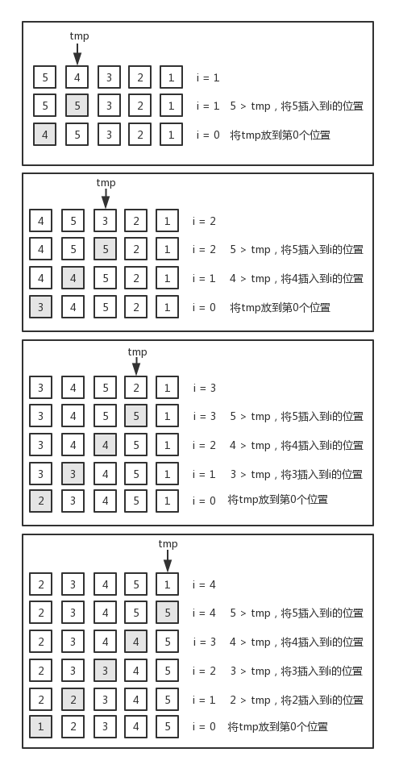
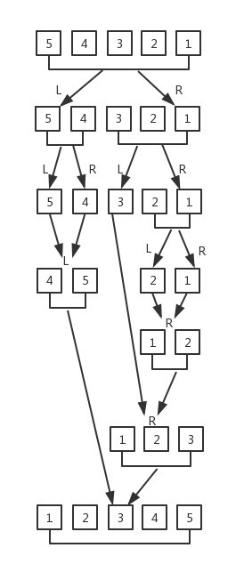
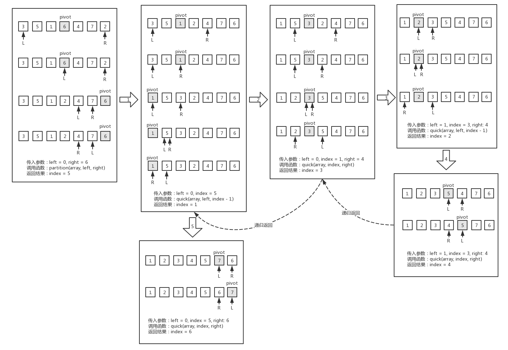
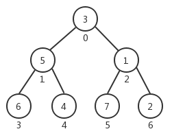
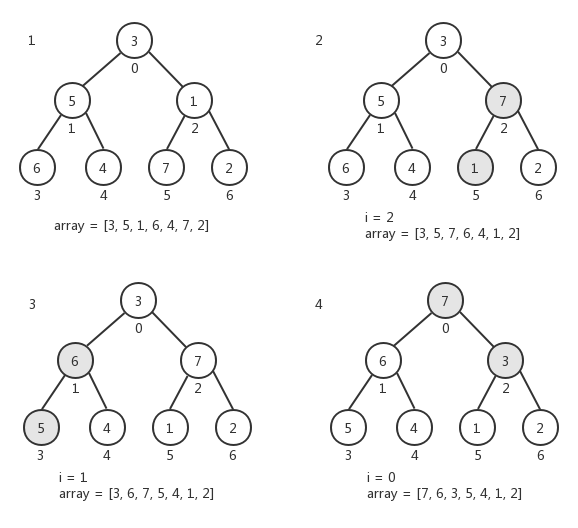
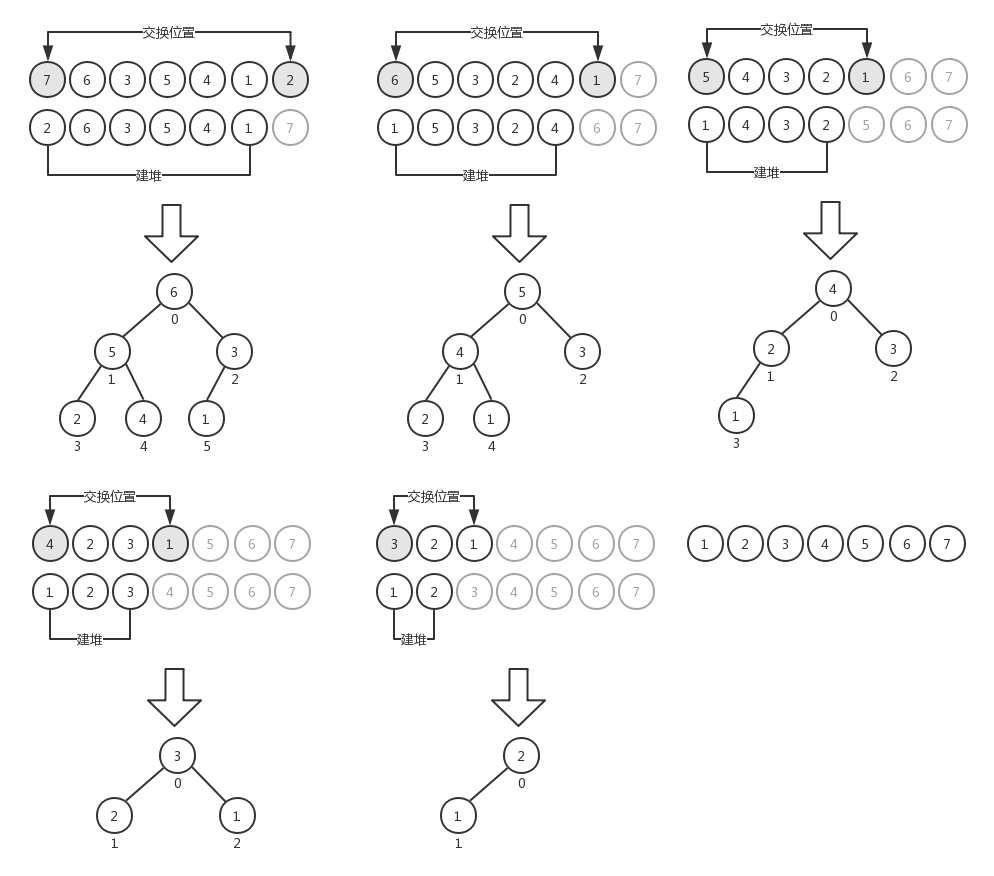

在计算机编程中，排序算法是最常用的算法之一，本文介绍了几种常见的排序算法以及它们之间的差异和复杂度。

<a name="5d7ecc89"></a>

## 冒泡排序

冒泡排序应该是最简单的排序算法了，在所有讲解计算机编程和数据结构的课程中，无一例外都会拿冒泡排序作为开篇来讲解排序的原理。冒泡排序理解起来也很容易，就是两个嵌套循环遍历数组，对数组中的元素两两进行比较，如果前者比后者大，则交换位置（这是针对升序排序而言，如果是降序排序，则比较的原则是前者比后者小）。

在冒泡排序中，对于内层的循环而言，每一次都是把这一轮中的最大值放到最后（相对于升序排序），它的过程是这样的：第一次内层循环，找出数组中的最大值排到数组的最后；第二次内层循环，找出数组中的次大值排到数组的倒数第二位；第三次内层循环，找出数组中的第三大值排到数组的倒数第三位......以此类推。所以，对于内层循环，我们可以不用每一次都遍历到length - 1的位置，而只需要遍历到 length - 1 - i的位置就可以了，这样可以减少内层循环遍历的次数。下面是改进后的冒泡排序算法

```javascript
function bubbleSortArray(array) {
    let length = array.length
    for (let i = 0; i < length; i++) {
        for (let j = 0; j < length - 1 - i; j++) {
            if (array[j] > array[j + 1]) {
                [array[j], array[j + 1]] = [array[j + 1], array[j]]
            }
        }
    }
}
```

i
在实际应用中，我们并不推荐使用冒泡排序算法，尽管它是最直观的用来讲解排序过程的算法。冒泡排序算法的复杂度为 O(n2)。 <a name="cc128b01"></a>

## 选择排序

选择排序与冒泡排序很类似，它也需要两个嵌套的循环来遍历数组，只不过在每一次循环中要找出最小的元素（这是针对升序排序而言，如果是降序排序，则需要找出最大的元素）。第一次遍历找出最小的元素排在第一位，第二次遍历找出次小的元素排在第二位，以此类推。我们来看下选择排序的的实现：

```javascript
function selectionSort(array) {
    let length = nums.length
    for (let i = 0; i < length; i++) {
        let min = i
        for (let j = i; j < length; j++) {
            if (nums[min] > nums[j]) {
                min = j
            }
        }
        if (min !== i) {
            [nums[i], nums[min]] = [nums[min], nums[i]]
        }
    }
    return nums
}
```

上面这段代码是升序选择排序，它的执行过程是这样的，首先将第一个元素作为最小元素 min，然后在内层循环中遍历数组的每一个元素，如果有元素的值比 min 小，就将该元素的值赋值给 min。内层遍历完成后，如果数组的第一个元素和 min 不相同，则将它们交换一下位置。然后再将第二个元素作为最小元素 min，重复前面的过程。直到数组的每一个元素都比较完毕。

选择排序算法的复杂度与冒泡排序一样，也是 O(n2)。

<a name="112be43e"></a>

## 插入排序

插入排序与前两个排序算法的思路不太一样，为了便于理解，我们以\[ 5, 4, 3, 2, 1 ]这个数组为例，用下图来说明插入排序的整个执行过程：

在插入排序中，对数组的遍历是从第二个元素开始的，tmp 是个临时变量，用来保存当前位置的元素。然后从当前位置开始，取前一个位置的元素与 tmp 进行比较，如果值大于 tmp（针对升序排序而言），则将这个元素的值插入到这个位置中，最后将 tmp 放到数组的第一个位置（索引号为 0）。反复执行这个过程，直到数组元素遍历完毕。下面是插入排序算法的实现：
l

```javascript
function insertionSort(array) {
    let length = array.length
    let j, tmp

    for (let i = 1; i < length; i++) {
        j = i
        tmp = array[i]
        while (j > 0 && array[j - 1] > tmp) {
            array[j] = array[j - 1]
            j--
        }
        array[j] = tmp
    }
}
```

插入排序比冒泡排序和选择排序算法的性能要好。
i <a name="95566613"></a>

## 归并排序

归并排序比前面介绍的几种排序算法性能都要好，它的复杂度为O(nlogn)。
归并排序的基本思路是通过递归调用将给定的数组不断分割成最小的两部分（每一部分只有一个元素），对这两部分进行排序，然后向上合并成一个大数组。我们还是以\[ 5, 4, 3, 2, 1 ]这个数组为例，来看下归并排序的整个执行过程：

首先要将数组分成两个部分，对于非偶数长度的数组，你可以自行决定将多的分到左边或者右边。然后按照这种方式进行递归，直到数组的左右两部分都只有一个元素。对这两部分进行排序，递归向上返回的过程中将其组成和一个完整的数组。下面是归并排序的算法的实现：

```javascript
const dfs = (l, r) => {
  let i = 0
  let j = 0
  let res = []
  while (i < l.length && j < r.length) {
    if (l[i] < r[j]) {
      res.push(l[i++])
    } else {
      res.push(r[j++])
    }
  }
  return res.concat(i < l.length ? l.slice(i) : r.slice(j))
}
let length = nums.length
if (length > 1) {
  let midIndex = length >> 1
  nums = dfs(sortArray(nums.slice(0, midIndex)), sortArray(nums.slice(midIndex, length)))
}
return nums
```

<a name="5ee213ee"></a>

## 快速排序

快速排序的复杂度也是O(nlogn)，但它的性能要优于其它排序算法。快速排序与归并排序类似，其基本思路也是将一个大数组分为较小的数组，但它不像归并排序一样将它们分割开。快速排序算法比较复杂，大致过程为：

1. 从给定的数组中选取一个参考元素。参考元素可以是任意元素，也可以是数组的第一个元素，我们这里选取中间位置的元素（如果数组长度为偶数，则向下取一个位置），这样在大多数情况下可以提高效率。
2. 创建两个指针，一个指向数组的最左边，一个指向数组的最右边。移动左指针直到找到比参考元素大的元素，移动右指针直到找到比参考元素小的元素，然后交换左右指针对应的元素。重复这个过程，直到左指针超过右指针（即左指针的索引号大于右指针的索引号）。通过这一操作，比参考元素小的元素都排在参考元素之前，比参考元素大的元素都排在参考元素之后（针对升序排序而言）。
3. 以参考元素为分隔点，对左右两个较小的数组重复上述过程，直到整个数组完成排序。

下面是快速排序算法的实现：

```javascript
const partition = (array, left, right) => {
    const pivot = array[Math.floor((right + left) / 2)]
    let i = left
    let j = right

    while (i <= j) {
        while (array[i] < pivot) {
            i++
        }
        while (array[j] > pivot) {
            j--
        }
        if (i <= j) {
            ;[array[i], array[j]] = [array[j], array[i]]
            i++
            j--
        }
    }
    return i
}

const quick = (array, left, right) => {
    let length = array.length
    let index
    if (length > 1) {
        index = partition(array, left, right)
        if (left < index - 1) {
            quick(array, left, index - 1)
        }
        if (index < right) {
            quick(array, index, right)
        }
    }
    return array
}

function quickSort(array) {
    return quick(array, 0, array.length - 1)
}
```

假定数组为\[ 3, 5, 1, 6, 4, 7, 2 ]，按照上面的代码逻辑，整个排序的过程如下图所示：

下面是测试结果：

```javascript
let array = [3, 5, 1, 6, 4, 7, 2]
console.log(array.toString()) // 3,5,1,6,4,7,2
console.log(quickSort(array).toString()) // 1,2,3,4,5,6,7
```

快速排序算法理解起来有些难度，可以按照上面给出的示意图逐步推导一遍，以帮助理解整个算法的实现原理。

<a name="141c7256"></a>

## 堆排序

在计算机科学中，堆是一种特殊的数据结构，它通常用树来表示数组。堆有以下特点：

- 堆是一棵完全二叉树
- 子节点的值不大于父节点的值（最大堆），或者子节点的值不小于父节点的值（最小堆）
- 根节点的索引号为 0
- 子节点的索引为父节点索引 × 2 + 1
- 右子节点的索引为父节点索引 × 2 + 2

堆排序是一种比较高效的排序算法。
在堆排序中，我们并不需要将数组元素插入到堆中，而只是通过交换来形成堆，以数组\[ 3, 5, 1, 6, 4, 7, 2 ]为例，我们用下图来表示其初始状态：

那么，如何将其转换成一个符合标准的堆结构呢？先来看看堆排序算法的实现：

```javascript
const heapify = (array, heapSize, index) => {
    let largest = index
    const left = index * 2 + 1
    const right = index * 2 + 2
    if (left < heapSize && array[left] > array[index]) {
        largest = left
    }
    if (right < heapSize && array[right] > array[largest]) {
        largest = right
    }
    if (largest !== index) {
        ;[array[index], array[largest]] = [array[largest], array[index]]
        heapify(array, heapSize, largest)
    }
}

const buildHeap = array => {
    let heapSize = array.length
    for (let i = heapSize; i >= 0; i--) {
        heapify(array, heapSize, i)
    }
}

function heapSort(array) {
    let heapSize = array.length
    buildHeap(array)

    while (heapSize > 1) {
        heapSize--
        ;[array[0], array[heapSize]] = [array[heapSize], array[0]]
        heapify(array, heapSize, 0)
    }

    return array
}
```

函数 buildHeap()将给定的数组转换成堆（按最大堆处理）。下面是将数组\[ 3, 5, 1, 6, 4, 7, 2 ]转换成堆的过程示意图：

在函数 buildHeap()中，我们从数组的尾部开始遍历去查看每个节点是否符合堆的特点。在遍历的过程中，我们发现当索引号为 6、5、4、3 时，其左右子节点的索引大小都超出了数组的长度，这意味着它们都是叶子节点。那么我们真正要做的就是从索引号为 2 的节点开始。其实从这一点考虑，结合我们利用完全二叉树来表示数组的特性，可以对 buildHeap()函数进行优化，将其中的 for 循环修改为下面这样，以去掉对子节点的操作。

```javascript
for (let i = Math.floor(heapSize / 2) - 1; i >= 0; i--) {
    heapify(array, heapSize, i)
}
```

从索引 2 开始，我们查看它的左右子节点的值是否大于自己，如果是，则将其中最大的那个值与自己交换，然后向下递归查找是否还需要对子节点继续进行操作。索引 2 处理完之后再处理索引 1，然后是索引 0，最终转换出来的堆如图中的 4 所示。你会发现，每一次堆转换完成之后，排在数组第一个位置的就是堆的根节点，也就是数组的最大元素。根据这一特点，我们可以很方便地对堆进行排序，其过程是：

- 将数组的第一个元素和最后一个元素交换
- 减少数组的长度，从索引 0 开始重新转换堆

直到整个过程结束。对应的示意图如下：

堆排序的核心部分在于如何将数组转换成堆，也就是上面代码中 buildHeap()和 heapify()函数部分。
同样给出堆排序的测试结果：

```javascript
let array = [3, 5, 1, 6, 4, 7, 2]
console.log(array.toString()) // 3,5,1,6,4,7,2
console.log(heapSort(array).toString()) // 1,2,3,4,5,6,7
```

<a name="6f407f2b"></a>

## 有关算法复杂度

上面我们在介绍各种排序算法的时候，提到了算法的复杂度，算法复杂度用大O表示法，它是用大O表示的一个函数，如：

- O(1)：常数
- O(log(n))：对数
- O(log(n) c)：对数多项式
- O(n)：线性
- O(n2)：二次
- O(nc)：多项式
- O(cn)：指数

我们如何理解大O表示法呢？看一个例子：

```javascript
function increment(num) {
    return ++num
}
```

对于函数 increment()，无论我传入的参数 num 的值是什么数字，它的运行时间都是 X（相对于同一台机器而言）。函数 increment()的性能与参数无关，因此我们可以说它的算法复杂度是O(1)（常数）。
再看一个例子：

```javascript
function sequentialSearch(array, item) {
    for (let i = 0; i < array.length; i++) {
        if (item === array[i]) return i
    }
    return -1
}
```

函数 sequentialSearch()的作用是在数组中搜索给定的值，并返回对应的索引号。假设 array 有 10 个元素，如果要搜索的元素排在第一个，我们说开销为 1。如果要搜索的元素排在最后一个，则开销为 10。当数组有 1000 个元素时，搜索最后一个元素的开销是 1000。所以，sequentialSearch()函数的总开销取决于数组元素的个数和要搜索的值。在最坏情况下，没有找到要搜索的元素，那么总开销就是数组的长度。因此我们得出 sequentialSearch()函数的时间复杂度是O(n)，n 是数组的长度。
同理，对于前面我们说的冒泡排序算法，里面有一个双层嵌套的 for 循环，因此它的复杂度为O(n2)。
时间复杂度O(n)的代码只有一层循环，而O(n2)的代码有双层嵌套循环。如果算法有三层嵌套循环，它的时间复杂度就是O(n3)。
下表展示了各种不同数据结构的时间复杂度：

| 数据结构 | 一般情况 |  |  | 最差情况 |  |  |
| --- | --- | --- | --- | --- | --- | --- |
|  | 插入 | 删除 | 搜索 | 插入 | 删除 | 搜索 |
| 数组/栈/队列 | O(1) | O(1) | O(n) | O(1) | O(1) | O(n) |
| 链表 | O(1) | O(1) | O(n) | O(1) | O(1) | O(n) |
| 双向链表 | O(1) | O(1) | O(n) | O(1) | O(1) | O(n) |
| 散列表 | O(1) | O(1) | O(1) | O(n) | O(n) | O(n) |
| BST 树 | O(log(n)) | O(log(n)) | O(log(n)) | O(n) | O(n) | O(n) |
| AVL 树 | O(log(n)) | O(log(n)) | O(log(n)) | O(log(n)) | O(log(n)) | O(log(n)) |

数据结构的时间复杂度


| 节点/边的管理方式 | 存储空间 | 增加顶点 | 增加边 | 删除顶点 | 删除边 | 轮询 |
| --- | --- | --- | --- | --- | --- | --- |
| 领接表 | O(| V | + | E |) | O(1) | O(1) | O(| V | + | E |) | O(| E |) | O(| V |) |
| 邻接矩阵 | O(| V |2) | O(| V |2) | O(1) | O(| V |2) | O(1) | O(1) |

图的时间复杂度


| 算法（用于数组） | 时间复杂度 |  |  |
| --- | --- | --- | --- |
|  | 最好情况 | 一般情况 | 最差情况 |
| 冒泡排序 | O(n) | O(n2) | O(n3) |
| 选择排序 | O(n2) | O(n2) | O(n2) |
| 插入排序 | O(n) | O(n2) | O(n2) |
| 归并排序 | O(log(n)) | O(log(n)) | O(log(n)) |
| 快速排序 | O(log(n)) | O(log(n)) | O(n2) |
| 堆排序 | O(log(n)) | O(log(n)) | O(log(n)) |

排序算法的时间复杂度

<a name="cb760e4e"></a>

## 搜索算法

顺序搜索是一种比较直观的搜索算法，上面介绍算法复杂度一小节中的 sequentialSearch()函数就是顺序搜索算法，就是按顺序对数组中的元素逐一比较，直到找到匹配的元素。顺序搜索算法的效率比较低。
还有一种常见的搜索算法是二分搜索算法。它的执行过程是：

1. 将待搜索数组排序。
2. 选择数组的中间值。
3. 如果中间值正好是要搜索的值，则完成搜索。
4. 如果要搜索的值比中间值小，则选择中间值左边的部分，重新执行步骤 2。
5. 如果要搜索的值比中间值大，则选择中间值右边的部分，重新执行步骤 2。

下面是二分搜索算法的具体实现：

```javascript
function binarySearch(array, item) {
    quickSort(array) // 首先用快速排序法对array进行排序

    let low = 0
    let high = array.length - 1

    while (low <= high) {
        const mid = Math.floor((low + high) / 2) // 选取中间位置的元素
        const element = array[mid]

        // 待搜索的值大于中间值
        if (element < item) low = mid + 1
        // 待搜索的值小于中间值
        else if (element > item) high = mid - 1
        // 待搜索的值就是中间值
        else return true
    }

    return false
}
```

对应的测试结果：

```javascript
const array = [8, 7, 6, 5, 4, 3, 2, 1]
console.log(binarySearch(array, 2)) // true
```

这个算法的基本思路有点类似于猜数字大小，每当你说出一个数字，我都会告诉你是大了还是小了，经过几轮之后，你就可以很准确地确定数字的大小了。
