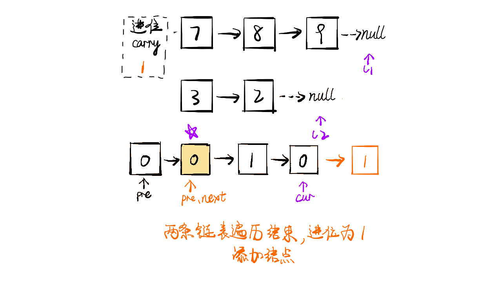

题目描述：

给出两个 非空 的链表用来表示两个非负的整数。其中，它们各自的位数是按照 逆序 的方式存储的，并且它们的每个节点只能存储 一位 数字。

如果，我们将这两个数相加起来，则会返回一个新的链表来表示它们的和。

您可以假设除了数字 0 之外，这两个数都不会以 0 开头。

示例:

```javascript
输入：(2 -> 4 -> 3) + (5 -> 6 -> 4)
输出：7 -> 0 -> 8
原因：342 + 465 = 807
```

<a name="0c223e18"></a>

## 解题思路

1. 将两个链表看作相同长度进行遍历，如果某个链表较短则在前方补 `0`
2. 因为每个节点只能存放一位数字，因此要考虑进位，计算结束后要更新进位值
3. 若两个链表全部遍历完成之后，进位位 `1`，则在新构建的链表最前方添加节点 `1`

<a name="571f6dbc"></a>

## 图解




```javascript
/**
 * Definition for singly-linked list.
 * function ListNode(val) {
 *     this.val = val;
 *     this.next = null;
 * }
 */
/**
 * @param {ListNode} l1
 * @param {ListNode} l2
 * @return {ListNode}
 */
var addTwoNumbers = function(l1, l2) {
    var node = new ListNode(0);
    var current = node;
    var carry = 0;
    
    while(l1 || l2) {
        var n1 = l1 ? l1.val : 0;
        var n2 = l2 ? l2.val : 0;
        var sum = n1 + n2 + carry;
        carry = parseInt(sum / 10);
        current.next = new ListNode(sum % 10);
        current = current.next;
        
        if (l1) l1 = l1.next;
        if (l2) l2 = l2.next;
    }
    
    if (carry > 0) {
        current.next = new ListNode(carry)        
    }
    
    return node.next
};
```
