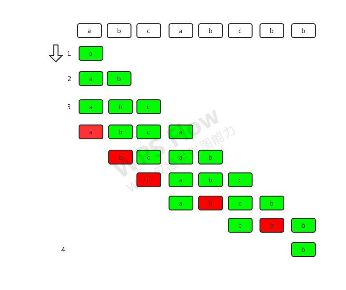

给定一个字符串，请你找出其中不含有重复字符的 **最长子串** 的长度。

示例 1:

```javascript
输入: "abcabcbb"
输出: 3 
解释: 因为无重复字符的最长子串是 "abc"，所以其长度为 3。
```

示例 2:

```javascript
输入: "bbbbb"
输出: 1
解释: 因为无重复字符的最长子串是 "b"，所以其长度为 1。
```

示例 3:

```javascript
输入: "pwwkew"
输出: 3
解释: 因为无重复字符的最长子串是 "wke"，所以其长度为 3。
     请注意，你的答案必须是 子串 的长度，"pwke" 是一个子序列，不是子串。
```

<a name="0c223e18"></a>

## 解题思路

> 通过图解法进行判定，每当出现新的重复字符时，将重新截取子字符串。
> 截取的位置为该字符串第一次出现重复字符的位置。
> 字符串长度为 0 则直接返回

<a name="571f6dbc"></a>

## 图解

 <a name="Nm6k0"></a>

### 游标法

```javascript
/**
 * @param {string} s
 * @return {number}
 */
var lengthOfLongestSubstring = function (s) {
    let maxLength = 0
    let subStr = ""
    for (let i = 0; i < s.length; i++) {
        if (!subStr.includes(s[i])) {
            subStr += s[i]
        } else {
            let idx = subStr.indexOf(s[i])
            subStr = subStr.substring(idx + 1) + s[i]
        }
        maxLength = Math.max(maxLength, subStr.length)
    }
    return maxLength
}
```

<a name="zv5Wo"></a>

### 哈希表法

```javascript
/**
 * @param {string} s
 * @return {number}
 */
var lengthOfLongestSubstring = function (s) {
    let maxLength = 0
    let i = 0
    let map = new Map()
    for (let j = 0; j < s.length; j++) {
        if (map.has(s[j]) && map.get(s[j]) >= i) {
            i = map.get(s[j]) + 1
        }
        maxLength = Math.max(maxLength, j - i + 1)
        map.set(s[j], j)
    }
    return maxLength
}
```
