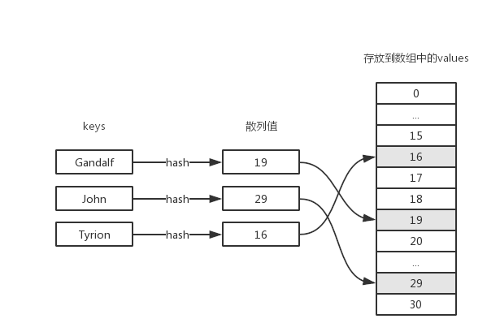
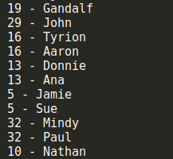
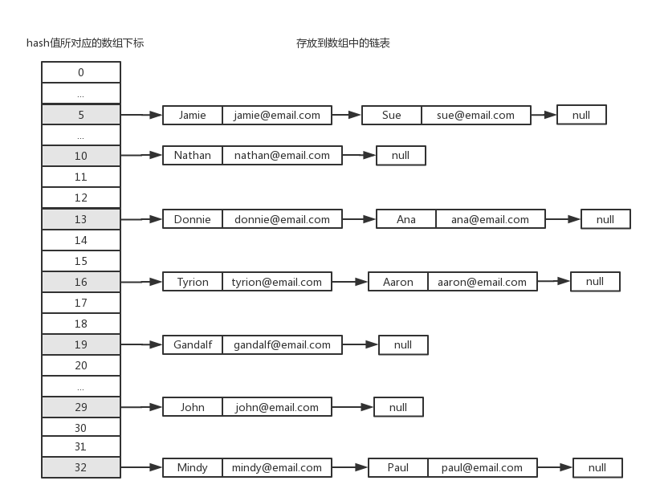
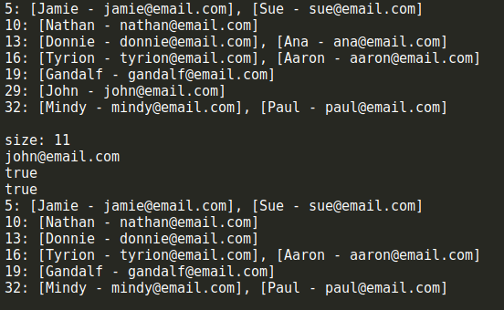
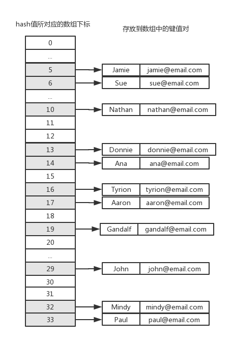
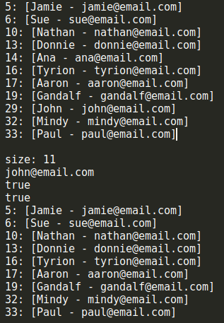
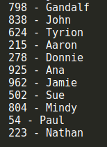

[链接](https://www.cnblogs.com/jaxu/p/11302315.html)

在[前一篇文章](https://www.cnblogs.com/jaxu/p/11287315.html)中，我们介绍了如何在 JavaScript 中实现集合。字典和集合的主要区别就在于，集合中数据是以**\[值，值]**的形式保存的，我们只关心值本身；而在字典和散列表中数据是以**\[键，值]**的形式保存的，键不能重复，我们不仅关心键，也关心键所对应的值。
我们也可以把字典称之为映射表。由于字典和集合很相似，我们可以在[前一篇文章](https://www.cnblogs.com/jaxu/p/11287315.html)中的集合类 Set 的基础上来实现我们的字典类 Dictionary。与 Set 类相似，ES6 的原生 Map 类已经实现了字典的全部功能，稍后我们会介绍它的用法。
下面是我们的 Dictionary 字典类的实现代码：


```javascript
class Dictionary {
    constructor() {
        this.items = {}
    }

    set(key, value) {
        // 向字典中添加或修改元素
        this.items[key] = value
    }

    get(key) {
        // 通过键值查找字典中的值
        return this.items[key]
    }

    delete(key) {
        // 通过使用键值来从字典中删除对应的元素
        if (this.has(key)) {
            delete this.items[key]
            return true
        }
        return false
    }

    has(key) {
        // 判断给定的键值是否存在于字典中
        return this.items.hasOwnProperty(key)
    }

    clear() {
        // 清空字典内容
        this.items = {}
    }

    size() {
        // 返回字典中所有元素的数量
        return Object.keys(this.items).length
    }

    keys() {
        // 返回字典中所有的键值
        return Object.keys(this.items)
    }

    values() {
        // 返回字典中所有的值
        return Object.values(this.items)
    }

    getItems() {
        // 返回字典中的所有元素
        return this.items
    }
}
```

与 Set 类很相似，只是把其中 value 的部分替换成了 key。我们来看看一些测试用例：


```javascript
let Dictionary = require("./dictionary")

let dictionary = new Dictionary()
dictionary.set("Gandalf", "gandalf@email.com")
dictionary.set("John", "john@email.com")
dictionary.set("Tyrion", "tyrion@email.com")
console.log(dictionary.has("Gandalf")) // true
console.log(dictionary.size()) // 3
console.log(dictionary.keys()) // [ 'Gandalf', 'John', 'Tyrion' ]
console.log(dictionary.values()) // [ 'gandalf@email.com', 'john@email.com', 'tyrion@email.com' ]
console.log(dictionary.get("Tyrion")) // tyrion@email.com

dictionary.delete("John")
console.log(dictionary.keys()) // [ 'Gandalf', 'Tyrion' ]
console.log(dictionary.values()) // [ 'gandalf@email.com', 'tyrion@email.com' ]
console.log(dictionary.getItems()) // { Gandalf: 'gandalf@email.com', Tyrion: 'tyrion@email.com' }
```

相应地，下面是使用 ES6 的原生 Map 类的测试结果：

```javascript
let dictionary = new Map()
dictionary.set("Gandalf", "gandalf@email.com")
dictionary.set("John", "john@email.com")
dictionary.set("Tyrion", "tyrion@email.com")
console.log(dictionary.has("Gandalf")) // true
console.log(dictionary.size) // 3
console.log(dictionary.keys()) // [Map Iterator] { 'Gandalf', 'John', 'Tyrion' }
console.log(dictionary.values()) // [Map Iterator] { 'gandalf@email.com', 'john@email.com', 'tyrion@email.com' }
console.log(dictionary.get("Tyrion")) // tyrion@email.com

dictionary.delete("John")
console.log(dictionary.keys()) // [Map Iterator] { 'Gandalf', 'Tyrion' }
console.log(dictionary.values()) // [Map Iterator] { 'gandalf@email.com', 'tyrion@email.com' }
console.log(dictionary.entries()) // [Map Iterator] { [ Gandalf: 'gandalf@email.com' ], [ Tyrion: 'tyrion@email.com' ] }
```

和前面我们自定义的 Dictionary 类稍微有一点不同，values()方法和 keys()方法返回的不是一个数组，而是 Iterator 迭代器。另一个就是这里的 size 是一个属性而不是方法，然后就是 Map 类没有 getItems()方法，取而代之的是 entries()方法，它返回的也是一个 Iterator。有关 Map 类的详细详细介绍可以查看[这里](https://developer.mozilla.org/zh-CN/docs/Web/JavaScript/Reference/Global_Objects/Map)。
在 ES6 中，除了原生的 Set 和 Map 类外，还有它们的弱化版本，分别是[WeakSet](https://developer.mozilla.org/zh-CN/docs/Web/JavaScript/Reference/Global_Objects/WeakSet)和[WeakMap](https://developer.mozilla.org/zh-CN/docs/Web/JavaScript/Reference/Global_Objects/WeakMap)，我们在[《JavaScript 数据结构——栈的实现与应用》](https://www.cnblogs.com/jaxu/p/11264017.html)一文中已经见过 WeakMap 的使用了。Map 和 Set 与它们各自的弱化版本之间的主要区别是：

- WeakSet 或 WeakMap 类没有 entries、keys 和 values 等迭代器方法，只能通过 get 和 set 方法访问和设置其中的值。这也是为什么我们在[《JavaScript 数据结构——栈的实现与应用》](https://www.cnblogs.com/jaxu/p/11264017.html)一文中要使用 WeakMap 类来定义类的私有属性的原因。
- 只能用对应作为键值，或者说其中的内容只能是对象，而不能是数字、字符串、布尔值等基本数据类型。

弱化的 Map 和 Set 类主要是为了提供 JavaScript 代码的性能。

<a name="02d41e53"></a>

### 散列表

散列表（或者叫哈希表），是一种改进的 dictionary，它将 key 通过一个固定的算法（散列函数或哈希函数）得出一个数字，然后将 dictionary 中 key 所对应的 value 存放到这个数字所对应的数组下标所包含的存储空间中。在原始的 dictionary 中，如果要查找某个 key 所对应的 value，我们需要遍历整个字典。为了提高查询的效率，我们将 key 对应的 value 保存到数组里，只要 key 不变，使用相同的散列函数计算出来的数字就是固定的，于是就可以很快地在数组中找到你想要查找的 value。下面是散列表的数据结构示意图：

下面是我们散列函数 loseloseHashCode()的实现代码：

```javascript
loseloseHashCode (key) {
    let hash = 0;
    for (let i = 0; i < key.length; i++) {
        hash += key.charCodeAt(i);
    }
    return hash % 37;
}
```

这个散列函数的实现很简单，我们将传入的 key 中的每一个字符使用 charCodeAt()函数（有关该函数的详细内容可以查看[这里](https://developer.mozilla.org/zh-CN/docs/Web/JavaScript/Reference/Global_Objects/String/charCodeAt)）将其转换成 ASCII 码，然后将这些 ASCII 码相加，最后用 37 求余，得到一个数字，这个数字就是这个 key 所对应的 hash 值。接下来要做的就是将 value 存放到 hash 值所对应的数组的存储空间内。下面是我们的 HashTable 类的主要实现代码：

```javascript
class HashTable {
    constructor() {
        this.table = []
    }

    loseloseHashCode(key) {
        // 散列函数
        let hash = 0
        for (let i = 0; i < key.length; i++) {
            hash += key.charCodeAt(i)
        }
        return hash % 37
    }

    put(key, value) {
        // 将键值对存放到哈希表中
        let position = this.loseloseHashCode(key)
        console.log(`${position} - ${key}`)
        this.table[position] = value
    }

    get(key) {
        // 通过key查找哈希表中的值
        return this.table[this.loseloseHashCode(key)]
    }

    remove(key) {
        // 通过key从哈希表中删除对应的值
        this.table[this.loseloseHashCode(key)] = undefined
    }

    isEmpty() {
        // 判断哈希表是否为空
        return this.size() === 0
    }

    size() {
        // 返回哈希表的长度
        let count = 0
        this.table.forEach(item => {
            if (item !== undefined) count++
        })
        return count
    }

    clear() {
        // 清空哈希表
        this.table = []
    }
}
```

测试一下上面的这些方法：

```javascript
let HashTable = require("./hashtable")

let hash = new HashTable()
hash.put("Gandalf", "gandalf@email.com") // 19 - Gandalf
hash.put("John", "john@email.com") // 29 - John
hash.put("Tyrion", "tyrion@email.com") // 16 - Tyrion

console.log(hash.isEmpty()) // false
console.log(hash.size()) // 3
console.log(hash.get("Gandalf")) // gandalf@email.com
console.log(hash.get("Loiane")) // undefined

hash.remove("Gandalf")
console.log(hash.get("Gandalf")) // undefined
hash.clear()
console.log(hash.size()) // 0
console.log(hash.isEmpty()) // true
```

为了方便查看 hash 值和 value 的对应关系，我们在 put()方法中加入了一行 console.log()，用来打印 key 的 hash 值和 value 之间的对应关系。可以看到，测试的结果和前面我们给出的示意图是一致的。
散列集合的实现和散列表类似，只不过在散列集合中不再使用键值对，而是只有值没有键。这个我们在前面介绍集合和字典的时候已经讲过了，这里不再赘述。
细心的同学可能已经发现了，这里我们提供的散列函数可能过于简单，以致于我们无法保证通过散列函数计算出来的 hash 值一定是唯一的。换句话说，传入不同的 key 值，我们有可能会得到相同的 hash 值。尝试一下下面这些 keys：

```javascript
let hash = new HashTable()
hash.put("Gandalf", "gandalf@email.com")
hash.put("John", "john@email.com")
hash.put("Tyrion", "tyrion@email.com")
hash.put("Aaron", "aaron@email.com")
hash.put("Donnie", "donnie@email.com")
hash.put("Ana", "ana@email.com")
hash.put("Jamie", "jamie@email.com")
hash.put("Sue", "sue@email.com")
hash.put("Mindy", "mindy@email.com")
hash.put("Paul", "paul@email.com")
hash.put("Nathan", "nathan@email.com")
```


从结果中可以看到，尽管有些 keys 不同，但是通过我们提供的散列函数居然得到了相同的 hash 值，这显然违背了我们的设计原则。在哈希表中，这个叫做散列冲突，为了得到一个可靠的哈希表，我们必须尽可能地避免散列冲突。那如何避免这种冲突呢？这里介绍两种解决冲突的方法：分离链接和线性探查。

<a name="2afa3875"></a>

#### 分离链接

所谓分离链接，就是将原本存储在哈希表中的值改成链表，这样在哈希表的同一个位置上，就可以存储多个不同的值。链表中的每一个元素，同时存储了 key 和 value。示意图如下：

这样，当不同的 key 通过散列函数计算出相同的 hash 值时，我们只需要找到数组中对应的位置，然后往其中的链表添加新的节点即可，从而有效地避免了散列冲突。为了实现这种数据结构，我们需要定义一个新的辅助类 ValuePair，它的内容如下：

```javascript
let ValuePair = function (key, value) {
    this.key = key
    this.value = value

    this.toString = function () {
        // 提供toString()方法以方便我们测试
        return `[${this.key} - ${this.value}]`
    }
}
```

ValuePair 类具有两个属性，key 和 value，用来保存我们要存入到散列表中的元素的键值对。toString()方法在这里不是必须的，该方法是为了后面我们方便测试。
新的采用了分离链接的 HashTableSeparateChaining 类可以继承自前面的 HashTable 类，完整的代码如下：

```javascript
class HashTableSeparateChaining extends HashTable {
    constructor() {
        super()
    }

    put(key, value) {
        let position = this.loseloseHashCode(key)

        if (this.table[position] === undefined) {
            this.table[position] = new LinkedList() // 单向链表，需要引入LinkedList类
        }
        this.table[position].append(new ValuePair(key, value))
    }

    get(key) {
        let position = this.loseloseHashCode(key)

        if (this.table[position] !== undefined) {
            let current = this.table[position].getHead()
            while (current) {
                if (current.element.key === key) return current.element.value
                current = current.next
            }
        }
        return undefined
    }

    remove(key) {
        let position = this.loseloseHashCode(key)
        let hash = this.table[position]

        if (hash !== undefined) {
            let current = hash.getHead()
            while (current) {
                if (current.element.key === key) {
                    hash.remove(current.element)
                    if (hash.isEmpty()) this.table[position] = undefined
                    return true
                }
                current = current.next
            }
        }

        return false
    }

    size() {
        let count = 0
        this.table.forEach(item => {
            if (item !== undefined) count += item.size()
        })
        return count
    }

    toString() {
        let objString = ""
        for (let i = 0; i < this.table.length; i++) {
            let ci = this.table[i]
            if (ci === undefined) continue

            objString += `${i}: `
            let current = ci.getHead()
            while (current) {
                objString += current.element.toString()
                current = current.next
                if (current) objString += ", "
            }
            objString += "\r\n"
        }
        return objString
    }
}
```

其中的 LinkedList 类为单向链表，具体内容可以查看[《JavaScript 数据结构——链表的实现与应用》](https://www.cnblogs.com/jaxu/p/11277732.html)。注意，现在 hash 数组中的每一个元素都是一个单向链表，单向链表的所有操作我们可以借助于 LinkedList 类来完成。我们重写了 size()方法，因为现在要计算的是数组中所有链表的长度总和。
下面是 HashTableSeparateChaining 类的测试用例及结果：

```javascript
let hash = new HashTableSeparateChaining()

hash.put("Gandalf", "gandalf@email.com")
hash.put("John", "john@email.com")
hash.put("Tyrion", "tyrion@email.com")
hash.put("Aaron", "aaron@email.com")
hash.put("Donnie", "donnie@email.com")
hash.put("Ana", "ana@email.com")
hash.put("Jamie", "jamie@email.com")
hash.put("Sue", "sue@email.com")
hash.put("Mindy", "mindy@email.com")
hash.put("Paul", "paul@email.com")
hash.put("Nathan", "nathan@email.com")

console.log(hash.toString())
console.log(`size: ${hash.size()}`)
console.log(hash.get("John"))

console.log(hash.remove("Ana"))
console.log(hash.remove("John"))
console.log(hash.toString())
```


可以看到，结果和上面示意图上给出的是一致的，size()、remove()和 get()方法的执行结果也符合预期。

<a name="c112812d"></a>

#### 线性探查

避免散列冲突的另一种方法是线性探查。当向哈希数组中添加某一个新元素时，如果该位置上已经有数据了，就继续尝试下一个位置，直到对应的位置上没有数据时，就在该位置上添加数据。我们将上面的例子改成线性探查的方式，存储结果如下图所示：

现在我们不需要单向链表 LinkedList 类了，但是 ValuePair 类仍然是需要的。同样的，我们的 HashTableLinearProbing 类继承自 HashTable 类，完整的代码如下：

```javascript
class HashTableLinearProbing extends HashTable {
    constructor() {
        super()
    }

    put(key, value) {
        let position = this.loseloseHashCode(key)

        if (this.table[position] === undefined) {
            this.table[position] = new ValuePair(key, value)
        } else {
            let index = position + 1
            while (this.table[index] !== undefined) {
                index++
            }
            this.table[index] = new ValuePair(key, value)
        }
    }

    get(key) {
        let position = this.loseloseHashCode(key)

        if (this.table[position] !== undefined) {
            if (this.table[position].key === key) return this.table[position].value
            let index = position + 1
            while (this.table[index] !== undefined && this.table[index].key !== key) {
                index++
            }
            return this.table[index].value
        }
        return undefined
    }

    remove(key) {
        let position = this.loseloseHashCode(key)

        if (this.table[position] !== undefined) {
            if (this.table[position].key === key) {
                this.table[position] = undefined
                return true
            }
            let index = position + 1
            while (this.table[index] !== undefined && this.table[index].key !== key) {
                index++
            }
            this.table[index] = undefined
            return true
        }
        return false
    }

    toString() {
        let objString = ""
        for (let i = 0; i < this.table.length; i++) {
            let ci = this.table[i]
            if (ci === undefined) continue

            objString += `${i}: ${ci}\r\n`
        }
        return objString
    }
}
```

使用上面和 HashTableSeparateChaining 类相同的测试用例，我们来看看测试结果：

可以和 HashTableSeparateChaining 类的测试结果比较一下，多出来的位置 6、14、17、33，正是 HashTableSeparateChaining 类中每一个链表的剩余部分。get()和 remove()方法也能正常工作，我们不需要重写 size()方法，和基类 HashTable 中一样，hash 数组中每一个位置只保存了一个元素。另一个要注意的地方是，由于 JavaScript 中定义数组时不需要提前给出数组的长度，因此我们可以很容易地利用 JavaScript 语言的这一特性来实现线性探查。在某些编程语言中，数组的定义是必须明确给出长度的，这时我们就需要重新考虑我们的 HashLinearProbing 类的实现了。
loseloseHashCode()散列函数并不是一个表现良好的散列函数，正如你所看到的，它会很轻易地产生散列冲突。一个表现良好的散列函数必须能够尽可能低地减少散列冲突，并提高性能。我们可以在网上找一些不同的散列函数的实现方法，下面是一个比 loseloseHashCode()更好的散列函数 djb2HashCode()：

```javascript
djb2HashCode (key) {
    let hash = 5381;
    for (let i = 0; i < key.length; i++) {
        hash = hash * 33 + key.charCodeAt(i);
    }
    return hash % 1013;
}
```

我们用相同的测试用例来测试 dj2HashCode()，下面是测试结果：

这次没有冲突！然而这并不是最好的散列函数，但它是社区最推崇的散列函数之一。
